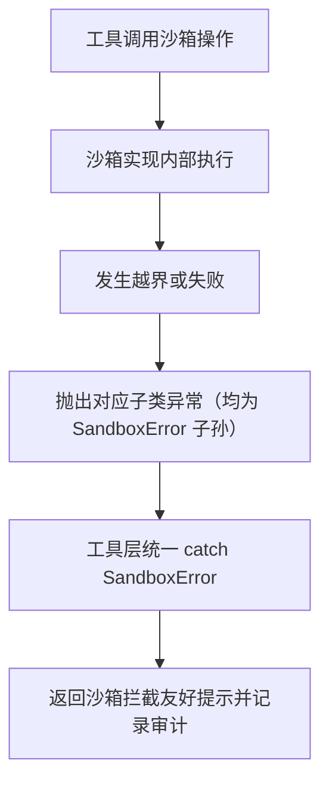

# sandbox/exceptions.py — exceptions.py

> **文件路径**: `backend/packages/harness/agentflow/sandbox/exceptions.py`
> **目录位置**: sandbox → exceptions.py
> **职责**: 沙箱统一异常体系（基类 SandboxError + 4 个子类）

## 📑 目录

- [📋 结构图](#📋-结构图)
- [📤 关键导出](#📤-关键导出)
- [💡 设计思想](#💡-设计思想)
- [🎯 实用场景](#🎯-实用场景)
- [📊 顺序执行链流程图](#📊-顺序执行链流程图)
- [🧩 代码解析（成块对照 exceptions.py）](#🧩-代码解析成块对照-exceptionspy)
- [❓ Q&A / 知识点](#❓-qa--知识点)
- [⚠️ 风险点](#⚠️-风险点)

## 📋 结构图

```text
┌──────────────────────────────────────────────────────┐
│ SandboxError(Exception)  沙箱异常基类（工具层统一 catch）│
│   ├─ SandboxPermissionError  越界 / 权限拒绝           │
│   ├─ SandboxFileError        文件操作失败              │
│   │     └─ SandboxFileNotFoundError  文件不存在        │
│   └─ SandboxCommandError     命令执行失败（超时/非零码）│
│                                                      │
│ 统一构造签名: (message: str, details: str | None)      │
└──────────────────────────────────────────────────────┘
```

## 📤 关键导出

**异常类**

- `SandboxError`
- `SandboxPermissionError`
- `SandboxFileError`
- `SandboxFileNotFoundError`
- `SandboxCommandError`

## 💡 设计思想

1. **统一基类收口**：工具层只 `except SandboxError` 一类——沙箱抛的全被友好提示接住，
   模型/网络等非沙箱异常走各自路径，不被误吞。
2. **细分类型区分两种失败**：`SandboxPermissionError` 是"被拦截（安全拒绝）"，
   `SandboxFileError`/`SandboxCommandError` 是"真失败（IO/进程）"——测试可精确断言，
   日志可区分。
3. **details 可选上下文**：异常消息本体保持干净，`details` 携带 command/path 现场，
   供审计与排错（不塞敏感信息）。

## 🎯 实用场景

1. 工具层兜底：terminal_tool.py:90、file_tools.py:94/116 均 `except SandboxError as exc`
   → 返回 `（沙箱拦截）{exc}` 友好串并记审计 allowed=False。
2. 实现方抛错：NoopSandbox 全拒抛 `SandboxError`；LocalSandbox 按越界/缺文件/IO/退出码
   分别抛 4 个子类。
3. 测试断言：test_sandbox_guard.py:32 断言越界抛 `SandboxPermissionError`、:56 断言
   Noop 抛 `SandboxError`。

## 📊 顺序执行链流程图

本文件是纯异常定义，本身无执行逻辑；它的"执行链"发生在**被抛出与被捕获**时：

```text
工具调用沙箱操作（request：terminal_run / read_file / write_file）
│
▼
沙箱实现内部执行（NoopSandbox 或 LocalSandbox）
│
▼
发生越界 / 缺文件 / IO 失败 / 命令超时或非零退出
│
▼
抛出对应子类异常（全部是 SandboxError 的子孙）
│
▼
工具层 except SandboxError as exc（terminal_tool.py:90 等）
│
▼
返回 "（沙箱拦截）{exc}" 友好提示 + 审计 allowed=False
│
▼
模型拿到拦截提示，不再重试同一越界操作
```

**Mermaid 版（GitHub / 飞书渲染；VSCode 需装插件）**：



## 🧩 代码解析（成块对照 exceptions.py）

> 读法：每块先贴**完整代码**，再看块下方的整块解析。代码与文件一致，仅省略头部规范注释。

### 块 1：`SandboxError` 基类 + 构造签名 —— 统一 catch 的收口点

```python
from __future__ import annotations


class SandboxError(Exception):
    """沙箱操作异常基类（工具层统一 catch 此类）。"""

    def __init__(self, message: str, details: str | None = None):
        super().__init__(message)
        self.details = details
```

**结构简析**：`SandboxError(Exception)` 基类，工具层统一 catch 的收口点。基类直接继承标准库 `Exception`（不是 BaseException），`except Exception` 的常规路径天然兜得住。

**`__init__()` 参数逐条解释**：

| 参数 | 类型 | 默认值 | 含义 |
|---|---|---|---|
| `message` | `str` | 必填 | 异常主文案，原样传给 `super().__init__(message)`，保证 `str(exc)` 友好、给模型/用户看 |
| `details` | `str \| None` | `None` | 可选现场上下文（命令片段/路径/root），存 `self.details`，给审计/排错看，不塞敏感信息 |

**落库要点**：`from __future__ import annotations` 让 `str | None` 注解在旧解释器下也只做字符串不求值。工具层只需记住一件事：`except SandboxError` 就能接住沙箱抛出的一切。

### 块 2：4 个子类 —— 两类失败语义的细分

```python
class SandboxPermissionError(SandboxError):
    """沙箱权限拒绝：路径越界 / 操作不允许。"""


class SandboxFileError(SandboxError):
    """沙箱内文件操作失败（读写删等）。"""


class SandboxFileNotFoundError(SandboxFileError):
    """沙箱内文件不存在。"""


class SandboxCommandError(SandboxError):
    """沙箱内命令执行失败（非零退出码/超时）。"""
```

**结构简析**：4 个子类全部为空壳（只有 docstring，无方法）——它们是标签类，靠类型区分失败语义，构造签名继承自基类 `(message, details=None)`。

本块各类均无自定义参数（空壳标签类，复用基类 `__init__`）。各类语义与典型抛出方：

| 异常 | 语义 | 典型抛出方（源码事实） |
|---|---|---|
| `SandboxPermissionError` | 安全拦截：路径越界 | local.py `_resolve` 前缀校验失败 |
| `SandboxFileError` | 文件 IO 真失败 | local.py `except OSError` 包装（读/写/删） |
| `SandboxFileNotFoundError` | 文件/目录不存在 | local.py 读/列/删前存在性检查；**继承自 SandboxFileError** |
| `SandboxCommandError` | 命令超时 / 非零退出码 | local.py `execute_command` |

**落库要点**：`SandboxFileNotFoundError` 的父类是 `SandboxFileError` 而非直接继承 `SandboxError`——既支持精确断言"文件不存在"，又能被 `except SandboxFileError` 一网打尽（两级粒度通吃）。

## ❓ Q&A / 知识点

### 1. 为什么 SandboxFileNotFoundError 继承 SandboxFileError 而不是直接继承 SandboxError？

**一句话**：让"文件不存在"既能被精确断言，又能被"所有文件错误"一网打尽——两级粒度通吃。

- 精确粒度：测试/调用方可以 `pytest.raises(SandboxFileNotFoundError)` 或 `except ...NotFoundError`
  只处理"缺文件"这一种情况。
- 宽松粒度：`except SandboxFileError` 会同时接住"缺文件"和"其他 IO 错误"，
  因为 NotFound 是 FileError 的子类。
- 对照：`SandboxCommandError` 没有再细分（超时与非零码共用一类，靠 message 文本区分），
  M4 裁剪后只保留必要的层级。

### 2. details 字段为什么可选、放什么？

**一句话**：message 是给模型/用户看的干净文案，details 是给审计/排错看的现场，
两者分离，details 不塞敏感信息。

源码实例：`SandboxPermissionError(f"路径越界（沙箱外）: {path}", details=f"root={self._root}")`
（local.py:87-90）——message 说人话，details 补 root 现场；NoopSandbox 则用
`details=f"command={command[:80]}"`（noop.py:52）截断保留命令前 80 字符。

## ⚠️ 风险点

1. 工具层必须 catch `SandboxError`——不 catch 会让异常炸进模型工具循环
   （terminal_tool.py:36 注释专门标注此约束）。
2. details 只带命令/路径上下文，勿塞密钥等敏感信息。
3. 模块头部结构图注释写 `SandboxError(BaseException)`，实际源码 line 38 为
   `class SandboxError(Exception)`——以代码为准（差异已记入汇报）。

---
_2026-10-01 M4 补齐：目录 + 顺序执行链流程图 + 成块代码解析（+Q&A）。_
_2026-10-03 重构：代码解析段按「结构简析 + 参数逐条表格 + 落库要点」规范化（代码块零改动）。_
