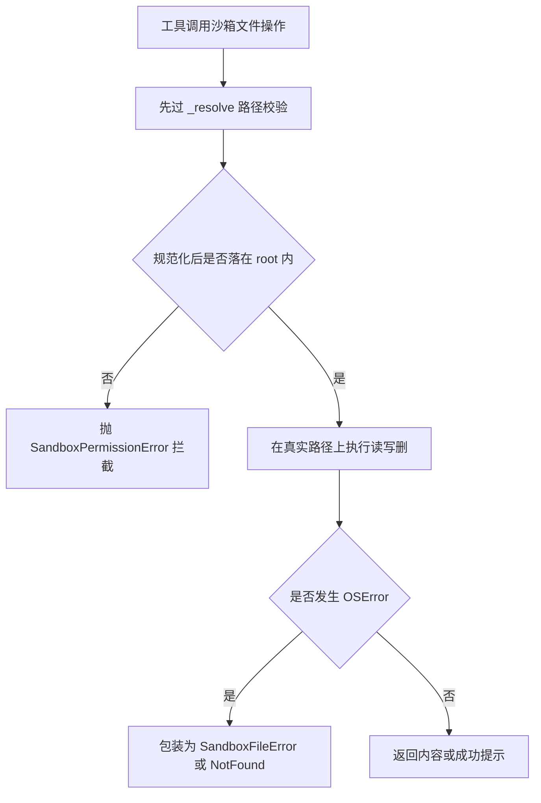

# sandbox/local.py — local.py

> **文件路径**: `backend/packages/harness/agentflow/sandbox/local.py`
> **目录位置**: sandbox → local.py
> **职责**: 本地目录沙箱（M4 自研）——所有路径落在 root 内才放行，root 外一律拦截；root 内 cwd 执行命令 + 超时

## 📑 目录

- [📋 结构图](#📋-结构图)
- [📤 关键导出](#📤-关键导出)
- [💡 设计思想](#💡-设计思想)
- [🎯 实用场景](#🎯-实用场景)
- [📊 顺序执行链流程图](#📊-顺序执行链流程图)
- [🧩 代码解析（成块对照 local.py）](#🧩-代码解析成块对照-localpy)
- [❓ Q&A / 知识点](#❓-qa--知识点)
- [⚠️ 风险点](#⚠️-风险点)

## 📋 结构图

```text
┌──────────────────────────────────────────────────────┐
│ LocalSandbox(Sandbox)                                  │
│   root: Path（构造时 resolve + mkdir，所有操作基准）    │
│   _resolve(path): 核心安全闸                            │
│     expanduser → 相对路径拼 root → resolve() 规范化     │
│     → 前缀校验：p == root 或 root in p.parents         │
│     → 越界 raise SandboxPermissionError                │
│   execute_command: subprocess cwd=root + timeout        │
│   read_file / list_dir / write_file /                  │
│   update_file / delete_file：先 _resolve 再操作        │
│                                                      │
│ LocalSandboxProvider(SandboxProvider)                  │
│   root 默认 tempfile.mkdtemp(prefix=agentflow-sandbox-)│
│   固定返回单个 LocalSandbox，release 空操作             │
└──────────────────────────────────────────────────────┘
```

## 📤 关键导出

**类**

- `LocalSandbox`
- `LocalSandboxProvider`

**内部方法**

- `LocalSandbox._resolve(path)` —— 路径规范化 + 越界校验（核心安全闸）

## 💡 设计思想

1. **路径隔离靠规范化后的前缀校验**：任何路径先 `resolve()` 转成真实绝对路径
   （软链、`..`、`~` 全部归一），再校验它是否落在 root 内——写 `/etc/xxx`、
   `../` 逃逸、软链逃逸都在 `_resolve` 被拦（验收点 4 核心）。
2. **命令隔离只做两层**：`cwd=root` + `timeout`；⚠️ 无 OS 级进程 jail——
   命令内部 `cd /etc && …` 可逃逸 cwd，完整隔离留 M5，风险点如实标注。
3. **单例复用**：Provider 固定一个沙箱；测试注入临时目录，所有操作只碰临时目录。
4. **不缓存解析结果**：每次操作实时 resolve，防 TOCTOU 竞态（M4 够用）。

## 🎯 实用场景

1. CLI 生产装配：cli/main.py:175-176 `sandbox_root = project_root / ".sandbox"`
   → `set_sandbox_provider(LocalSandboxProvider(sandbox_root))`——子代理/终端操作
   落在项目 `.sandbox/` 内，宿主目录访问被 `_resolve` 拦截。
2. 测试注入：test_sandbox_guard.py:70-71 `LocalSandboxProvider(tmp_path / "sandbox-root")`
   + set，finally reset。
3. 工具消费：terminal_run → execute_command；read_file/write_file → 对应文件方法，
   全部经 `provider.get(provider.acquire())` 取到本类实例。

## 📊 顺序执行链流程图

以一次文件操作为例（命令执行链在块 4 单独说明）：

```text
工具调沙箱文件操作（request：read_file/write_file/delete_file…）
│
▼
先过 _resolve(path)              ← 所有文件操作的统一前置
│
▼
expanduser → 相对路径拼 root → resolve() 规范化为真实绝对路径
│
▼
前缀校验：p == root 或 root in p.parents？
│   ├─ 否 → raise SandboxPermissionError（越界拦截，验收点 4）
│   └─ 是 → 返回规范化路径 p
▼
在 p 上执行真实文件操作（read_text / write_bytes / unlink …）
│
▼
OSError → 包装为 SandboxFileError / SandboxFileNotFoundError
│
▼
工具层 except SandboxError → "（沙箱拦截）…" + 审计 allowed=False
```

**Mermaid 版（GitHub / 飞书渲染；VSCode 需装插件）**：



## 🧩 代码解析（成块对照 local.py）

> 读法：每块先贴**完整代码**，再看块下方的整块解析。代码与文件一致，仅省略头部规范注释。

### 块 1：imports —— subprocess/shlex/tempfile + 4 个异常

```python
from __future__ import annotations

import os
import shlex
import subprocess
import tempfile
from pathlib import Path

from agentflow.sandbox.exceptions import (
    SandboxCommandError,
    SandboxFileError,
    SandboxFileNotFoundError,
    SandboxPermissionError,
)
from agentflow.sandbox.sandbox import Sandbox
from agentflow.sandbox.sandbox_provider import SandboxProvider
```

**整块解析**：标准库五件——`os`（list_dir 的 os.walk 按层遍历）、`shlex`（引用命令文本，错误消息里安全打印）、
`subprocess`（执行命令）、`tempfile`（Provider 默认 root）、`pathlib.Path`
（路径规范化的核心工具）。异常侧把 exceptions.py 的 4 个子类**全部 import**——
LocalSandbox 是全项目唯一"按错误语义细分抛错"的实现：越界抛 Permission、
缺文件抛 NotFound、OSError 包装成 File、超时/非零码抛 Command。

### 块 2：`LocalSandbox.__init__` —— root 规范化 + 建目录 + id 命名

```python
class LocalSandbox(Sandbox):
    """本地目录沙箱：root 目录内可读写/执行，root 外一律拒绝。

    M4 定位：文件路径级隔离（验收点 4）。命令执行 cwd 限制 + 超时，
    但不做 OS 级进程 jail（`cd /etc && …` 可逃逸 cwd，见风险点 2）。
    """

    def __init__(self, root: str | Path):
        root_path = Path(root).resolve()
        root_path.mkdir(parents=True, exist_ok=True)
        super().__init__(id=f"local-{root_path.name or 'root'}")
        self._root = root_path
```

**整块解析**：构造时就把 root 钉死——① `Path(root).resolve()`：root 自身先规范化，
后续所有前缀校验都拿这个**已 resolve 的绝对路径**做基准；② `mkdir(parents=True,
exist_ok=True)`：目录不存在就建（CLI 的 `.sandbox`、测试的 tmp 目录都自动就绪）；
③ id 取 `local-{root名}`（根目录无名时兜底 'root'），如 `.sandbox` 目录即 id=`local-.sandbox`。
docstring 自曝短板：不做 OS 级 jail。

### 块 3：`_resolve` —— 核心安全闸（越界拦截全靠它）

```python
    # ---- 核心安全闸：路径校验 ----
    def _resolve(self, path: str | Path) -> Path:
        """规范化路径并校验落在 root 内；越界抛 SandboxPermissionError。

        相对路径以沙箱 root 为基准（沙箱内文件用相对路径写即可）。
        """
        p = Path(path).expanduser()
        if not p.is_absolute():
            p = self._root / p
        p = p.resolve()
        if p != self._root and self._root not in p.parents:
            raise SandboxPermissionError(
                f"路径越界（沙箱外）: {path}",
                details=f"root={self._root}",
            )
        return p
```

**整块解析**：四步走，每步对应一类逃逸手法：

| 步骤 | 代码 | 拦掉什么 |
|---|---|---|
| 展开用户目录 | `expanduser()` | `~/xxx` 这类主目录引用 |
| 相对路径拼接 root | `if not p.is_absolute(): p = self._root / p` | 工具传相对路径时**以 root 为基准**，而非调用时的 cwd |
| 规范化为真实绝对路径 | `p = p.resolve()` | `..` 向上逃逸、软链指向沙箱外 |
| 前缀校验 | `p != root and root not in p.parents` | 规范化后不在 root 内（含等于 root 本身放行）→ 抛 Permission |

关键在最后一行的两个条件缺一不可：`p == self._root`（访问根目录本身）放行，
其余必须 `root in p.parents`。抛错时 details 带上 root，便于审计定位。

### 块 4：`execute_command` —— cwd 限制 + 超时，无 OS jail

```python
    # ---- 命令执行 ----
    def execute_command(self, command: str, timeout: int = 30) -> str:
        """在沙箱根目录内执行命令（shell 字符串，cwd=root，超时控制）。"""
        try:
            proc = subprocess.run(
                command,
                shell=True,  # 沙箱设计如此：接受完整 shell 串，靠 cwd+超时限制
                check=False,  # 显式不抛：非零码走下方 returncode 分支转 SandboxCommandError
                cwd=self._root,
                capture_output=True,
                text=True,
                timeout=timeout,
            )
        except subprocess.TimeoutExpired:
            raise SandboxCommandError(
                f"命令超时（>{timeout}s）: {shlex.quote(command)[:80]}"
            ) from None
        out = (proc.stdout or "") + (proc.stderr or "")
        if proc.returncode != 0:
            raise SandboxCommandError(
                f"命令失败（exit={proc.returncode}）: {shlex.quote(command)[:80]}",
                details=out[:500],
            )
        return out.strip() or "(无输出)"
```

**整块解析**：`shell=True` 故意接受完整 shell 串（noqa S602 标注"沙箱设计如此"），
限制手段只有 `cwd=self._root`（起始目录）和 `timeout`（默认 30s）两级。错误分两路：
超时 → `SandboxCommandError`（`from None` 不串栈）；非零退出码 → 同样抛 Command，
details 带输出前 500 字符。输出合并 stdout+stderr、strip，空输出返回 `"(无输出)"`。
**如实标注风险**：命令内部 `cd /etc && cat /etc/hosts` 可逃逸 cwd 限制——
这不是文件路径沙箱能拦的，完整 OS 级 jail 留 M5。

### 块 5：`read_file` / `list_dir` —— 读向操作

```python
    # ---- 文件操作 ----
    def read_file(self, path: str) -> str:
        p = self._resolve(path)
        if not p.is_file():
            raise SandboxFileNotFoundError(f"文件不存在: {path}")
        try:
            return p.read_text(encoding="utf-8")
        except OSError as exc:
            raise SandboxFileError(f"读取失败: {path}（{exc}）") from exc

    def list_dir(self, path: str, max_depth: int = 2) -> list[str]:
        """列出目录内容（相对路径，最多 max_depth 层）。

        depth=1 只列直接子项；depth=2 再下一层；os.walk 到深度上限
        即 dirs[:] = [] 停止下钻（原 rglob 写法会无限递归，已修正）。
        """
        p = self._resolve(path)
        if not p.is_dir():
            raise SandboxFileNotFoundError(f"目录不存在: {path}")
        depth = max(1, int(max_depth))
        out: list[str] = []
        for root, dirs, files in os.walk(p):
            level = len(Path(root).relative_to(p).parts)  # 0 = p 本身
            if level >= depth:
                dirs[:] = []  # 到深度上限，不再下钻
            for name in sorted(dirs + files):
                if level < depth:
                    out.append(str(Path(root).relative_to(p) / name))
        return out[:500]  # 上限 500 条防爆炸
```

**整块解析**：每个方法第一行都是 `p = self._resolve(path)`——文件类操作没有例外，
先过安全闸再谈业务。read_file 固定 utf-8 读文本；list_dir 用 `os.walk` 按层遍历：
`level = len(Path(root).relative_to(p).parts)` 算出当前相对层级，`level >= depth`
时 `dirs[:] = []` 停止下钻，保证最多列 max_depth 层（depth=1 只列直接子项）。
结果排序后 `[:500]` 截断防目录爆炸。OSError 一律 `from exc` 包装成
SandboxFileError（保留原始异常链）。

### 块 6：`write_file` / `update_file` / `delete_file` —— 写向操作

```python
    def write_file(self, path: str, content: str, append: bool = False) -> None:
        p = self._resolve(path)
        try:
            p.parent.mkdir(parents=True, exist_ok=True)  # 父目录自动建（工具写 a/b.txt 不必先建目录）
            if append:
                with p.open("a", encoding="utf-8") as f:
                    f.write(content)
            else:
                p.write_text(content, encoding="utf-8")
        except OSError as exc:
            raise SandboxFileError(f"写入失败: {path}（{exc}）") from exc

    def update_file(self, path: str, content: bytes) -> None:
        p = self._resolve(path)
        try:
            p.write_bytes(content)
        except OSError as exc:
            raise SandboxFileError(f"更新失败: {path}（{exc}）") from exc

    def delete_file(self, path: str) -> None:
        p = self._resolve(path)
        if not p.exists():
            raise SandboxFileNotFoundError(f"文件不存在: {path}")
        try:
            p.unlink()
        except OSError as exc:
            raise SandboxFileError(f"删除失败: {path}（{exc}）") from exc
```

**整块解析**：三个写方法结构同构——先 `_resolve`，再 try 真实 IO，OSError 包装。
差异在语义：write_file 是文本（utf-8，append 决定 "a"/覆盖），**检查轮修正**——
写入前 `p.parent.mkdir(parents=True, exist_ok=True)` 自动建父目录（模型写
`a/b.txt` 不必先建目录，更符合工具调用习惯）；update_file 是
`write_bytes` 二进制整体替换（不做编码），delete_file 先 `exists()` 再 `unlink()`。
越界在三个方法里被同一道闸统一拦截：测试 test_sandbox_guard.py:33 写
`/etc/agentflow_should_not_write.txt` 被拒、:43 写 `../escape.txt` 被拒。

### 块 7：`LocalSandboxProvider` —— 固定单例，root 默认临时目录

```python
class LocalSandboxProvider(SandboxProvider):
    """本地目录沙箱提供者：固定返回单个 LocalSandbox。

    用法:
        provider = LocalSandboxProvider(tempfile.mkdtemp())
        set_sandbox_provider(provider)  # 测试注入
    """

    def __init__(self, root: str | Path | None = None):
        root = root or tempfile.mkdtemp(prefix="agentflow-sandbox-")
        self._sandbox = LocalSandbox(root)

    def acquire(self, thread_id: str | None = None) -> str:
        return self._sandbox.id

    def get(self, sandbox_id: str) -> Sandbox | None:
        return self._sandbox if sandbox_id == self._sandbox.id else None

    def release(self, sandbox_id: str) -> None:
        pass  # 单例沙箱无状态，无需归还
```

**整块解析**：`root=None` 时自动建 `agentflow-sandbox-` 前缀的临时目录——
"裸用"这个 Provider 也能跑（测试友好）；CLI 则显式传项目 `.sandbox`。
三个接口方法与 NoopSandboxProvider 同构（固定单例、id 匹配查表、release 空操作），
区别只在背后那个 LocalSandbox 真的读写磁盘。

## ❓ Q&A / 知识点

### 沙箱越界怎么拦的？（2026-10-01 用户提问）

**一句话**：全靠 `_resolve` 一道闸——相对路径以 root 为基准拼好，再 `resolve()`
规范化成真实绝对路径，最后做前缀校验：不在 root 内就抛 `SandboxPermissionError`。

四步拦截链（local.py:77-91）：

```text
调用方给的 path（可能是相对/../~/软链/绝对宿主路径）
│
▼ expanduser()      展开 ~
▼ 相对路径 → self._root / path   ← 相对路径一律以沙箱 root 为基准，
│                                   不按"调用时进程 cwd"算（关键）
▼ resolve()         .. 归一、软链解析成真实路径
▼ 前缀校验          p == root 或 root in p.parents？
└─ 否则 → raise SandboxPermissionError（details 带 root）
```

测试佐证（tests/test_sandbox_guard.py）：

| 逃逸手法 | 测试 | 结果 |
|---|---|---|
| 绝对宿主路径 `/etc/...` | :32-36 | SandboxPermissionError |
| `../` 向上逃逸 | :39-43 | SandboxPermissionError |
| 沙箱内正常写读 | :21-25 | 放行 |

**注意边界**：这是**文件路径级**隔离；`execute_command` 里 shell 命令内部的
`cd /etc && …` 不经过 `_resolve`，不在本闸防护范围（见风险点 2）。

### 为什么用 `resolve()` 而不是 `normpath()` 做规范化？

**一句话**：`normpath` 只做字符串归一（处理 `..`），不解析软链——沙箱里放一个
指向 `/etc` 的符号链接，normpath 会被骗过；`resolve()` 实时把路径解析成真实位置，
软链逃逸同样落网。源码头部风险点 1 即此告诫。

### execute_command 只设了 cwd=root，为什么还算"沙箱"？

**一句话**：如实说——M4 它只做到"文件路径级隔离"，命令执行只有 cwd + 超时两级
限制，**没有 OS 级进程 jail**。`cd /etc && cat /etc/hosts` 这类命令能逃出 cwd 限制，
完整执行安全隔离是 M5（execution security）的事，勿声称 M4 已对命令做 jail。

## ⚠️ 风险点

1. **execute_command 无 OS 级 jail**：命令内部可 `cd` 到沙箱外——文件操作有 `_resolve`
   兜底，命令没有。勿对外声称"命令已隔离"；完整 jail 留 M5。
2. `_resolve` 必须用 `resolve()`（软链/`..` 全规范化）——改用 `normpath` 会被软链绕过。
3. LocalSandbox 不缓存解析结果，每次操作实时 resolve——防 TOCTOU 竞态，M4 够用；
   高频调用时可留意重复 resolve 开销。
4. list_dir 结果 `[:500]` 硬截断——超 500 条的目录只看到前 500（排序后），不是错误。
5. Provider 默认 root 是 `tempfile.mkdtemp()` 临时目录——裸用（未显式传 root）时
   文件落在系统临时区，重启即失；CLI 生产装配务必显式传项目 `.sandbox`。

---
_2026-10-01 M4 补齐：目录 + 顺序执行链流程图 + 成块代码解析（+Q&A）。_
