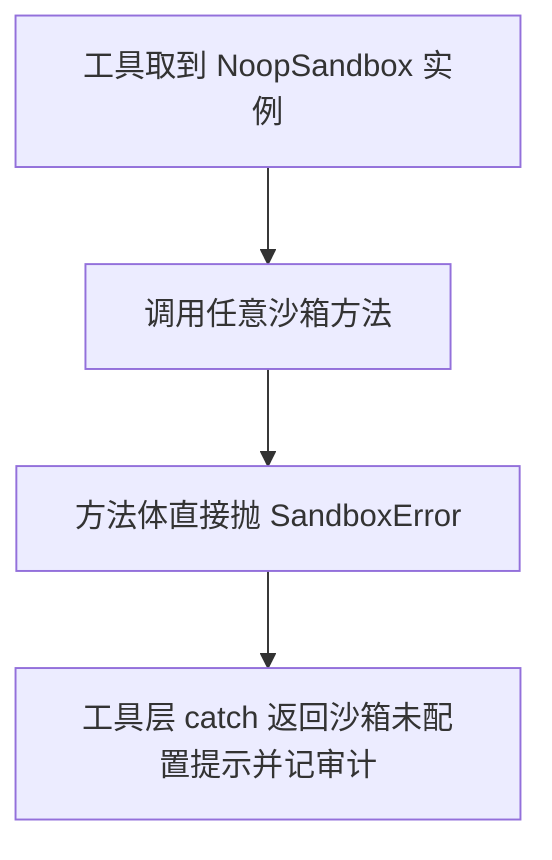

# sandbox/noop.py — noop.py

> **文件路径**: `backend/packages/harness/agentflow/sandbox/noop.py`
> **目录位置**: sandbox → noop.py
> **职责**: 空沙箱——桌面环境默认实现，所有宿主系统操作一律拒绝（fail-closed）

## 📑 目录

- [📋 结构图](#📋-结构图)
- [📤 关键导出](#📤-关键导出)
- [💡 设计思想](#💡-设计思想)
- [🎯 实用场景](#🎯-实用场景)
- [📊 顺序执行链流程图](#📊-顺序执行链流程图)
- [🧩 代码解析（成块对照 noop.py）](#🧩-代码解析成块-nooppy)
- [❓ Q&A / 知识点](#❓-qa--知识点)
- [⚠️ 风险点](#⚠️-风险点)

## 📋 结构图

```text
┌──────────────────────────────────────────────────────┐
│ NoopSandbox(Sandbox)                                  │
│   __init__: id="noop", _deny_msg=拒绝文案             │
│   6 个方法全部 raise SandboxError(_deny_msg, details)  │
│                                                      │
│ NoopSandboxProvider(SandboxProvider)                  │
│   __init__: 建唯一 NoopSandbox 实例                   │
│   acquire -> "noop"（固定 id）                         │
│   get(id)  -> id 匹配则返回该实例，否则 None           │
│   release -> pass（单例无状态，无需归还）              │
└──────────────────────────────────────────────────────┘
```

## 📤 关键导出

**类**

- `NoopSandbox`
- `NoopSandboxProvider`

## 💡 设计思想

1. **fail-closed 安全默认**：桌面环境默认无真实沙箱——任何宿主操作直接拒绝，
   不让子代理"静默跑在用户机器上"。宁可拒绝，不可放行。
2. **无状态单例**：Provider 固定返回同一个 NoopSandbox，release 空操作，
   不存在资源回收问题。
3. **拒绝信息统一**：`_deny_msg` 在 `__init__` 里存成实例属性，6 个方法共用同一段文案，
   只在 details 里带各自的 command/path 现场。

## 🎯 实用场景

1. 默认提供者：get_sandbox_provider() 在无人注入时惰性创建的就是 NoopSandboxProvider
   （sandbox_provider.py:74-76）——CLI 以外任何环境 terminal_run 等都落到这里。
2. 安全基线测试：test_sandbox_guard.py:53-61 断言 Noop 的 execute/write/read 全部
   抛 SandboxError，锁住"默认拒绝"行为不被改坏。
3. 工具行为兜底：未配置沙箱时工具返回"沙箱未配置"提示，比"偷偷跑在用户机器上"安全。

## 📊 顺序执行链流程图

```text
工具取沙箱实例（request：未注入 Local 时，单例即 NoopProvider）
│
▼
provider.acquire() -> "noop" → provider.get("noop") -> NoopSandbox 单例
│
▼
工具调任意方法（execute_command / read_file / write_file …）
│
▼
方法体直接 raise SandboxError(_deny_msg, details=现场)
│
▼
工具层 except SandboxError（terminal_tool.py:90 / file_tools.py:94）
│
▼
返回 "（沙箱拦截）沙箱未配置…" + 审计 allowed=False
```

**Mermaid 版（GitHub / 飞书渲染；VSCode 需装插件）**：



## 🧩 代码解析（成块对照 noop.py）

> 读法：每块先贴**完整代码**，再看块下方的整块解析。代码与文件一致，仅省略头部规范注释。

### 块 1：imports —— 接异常基类 + 两个接口

```python
from __future__ import annotations

from agentflow.sandbox.exceptions import SandboxError
from agentflow.sandbox.sandbox import Sandbox
from agentflow.sandbox.sandbox_provider import SandboxProvider
```

**整块解析**：三个 import 正好对应它的两个身份——继承 `Sandbox`（成为一个沙箱）、
继承 `SandboxProvider`（成为提供者）、抛 `SandboxError`（拒绝时用）。
注意这里**只 import 基类异常**——Noop 一律抛最普通的 SandboxError，
不细分 Permission/File/Command（反正都是"未配置"一种语义）。

### 块 2：`NoopSandbox.__init__` —— 固定 id + 拒绝文案

```python
class NoopSandbox(Sandbox):
    """空沙箱：所有操作抛 SandboxError（桌面默认，无真实沙箱）。"""

    def __init__(self):
        super().__init__(id="noop")
        self._deny_msg = "沙箱未配置（NoopSandbox）：宿主系统操作被拒绝"
```

**整块解析**：两行关键事实——① `id="noop"` 是 Provider 查表键（NoopSandboxProvider.get
按这个 id 匹配）；② `_deny_msg` 是全类统一拒绝文案。文案点名"NoopSandbox"并说明
"宿主系统操作被拒绝"，用户看到就知道不是操作错了、是沙箱根本没配。

### 块 3：6 个拒绝方法 —— 每个抽象方法都 fail

```python
    def execute_command(self, command: str, timeout: int = 30) -> str:
        raise SandboxError(self._deny_msg, details=f"command={command[:80]}")

    def read_file(self, path: str) -> str:
        raise SandboxError(self._deny_msg, details=f"path={path}")

    def list_dir(self, path: str, max_depth: int = 2) -> list[str]:
        raise SandboxError(self._deny_msg, details=f"path={path}")

    def write_file(self, path: str, content: str, append: bool = False) -> None:
        raise SandboxError(self._deny_msg, details=f"path={path}")

    def update_file(self, path: str, content: bytes) -> None:
        raise SandboxError(self._deny_msg, details=f"path={path}")

    def delete_file(self, path: str) -> None:
        raise SandboxError(self._deny_msg, details=f"path={path}")
```

**整块解析**：6 个方法的签名与 `Sandbox` ABC 逐一对齐（参数名、默认值、返回类型都一致），
方法体却只有一行 raise——这就是"全拒绝"的字面实现。细节：`execute_command` 的 details
用 `command[:80]` 截断（命令可能很长，避免异常对象膨胀），文件类方法只带 `path`。
签名照抄接口是硬约束：缺一个方法，NoopSandbox 就无法实例化（ABC 校验）。

### 块 4：`NoopSandboxProvider` —— 固定返回单例

```python
class NoopSandboxProvider(SandboxProvider):
    """空沙箱提供者：固定返回单个 NoopSandbox（id="noop"）。"""

    def __init__(self):
        self._sandbox = NoopSandbox()

    def acquire(self, thread_id: str | None = None) -> str:
        return self._sandbox.id

    def get(self, sandbox_id: str) -> Sandbox | None:
        return self._sandbox if sandbox_id == self._sandbox.id else None

    def release(self, sandbox_id: str) -> None:
        pass  # 单例无状态，无需归还
```

**整块解析**：Provider 在 `__init__` 里建一个 NoopSandbox 存着，此后
acquire 永远返回它的 id、get 在 id 匹配时返回它、release 什么都不做。
`get` 对陌生 id 返回 None——与工具层"sandbox is None → 返回（沙箱不可用）"的兜底
（terminal_tool.py:84）配套。（注：模块头部结构图注释把 acquire 误写为
返回 "local"，实际源码返回 `self._sandbox.id` 即 "noop"，以代码为准。）

## ❓ Q&A / 知识点

### 为什么默认沙箱是 Noop 而不是直接开放宿主目录？

**一句话**：fail-closed 原则——安全默认值必须是"拒绝"，而不是"放行"。

| 策略 | 未配置沙箱时的行为 | 后果 |
|---|---|---|
| 默认放行宿主 | terminal_run 在用户真实目录里跑命令 | 子代理可任意读写宿主文件，无审计兜底 |
| 默认 Noop（本项目） | 一律抛"沙箱未配置" | 用户必须显式 `set_sandbox_provider(Local…)` 才放开 |

CLI 装配（cli/main.py:176）显式注入 `LocalSandboxProvider(项目/.sandbox)`，
把"是否放开、放开到哪个目录"变成一个看得见的决策点。

### 拒绝文案为什么存成实例属性 `_deny_msg`，而不是每个方法内联字符串？

**一句话**：统一文案只维护一处——6 个方法共用，将来改措辞只动 `__init__` 一行。
同时 details 仍按方法各自携带现场（command 截断 80 字符 / path 原文），文案与现场分离。

## ⚠️ 风险点

1. fail-closed 是红线：勿给 NoopSandbox 加"透传宿主"或"放行某白名单"行为——
   加了就等于拆掉默认安全闸。
2. 每次 get 返回同一实例（无状态），多线程调用安全；若未来给 Noop 加状态需重审。
3. Noop 抛的是最普通的 `SandboxError`，不是 `SandboxPermissionError`——
   测试/审计按"未配置"语义归类，勿与"越界拦截"混淆。

---
_2026-10-01 M4 补齐：目录 + 顺序执行链流程图 + 成块代码解析（+Q&A）。_
