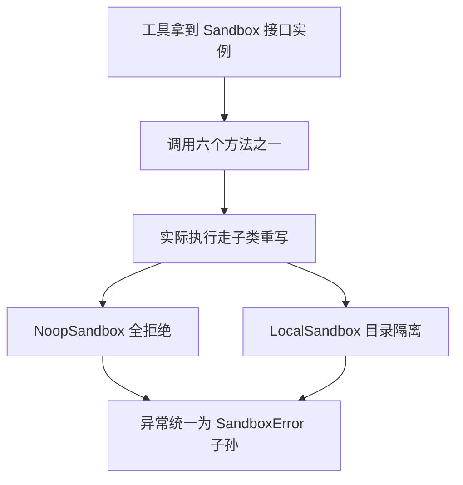

# sandbox/sandbox.py — sandbox.py

> **文件路径**: `backend/packages/harness/agentflow/sandbox/sandbox.py`
> **目录位置**: sandbox → sandbox.py
> **职责**: 沙箱抽象基类 Sandbox——定义子代理全部宿主系统操作的接口面（6 个抽象方法）

## 📑 目录

- [📋 结构图](#📋-结构图)
- [📤 关键导出](#📤-关键导出)
- [💡 设计思想](#💡-设计思想)
- [🎯 实用场景](#🎯-实用场景)
- [📊 顺序执行链流程图](#📊-顺序执行链流程图)
- [🧩 代码解析（成块对照 sandbox.py）](#🧩-代码解析成块对照-sandboxpy)
- [❓ Q&A / 知识点](#❓-qa--知识点)
- [⚠️ 风险点](#⚠️-风险点)

## 📋 结构图

```text
┌──────────────────────────────────────────────────────┐
│ Sandbox(ABC)                                         │
│   __init__(id)  → self._id                           │
│   id: property（Provider 查表键）                     │
│   ── 6 个抽象方法（子类必须全部实现）──                │
│   execute_command(command, timeout=30) -> str         │
│   read_file(path) -> str                             │
│   list_dir(path, max_depth=2) -> list[str]           │
│   write_file(path, content, append=False)            │
│   update_file(path, content: bytes)                   │
│   delete_file(path)                                   │
│                                                      │
│ 已知实现: NoopSandbox（全拒绝）/ LocalSandbox（目录隔离）│
└──────────────────────────────────────────────────────┘
```

## 📤 关键导出

**类**

- `Sandbox`（抽象基类）

## 💡 设计思想

1. **接口与实现分离**：ABC 只规定"沙箱能做什么"（6 个方法签名），"用哪个沙箱"由
   SandboxProvider 决定——工具层只依赖 `Sandbox` 接口，不感知背后是 Noop、本地目录
   还是未来的远程容器。
2. **id 是查表键**：构造时收一个 `id`，property 暴露给 Provider 的 get/release 当键用。
3. **str/bytes 语义分开**：`write_file` 收 `str`（append 布尔控制追加），
   `update_file` 收 `bytes` 整体替换（二进制安全）——两类写入语义不混。

## 🎯 实用场景

1. 工具层类型标注：file_tools.py:72 `_sandbox_guard() -> Sandbox | None` 就按这个接口编程。
2. 新增沙箱实现的起点：写一个子类把 6 个抽象方法全部实现即可接入（M4 已有
   Noop/Local 两个实现）。
3. 契约文档：方法 docstring 即契约（越界/权限问题抛 SandboxError），子类照此抛错。

## 📊 顺序执行链流程图

本文件是纯接口定义，无可执行逻辑；它的"执行链"发生在**工具拿到实例并调方法**时：

```text
工具拿到 Sandbox 实例（request：provider.get(provider.acquire())）
│
▼
工具按接口调方法（execute_command / read_file / write_file …）
│
▼
ABC 本身无实现 → 实际走子类重写
│
├─ NoopSandbox：直接 raise SandboxError（fail-closed）
│
└─ LocalSandbox：_resolve 校验后真实执行
│
▼
越界/失败 → 抛 SandboxError 子孙
│
▼
工具层 except SandboxError → 友好提示 + 审计
```

**Mermaid 版（GitHub / 飞书渲染；VSCode 需装插件）**：



## 🧩 代码解析（成块对照 sandbox.py）

> 读法：每块先贴**完整代码**，再看块下方的整块解析。代码与文件一致，仅省略头部规范注释。

### 块 1：imports —— 只依赖 abc

```python
from __future__ import annotations

from abc import ABC, abstractmethod
```

**整块解析**：零业务依赖——`ABC` 标记抽象基类（不实现抽象方法就无法实例化），
`abstractmethod` 装饰抽象方法。这个模块刻意不 import 任何实现类或异常类——
异常类型只写在 docstring 里约定，保持接口层纯净。

### 块 2：类约定 + `__init__` + `id` property —— 共享的一半实现

```python
class Sandbox(ABC):
    """沙箱抽象基类：子代理所有宿主系统操作都经这里。

    子类必须实现 6 个抽象方法；越界/权限问题抛 SandboxError。
    """

    def __init__(self, id: str):
        self._id = id

    @property
    def id(self) -> str:
        """沙箱唯一标识（Provider 查表键）。"""
        return self._id
```

**整块解析**：ABC 并非全抽象——`__init__` 和 `id` 是**共享实现**：子类只负责把
`id` 字符串传进来（NoopSandbox 传 `id="noop"`，LocalSandbox 传
`f"local-{root_path.name or 'root'}"`），标识逻辑基类统一兜住。docstring 里那句
"子代理所有宿主系统操作都经这里"是全局约束：任何宿主操作不绕开沙箱直接做
（terminal_tool.py:35 注释：不要提供绕过 get_sandbox_provider 的执行路径）。

### 块 3：抽象方法 1-3 —— 命令 / 读 / 列目录

```python
    @abstractmethod
    def execute_command(self, command: str, timeout: int = 30) -> str:
        """在沙箱内执行命令，返回 stdout+stderr 文本。"""

    @abstractmethod
    def read_file(self, path: str) -> str:
        """读取沙箱内文件内容。"""

    @abstractmethod
    def list_dir(self, path: str, max_depth: int = 2) -> list[str]:
        """列出沙箱内目录（相对路径列表，深度限制防爆炸）。"""
```

**整块解析**：三个"读向"方法的签名即契约——`execute_command` 默认 `timeout=30` 秒；
`list_dir` 默认 `max_depth=2`（docstring 注明"深度限制防爆炸"，LocalSandbox 里
depth>=2 用 rglob、否则 glob，且结果截到 500 条）。注意方法体**只有 docstring 没有代码**
——这是 `@abstractmethod` 的写法：基类不给实现，子类不全部实现就实例化报错。

### 块 4：抽象方法 4-6 —— 三种写/删语义

```python
    @abstractmethod
    def write_file(self, path: str, content: str, append: bool = False) -> None:
        """写入/追加沙箱内文件。"""

    @abstractmethod
    def update_file(self, path: str, content: bytes) -> None:
        """整体替换沙箱内文件内容（二进制安全）。"""

    @abstractmethod
    def delete_file(self, path: str) -> None:
        """删除沙箱内文件。"""
```

**整块解析**：三种写入语义刻意分开——`write_file` 收 `str` + `append: bool`
（追加/覆盖文本），`update_file` 收 `bytes`（整体替换、二进制安全），`delete_file`
只收路径。为什么 `update_file` 用 bytes 而 write 用 str：文本写入有 encoding 语义
（LocalSandbox 固定 utf-8），二进制替换不该被文本编码碰。工具层目前只暴露
write_file/read_file 两个工具（见 file_tools.py），update/delete 是给 Provider
内部与未来扩展预留的接口面。

## ❓ Q&A / 知识点

### 为什么用 ABC 而不是 Protocol？

**一句话**：Sandbox 需要共享实现（`__init__` 存 id + `id` property），
ABC 靠继承白捡这段公共逻辑；Protocol 只做结构约定、不带实现。

| 对比 | ABC（本项目） | Protocol |
|---|---|---|
| 公共实现 | 基类写好 `_id` 存储与 property，子类直接继承 | 无，每个类自己写 |
| 实例化拦截 | 未实现全部抽象方法 → 实例化即 TypeError | 无运行时检查（仅静态） |
| 语义 | "是一个沙箱"（is-a） | "长得像沙箱"（structural） |

### list_dir 为什么默认 max_depth=2、且只列相对路径？

**一句话**：深度 + 条数双防爆——防止沙箱里放一个巨大目录时把模型上下文撑爆。
源码佐证：LocalSandbox 实现里 `depth = max(1, int(max_depth))`，depth>=2 才用
`rglob` 递归，结果 `[:500]` 截断（local.py:127-145）。

## ⚠️ 风险点

1. 新增能力 = 加抽象方法 → NoopSandbox 与 LocalSandbox 都要同步实现，
   否则子类实例化直接报错。
2. 方法签名的 str/bytes 语义勿混：write_file 是文本+append 布尔，
   update_file 是二进制整体替换，不要反过来用。
3. 工具层必须经此接口操作系统，勿开绕过沙箱的执行路径（terminal_tool.py:35）。

---
_2026-10-01 M4 补齐：目录 + 顺序执行链流程图 + 成块代码解析（+Q&A）。_
