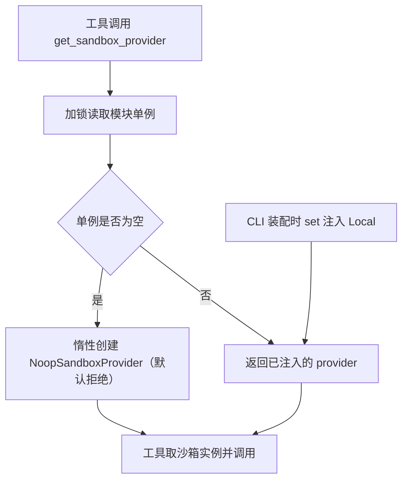

# sandbox/sandbox_provider.py — sandbox_provider.py

> **文件路径**: `backend/packages/harness/agentflow/sandbox/sandbox_provider.py`
> **目录位置**: sandbox → sandbox_provider.py
> **职责**: 沙箱提供者接口（创建/获取/归还）+ 全局单例的 get/set/reset 注入机制

## 📑 目录

- [📋 结构图](#📋-结构图)
- [📤 关键导出](#📤-关键导出)
- [💡 设计思想](#💡-设计思想)
- [🎯 实用场景](#🎯-实用场景)
- [📊 顺序执行链流程图](#📊-顺序执行链流程图)
- [🧩 代码解析（成块对照 sandbox_provider.py）](#🧩-代码解析成块对照-sandbox_providerpy)
- [❓ Q&A / 知识点](#❓-qa--知识点)
- [⚠️ 风险点](#⚠️-风险点)

## 📋 结构图

```text
┌──────────────────────────────────────────────────────┐
│ SandboxProvider(ABC)                                  │
│   acquire(thread_id?) -> str   取一个沙箱，返回 id     │
│   get(sandbox_id) -> Sandbox|None  按 id 取实例        │
│   release(sandbox_id) -> None  归还（多为空操作）      │
│                                                      │
│ 模块级单例状态:                                        │
│   _provider: SandboxProvider | None = None            │
│   _provider_lock = threading.Lock()                   │
│                                                      │
│ get_sandbox_provider()   取单例（惰性建 Noop）         │
│ set_sandbox_provider(p)  注入（p=None 表示恢复默认）   │
│ reset_sandbox_provider() 重置回默认                   │
└──────────────────────────────────────────────────────┘
```

## 📤 关键导出

**类**

- `SandboxProvider`（抽象基类）

**函数**

- `get_sandbox_provider()`
- `set_sandbox_provider(provider)`
- `reset_sandbox_provider()`

## 💡 设计思想

1. **单例 + 依赖注入**：生产环境默认 `NoopSandboxProvider`（fail-closed）；
   CLI 启动时 `set_sandbox_provider(LocalSandboxProvider(项目/.sandbox))` 注入真实沙箱，
   测试则注入临时目录的 Local——工具层永远只调 `get_sandbox_provider()`，不感知全局是谁。
2. **惰性创建 + 延迟导入**：`_provider` 初始为 None，首次 get 才建 Noop；
   Noop 在函数体内 import（避免包级循环）。
3. **锁保护单例**：`threading.Lock` 包住单例读写，多线程下不竞态。

## 🎯 实用场景

1. CLI 装配：cli/main.py:176 `set_sandbox_provider(LocalSandboxProvider(sandbox_root))`
   （sandbox_root = project_root / ".sandbox"，cli/main.py:175）。
2. 工具消费：terminal_tool.py:82、file_tools.py:74 都走
   `get_sandbox_provider()` → `provider.acquire()` → `provider.get(id)` 两步取实例。
3. 测试注入与还原：test_sandbox_guard.py:71 set、:92 finally 里 reset，
   避免污染其他测试。

## 📊 顺序执行链流程图

```text
工具取沙箱（request：terminal_run / read_file / write_file 触发）
│
▼
get_sandbox_provider()           ← 唯一入口（terminal_tool.py:82 / file_tools.py:74）
│
▼
with _provider_lock（加锁）
│
▼
_provider is None？
│   ├─ 是 → 函数内延迟 import NoopSandboxProvider 并实例化（默认 fail-closed）
│   └─ 否 → 直接返回已注入的 provider（CLI 已 set 过 Local）
▼
provider.acquire() → 沙箱 id → provider.get(id) → Sandbox 实例
│
▼
实例被调 execute_command / read_file / write_file
│
▼
（异常路径）越界/失败抛 SandboxError → 工具层 catch → 友好提示 + 审计
```

**Mermaid 版（GitHub / 飞书渲染；VSCode 需装插件）**：



## 🧩 代码解析（成块对照 sandbox_provider.py）

> 读法：每块先贴**完整代码**，再看块下方的整块解析。代码与文件一致，仅省略头部规范注释。

### 块 1：imports —— threading + abc + Sandbox 接口

```python
from __future__ import annotations

import threading
from abc import ABC, abstractmethod

from agentflow.sandbox.sandbox import Sandbox
```

**整块解析**：只引三样——`threading`（锁）、`abc`（提供者接口）、以及
`sandbox.Sandbox`（get 方法的返回类型）。注意这里**没有** import NoopSandboxProvider
——它被刻意推迟到 get 函数体内（块 4），这是本模块防循环导入的关键手法。

### 块 2：`SandboxProvider` ABC —— 提供者契约

```python
class SandboxProvider(ABC):
    """沙箱提供者：负责创建/获取/归还沙箱实例。"""

    @abstractmethod
    def acquire(self, thread_id: str | None = None) -> str:
        """获取一个沙箱，返回其 id。"""

    @abstractmethod
    def get(self, sandbox_id: str) -> Sandbox | None:
        """按 id 取沙箱实例（无则 None）。"""

    @abstractmethod
    def release(self, sandbox_id: str) -> None:
        """归还沙箱（当前实现多为空操作）。"""
```

**整块解析**：三个方法构成"借还"模型——`acquire` 借出（返回 id，可按 thread_id 路由，
M4 两个实现都忽略该参数）、`get` 按 id 查实例（查不到返回 None）、`release` 归还。
当前两个实现（Noop/Local）都是**固定单例**：acquire 永远返回同一个 id，
release 是空操作——借还模型为未来"每线程一个沙箱/远程容器池"预留，M4 不展开。

### 块 3：模块级单例状态

```python
# ---- 单例状态 ----
_provider: SandboxProvider | None = None
_provider_lock = threading.Lock()
```

**整块解析**：模块顶层两个变量就是全部"全局"——`_provider` 持当前提供者（None=未注入，
走默认），`_provider_lock` 是保护它的锁。单例不靠类变量、靠模块全局，这是 Python 常见写法：
`import` 一次模块就一份状态。docstring 风险点注明：多线程访问必须走锁。

### 块 4：`get_sandbox_provider` —— 惰性 + 延迟导入

```python
def get_sandbox_provider() -> SandboxProvider:
    """获取全局沙箱提供者（默认 NoopSandboxProvider，惰性创建）。"""
    global _provider
    with _provider_lock:
        if _provider is None:
            # 延迟导入：避免包级循环（noop 依赖 sandbox.py）
            from agentflow.sandbox.noop import NoopSandboxProvider

            _provider = NoopSandboxProvider()
        return _provider
```

**整块解析**：两个设计点——① **惰性**：不注入时才建 Noop，建完缓存进 `_provider`；
② **延迟导入**：`NoopSandboxProvider` 在函数体内 import。为什么要延迟：noop.py 顶部
`from agentflow.sandbox.sandbox_provider import SandboxProvider`（noop.py:41），
若本模块顶部再 import noop 就成了环。函数内 import 在首次调用时才解析，环自然解开。
整段在 `with _provider_lock` 内，多线程下"检查 None + 建实例"是原子的。

### 块 5：`set_sandbox_provider` / `reset_sandbox_provider` —— 注入与还原

```python
def set_sandbox_provider(provider: SandboxProvider | None) -> None:
    """注入沙箱提供者（测试用）；传 None 表示恢复默认。"""
    global _provider
    with _provider_lock:
        _provider = provider


def reset_sandbox_provider() -> None:
    """重置为默认提供者（测试 teardown 用）。"""
    set_sandbox_provider(None)
```

**整块解析**：set 直接覆盖 `_provider`（同样在锁内）。妙处在于**传 None = 恢复默认**：
`reset` 只是 `set(None)`——下一次 get 发现 None，会按块 4 的逻辑重建 NoopSandboxProvider。
所以 CLI 的 `set_sandbox_provider(LocalSandboxProvider(...))` 与测试的
`set_sandbox_provider(tmp)` 用的是同一个入口，退出时 `reset()` 即干净还原。

## ❓ Q&A / 知识点

### 为什么 get 函数体内要延迟 import NoopSandboxProvider？

**一句话**：解包级循环导入——noop.py 顶部 import 了本模块的 SandboxProvider，
本模块顶部若再 import noop 就成环；函数体内 import 在首次调用时才解析，环被错开。

调用链佐证：cli/main.py:90 从 `agentflow.sandbox` 包入口 import；包入口 `__init__.py`
顶层 import local/noop/sandbox_provider；真正在运行时第一次 get 时才落到
`NoopSandboxProvider()` 实例化。

### set_sandbox_provider(None) 为什么等于"恢复默认"，而不是直接建 Noop？

**一句话**：刻意保持"None = 未初始化"的单一语义——重建 Noop 的逻辑只写在 get 一处，
reset 不重复实现。测试 teardown 调 reset 后，下一个用例的 get 会自然重建默认 Noop，
不会带着上一个测试的临时目录 provider 跑。

## ⚠️ 风险点

1. set 注入后（尤其测试）必须 reset——否则后续会话/测试跑在错误的 provider 上
   （test_sandbox_guard.py:92 finally 里 reset 即此模式）。
2. 单例是模块级全局：读写均须走 `_provider_lock`；provider 实例自身的线程安全
   由实现类负责（Noop/Local 均无状态，M4 够用）。
3. `acquire(thread_id)` 参数在 M4 两个实现里均未使用——未来做多沙箱路由时再启用，
   勿误以为已按会话隔离。

---
_2026-10-01 M4 补齐：目录 + 顺序执行链流程图 + 成块代码解析（+Q&A）。_
