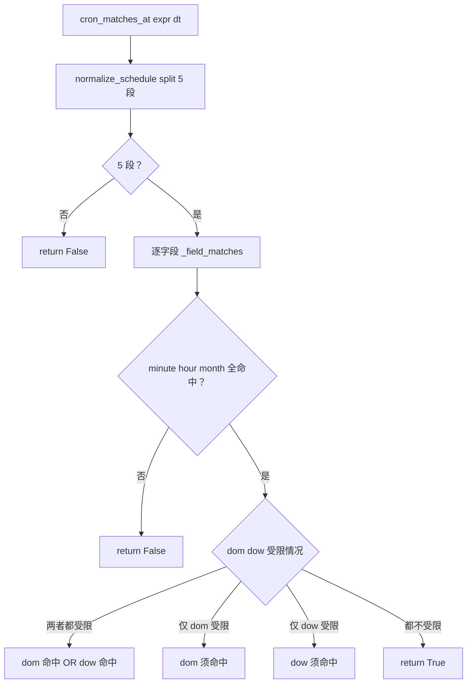

# scheduler/cron.py — cron.py

> **文件路径**: `backend/packages/harness/agentflow/scheduler/cron.py`
> **目录位置**: scheduler → cron.py
> **职责**: 手写 5 字段 cron 调度匹配（零第三方依赖，M5）

## 📑 目录

- [📋 结构图](#📋-结构图)
- [📤 关键导出](#📤-关键导出)
- [💡 设计思想](#💡-设计思想)
- [🎯 实用场景](#🎯-实用场景)
- [📊 顺序执行链流程图](#📊-顺序执行链流程图)
- [🧩 代码解析（成块对照 cron.py）](#🧩-代码解析成块对照-cronpy)
- [❓ Q&A / 知识点](#❓-qa--知识点)
- [⚠️ 风险点](#⚠️-风险点)

## 📋 结构图

```text
┌──────────────────────────────────────────────────────────────┐
│ normalize_schedule(expr) → 标准 5 字段 cron 串                │
│   标准 5 字段原样返回；空/关键词/非法 → 兜底 "0 9 * * *"      │
│                                                              │
│ cron_matches_at(expr, dt) → bool（dt 落在该调度上？）         │
│   ├─ _field_matches(pattern, value)  * , - */n a-b/n        │
│   └─ _dow_matches(pattern, dt)  DOW 按 JS 0=周日             │
│                                                              │
│ _is_standard_cron(expr) → bool   5 段且字符合法              │
│ _parse_range(token) → (lo,hi)    "a-b" 或 "a"               │
└──────────────────────────────────────────────────────────────┘
```

## 📤 关键导出

**函数**

- `normalize_schedule(expr)`
- `cron_matches_at(expr, dt)`

**内部私有**

- `_is_standard_cron` / `_parse_range` / `_field_matches` / `_dow_matches`
- 常量 `_CRON_FIELD_CHARS` / `_FALLBACK`

## 💡 设计思想

1. **零第三方依赖（关键决策）**：验收演示要"每分钟 echo"，rrule/croniter 一律不引入——
   纯 stdlib（datetime）手写 5 字段匹配，部署零额外 pip 依赖。
2. **只收标准 5 字段 cron 或粗粒度关键词**：自然语言模糊解析（"每天早上"）不做，
   空/关键词/非法写法一律兜底 `0 9 * * *`（每天 09:00），宁可保守不误触发。
3. **DOW 按 JS 约定 0=周日**：与前端/JS 生态一致，不直接用 Python `weekday()`（0=周一）。

## 🎯 实用场景

1. **建任务时归一化**：`cli/main.py` 创建定时任务前调 `normalize_schedule(raw)`，
   把用户乱填的写法兜底成合法 cron。
2. **tick 时判断命中**：`scheduler/loop.py._tick` 每分钟对每条 active 任务调
   `cron_matches_at(schedule, now)`，命中才入队。
3. **演示"每分钟跑"**：`*/1 * * * *` 经 `_field_matches` 的 `*/n` 分支每分命中。

## 📊 顺序执行链流程图

**调用方**：
- `normalize_schedule` ← `cli/main.py:225`（建任务时）+ `cron_matches_at` 内部首步
- `cron_matches_at` ← `scheduler/loop.py:111`（`_tick` 每轮）

```text
cron_matches_at(expr, dt)
│
▼
parts = normalize_schedule(expr).split()   → 非 5 段 return False
│   （空/非法/关键词都先被归一成 "0 9 * * *"）
│
▼
minute, hour, dom, month, dow = parts
│
├─ not _field_matches(minute, dt.minute) → False
├─ not _field_matches(hour, dt.hour)     → False
├─ not _field_matches(month, dt.month)   → False
│
▼（min/hour/month 全命中）
dom_restricted = dom != "*"
dow_restricted = dow != "*"
│
├─ 两者都受限 → return _field_matches(dom, day) OR _dow_matches(dow, dt)
├─ 仅 dom 受限 → return _field_matches(dom, day)
├─ 仅 dow 受限 → return _dow_matches(dow, dt)
└─ 都不受限   → return True
```

**Mermaid 版（GitHub / 飞书渲染）**：



## 🧩 代码解析（成块对照 cron.py）

> 读法：每块先贴**完整代码**，再看块下方的整块解析。代码与文件一致。

### 块 1：字符合法集 + 兜底调度 + `_is_standard_cron`

```python
# 标准 cron 单字段允许的字符：数字 / * / , / - / /
_CRON_FIELD_CHARS = set("0123456789*,/-")

# 兜底调度：任何非法/空/关键词都归一到"每天 09:00"
_FALLBACK = "0 9 * * *"


def _is_standard_cron(expr: str) -> bool:
    """是否为标准 5 字段 cron（按空白切恰好 5 段，每段字符合法且非空）。"""
    parts = expr.split()
    if len(parts) != 5:
        return False
    for p in parts:
        if not p or not _CRON_FIELD_CHARS.issuperset(p):
            return False
    return True
```

**结构简析**：`_CRON_FIELD_CHARS` 是白名单字符集（数字 + `*,/-`）；`_is_standard_cron` 用它做**最严校验**——按空白切必须恰好 5 段，每段非空且每个字符都在白名单内。`_FALLBACK = "0 9 * * *"` 是全局兜底，任何非法/空/关键词都归一到"每天 09:00"。

**`_is_standard_cron()` 参数逐条解释**：

| 参数 | 类型 | 默认值 | 含义 |
|---|---|---|---|
| `expr` | `str` | 必填 | 待校验调度表达式；`split()` 必须恰好 5 段，且每段非空、每个字符都在 `_CRON_FIELD_CHARS` 白名单内 |

**落库要点**：纯函数不碰 DB。这里**不验证数值范围**（如 hour=25 也能过）——范围交给 `_field_matches` 的 `int()` 与区间判断自然落空（99 <= value <= 99 永不命中，静默不触发）。

### 块 2：`normalize_schedule` —— 调度表达式归一化

```python
def normalize_schedule(expr: str) -> str:
    """把用户调度表达式归一化为标准 5 字段 cron 串。

    规则（定稿）：
        - 空 / None → 兜底 "0 9 * * *"
        - 标准 5 字段 cron（如 "*/1 * * * *"、"0 9 * * *"）→ 原样返回
        - 关键词（@daily / 每天 / 每天9点 / daily …）→ "0 9 * * *"
        - 其它非法写法 → 兜底 "0 9 * * *"
    """
    if not expr:
        return _FALLBACK
    e = expr.strip()
    if not e:
        return _FALLBACK
    if _is_standard_cron(e):
        return e
    # 非标准写法（关键词/自然语言/乱填）一律兜底每天 09:00
    return _FALLBACK
```

**结构简析**：归一化逻辑极简——三道闸：① `not expr`（None/空串）兜底；② strip 后空兜底；③ `_is_standard_cron` 过则原样返回，否则一律兜底。关键设计：**不做关键词识别分支**——docstring 里列的 `@daily/每天/daily` 等关键词并没有被单独解析成等价 cron，它们和"乱填"走同一条 `return _FALLBACK` 路径。

**`normalize_schedule()` 参数逐条解释**：

| 参数 | 类型 | 默认值 | 含义 |
|---|---|---|---|
| `expr` | `str` | 必填 | 用户调度表达式；空/None→兜底；标准 5 字段 cron（如 `*/5 * * * *`、`0 9 * * *`）原样返回；关键词/自然语言/乱填（如"每天9点"）无显式映射表，统一落 `_FALLBACK` |

**落库要点**：纯函数不碰 DB。"每天9点"这个关键词最终归一成 `0 9 * * *`（恰好语义一致），但代码里没有显式关键词映射表——是靠"非标准即兜底到 09:00"巧合对齐。

### 块 3：`_parse_range` + `_field_matches` —— 单字段匹配核心

```python
def _parse_range(token: str) -> tuple[int, int] | None:
    """把 "a-b" 或 "a" 解析成 (lo, hi)；非法返回 None。"""
    try:
        if "-" in token:
            lo_s, hi_s = token.split("-", 1)
            lo, hi = int(lo_s), int(hi_s)
            return (lo, hi) if lo <= hi else None
        v = int(token)
        return v, v
    except ValueError:
        return None


def _field_matches(pattern: str, value: int) -> bool:
    """单字段匹配：支持 *、逗号列表、a-b 区间、*/n 步长、a-b/n 步长区间。"""
    for part in pattern.split(","):
        part = part.strip()
        if not part:
            continue
        if part == "*":
            return True
        if "/" in part:
            base, _, step_s = part.partition("/")
            try:
                step = int(step_s)
            except ValueError:
                continue
            if step <= 0:
                continue
            if base == "*":
                # "*/n"：每 n 个单位命中一次（value 是 step 的倍数）
                if value % step == 0:
                    return True
            else:
                rng = _parse_range(base)
                if rng is not None:
                    lo, hi = rng
                    if lo <= value <= hi and (value - lo) % step == 0:
                        return True
        else:
            rng = _parse_range(part)
            if rng is not None:
                lo, hi = rng
                if lo <= value <= hi:
                    return True
    return False
```

**结构简析**：`_parse_range` 把 token 解析成闭区间 `(lo, hi)`；`_field_matches` 是单字段匹配核心——按逗号 split 成多个 part 逐个判断，支持 `*`、列表、`a-b`、`*/n`、`a-b/n`。

**`_parse_range()` 参数逐条解释**：

| 参数 | 类型 | 默认值 | 含义 |
|---|---|---|---|
| `token` | `str` | 必填 | 单字段 token；含 `-` 则 split 一次取两端，要求 `lo <= hi`（否则返回 None）；纯数字退化成 `(v, v)`；`int()` 失败（ValueError）返回 None |

**`_field_matches()` 参数逐条解释**：

| 参数 | 类型 | 默认值 | 含义 |
|---|---|---|---|
| `pattern` | `str` | 必填 | 该字段的 cron 片段（可含 `,` 列表）；`*` 立即命中；含 `/` 走步长——`base=="*"` 即 `*/n`（`value % step == 0`），否则 base 先 `_parse_range` 成区间再判 `lo<=value<=hi and (value-lo)%step==0`；不含 `/` 直接判区间包含 |
| `value` | `int` | 必填 | 待比对的当前值（如 `dt.minute`）；step 非数字或 `<=0` 都跳过（不命中，不报错） |

**落库要点**：纯函数不碰 DB。step 非法时静默跳过该 part 而非抛错。

### 块 4：`_dow_matches` + `cron_matches_at` —— 星期换算 + 五字段汇总

```python
def _dow_matches(pattern: str, dt: datetime) -> bool:
    """星期字段匹配。

    DOW 按 JS 约定：0=周日，1=周一 … 6=周六（Python weekday() 是 0=周一，
    需换算）。cron 同时允许 7 作为周日(0) 的别名，这里把独立 token "7" 归一为 "0"。
    """
    js_dow = (dt.weekday() + 1) % 7  # 周一0→1 … 周日6→0
    norm = ",".join(
        "0" if p.strip() == "7" else p for p in pattern.split(",")
    )
    return _field_matches(norm, js_dow)


def cron_matches_at(expr: str, dt: datetime) -> bool:
    """判断时刻 dt 是否命中调度 expr（先归一化再逐字段比对）。

    minute / hour / month 必须同时命中（AND）；
    dom / dow 用 POSIX 语义：两者都被限制（非 *）时取 OR，否则被限制者须命中。
    """
    parts = normalize_schedule(expr).split()
    if len(parts) != 5:
        return False
    minute, hour, dom, month, dow = parts

    if not _field_matches(minute, dt.minute):
        return False
    if not _field_matches(hour, dt.hour):
        return False
    if not _field_matches(month, dt.month):
        return False

    dom_restricted = dom != "*"
    dow_restricted = dow != "*"
    if dom_restricted and dow_restricted:
        return _field_matches(dom, dt.day) or _dow_matches(dow, dt)
    if dom_restricted:
        return _field_matches(dom, dt.day)
    if dow_restricted:
        return _dow_matches(dow, dt)
    return True
```

**结构简析**：`_dow_matches` 关键在 DOW 换算——Python `dt.weekday()` 是周一=0…周日=6，而 cron/JS 约定周日=0…周六=6。`cron_matches_at` 先归一化再拆 5 字段，min/hour/month 三个字段 AND 全命中才继续；dom/dow 用 POSIX 语义。

**`_dow_matches()` 参数逐条解释**：

| 参数 | 类型 | 默认值 | 含义 |
|---|---|---|---|
| `pattern` | `str` | 必填 | 星期字段片段；独立 token `"7"` 归一为 `"0"`（cron 惯例 7=周日），再交 `_field_matches` 比对 |
| `dt` | `datetime` | 必填 | 待判时刻；`js_dow = (dt.weekday() + 1) % 7`（周一0→1，周日6→0）换算成 JS 约定后比对 |

**`cron_matches_at()` 参数逐条解释**：

| 参数 | 类型 | 默认值 | 含义 |
|---|---|---|---|
| `expr` | `str` | 必填 | 调度表达式；先 `normalize_schedule` 归一再 split 5 段，非 5 段 return False |
| `dt` | `datetime` | 必填 | 待判时刻；minute/hour/month 须 AND 全命中；dom/dow 两者都被限制（非 `*`）取 OR（"每月 1 号或周一"都触发）、仅一个受限则该者须命中、都不受限 return True |

**落库要点**：纯函数不碰 DB。DOW 必须经 `_dow_matches` 换算，勿直接拿 `dt.weekday()` 比 pattern（差一天）；dom/dow POSIX 是 OR 不是 AND。

## ❓ Q&A / 知识点

### 1. 为什么手写 cron 而不引 croniter/rrule？

**一句话**：零第三方依赖是刻意决策——验收演示要"每分钟 echo"，引入 croniter 增加部署成本，
而 M5 需要的语义（5 字段 + `*,/-` + `*/n` + DOW）用 stdlib 不到百行就能写完。

源码设计思想第 1 条明确"零第三方依赖"。手写代价是要自己处理 DOW 换算、POSIX dom/dow OR 语义，
但换来：`pip install` 不增依赖、审计面小、行为完全可控。如果 M7 需要更复杂调度
（秒级、年字段、L 最后工作日），再评估引入 croniter。

### 2. DOW 为什么按 JS 约定 0=周日，而不是 Python weekday()？

**一句话**：与前端/JS cron 生态对齐（cron 标准本身就是 0=周日），避免和 JS 侧
"每周一跑"配置对不上。

代码 `js_dow = (dt.weekday() + 1) % 7` 把 Python 的周一=0 换成 JS 的周日=0。
如果直接拿 `dt.weekday()` 比，会差一天（Python 周一=0 vs cron 周一=1），
"每周一"会错跑到周二。这是 cron 实现最经典的坑，源码注释专门警告了。

### 3. "每天9点"这个关键词是怎么归一的？

**一句话**：它**没有**被关键词表显式映射——而是作为"非标准 cron"被兜底逻辑
统一归一成 `0 9 * * *`，恰好语义一致。

`normalize_schedule` 里没有 `if "每天" in expr: return "0 9 * * *"` 这样的分支；
`"每天9点"` 过不了 `_is_standard_cron`（含中文，白名单字符集不含中文），
直接落到最后的 `return _FALLBACK`，而 `_FALLBACK` 恰好就是 `0 9 * * *`。
这是"兜底值选得巧"而非"关键词解析"——docstring 列关键词只是举例说明哪些写法会被兜底。

## ⚠️ 风险点

1. **不做数值范围校验**：`_is_standard_cron` 只查字符，`hour=99` 能过校验，
   但 `_field_matches` 里 `99 <= value <= 99` 永不命中（静默不触发，不报错）。
2. **DOW 必须用 `_dow_matches`**：勿直接拿 `dt.weekday()` 比 pattern（差一天）。
3. **dom/dow POSIX OR 语义**：两者都写限制时是 OR 不是 AND，改逻辑前先确认。
4. **兜底即行为**：任何拼错的调度都静默变成"每天 09:00"——用户以为没生效其实在 9 点跑。

---
_2026-10-02 新建：M5 文档（目录 + 流程图 + 成块代码解析 + Q&A）。_

_2026-10-03 重构：代码解析段按「结构简析 + 参数逐条表格 + 落库要点」规范化（代码块零改动）。_
