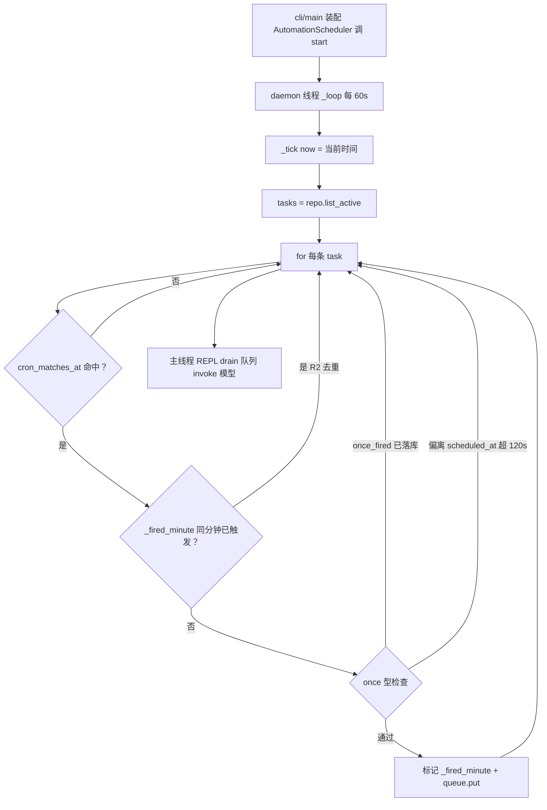

# scheduler/loop.py — loop.py

> **文件路径**: `backend/packages/harness/agentflow/scheduler/loop.py`
> **目录位置**: scheduler → loop.py
> **职责**: 定时调度 daemon tick 线程（只扫库 + 入队，绝不碰模型，M5）

## 📑 目录

- [📋 结构图](#📋-结构图)
- [📤 关键导出](#📤-关键导出)
- [💡 设计思想](#💡-设计思想)
- [🎯 实用场景](#🎯-实用场景)
- [📊 顺序执行链流程图](#📊-顺序执行链流程图)
- [🧩 代码解析（成块对照 loop.py）](#🧩-代码解析成块对照-looppy)
- [❓ Q&A / 知识点](#❓-qa--知识点)
- [⚠️ 风险点](#⚠️-风险点)

## 📋 结构图

```text
┌──────────────────────────────────────────────────────────────┐
│ AutomationScheduler(repo, queue, interval=60)                │
│   start() → threading.Thread(target=_loop, daemon=True)     │
│   stop()  → _running=False（下轮 sleep 后退出）              │
│   _loop() → while running: _tick(); sleep(interval)          │
│   _tick(now=None):                                          │
│     repo.list_active() → cron_matches_at 命中                │
│       → 分钟级去重 _fired_minute（同分钟只入队一次，R2）      │
│       → once 型：once_fired 或偏离 scheduled_at>120s 跳过    │
│       → queue.put((task_id, prompt))  ← 只投递，不执行       │
│                                                              │
│ _parse_iso(value) → datetime|None  容错解析 ISO（去时区）    │
└──────────────────────────────────────────────────────────────┘
```

## 📤 关键导出

**类**

- `AutomationScheduler`

**内部私有**

- `_parse_iso`

## 💡 设计思想

1. **tick 线程是 daemon，只扫库 + 入队，绝不建 agent / 不碰模型（R4/R6）**：
   真正执行在 REPL 主线程 `drain` 队列时。单线程 CLI 模型调用，后台线程碰模型会并发崩。
2. **分钟级去重在内存（R2）**：`_fired_minute` 是进程内 dict，同一分钟同一任务只入队一次；
   重启后不保留，靠 `once_fired` 落库兜底。
3. **once 型幂等双保险**：既看落库的 `once_fired`，又看与 `scheduled_at` 的 ±120s 时间窗。
4. **repo 走 db_path 线程本地连接（P-018）**：tick daemon 线程不共享主线程 conn。

## 🎯 实用场景

1. **CLI 启动装配**：`cli/main.py:345` `AutomationScheduler(auto_repo, q, interval=60)` + `start()`。
2. **REPL drain 执行**：主线程每轮 input 前 `q.get_nowait()` 取出命中任务，
   `agent.invoke` 真正跑模型（执行权在主线程）。
3. **测试注入 now**：`_tick(now=固定时刻)` 可测 cron 命中与去重，不依赖真实时间。

## 📊 顺序执行链流程图

**调用方**：`AutomationScheduler` ← `cli/main.py:345`（装配 start）；
`_tick` 内 `cron_matches_at` ← `scheduler/cron.py`，`list_active` ← `persistence/automation_repositories.py`。

```text
主线程 cli/main.py
│
├─ scheduler = AutomationScheduler(auto_repo, q, interval=60)
└─ scheduler.start()  → 起 daemon 线程跑 _loop
                        │
                        ▼（daemon 线程，每 60s）
                    _loop(): while _running → _tick() → sleep(60)
                        │
                        ▼
                    _tick(now=None)
                        now = now or datetime.now(UTC)
                        minute_key = now.strftime("%Y%m%d%H%M")
                        tasks = repo.list_active()   （失败静默 return）
                        │
                        for a in tasks:
                          ① cron_matches_at(a["schedule"], now)？ 否→continue
                          ② _fired_minute[task_id]==minute_key？ 是→continue（R2 去重）
                          ③ once 型？ once_fired 已落库→continue
                                  |dev(now, scheduled_at)|>120s→continue
                          ④ _fired_minute[task_id]=minute_key
                             queue.put((task_id, prompt))   ← 只投递
                        │
                        ▼（回到主线程 REPL）
                    主线程 q.get_nowait() drain → agent.invoke 执行 → finish_run/touch_last_run
```

**Mermaid 版（GitHub / 飞书渲染）**：



## 🧩 代码解析（成块对照 loop.py）

> 读法：每块先贴**完整代码**，再看块下方的整块解析。代码与文件一致。

### 块 1：imports + `_parse_iso`

```python
from __future__ import annotations

import logging
import threading
import time
from datetime import UTC, datetime

from agentflow.scheduler.cron import cron_matches_at

logger = logging.getLogger(__name__)


def _parse_iso(value: object) -> datetime | None:
    """容错解析 ISO 时间串；带时区则去时区（与本地 naive now 比较）。"""
    if not value:
        return None
    try:
        dt = datetime.fromisoformat(str(value))
    except ValueError:
        return None
    if dt.tzinfo is not None:
        dt = dt.replace(tzinfo=None)
    return dt
```

**结构简析**：标准库导入（logging/threading/time/datetime）+ `cron_matches_at`；`_parse_iso` 容错解析 ISO 串，关键一步是**带时区则去时区**，因为 `now = datetime.now(UTC)` 比较时需统一基准。

**`_parse_iso()` 参数逐条解释**：

| 参数 | 类型 | 默认值 | 含义 |
|---|---|---|---|
| `value` | `object` | 必填 | ISO 时间串（实际是 once 任务的 `scheduled_at`）；空值返回 None；`fromisoformat` 抛 ValueError 也返回 None；`dt.tzinfo is not None` 则 `replace(tzinfo=None)` 去时区 |

**落库要点**：统一成 naive 后才能 `abs((now - sat).total_seconds())` 比 ±120s 时间窗；带时区的 `scheduled_at` 直接相减会 TypeError。

### 块 2：`AutomationScheduler.__init__` + `start` + `stop`

```python
class AutomationScheduler:
    """定时调度器：后台 daemon 线程每分钟扫 active 任务，到点投队列。

    参数:
        repo:    AutomationRepository（db_path 模式，线程本地连接）
        queue:   queue.Queue，命中后投递 (task_id, prompt)
        interval: tick 间隔秒（默认 60）
    """

    def __init__(self, repo, queue, interval: float = 60):
        self._repo = repo
        self._queue = queue
        self.interval = interval
        self._running = False
        self._thread: threading.Thread | None = None
        # R2：分钟级去重 task_id -> "YYYYMMDDHHM"，同一分钟只入队一次
        self._fired_minute: dict[str, str] = {}

    def start(self) -> None:
        """启动 daemon tick 线程（detach，主进程退出即随进程结束）。"""
        self._running = True
        self._thread = threading.Thread(target=self._loop, daemon=True)
        self._thread.start()

    def stop(self) -> None:
        """停止 tick 循环（下一轮 sleep 返回后退出）。"""
        self._running = False
```

**结构简析**：`__init__` 注入三依赖并初始化 R2 分钟级去重字典；`start()` 起一个 `daemon=True` 线程跑 `_loop`（随主进程退出即结束，不阻塞退出）；`stop()` 只置标志位，靠 `_loop` 下一轮 sleep 返回后自然退出（不 join、不强行 kill）。

**`__init__()` 参数逐条解释**：

| 参数 | 类型 | 默认值 | 含义 |
|---|---|---|---|
| `repo` | AutomationRepository | 必填 | 仓储（db_path 线程本地连接模式，tick daemon 线程不共享主线程 conn） |
| `queue` | `queue.Queue` | 必填 | 命中后投递 `(task_id, prompt)` 的队列；执行权在 REPL 主线程 drain，本线程不 invoke 模型 |
| `interval` | `float` | `60` | tick 间隔秒数 |

**`start()` 参数逐条解释**：无参数，直接置 `_running=True` 并起一个 `daemon=True` 线程跑 `_loop`（detach，主进程退出即随进程结束）。

**`stop()` 参数逐条解释**：无参数，直接置 `_running=False`（下一轮 sleep 返回后退出，不 join、不强行 kill）。

**落库要点**：`_fired_minute` 是 R2 分钟级去重字典 `task_id -> "YYYYMMDDHHM"`（到分钟），进程内内存态，重启后清空，靠 once_fired 落库兜底。

### 块 3：`_loop` + `_tick` —— tick 主循环与四步判定

```python
    def _loop(self) -> None:
        while self._running:
            self._tick()
            time.sleep(self.interval)

    def _tick(self, now: datetime | None = None) -> None:
        """扫一遍 active 任务，命中者投队列。

        now 可注入（测试用固定时刻）；缺省取本地当前时间。
        """
        now = now or datetime.now(UTC)
        minute_key = now.strftime("%Y%m%d%H%M")

        try:
            tasks = self._repo.list_active()
        except Exception:  # noqa: BLE001 —— daemon 读库失败本轮静默，下轮重试
            return

        for a in tasks:
            try:
                task_id = a["task_id"]
                # ① cron 是否命中当前分钟
                if not cron_matches_at(a["schedule"], now):
                    continue
                # ② R2 分钟级去重：同一分钟同一任务只入队一次
                if self._fired_minute.get(task_id) == minute_key:
                    continue
                # ③ once 型幂等：已触发过，或偏离目标时间窗 >120s 则跳过
                if a.get("schedule_type") == "once":
                    if a.get("once_fired"):
                        continue
                    sat = _parse_iso(a.get("scheduled_at"))
                    if sat is not None and abs((now - sat).total_seconds()) > 120:
                        continue
                # ④ 标记 + 投递（不执行，执行权在 REPL 主线程）
                self._fired_minute[task_id] = minute_key
                self._queue.put((task_id, a["prompt"]))
            except Exception as exc:  # noqa: BLE001 —— 单任务异常不影响其它任务
                logger.warning("自动化单任务处理失败: %s", exc)
                continue
```

**结构简析**：`_loop` 极简——`while _running: _tick(); sleep(interval)`。`_tick` 是核心，对每条 active 任务做四步判定（cron 命中→R2 去重→once 幂等→标记+投递），最后**只投递不执行**（执行权在 REPL 主线程）。

**`_loop()` 参数逐条解释**：无参数，直接执行 `while self._running: self._tick(); time.sleep(self.interval)`。

**`_tick()` 参数逐条解释**：

| 参数 | 类型 | 默认值 | 含义 |
|---|---|---|---|
| `now` | `datetime \| None` | `None` | 注入时刻（测试用固定时刻）；缺省 `datetime.now(UTC)`；据此算 `minute_key = now.strftime("%Y%m%d%H%M")` 做分钟级去重键 |

**落库要点**：读库 `list_active()` 整个 try 包住，失败本轮静默 return（下轮重试，daemon 不因一次读库崩停摆）；for 循环里每个任务单独 try，单任务异常 `logger.warning` 后 continue（不影响其它任务）。四步：①`cron_matches_at` 不命中 continue；②`_fired_minute[task_id]` 已是当前 minute_key 则 continue（R2 去重）；③once 型——`once_fired` 落库为真 continue，否则解析 `scheduled_at`，偏离 >120s 则 continue（错过窗不补跑）；④写 `_fired_minute[task_id]=minute_key` + `queue.put((task_id, prompt))`。

## ❓ Q&A / 知识点

### 1. tick 线程为什么绝不碰模型（R4）？

**一句话**：单线程 CLI 模型调用，后台 daemon 线程里 `agent.invoke` 会与 REPL 主线程并发跑模型，
破坏"单线程 CLI、执行期间用户等待"的 R6 约束。

源码里 `_tick` 最后只做 `queue.put`——把命中的 `(task_id, prompt)` 丢进队列就完事。
真正的 `agent.invoke` 在 `cli/main.py` REPL 主线程的 drain 循环里（每轮 input 前 `q.get_nowait()`）。
这样模型调用永远在主线程串行，后台线程只干"扫库 + 比对 cron + 投递"这种纯 CPU/IO 轻活。

### 2. _fired_minute 去重为什么放内存，重启失效可接受？

**一句话**：它防的是"同一分钟内 tick 重入"（如 interval 抖动导致 60s 内扫两次），
进程重启后这个内存态丢失无所谓——因为 **once 型有 `once_fired` 落库兜底**，
recurring 型重启后本来就该重新按 cron 触发（去重本就不需要跨进程保留）。

`_fired_minute` 只在单次进程生命周期内防同一分钟重复入队。重启后：
once 任务已通过 `touch_last_run(once_fired=1)` 落库标记，`_tick` 第③步直接 continue；
recurring 任务按 cron 该几点跑就几点跑，不需要记住"上一分钟跑过"。

### 3. once 型幂等为什么是双保险（once_fired + ±120s 时间窗）？

**一句话**：`once_fired` 防"已跑完还重复触发"，±120s 窗防"进程重启后补跑早已过期的 once"——
两个条件堵的是不同漏洞。

第一道：`if a.get("once_fired"): continue`——任务执行完主线程 drain 时
`touch_last_run(once_fired=1)` 落库，下轮 tick 看到就跳过。
第二道：若进程在 `scheduled_at` 之后很久才起来（比如关机 3 小时），
此时即使 `once_fired` 还是 0，`abs(now - scheduled_at) > 120` 也会跳过——
不补跑 3 小时前该跑的 once。两道合起来才是完整幂等。

### 4. daemon 线程 + detach 是什么意思？（start() 里那行注释）

**一句话**：`daemon=True` = 主线程退出时该线程被**直接强制终止**；detach = 主线程启动它后
**不 join、不等待**，各跑各的。

**daemon 线程（守护线程）**：

| 线程类型 | 主线程退出时 |
|---|---|
| 非 daemon（默认） | 进程**必须等它结束**才能退出——主代码跑完但还有非 daemon 线程活着，进程就挂着 |
| daemon=True | 进程**立即退出**，该线程被丢弃，不等不救 |

**detach（分离）**：C++ 有显式的 `std::thread::detach()`；Python 没有单独方法，
"分离"效果 = `daemon=True` + 不 `join()` 组合实现。启动后主线程继续干自己的事，
不阻塞、不回收。

**为什么 tick 线程敢用 daemon**：它的职责极轻——只**扫库 + 比对 cron + `queue.put`**，
不碰模型、不持有必须落盘的中间状态（R4/R6 设计约束）。所以：

1. 用户退出 CLI（exit / Ctrl+C）时进程**立刻结束**，不用写 `stop()` 优雅停止；
2. 队列里还没处理的定时任务直接丢弃可接受（下次启动再触发）；
3. 若它是非 daemon，退出 CLI 会"卡住"——主线程等着这个 60s 循环永远不结束的线程。

对应源码（`start()`，178-181 行）：

```python
def start(self) -> None:
    """启动 daemon tick 线程（detach，主进程退出即随进程结束）。"""
    self._running = True
    self._thread = threading.Thread(target=self._loop, daemon=True)
    self._thread.start()
```

`stop()` 也印证了这一设计：它只置 `_running=False`，**不 join、不强行 kill**——
daemon 语义下根本不需要等线程收尾，`_loop` 下一轮 sleep 返回后自然退出即可。

## ⚠️ 风险点

1. **_fired_minute 是进程内内存态**：重启后清空，靠 once_fired 落库兜底；
   recurring 型不受影响。
2. **tick 内异常静默吞掉**：读库失败本轮 return、单任务异常 continue——
   daemon 线程崩了不会抛到主线程，排障时要看日志别指望报错。
3. **绝不在线程里 invoke 模型**：任何"在 _tick 里直接跑 agent"的改动都违反 R4/R6。
4. **once 型 ±120s 窗是硬编码**：错过窗口不补跑，勿改大（否则会补跑很久前的任务）。

---
_2026-10-02 新建：M5 文档（目录 + 流程图 + 成块代码解析 + Q&A）。_

_2026-10-03 重构：代码解析段按「结构简析 + 参数逐条表格 + 落库要点」规范化（代码块零改动）。_

_2026-10-06 追加：Q&A 4（daemon 线程 + detach 概念解释，含对比表与源码对照）。_
