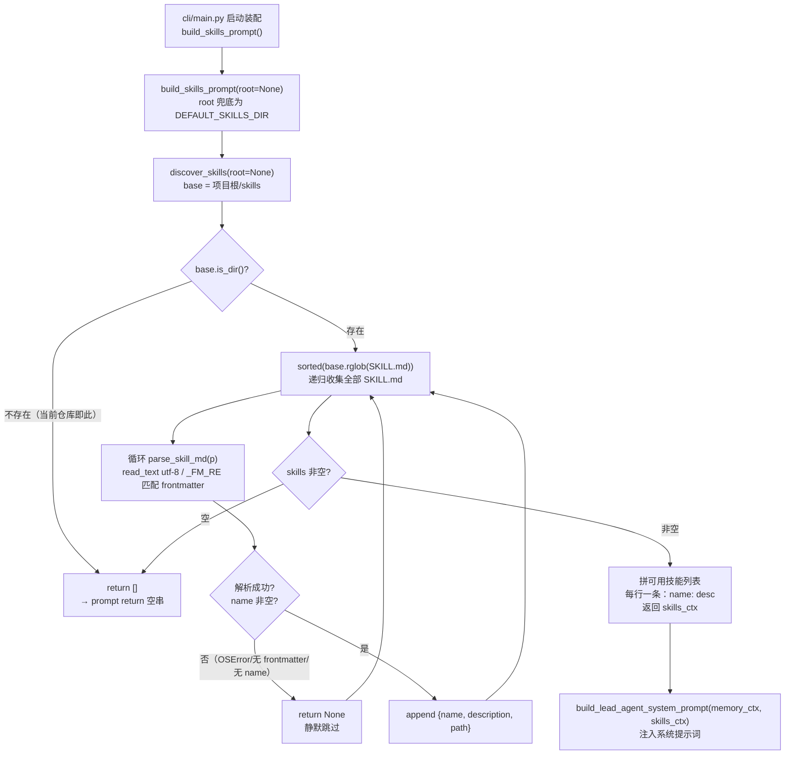

# skills/loader.py — loader.py

> **文件路径**: `backend/packages/harness/agentflow/skills/loader.py`
> **目录位置**: skills → loader.py
> **职责**: SKILL.md 发现 / 解析 / 注入系统提示词（M3：扫描目录 → 读 frontmatter → 生成技能列表 prompt）

## 📑 目录

- [📋 结构图](#📋-结构图)
- [📤 关键导出](#📤-关键导出)
- [💡 设计思想](#💡-设计思想)
- [🎯 实用场景](#🎯-实用场景)
- [📊 顺序执行链流程图](#📊-顺序执行链流程图)
- [🧩 代码解析（成块对照 loader.py）](#🧩-代码解析成块对照-loaderpy)
- [❓ Q&A / 知识点](#❓-qa--知识点)
- [⚠️ 风险点](#⚠️-风险点)

## 📋 结构图

```text
┌──────────────────────────────────────────────────────────────┐
│ 外部调用方: cli/main.py                                       │
│   from agentflow.skills.loader import build_skills_prompt     │
│   skills_ctx = build_skills_prompt()        ← 启动装配时调用  │
│   system_prompt = build_lead_agent_system_prompt(            │
│       memory_ctx, skills_ctx)               ← 注入系统提示词   │
└──────────────────────────────────────────────────────────────┘
                              │
                              ▼
┌──────────────────────────────────────────────────────────────┐
│ DEFAULT_SKILLS_DIR: 默认扫描根（项目根/skills，parents[5]）   │
│ _FM_RE: frontmatter 极简正则（^--- … --- 之间的 yaml 块）     │
│                                                              │
│ build_skills_prompt(root=None) -> str                        │
│   技能列表 → 提示词段落（无技能 → 空串）                       │
│        │ 调用                                                 │
│        ▼                                                     │
│ discover_skills(root=None) -> list[dict]                      │
│   base.rglob("SKILL.md") 递归找 → sorted 稳定排序              │
│        │ 逐个调用                                             │
│        ▼                                                     │
│ parse_skill_md(path) -> dict | None                          │
│   读 SKILL.md → 取 frontmatter 的 name/description            │
│   返回 {"name","description","path"}；不规范 → None（静默跳过） │
└──────────────────────────────────────────────────────────────┘
```

## 📤 关键导出

**函数**

- `build_skills_prompt(root: str | Path | None = None) -> str` —— 唯一被外部（cli/main.py）导入的入口
- `discover_skills(root: str | Path | None = None) -> list[dict]` —— 递归发现全部技能（仅包内被 build_skills_prompt 调用）
- `parse_skill_md(path: str | Path) -> dict | None` —— 解析单个 SKILL.md（仅包内被 discover_skills 调用）

**常量**

- `DEFAULT_SKILLS_DIR` —— 默认技能扫描根（项目根/skills）
- `_FM_RE`（私有）—— frontmatter 正则

## 💡 设计思想

1. **SKILL.md 自描述**：每个技能一个目录 + 一个说明文件（SKILL.md），模型靠 frontmatter 里的 `description` 知道"什么时候用什么技能"（对标 evoflow/skills 的原版思想）。
2. **无技能目录时返回空串**：提示词干净，不引入噪声；没有 skills 目录也照常启动，不报错。
3. **M3 只做"发现 + 注入说明"**：本阶段只把"有哪些技能、各自干什么"列进系统提示词；技能正文真正被调用留给 M6（接 MCP 时再学）。

## 🎯 实用场景

1. **新会话启动装配**：cli/main.py 启动时调用 `build_skills_prompt()`，把"可用技能清单"拼进 lead agent 系统提示词，模型开工前就知道有哪些技能可用。
2. **技能即插即用**：在项目根 `skills/<技能名>/SKILL.md` 写好带 `name`/`description` frontmatter 的说明文件，下次启动自动被 `rglob` 发现，无需改任何 Python 代码。
3. **缺目录静默降级**：默认扫描根不存在时 `discover_skills` 返回 `[]`、`build_skills_prompt` 返回 `""`，Agent 无技能也能跑（当前仓库即此状态）。

## 📊 顺序执行链流程图

```text
cli/main.py 启动装配（request: skills_ctx = build_skills_prompt()）
│
▼
build_skills_prompt(root=None)    ← main.py 空参调用 → root 兜底为 DEFAULT_SKILLS_DIR
│
▼
discover_skills(root=None)         ← base = DEFAULT_SKILLS_DIR（项目根/skills）
│
▼
base.is_dir() 检查                ← 目录不存在 → 直接 return []
│                                  （当前仓库：项目根/skills 不存在，运行时即此分支）
├────────────────────────────────── 命中分支：prompt 直接 return ""
│
▼（目录存在时）
sorted(base.rglob("SKILL.md"))   ← 递归找全部 SKILL.md，sorted 保证输出顺序稳定
│
▼ 对每个 p 循环
parse_skill_md(p)                 ← Path.read_text(encoding="utf-8")；OSError → return None
│                                  _FM_RE.match 命中首段 frontmatter；未命中 → None
▼
逐行拆 name:/description:          ← 去掉首尾引号；name 为空 → return None（跳过）
│
▼
if parsed: out.append(parsed)     ← 解析失败的 None 被静默过滤，不入列表
│
▼
build_skills_prompt 拼提示词      ← 空列表 → return ""；
│                                  否则 ["可用技能:", "- name: desc or （无说明）"] 用 \n 连接
▼
build_lead_agent_system_prompt(memory_ctx, skills_ctx)
                                  ← 技能段落进系统提示词，随 agent 启动生效
```

**Mermaid 版（GitHub / 飞书渲染；VSCode 需装插件）**：



## 🧩 代码解析（成块对照 loader.py）

> 读法：每块先贴**完整代码**，再看块下方的整块解析。代码与文件一致，仅省略头部规范注释。

### 块 1：imports + 两个模块级常量 —— 扫描根与 frontmatter 正则

```python
from __future__ import annotations

import re
from pathlib import Path

# 默认技能扫描根（项目根/skills；不存在时 discover 返回空）
DEFAULT_SKILLS_DIR = Path(__file__).resolve().parents[5] / "skills"

# frontmatter: 开头 --- 到下一个 --- 之间的 yaml 块
_FM_RE = re.compile(r"^---\s*\n(.*?)\n---\s*\n", re.DOTALL)
```

**结构简析**：两个模块级常量——`DEFAULT_SKILLS_DIR` 用 `__file__` 反推项目根（本文件位于 `backend/packages/harness/agentflow/skills/loader.py`，`parents[5]` = 仓库根 `AgentFlow/`，再拼 `skills`）；`_FM_RE` 是极简 frontmatter 提取正则（`^---\s*\n` 行首 `---`，`(.*?)` 非贪婪捕获到下一个 `\n---\s*\n`，`re.DOTALL` 让 `.` 跨行），只认「文件最开头第一段 `---` 包裹的块」。

**补充**：`from __future__ import annotations` 让 `str | Path | None` 这类新写法在旧解释器下也只做字符串注解、不立即求值。

### 块 2：`parse_skill_md` —— 解析单个 SKILL.md

```python
def parse_skill_md(path: str | Path) -> dict | None:
    """解析一个 SKILL.md：取 frontmatter 的 name/description。

    返回: {"name","description","path"}；格式不规范则返回 None。
    """
    p = Path(path)
    try:
        raw = p.read_text(encoding="utf-8")
    except OSError:
        return None
    m = _FM_RE.match(raw)
    if not m:
        return None
    fm = m.group(1)
    name = ""
    desc = ""
    for line in fm.splitlines():
        line = line.strip()
        if line.startswith("name:") and not name:
            name = line.split(":", 1)[1].strip().strip('"').strip("'")
        elif line.startswith("description:") and not desc:
            desc = line.split(":", 1)[1].strip().strip('"').strip("'")
    if not name:
        return None
    return {"name": name, "description": desc, "path": str(p)}
```

**结构简析**：容错优先的「尽力解析」——读文件失败（OSError）→ None；没命中 `_FM_RE` → None；逐行扫 frontmatter 只认 `name:`/`description:` 两个键（`split(":", 1)` 只切第一个冒号，值剥首尾空白和单/双引号；`and not name`/`and not desc` 表示只取**第一个**出现的键）；`name` 为空 → None。

**`parse_skill_md()` 参数逐条解释**：

| 参数 | 类型 | 默认值 | 含义 |
|---|---|---|---|
| `path` | `str \| Path` | 必填 | 单个 SKILL.md 路径；读不到/无 frontmatter/无 name 都返回 None（静默跳过） |

**落库要点/补充**：返回值固定三字段 `{"name", "description", "path"}`，`path` 转成字符串供后续 M6 定位技能正文；`description` 允许为空（拼 prompt 时显示「（无说明）」）。

### 块 3：`discover_skills` —— 递归目录扫描

```python
def discover_skills(root: str | Path | None = None) -> list[dict]:
    """递归扫描技能根目录，收集全部 SKILL.md 的技能说明。"""
    base = Path(root) if root else DEFAULT_SKILLS_DIR
    if not base.is_dir():
        return []
    out: list[dict] = []
    for p in sorted(base.rglob("SKILL.md")):
        parsed = parse_skill_md(p)
        if parsed:
            out.append(parsed)
    return out
```

**结构简析**：`root` 不传则兜底 `DEFAULT_SKILLS_DIR`；目录不存在直接 `return []`（不报错、不警告，是「无技能也能启动」的关键分支）；`base.rglob("SKILL.md")` 递归找所有该文件，外包 `sorted(...)` 让扫描顺序与文件系统无关、提示词稳定；逐个交给 `parse_skill_md`，`if parsed` 把解析失败的 `None` 静默过滤。

**`discover_skills()` 参数逐条解释**：

| 参数 | 类型 | 默认值 | 含义 |
|---|---|---|---|
| `root` | `str \| Path \| None` | `None` | 技能扫描根目录；为 None 时兜底 `DEFAULT_SKILLS_DIR`（项目根/skills） |

### 块 4：`build_skills_prompt` —— 拼提示词段落

```python
def build_skills_prompt(root: str | Path | None = None) -> str:
    """可用技能 → 提示词段落（无技能返回空串）。"""
    skills = discover_skills(root)
    if not skills:
        return ""
    lines = ["可用技能:", *[f"- {s['name']}: {s['description'] or '（无说明）'}" for s in skills]]
    return "\n".join(lines)
```

**结构简析**：本函数是**唯一被外部导入的入口**（cli/main.py `from agentflow.skills.loader import build_skills_prompt`）；空技能 → `return ""`（调用方拼进系统提示词也无副作用）；非空时输出形如「可用技能:」+ 每行 `- name: desc`，`s['description'] or '（无说明）'` 占位避免孤零零的 `- name:`。

**`build_skills_prompt()` 参数逐条解释**：

| 参数 | 类型 | 默认值 | 含义 |
|---|---|---|---|
| `root` | `str \| Path \| None` | `None` | 透传给 `discover_skills`；None 时走默认扫描根 |

**落库要点/补充**：产物 `skills_ctx` 在 cli/main.py 与 `memory_ctx` 一起传入 `build_lead_agent_system_prompt(memory_ctx, skills_ctx)`，最终进 lead agent 系统提示词。

## ❓ Q&A / 知识点

### 1. 为什么 frontmatter 不规范/文件读失败时是"静默跳过"而不是报错？

**一句话**：`parse_skill_md` 用 `return None` 表达"这个文件不算技能"，`discover_skills` 用 `if parsed` 把 None 滤掉——技能目录是用户可自由增删的开放目录，混入一个格式不对的 SKILL.md 不应拖垮整个 Agent 启动。

| 异常情况 | 落点 | 结果 |
|---|---|---|
| 文件不存在 / 无权限 | `except OSError: return None` | 静默跳过 |
| 文件开头没有 `---` frontmatter | `_FM_RE.match` 未命中 → `return None` | 静默跳过 |
| frontmatter 里没有 `name:` | `if not name: return None` | 静默跳过 |
| `name` 有、`description` 空 | 正常返回，description="" | 提示词里显示"（无说明）" |

代价是"写了技能却没被发现"时**没有任何日志提示**——排查时要自己确认 SKILL.md 开头是否是合法 `---` 块、是否有 `name:` 行。

### 2. `DEFAULT_SKILLS_DIR` 的 `parents[5]` 怎么就到了项目根？

**一句话**：靠 `__file__` 逐层向上数——本文件路径 `backend/packages/harness/agentflow/skills/loader.py`，`parents[0]`=skills、`[1]`=agentflow、`[2]`=harness、`[3]`=packages、`[4]`=backend、`[5]`=仓库根 `AgentFlow/`，再拼 `/"skills"` 即 `<仓库根>/skills`。

所以移动本文件的目录层级会改变默认扫描根；但函数签名带 `root` 参数，调用方也可显式覆盖。

### 3. M3 阶段技能"被真正执行"了吗？

**一句话**：没有。loader 只做**发现 + 把 name/description 列进系统提示词**；技能正文（SKILL.md 之后的内容）当前根本不读取，技能真正被模型调用/执行留给 M6 接 MCP 时再做——源码头部注释原话："M3 只做'发现 + 注入说明'；技能内容真正被调用 M6 再学（MCP）"。

## ⚠️ 风险点

1. frontmatter 解析是**极简正则 + 逐行认两个键**：不解析嵌套/多行 YAML、不认列表值；格式不规范时静默跳过（不报错），容易"写了技能但没被发现"且无任何提示。
2. 注入内容长度 = 技能数 × description 长度，技能变多时注意 system prompt 的 token 占用。
3. **默认扫描根当前是空的**：`<仓库根>/skills/` 目录在本仓库尚不存在，运行时 `discover_skills` 返回 `[]`、`build_skills_prompt()` 返回 `""`——加载链路已接好，但暂无技能可注入；新增技能需在项目根建 `skills/<名>/SKILL.md`。
4. `root` 参数虽支持传参，但 cli/main.py 当前是**空参调用** `build_skills_prompt()`（未把扫描根暴露成 CLI 参数）；源码注释写"扫描根可配（CLI 传参）"，该接线点尚未真正落地。

---
_2026-09-30 新建：M3 文档（目录 + 流程图 + 成块代码解析 + Q&A）。_
_2026-10-03 重构：代码解析段按「结构简析 + 参数逐条表格 + 落库要点」规范化（代码块零改动）。_
