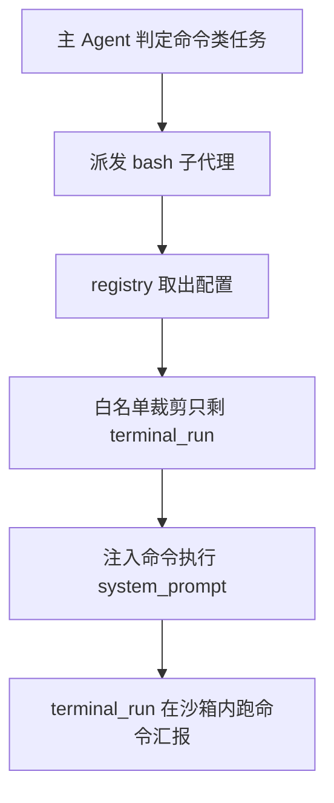

# subagents/builtins/bash_agent.py — bash_agent.py

> **文件路径**: `backend/packages/harness/agentflow/subagents/builtins/bash_agent.py`
> **目录位置**: subagents → builtins → bash_agent.py
> **职责**: Bash 子代理配置（最小权限：只给 terminal_run 终端工具）

## 📑 目录

- [📋 结构图](#📋-结构图)
- [📤 关键导出](#📤-关键导出)
- [💡 设计思想](#💡-设计思想)
- [🎯 实用场景](#🎯-实用场景)
- [📊 顺序执行链流程图](#📊-顺序执行链流程图)
- [🧩 代码解析（成块对照 bash_agent.py）](#🧩-代码解析成块对照-bash_agentpy)
- [❓ Q&A / 知识点](#❓-qa--知识点)
- [⚠️ 风险点](#⚠️-风险点)

## 📋 结构图

```text
┌──────────────────────────────────────────────────────────┐
│ BASH_AGENT_CONFIG = SubagentConfig(                      │
│   name="bash"                                          │
│   description: 跑命令/脚本/批处理任务时派它                │
│   system_prompt: 只做命令执行，汇报命令与结果摘要          │
│   tools=["terminal_run"]  白名单（只给终端，最小权限）     │
│   model="inherit" / max_turns=50（未消费） / timeout=120 │
└──────────────────────────────────────────────────────────┘
```

## 📤 关键导出

**实例**

- `BASH_AGENT_CONFIG`（SubagentConfig）

## 💡 设计思想

1. 专用化：bash 子代理只被派去执行命令类任务，工具白名单只留 `terminal_run`（不碰文件/知识库）。
2. 白名单而非黑名单：职责越窄越安全（最小权限原则）——即使 config 黑名单忘了排，白名单本身也只放行终端。
3. 沙箱兜底：terminal_run 走 LocalSandbox，命令逃逸由 sandbox._resolve 拦截（见 sandbox/local.py）。

## 🎯 实用场景

1. 命令执行类任务：查看系统状态、跑测试、批处理文件。
2. 需要在沙箱内跑脚本且只要结果摘要。
3. 不适合：需要阅读理解的复杂任务（派 general-purpose）。

## 📊 顺序执行链流程图（bash 子代理被派发）

```text
主 Agent 判定是命令执行类任务（request）
│
▼
dispatch_subagents(subagent="bash")
│
▼
registry.get_subagent_config("bash")         ← 取出 BASH_AGENT_CONFIG
│
▼
SubagentExecutor(cfg, tools, model)          ← tools=["terminal_run"] 白名单裁剪
│
▼
_filter_tools：先白名单只剩 terminal_run，再剔黑名单（此时已无派发工具）
│
▼
create_agent(system_prompt=命令执行说明书)
│
▼
子代理用 terminal_run 在沙箱内跑命令 → 汇报退出码/结果摘要
```

**Mermaid 版（GitHub / 飞书渲染；VSCode 需装插件）**：



## 🧩 代码解析（成块对照 bash_agent.py）

> 读法：每块先贴**完整代码**，再看块下方的整块解析。代码与文件一致，仅省略头部规范注释。

### 块 1：imports

```python
from __future__ import annotations

from agentflow.subagents.config import SubagentConfig
```

**结构简析**：与 general_purpose 同款——只 import 同包 `SubagentConfig`，本文件只 new 一个配置实例。

本块无可逐条解释的函数（仅 import）。

**补充**：注册表装配在 builtins/__init__.py，本文件只产出配置对象。

### 块 2：BASH_AGENT_CONFIG 完整实例

```python
BASH_AGENT_CONFIG = SubagentConfig(
    name="bash",
    description="""Bash 子代理：需要执行 shell 命令、跑脚本或批处理时派它。
适合：命令执行类任务（查看系统状态、跑测试、批处理文件）；不适合：需要阅读理解的复杂任务。""",
    system_prompt="""你是一个 Bash 子代理：负责在沙箱内执行命令并汇报结果。

<行为准则>
- 用 terminal_run 执行命令；命令要在沙箱工作目录内完成
- 执行前自问：这条命令是否必要？是否可能影响宿主系统？（沙箱会拦截越界访问）
- 命令失败时：给出退出码/报错摘要，并尝试合理的修正（如加 --help 确认用法）
- 不要用终端做文件编辑（有 read_file / write_file 工具时优先用它们）
- 结束前总结：执行了什么命令、结果如何
</行为准则>
""",
    tools=["terminal_run"],  # 白名单：只给终端工具（最小权限）
    model="inherit",
    max_turns=50,
    timeout_seconds=120,
)
```

**结构简析**：直接 `SubagentConfig(...)` 构造一个 Bash 子代理配置实例，核心是用 `tools=["terminal_run"]` 白名单把能力面钉死在终端；未列的 `disallowed_tools` 走 config 默认黑名单。

**`SubagentConfig()` 参数逐条解释**（本实例实际传入的字段）：

| 参数 | 类型 | 默认值 | 含义 |
|---|---|---|---|
| `name` | `str` | 必填 | `"bash"`，注册表键，与 `BUILTIN_SUBAGENTS` 键名逐字一致 |
| `description` | `str` | 必填 | 多行文本，告诉主 Agent：命令/脚本/批处理派它；阅读理解类派 general-purpose |
| `system_prompt` | `str` | 必填 | `<行为准则>`：只做命令执行、沙箱内完成、失败给退出码、不拿终端编辑文件、结束总结 |
| `tools` | `list[str] \| None` | `None` | 此处显式 `["terminal_run"]`——**白名单只放行终端工具**（最小权限，与 general-purpose 的 None 形成对照） |
| `model` | `str` | `"inherit"` | 此处显式 `"inherit"`，复用父模型 |
| `max_turns` | `int` | `100` | 配置值为 `50`，但 executor 当前未消费，不会限制轮数 |
| `timeout_seconds` | `int` | `120` | 此处显式 120，单任务上限 |

**落库要点**：本实例未显式传 `disallowed_tools`，用 config 默认黑名单；但因 `tools=["terminal_run"]` 白名单已把工具集裁到只剩终端，黑名单这道在此处实际无额外可剔项——白名单本身已足够窄。

## ❓ Q&A / 知识点

### 1. 为什么 bash 子代理用白名单只留 terminal_run，而不是靠黑名单？

**一句话**：最小权限原则——白名单是"只放行 terminal_run"，即便 config 黑名单以后被改松、或新增了别的工具，bash 子代理的能力面也被钉死在终端，不会意外拿到文件/知识库工具。黑名单是"排除危险项"，白名单是"只给安全项"，后者更窄更安全。

### 2. terminal_run 走沙箱，executor 层知道吗？

**一句话**：不知道，也不需要知道。executor 只把过滤后的工具集交给 create_agent；`terminal_run` 工具内部自己走 LocalSandboxProvider（cli/main.py:176 注入），命令越界由 sandbox._resolve 拦截。bash 子代理的"在沙箱内执行"是工具层行为，executor 无感知。

## ⚠️ 风险点

1. `tools` 白名单改宽 = 扩大 bash 子代理能力面，谨慎（一旦加进 read_file/write_file 就不再是纯命令代理）。
2. 沙箱内执行：terminal_run 走 LocalSandbox，命令逃逸限制见 sandbox/local.py。
3. `max_turns=50` 当前不会限制轮数；真正生效的是 `timeout_seconds`，且超时无法强制终止底层线程。

---
_2026-10-01 M4 补齐：目录 + 顺序执行链流程图 + 成块代码解析（+Q&A）。_
_2026-10-03 重构：代码解析段按「结构简析 + 参数逐条表格 + 落库要点」规范化（代码块零改动）。_
