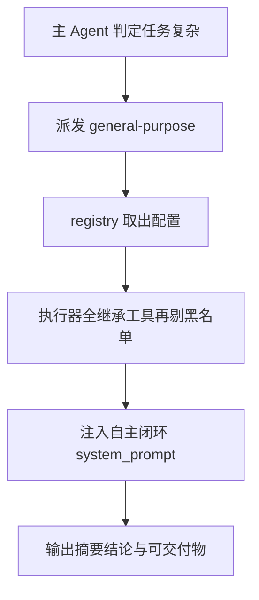

# subagents/builtins/general_purpose.py — general_purpose.py

> **文件路径**: `backend/packages/harness/agentflow/subagents/builtins/general_purpose.py`
> **目录位置**: subagents → builtins → general_purpose.py
> **职责**: 通用子代理配置（复杂多步骤任务的"万能分身"）

## 📑 目录

- [📋 结构图](#📋-结构图)
- [📤 关键导出](#📤-关键导出)
- [💡 设计思想](#💡-设计思想)
- [🎯 实用场景](#🎯-实用场景)
- [📊 顺序执行链流程图](#📊-顺序执行链流程图)
- [🧩 代码解析（成块对照 general_purpose.py）](#🧩-代码解析成块对照-general_purposepy)
- [❓ Q&A / 知识点](#❓-qa--知识点)
- [⚠️ 风险点](#⚠️-风险点)

## 📋 结构图

```text
┌──────────────────────────────────────────────────────────┐
│ GENERAL_PURPOSE_CONFIG = SubagentConfig(                  │
│   name="general-purpose"                                │
│   description: 复杂多步骤任务时派它                        │
│   system_prompt: 自主完成 + 清晰可核验结论                │
│   tools=None（继承父级全部工具）                          │
│   model="inherit" / max_turns=100 / timeout=120          │
└──────────────────────────────────────────────────────────┘
```

## 📤 关键导出

**实例**

- `GENERAL_PURPOSE_CONFIG`（SubagentConfig）

## 💡 设计思想

1. description 即"派发说明书"：主 Agent 读它决定何时派这个子代理。
2. system_prompt 裁剪自原版：保留"闭环优先 + 可核验结论"，删掉原版大文件探索规则（M4 无 MCP 环境，留待 M5）。
3. 明确禁止澄清：子代理拿到的任务已由主 Agent 拆好，不应再反问用户（原版同款约束；config 默认黑名单也排了 ask_clarification）。

## 🎯 实用场景

1. 复杂多步骤任务：查资料 + 改文件组合、需要分步推理、有明确先后顺序的流程。
2. 可拆成多个独立小任务并行做（配 dispatch_parallel）。
3. 不适合：一眼能做完的极简一步操作（不必派子代理）。

## 📊 顺序执行链流程图（general-purpose 被派发）

```text
主 Agent 判定任务复杂多步骤（request）
│
▼
dispatch_subagents(subagent="general-purpose")
│
▼
registry.get_subagent_config("general-purpose")  ← 取出 GENERAL_PURPOSE_CONFIG
│
▼
SubagentExecutor(cfg, tools, model)            ← tools=None 全继承，再剔黑名单
│
▼
create_agent(system_prompt=cfg.system_prompt)  ← 注入"自主闭环+可核验"说明书
│
▼
子代理自主执行 → 输出完成摘要/关键发现/产出/未完成项
```

**Mermaid 版（GitHub / 飞书渲染；VSCode 需装插件）**：



## 🧩 代码解析（成块对照 general_purpose.py）

> 读法：每块先贴**完整代码**，再看块下方的整块解析。代码与文件一致，仅省略头部规范注释。

### 块 1：imports

```python
from __future__ import annotations

from agentflow.subagents.config import SubagentConfig
```

**结构简析**：只 import 同包的 `SubagentConfig`，不建逻辑、不注册表，仅 new 一个配置实例。

本块无可逐条解释的函数（仅 import）。

**补充**：注册表装配在 builtins/__init__.py，本文件只负责产出配置对象。

### 块 2：GENERAL_PURPOSE_CONFIG 完整实例

```python
GENERAL_PURPOSE_CONFIG = SubagentConfig(
    name="general-purpose",
    description="""通用子代理：复杂多步骤任务（查资料+改文件组合、需要分步推理、有明确先后顺序的流程）。
适合：任务可拆成多个独立小任务并行做；不适合：一眼能做完的极简一步操作。""",
    system_prompt="""你是一个通用子代理：在可用工具与策略允许范围内，自主把当前任务做完，并给出清晰、可核验的结论。

<行为准则>
- 以把当前任务闭环为优先，按需、合规使用可用工具
- 步步为营，但在信息足够时果断执行
- 若遇错误、权限或环境限制，说明现象、原因与影响，并给出可行替代方案（若有）
- 结束前用简短文字总结完成内容与产出
- 不要向用户发起澄清提问；仅依据已给出的任务说明与上下文尽力完成
</行为准则>

<输出格式>
告一段落时请尽量包含：
1. 完成事项摘要
2. 关键发现或结论
3. 相关文件路径、数据或可交付物（如有）
4. 未完成项或风险（如有）
</输出格式>
""",
    tools=None,  # 继承父级全部工具（executor 按 disallowed 过滤）
    model="inherit",
    max_turns=100,
    timeout_seconds=120,
)
```

**结构简析**：直接 `SubagentConfig(...)` 构造一个通用子代理配置实例，逐字段指定取值；未列的 `disallowed_tools` 走 config 默认黑名单三件套。

**`SubagentConfig()` 参数逐条解释**（本实例实际传入的字段）：

| 参数 | 类型 | 默认值 | 含义 |
|---|---|---|---|
| `name` | `str` | 必填 | `"general-purpose"`，注册表键，与 `BUILTIN_SUBAGENTS` 键名逐字一致 |
| `description` | `str` | 必填 | 多行文本，告诉主 Agent"何时派它"：复杂多步骤、可拆并行；不适合极简一步 |
| `system_prompt` | `str` | 必填 | `<行为准则>`+`<输出格式>`：自主闭环、可核验结论、**禁止澄清**、四段式输出（摘要/发现/产出/未完成项） |
| `tools` | `list[str] \| None` | `None` | 此处显式传 `None` = 继承父级全部工具，executor 再按 disallowed 剔三件套 |
| `model` | `str` | `"inherit"` | 此处显式 `"inherit"`，复用父模型 |
| `max_turns` | `int` | `100` | 此处显式 100，比 bash 子代理（50）宽松——复杂任务轮次多 |
| `timeout_seconds` | `int` | `120` | 此处显式 120，单任务上限 |

**落库要点**：`disallowed_tools` 未在此列出，走 config 默认 `["subagent","dispatch_subagents","ask_clarification"]`；system_prompt 里"不要向用户发起澄清提问"与该黑名单排 `ask_clarification` 是双重保险。

## ❓ Q&A / 知识点

### 1. tools=None 是不是意味着子代理啥工具都能用？

**一句话**：几乎全继承，但不是无限制——`tools=None` 跳过白名单裁剪，可 `disallowed_tools` 黑名单这道闸仍生效，默认三件套（subagent / dispatch_subagents / ask_clarification）照样被剔掉。

### 2. 为什么通用子代理明确"不要向用户发起澄清提问"？

**一句话**：子代理面前没有用户——它是被主 Agent 派去干活的分身，任务已被主 Agent 拆好；它若反问，没人可答，只会卡死循环。所以 system_prompt 从行为上禁止澄清，config 黑名单又从工具上排掉 ask_clarification。

## ⚠️ 风险点

1. description 措辞影响主 Agent 何时派发（改了行为就变）。
2. system_prompt 保持"自主 + 可核验"，别加回澄清许可。
3. `tools=None` 能力面大，叠加 MAX_CONCURRENT_SUBAGENTS=3 控制并发即可。

---
_2026-10-01 M4 补齐：目录 + 顺序执行链流程图 + 成块代码解析（+Q&A）。_
_2026-10-03 重构：代码解析段按「结构简析 + 参数逐条表格 + 落库要点」规范化（代码块零改动）。_
