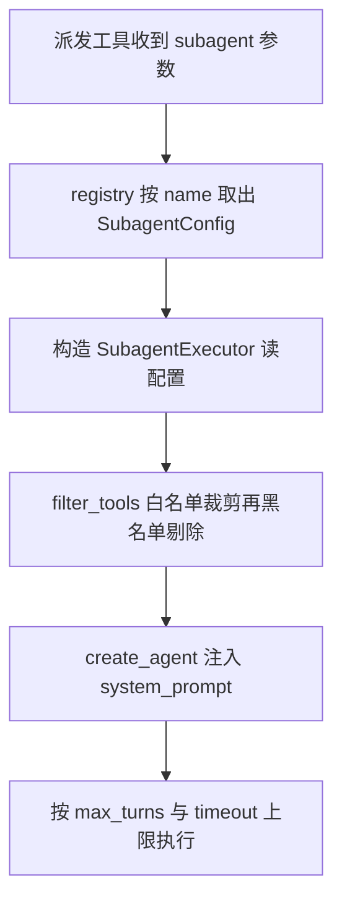

# subagents/config.py — config.py

> **文件路径**: `backend/packages/harness/agentflow/subagents/config.py`
> **目录位置**: subagents → config.py
> **职责**: 子代理配置数据类（配置与注册分离：builtins 定义配置，registry 负责查表）

## 📑 目录

- [📋 结构图](#📋-结构图)
- [📤 关键导出](#📤-关键导出)
- [💡 设计思想](#💡-设计思想)
- [🎯 实用场景](#🎯-实用场景)
- [📊 顺序执行链流程图](#📊-顺序执行链流程图)
- [🧩 代码解析（成块对照 config.py）](#🧩-代码解析成块对照-configpy)
- [❓ Q&A / 知识点](#❓-qa--知识点)
- [⚠️ 风险点](#⚠️-风险点)

## 📋 结构图

```text
┌──────────────────────────────────────────────────────────┐
│ @dataclass SubagentConfig                                │
│   name: 唯一标识（注册表查表键 "general-purpose"/"bash"） │
│   description: 给主 Agent 看的"何时派这个子代理"           │
│   system_prompt: 子代理行为说明书                         │
│   tools: 工具白名单（None = 继承父级全部）                │
│   disallowed_tools: 黑名单（默认排除递归派发三件套）      │
│   model: "inherit" = 用父模型（M4 仅支持此值）           │
│   max_turns / timeout_seconds: 执行上限                   │
└──────────────────────────────────────────────────────────┘
```

## 📤 关键导出

**类**

- `SubagentConfig`（@dataclass）

## 💡 设计思想

1. 配置与注册分离：builtins/general_purpose.py、builtins/bash_agent.py 只负责 new 出 `SubagentConfig` 实例，registry.py 负责把它们收进注册表查表。
2. 默认黑名单防递归：`disallowed_tools` 默认值排除 `subagent` / `dispatch_subagents` / `ask_clarification`，子代理默认不能再派子代理（否则无限嵌套）。
3. M4 只支持 `model="inherit"`（与父 Agent 同模型）；各自配模型留到 M6。

## 🎯 实用场景

1. 新增子代理：写一个 `X_AGENT_CONFIG = SubagentConfig(name="x", ...)`，再到 builtins/__init__.py 注册即可。
2. 收紧能力面：给 `tools` 传白名单（如 bash 子代理只给 `["terminal_run"]`）。
3. 限制失控：调小 `max_turns` / `timeout_seconds` 约束单个子代理任务。

## 📊 顺序执行链流程图（配置被消费时）

```text
dispatch_subagents 工具收到 subagent 参数（request）
│
▼
registry.get_subagent_config(name)        ← 按 name 从注册表取出 SubagentConfig 实例
│
▼
SubagentExecutor(cfg, tools, model)       ← 构造执行器，读 cfg.tools / cfg.disallowed_tools
│
▼
_filter_tools(tools, cfg.tools, cfg.disallowed_tools)  ← 先白名单裁剪，再黑名单剔除
│
▼
create_agent(model, tools, system_prompt=cfg.system_prompt)  ← 用 cfg.system_prompt 构建子代理
│
▼
子代理按 cfg.max_turns / cfg.timeout_seconds 上限执行
```

**Mermaid 版（GitHub / 飞书渲染；VSCode 需装插件）**：



## 🧩 代码解析（成块对照 config.py）

> 读法：每块先贴**完整代码**，再看块下方的整块解析。代码与文件一致，仅省略头部规范注释。

### 块 1：imports —— 只依赖 dataclass

```python
from __future__ import annotations

from dataclasses import dataclass, field
```

**整块解析**：本模块不依赖 langchain、不依赖任何业务包，纯数据类。`field` 是为了用 `default_factory`（黑名单是可变列表，不能写成 `[]` 默认值，否则类级共享导致跨实例污染）。`from __future__ import annotations` 让 `list[str] | None` 在旧 Python 也能做标注。

### 块 2：SubagentConfig 类与 docstring —— 字段说明书

```python
@dataclass
class SubagentConfig:
    """子代理配置（M4 最小版，对齐原版核心字段）。

    字段:
        name: 唯一标识（注册表查表键）
        description: 给主 Agent 看的说明（何时派这个子代理）
        system_prompt: 子代理行为说明书（注入其 system prompt）
        tools: 工具白名单；None = 继承父级全部工具
        disallowed_tools: 工具黑名单（始终排除）
        model: "inherit" = 用父模型（M4 仅支持此值）
        max_turns: 模型最大轮数（防失控）
        timeout_seconds: 单任务最长执行秒数
    """
```

**整块解析**：`@dataclass` 自动生成 `__init__` / `__repr__`，builtins 里只需关键字参数 new 实例。docstring 逐字段约定语义——尤其 `tools: None = 继承父级全部` 与 `disallowed_tools: 始终排除` 两条规则，是 executor._filter_tools 的判定依据。

### 块 3：字段定义与默认值 —— 黑名单防递归的落点

```python
    name: str
    description: str
    system_prompt: str
    tools: list[str] | None = None
    disallowed_tools: list[str] | None = field(
        default_factory=lambda: ["subagent", "dispatch_subagents", "ask_clarification"]
    )
    model: str = "inherit"
    max_turns: int = 100
    timeout_seconds: int = 120
```

**整块解析**：

| 字段 | 默认值 | 作用 |
|---|---|---|
| `name` | （必填） | 注册表查表键，必须与 BUILTIN_SUBAGENTS 键名一致 |
| `tools` | `None` | None = 继承父级全部工具；传 list = 白名单裁剪 |
| `disallowed_tools` | `["subagent", "dispatch_subagents", "ask_clarification"]` | 始终剔除，防递归派发 + 防子代理反问用户 |
| `model` | `"inherit"` | M4 唯一支持值，复用父模型 |
| `max_turns` | `100` | 模型最大轮数（bash 子代理在自己文件里改成 50） |
| `timeout_seconds` | `120` | run() 默认超时秒数 |

黑名单默认值是 `field(default_factory=lambda: [...])`——每个实例拿到一份独立新列表，不会被别的子代理改到。

## ❓ Q&A / 知识点

### 为什么默认黑名单要排除 dispatch_subagents（防递归派发）？（2026-10-01 用户提问）

**一句话**：不排的话，子代理拿到派发工具后会再派子代理，形成 子代理 → 子代理 → 子代理 的无限嵌套，既烧 token 又炸并发。

**依据源码**：config.py:65-67 默认值为 `["subagent", "dispatch_subagents", "ask_clarification"]`；executor._filter_tools 对 disallowed 非 None 时执行 `filtered = [t for t in filtered if t.name not in disallowed_set]`，把这三个工具从子代理工具集里剔除。

**三个被排工具各防什么**：

| 被排工具 | 防的问题 |
|---|---|
| `dispatch_subagents` | 子代理再派子代理 → 递归派发、并发失控（MAX_CONCURRENT_SUBAGENTS=3 被瞬间打穿） |
| `subagent` | 同上，原版派发类工具的旧名/别名，一并堵死 |
| `ask_clarification` | 子代理拿到的任务已由主 Agent 拆好，不应再反问用户（它面前没有用户） |

**双保险**：除了 config 黑名单，dispatch_tool.py 头部风险点注释（第 41 行）也写明"子代理工具集不要传 dispatch_subagents 自己（config 黑名单也排了）"——注入的工具集和 config 过滤两道都拦。

### tools=None（继承）与 disallowed_tools（黑名单）是什么关系？

**一句话**：两者在 executor._filter_tools 里是串联两道闸门——先白名单、再黑名单。`tools=None` 表示不做白名单裁剪（全部继承父级），但黑名单这道永远生效。

```text
父级全部工具
  │
  ├─ tools 非 None？→ 是：只留白名单内（bash 子代理只剩 terminal_run）
  │                  → 否（None）：全部保留
  ▼
再剔除 disallowed_tools 黑名单（默认三件套）
  ▼
最终交给子代理的工具集
```

所以即便 `tools=None`（general-purpose），它也拿不到 `dispatch_subagents` / `ask_clarification`。

## ⚠️ 风险点

1. `disallowed_tools` 默认值不可删/不可清空：删了等于放开递归派发，子代理无限嵌套。
2. `tools=None` 表示继承父级全部工具（白名单不生效）；要收紧能力面必须显式传白名单。
3. `model="inherit"` 是 M4 唯一合法值，填别的不会报错但 M4 未实现多模型（executor 直接用注入的父模型）。

---
_2026-10-01 M4 补齐：目录 + 顺序执行链流程图 + 成块代码解析（+Q&A）。_
