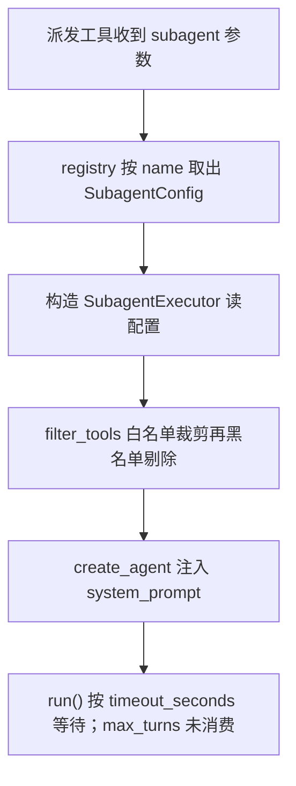

# subagents/config.py — config.py

> **文件路径**: `backend/packages/harness/agentflow/subagents/config.py`
> **目录位置**: subagents → config.py
> **职责**: 子代理配置数据类（配置与注册分离：builtins 定义配置，registry 负责查表）

## 📑 目录

- [📋 结构图](#📋-结构图)
- [📤 关键导出](#📤-关键导出)
- [💡 设计思想](#💡-设计思想)
- [🎯 实用场景](#🎯-实用场景)
- [📊 顺序执行链流程图](#📊-顺序执行链流程图)
- [🧩 代码解析（成块对照 config.py）](#🧩-代码解析成块对照-configpy)
- [❓ Q&A / 知识点](#❓-qa--知识点)
- [⚠️ 风险点](#⚠️-风险点)

## 📋 结构图

```text
┌──────────────────────────────────────────────────────────┐
│ @dataclass SubagentConfig                                │
│   name: 唯一标识（注册表查表键 "general-purpose"/"bash"） │
│   description: 给主 Agent 看的"何时派这个子代理"           │
│   system_prompt: 子代理行为说明书                         │
│   tools: 工具白名单（None = 继承父级全部）                │
│   disallowed_tools: 黑名单（默认排除递归派发三件套）      │
│   model: "inherit" = 用父模型（M4 仅支持此值）           │
│   max_turns: 已配置但当前未被 executor 消费               │
│   timeout_seconds: run() 的超时参数                       │
└──────────────────────────────────────────────────────────┘
```

## 📤 关键导出

**类**

- `SubagentConfig`（@dataclass）

## 💡 设计思想

1. 配置与注册分离：builtins/general_purpose.py、builtins/bash_agent.py 只负责 new 出 `SubagentConfig` 实例，registry.py 负责把它们收进注册表查表。
2. 默认黑名单防递归：`disallowed_tools` 默认值排除 `subagent` / `dispatch_subagents` / `ask_clarification`，子代理默认不能再派子代理（否则无限嵌套）。
3. M4 只支持 `model="inherit"`（与父 Agent 同模型）；各自配模型留到 M6。

## 🎯 实用场景

1. 新增子代理：写一个 `X_AGENT_CONFIG = SubagentConfig(name="x", ...)`，再到 builtins/__init__.py 注册即可。
2. 收紧能力面：给 `tools` 传白名单（如 bash 子代理只给 `["terminal_run"]`）。
3. 缩短调用方等待时长：调小 `timeout_seconds`。超时是 best-effort，底层线程仍可能继续运行；`max_turns` 当前只是配置字段，
   executor 未将其转换为 LangGraph recursion_limit，因此不能作为轮数保护。

## 📊 顺序执行链流程图（配置被消费时）

```text
dispatch_subagents 工具收到 subagent 参数（request）
│
▼
registry.get_subagent_config(name)        ← 按 name 从注册表取出 SubagentConfig 实例
│
▼
SubagentExecutor(cfg, tools, model)       ← 构造执行器，读 cfg.tools / cfg.disallowed_tools
│
▼
_filter_tools(tools, cfg.tools, cfg.disallowed_tools)  ← 先白名单裁剪，再黑名单剔除
│
▼
create_agent(model, tools, system_prompt=cfg.system_prompt)  ← 用 cfg.system_prompt 构建子代理
│
▼
子代理 run() 使用 cfg.timeout_seconds 等待上限；cfg.max_turns 当前没有执行效果
```

**Mermaid 版（GitHub / 飞书渲染；VSCode 需装插件）**：



## 🧩 代码解析（成块对照 config.py）

> 读法：每块先贴**完整代码**，再看块下方的整块解析。代码与文件一致，仅省略头部规范注释。

### 块 1：imports —— 只依赖 dataclass

```python
from __future__ import annotations

from dataclasses import dataclass, field
```

**结构简析**：本块仅 import 语句，模块只依赖标准库 `dataclasses`，不 import langchain 或任何业务包，是纯数据类模块。`from __future__ import annotations` 让 `list[str] | None` 在旧版 Python 也能做延迟标注；单独引入 `field` 是为了给可变字段配 `default_factory`。

本块无可逐条解释的函数（仅 import）。

**补充**：`disallowed_tools` 是可变列表，不能写成类级 `= []` 默认值（否则所有实例共享同一列表、跨实例污染），必须用 `field(default_factory=...)`。

### 块 2：SubagentConfig 类与 docstring —— 字段说明书

```python
@dataclass
class SubagentConfig:
    """子代理配置（M4 最小版，对齐原版核心字段）。

    字段:
        name: 唯一标识（注册表查表键）
        description: 给主 Agent 看的说明（何时派这个子代理）
        system_prompt: 子代理行为说明书（注入其 system prompt）
        tools: 工具白名单；None = 继承父级全部工具
        disallowed_tools: 工具黑名单（始终排除）
        model: "inherit" = 用父模型（M4 仅支持此值）
        max_turns: 预留字段；当前执行器未消费
        timeout_seconds: 单任务最长执行秒数
    """
```

**结构简析**：`@dataclass` 自动生成 `__init__` / `__repr__` / `__eq__`，builtins 里只需按关键字参数 new 出实例。docstring 逐字段约定语义，是 executor 端 `_filter_tools` 的判定依据。

本块仅为类声明 + docstring，字段的类型/默认值签名落在块 3，参数表见块 3。

**补充**：两条关键规则——`tools: None = 继承父级全部`、`disallowed_tools: 始终排除`——只在 docstring 里声明，真正生效靠 executor 消费。

### 块 3：字段定义与默认值 —— 黑名单防递归的落点

```python
    name: str
    description: str
    system_prompt: str
    tools: list[str] | None = None
    disallowed_tools: list[str] | None = field(
        default_factory=lambda: ["subagent", "dispatch_subagents", "ask_clarification"]
    )
    model: str = "inherit"
    max_turns: int = 100
    timeout_seconds: int = 120
```

**结构简析**：8 个字段中前 3 个（name/description/system_prompt）必填，其余带默认值。`disallowed_tools` 用 `default_factory` 生成独立新列表，是防递归派发的落点。

**`SubagentConfig()` 参数逐条解释**（即 dataclass 自动生成的 `__init__` 入参）：

| 参数 | 类型 | 默认值 | 含义 |
|---|---|---|---|
| `name` | `str` | 必填 | 注册表查表键，必须与 registry 的 `BUILTIN_SUBAGENTS` 键名一致（如 `"general-purpose"` / `"bash"`） |
| `description` | `str` | 必填 | 给主 Agent 看的说明——"何时派这个子代理"，供主 Agent 决策派发 |
| `system_prompt` | `str` | 必填 | 子代理行为说明书，构建子代理时注入其 system prompt |
| `tools` | `list[str] \| None` | `None` | 工具白名单；`None` = 继承父级全部工具（白名单不裁剪）；传 list = 只留名单内（bash 子代理只给 `["terminal_run"]`） |
| `disallowed_tools` | `list[str] \| None` | `["subagent", "dispatch_subagents", "ask_clarification"]` | 工具黑名单，始终剔除；防子代理递归派发 + 防子代理反问用户（它面前没有用户） |
| `model` | `str` | `"inherit"` | M4 唯一支持值，复用父 Agent 模型；多模型（各自配模型）留到 M6 |
| `max_turns` | `int` | `100` | 当前未被 executor 使用，不构成模型轮数限制；bash 子代理设为 50 也不会改变执行行为 |
| `timeout_seconds` | `int` | `120` | 单任务最长执行秒数，`run()` 的默认超时 |

**落库要点**：黑名单默认值用 `field(default_factory=lambda: [...])`——每个实例拿到一份独立新列表，不会被别的子代理改到。`max_turns` 虽定义在配置中，但 `SubagentExecutor._build_agent()` 没有设置 `recursion_limit`，`run()` 也未传入执行限制；当前只有 `timeout_seconds` 生效。

## ❓ Q&A / 知识点

### 1. 为什么默认黑名单要排除 dispatch_subagents（防递归派发）？（2026-10-01 用户提问）

**一句话**：不排的话，子代理拿到派发工具后会再派子代理，形成 子代理 → 子代理 → 子代理 的无限嵌套，既烧 token 又炸并发。

**依据源码**：config.py:65-67 默认值为 `["subagent", "dispatch_subagents", "ask_clarification"]`；executor._filter_tools 对 disallowed 非 None 时执行 `filtered = [t for t in filtered if t.name not in disallowed_set]`，把这三个工具从子代理工具集里剔除。

**三个被排工具各防什么**：

| 被排工具 | 防的问题 |
|---|---|
| `dispatch_subagents` | 子代理再派子代理 → 递归派发、并发失控（MAX_CONCURRENT_SUBAGENTS=3 被瞬间打穿） |
| `subagent` | 同上，原版派发类工具的旧名/别名，一并堵死 |
| `ask_clarification` | 子代理拿到的任务已由主 Agent 拆好，不应再反问用户（它面前没有用户） |

**双保险**：除了 config 黑名单，dispatch_tool.py 头部风险点注释（第 41 行）也写明"子代理工具集不要传 dispatch_subagents 自己（config 黑名单也排了）"——注入的工具集和 config 过滤两道都拦。

### 2. tools=None（继承）与 disallowed_tools（黑名单）是什么关系？

**一句话**：两者在 executor._filter_tools 里是串联两道闸门——先白名单、再黑名单。`tools=None` 表示不做白名单裁剪（全部继承父级），但黑名单这道永远生效。

```text
父级全部工具
  │
  ├─ tools 非 None？→ 是：只留白名单内（bash 子代理只剩 terminal_run）
  │                  → 否（None）：全部保留
  ▼
再剔除 disallowed_tools 黑名单（默认三件套）
  ▼
最终交给子代理的工具集
```

所以即便 `tools=None`（general-purpose），它也拿不到 `dispatch_subagents` / `ask_clarification`。

## ⚠️ 风险点

1. `disallowed_tools` 默认值不可删/不可清空：删了等于放开递归派发，子代理无限嵌套。
2. `tools=None` 表示继承父级全部工具（白名单不生效）；要收紧能力面必须显式传白名单。
3. `model="inherit"` 是 M4 唯一合法值，填别的不会报错但 M4 未实现多模型（executor 直接用注入的父模型）。

---
_2026-10-01 M4 补齐：目录 + 顺序执行链流程图 + 成块代码解析（+Q&A）。_
_2026-10-03 重构：代码解析段按「结构简析 + 参数逐条表格 + 落库要点」规范化（代码块零改动）。_
