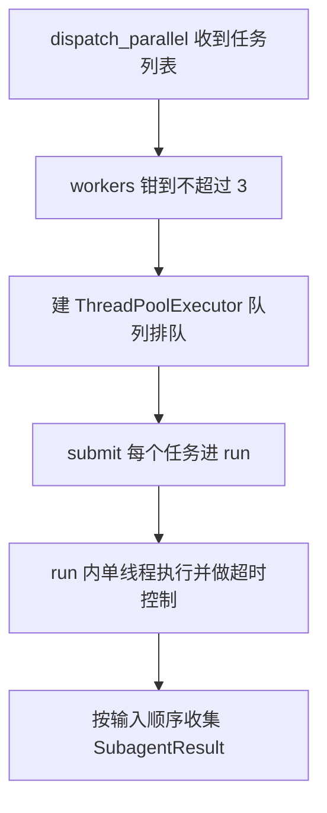

# subagents/executor.py — executor.py

> **文件路径**: `backend/packages/harness/agentflow/subagents/executor.py`
> **目录位置**: subagents → executor.py
> **职责**: 子代理执行引擎（状态/结果/同步执行/超时/重试/并行派发/后台任务）

## 📑 目录

- [📋 结构图](#📋-结构图)
- [📤 关键导出](#📤-关键导出)
- [💡 设计思想](#💡-设计思想)
- [🎯 实用场景](#🎯-实用场景)
- [📊 顺序执行链流程图](#📊-顺序执行链流程图)
- [🧩 代码解析（成块对照 executor.py）](#🧩-代码解析成块对照-executorpy)
- [❓ Q&A / 知识点](#❓-qa--知识点)
- [⚠️ 风险点](#⚠️-风险点)

## 📋 结构图

```text
┌────────────────────────────────────────────────────────────┐
│ SubagentStatus(Enum)  PENDING/RUNNING/COMPLETED/FAILED/TIMED_OUT │
│ SubagentResult(@dataclass) task_id/status/result/error/起止时间   │
│                                                            │
│ SubagentExecutor                                           │
│   __init__(config, tools, model=None) → _filter_tools      │
│   _build_agent() → create_agent（无 checkpointer）          │
│   run(task, timeout)            同步 + 超时 best-effort     │
│   run_with_retry(task, max_retries=2)  只重试 FAILED       │
│   execute_async(task) → task_id  后台任务                   │
│   dispatch_parallel(tasks, max_parallel=3)  并行≤3          │
│                                                            │
│ 模块级: _background_tasks + lock + _scheduler_pool(max=5)   │
│         get/list/cleanup_background_task                   │
│ 常量: MAX_CONCURRENT_SUBAGENTS = 3                         │
└────────────────────────────────────────────────────────────┘
```

## 📤 关键导出

**类**

- `SubagentStatus`（Enum）
- `SubagentResult`（@dataclass）
- `SubagentExecutor`

**函数（模块级后台任务）**

- `get_background_task_result(task_id)`
- `list_background_tasks()`
- `cleanup_background_task(task_id)`

**常量**

- `MAX_CONCURRENT_SUBAGENTS = 3`

## 💡 设计思想

1. 子代理不挂 checkpointer：一次执行、不持久化（M5 长任务再学）。
2. 并行控制 = `ThreadPoolExecutor(max_workers)` 天然排队：派 5 个任务时第 4/5 个等空位（验收点 2：实际并行 ≤3）。
3. 超时 best-effort：`future.result(timeout)` 超时标记 TIMED_OUT，底层线程无法真正中断（与原版一致）。
4. 重试只针对 FAILED（模型调用异常可重试；TIMED_OUT 不重试——超时重试只会再超时）。
5. executor 只 import `config.SubagentConfig`，不直接碰 sandbox：bash 子代理经白名单里的 `terminal_run` 工具间接走 LocalSandbox。

## 🎯 实用场景

1. 主 Agent 拆出多个独立小任务 → `dispatch_parallel` 并行跑 ≤3 个。
2. 单任务要防卡死 → `run` 带超时，`run_with_retry` 自动重试模型异常。
3. 长任务不想阻塞对话 → `execute_async` 拿 task_id，后续查 `get_background_task_result`。

## 📊 顺序执行链流程图（dispatch_parallel 一次并行派发）

```text
dispatch_subagents 工具 → executor.dispatch_parallel(tasks, max_parallel)（request）
│
▼
workers = max(1, min(max_parallel, 3))    ← 硬上限再钳一次，双保险
│
▼
ThreadPoolExecutor(max_workers=workers)    ← 队列天然排队，派 5 个只有 3 个真并发
│
▼
每个 future = pool.submit(self.run, t)    ← run 内部再开单线程池 + future.result(timeout)
│
▼
_run_sync：_build_agent → agent.invoke → _extract_final_ai_text
│
▼
[f.result() for f in futures]             ← 按输入顺序取结果（不等同完成顺序）
```

**Mermaid 版（GitHub / 飞书渲染；VSCode 需装插件）**：



## 🧩 代码解析（成块对照 executor.py）

> 读法：每块先贴**完整代码**，再看块下方的整块解析。代码与文件一致，仅省略头部规范注释。

### 块 1：imports + logger + 并行上限常量

```python
from __future__ import annotations

import logging
import threading
import uuid
from concurrent.futures import Future, ThreadPoolExecutor
from concurrent.futures import TimeoutError as FuturesTimeoutError
from dataclasses import dataclass
from datetime import UTC, datetime
from enum import Enum

from langchain.agents import create_agent
from langchain.tools import BaseTool
from langchain_core.language_models import BaseChatModel
from langchain_core.messages import AIMessage

from agentflow.subagents.config import SubagentConfig

logger = logging.getLogger(__name__)

# M4 验收硬约束：子代理并行上限（验收点 2：同时派 5 个 → 实际 ≤3）
MAX_CONCURRENT_SUBAGENTS = 3
```

**整块解析**：并发原语集中在 `concurrent.futures`（ThreadPoolExecutor / Future / TimeoutError 改名 FuturesTimeoutError 避免和别的 TimeoutError 混）。langchain 侧只取三件：`create_agent`（建子代理）、`BaseTool`（工具类型）、`BaseChatModel`（模型类型）、`AIMessage`（抽最终文本）。**唯一业务 import 是 `agentflow.subagents.config`**——本模块不 import sandbox、不 import registry、不 import tools，依赖极窄。`MAX_CONCURRENT_SUBAGENTS = 3` 是验收硬约束常量。

### 块 2：SubagentStatus + SubagentResult + _make_task_id

```python
class SubagentStatus(Enum):
    """子代理执行状态。"""

    PENDING = "pending"
    RUNNING = "running"
    COMPLETED = "completed"
    FAILED = "failed"
    TIMED_OUT = "timed_out"


@dataclass
class SubagentResult:
    """子代理执行结果。

    字段:
        task_id: 本次执行唯一标识
        status: 终态/中间态（PENDING→RUNNING→COMPLETED/FAILED/TIMED_OUT）
        result: 完成时的最终文本
        error: 失败时的错误信息
        started_at / completed_at: 起止时间（UTC）
    """

    task_id: str
    status: SubagentStatus
    result: str | None = None
    error: str | None = None
    started_at: datetime | None = None
    completed_at: datetime | None = None


def _make_task_id() -> str:
    """生成任务 ID（uuid 前 12 位，AgentFlow 无 make_formatted_id）。"""
    return uuid.uuid4().hex[:12]
```

**整块解析**：状态机五态——PENDING（后台任务刚登记）→ RUNNING（在跑）→ COMPLETED / FAILED / TIMED_OUT 三终态。`SubagentResult` 是纯数据载体，`result`（成功文本）与 `error`（失败信息）互斥填充。`_make_task_id` 取 `uuid4().hex[:12]` 短格式，docstring 注明"AgentFlow 无 make_formatted_id"。

### 块 3：_filter_tools —— 白名单 ∩ 黑名单

```python
def _filter_tools(
    all_tools: list[BaseTool],
    allowed: list[str] | None,
    disallowed: list[str] | None,
) -> list[BaseTool]:
    """按子代理配置过滤工具（白名单 + 黑名单）。

    - allowed 非 None：只留白名单内工具（bash 子代理只有 terminal_run）
    - disallowed 非 None：剔除黑名单（防递归派发）
    """
    filtered = all_tools
    if allowed is not None:
        allowed_set = set(allowed)
        filtered = [t for t in filtered if t.name in allowed_set]
    if disallowed is not None:
        disallowed_set = set(disallowed)
        filtered = [t for t in filtered if t.name not in disallowed_set]
    return filtered
```

**整块解析**：两道串联闸门——先白名单（`allowed` 非 None 才裁，None 表示继承父级全部），再黑名单（`disallowed` 非 None 才剔，默认三件套恒生效）。判定键是 `t.name`（工具注册名）。bash 子代理靠 `allowed=["terminal_run"]` 把工具集裁到只剩终端；general-purpose 靠 `tools=None` 全继承但仍被黑名单剔掉派发/澄清工具。

### 块 4：SubagentExecutor.__init__ + _build_agent

```python
class SubagentExecutor:
    """子代理执行器（M4 最小版）。

    用法:
        executor = SubagentExecutor(config, tools, model=parent_model)
        result = executor.run("帮我查一下 x")
        results = executor.dispatch_parallel(["查 a", "写 b"], max_parallel=3)
    """

    def __init__(
        self,
        config: SubagentConfig,
        tools: list[BaseTool],
        model: BaseChatModel | None = None,
    ):
        """初始化执行器。

        参数:
            config: 子代理配置（name/system_prompt/tools 白黑名单…）
            tools: 父级全部工具（executor 按 config 过滤后给子代理）
            model: 父模型实例；config.model="inherit" 时直接用
        """
        self.config = config
        self.model = model
        self.tools = _filter_tools(tools, config.tools, config.disallowed_tools)
        logger.info("SubagentExecutor 初始化: %s（工具 %d 个）", config.name, len(self.tools))

    # ---- 内部：构建子代理 ----
    def _build_agent(self):
        """构建子代理 Agent（langchain create_agent，与 lead_agent 同 API）。

        无 checkpointer：子代理一次执行、不持久化（M5 长任务再学）。
        """
        if self.model is None:
            raise RuntimeError("子代理需要 model（父模型未注入）")
        return create_agent(
            model=self.model,
            tools=self.tools,
            system_prompt=self.config.system_prompt,
        )
```

**整块解析**：构造时即按 config 把父级工具过滤成 `self.tools`（日志记录工具个数）。`_build_agent` 用 langchain `create_agent`（与 lead_agent 同 API），注入过滤后的工具集与 config.system_prompt；**不传 checkpointer**——子代理一次性执行不持久化。model 未注入直接 `raise RuntimeError`（对应 dispatch_tool 未配置分支的兜底）。

### 块 5：_run_sync + run（同步执行 + 超时 best-effort）

```python
    # ---- 内部：同步执行（不超时，供 run 包装） ----
    def _run_sync(self, task: str) -> SubagentResult:
        """真正执行子代理任务（线程内同步，无超时控制）。"""
        result = SubagentResult(
            task_id=_make_task_id(),
            status=SubagentStatus.RUNNING,
            started_at=datetime.now(UTC),
        )
        try:
            agent = self._build_agent()
            response = agent.invoke({"messages": [{"role": "user", "content": task}]})
            text = _extract_final_ai_text(response)
            result.result = text or "(子代理无文本输出)"
            result.status = SubagentStatus.COMPLETED
        except Exception as exc:  # noqa: BLE001 —— 模型调用异常统一收进 FAILED
            logger.warning("子代理 %s 执行失败: %s", self.config.name, exc)
            result.status = SubagentStatus.FAILED
            result.error = f"{type(exc).__name__}: {str(exc)[:200]}"
        result.completed_at = datetime.now(UTC)
        return result

    # ---- 对外：同步执行 + 超时 ----
    def run(self, task: str, timeout_seconds: int | None = None) -> SubagentResult:
        """同步执行子代理任务（带超时）。

        超时: future.result(timeout) 超时 → TIMED_OUT（best-effort，
        底层线程无法强杀，与原版一致）。

        注意: 超时路径必须 shutdown(wait=False)——`with ThreadPoolExecutor`
        退出时默认 wait=True 会等悬挂线程跑完，超时就不"及时返回"了。
        """
        timeout = timeout_seconds or self.config.timeout_seconds
        pool = ThreadPoolExecutor(max_workers=1)
        future: Future = pool.submit(self._run_sync, task)
        try:
            return future.result(timeout=timeout)
        except FuturesTimeoutError:
            logger.warning("子代理 %s 超时（%ss）", self.config.name, timeout)
            # 不等待悬挂线程：调用方及时拿 TIMED_OUT，底层线程由进程退出回收
            pool.shutdown(wait=False)
            return SubagentResult(
                task_id=_make_task_id(),
                status=SubagentStatus.TIMED_OUT,
                error=f"执行超时（{timeout} 秒）",
                started_at=datetime.now(UTC),
                completed_at=datetime.now(UTC),
            )
        finally:
            # 正常路径（COMPLETED/FAILED）任务已结束，wait=False 无副作用；
            # 超时路径已提前 shutdown，重复调用无害
            pool.shutdown(wait=False)
```

**整块解析**：`_run_sync` 是真干活的地方——建 agent、`agent.invoke`、`_extract_final_ai_text` 抽文本；任何 Exception（含模型调用异常）统一收进 FAILED，error 截前 200 字符。`run` 用 `ThreadPoolExecutor(max_workers=1)` 把 `_run_sync` 扔进单线程，主调线程 `future.result(timeout=timeout)` 等结果；超时抛 `FuturesTimeoutError` → 返回 TIMED_OUT。**关键点（检查轮修正）**：超时路径必须 `pool.shutdown(wait=False)`——若用 `with ThreadPoolExecutor` 包住，`__exit__` 的 `shutdown(wait=True)` 会等悬挂线程跑完，超时就不"及时返回"了。`finally` 里再 shutdown 一次无害（幂等）。底层线程无法强杀，best-effort，由进程退出回收。

### 块 6：run_with_retry + execute_async

```python
    # ---- 对外：失败重试 ----
    def run_with_retry(
        self,
        task: str,
        max_retries: int = 2,
        timeout_seconds: int | None = None,
    ) -> SubagentResult:
        """执行并重试（只对 FAILED 重试；TIMED_OUT 不重试）。"""
        attempt = 0
        while True:
            result = self.run(task, timeout_seconds=timeout_seconds)
            if result.status != SubagentStatus.FAILED or attempt >= max_retries:
                return result
            attempt += 1
            logger.info("子代理 %s 第 %d 次重试（上次: %s）", self.config.name, attempt, result.error)

    # ---- 对外：后台任务 ----
    def execute_async(self, task: str, task_id: str | None = None) -> str:
        """后台启动子代理任务，立即返回 task_id（结果查 _background_tasks）。"""
        tid = task_id or _make_task_id()
        with _background_tasks_lock:
            _background_tasks[tid] = SubagentResult(
                task_id=tid,
                status=SubagentStatus.PENDING,
            )
        _scheduler_pool.submit(_run_background, self, tid, task)
        return tid
```

**整块解析**：`run_with_retry` 是 while 循环——只在 `status == FAILED` 且 `attempt < max_retries`（默认 2）时重试；COMPLETED/TIMED_OUT 直接返回。`execute_async` 先在模块级 `_background_tasks` 登记一条 PENDING 占位（加锁），再把 `_run_background` 提交到 `_scheduler_pool`，立刻返回 task_id——调用方不等执行完。

### 块 7：dispatch_parallel —— 并行 ≤3 核心

```python
    # ---- 对外：并行派发（验收点 1/2/3 核心） ----
    def dispatch_parallel(
        self,
        tasks: list[str],
        max_parallel: int = MAX_CONCURRENT_SUBAGENTS,
    ) -> list[SubagentResult]:
        """把多个任务派给子代理并行执行，返回结果（按输入顺序）。

        并行控制: ThreadPoolExecutor(max_workers=min(max_parallel, 3))
        天然排队——派 5 个任务时，第 4/5 个等前序完成（验收点 2）。

        参数:
            tasks: 任务描述列表（每个都会被独立派发）
            max_parallel: 并行上限（硬约束 ≤3）

        返回:
            按输入顺序的 SubagentResult 列表（结果回传主 Agent）
        """
        workers = max(1, min(int(max_parallel), MAX_CONCURRENT_SUBAGENTS))
        with ThreadPoolExecutor(max_workers=workers) as pool:
            futures = [pool.submit(self.run, t) for t in tasks]
            return [f.result() for f in futures]  # 按输入顺序取
```

**整块解析**：这是 M4 验收点 1/2/3 的核心。`workers = max(1, min(int(max_parallel), MAX_CONCURRENT_SUBAGENTS))`——先把外部传入的 max_parallel 钳到不超过常量 3，再保底 ≥1。然后建一个 `max_workers=workers` 的线程池，把每个任务 `submit(self.run, t)`。**Python ThreadPoolExecutor 的队列天然排队**：池里只有 workers 个槽位，派 5 个任务时只有前 3 个真并发，第 4/5 个在队列里等空位。最后 `[f.result() for f in futures]` 按 futures 列表顺序（= 输入顺序）取结果，不是完成顺序。

### 块 8：模块级后台任务存储 + _run_background + 查询/清理 + 文本抽取

```python
# ---- 后台任务存储（模块级，进程内） ----
_background_tasks: dict[str, SubagentResult] = {}
_background_tasks_lock = threading.Lock()
# 调度线程池：execute_async 提交到这里（后台任务数量不限，执行仍受 run 超时控制）
_scheduler_pool = ThreadPoolExecutor(max_workers=5, thread_name_prefix="subagent-scheduler-")


def _run_background(executor: SubagentExecutor, task_id: str, task: str) -> None:
    """后台任务执行体：PENDING → RUNNING → 结果回写。"""
    with _background_tasks_lock:
        ent = _background_tasks.get(task_id)
        if ent is None:
            return
        ent.status = SubagentStatus.RUNNING
        ent.started_at = datetime.now(UTC)
    result = executor.run(task)
    with _background_tasks_lock:
        ent = _background_tasks.get(task_id)
        if ent is None:
            return
        ent.status = result.status
        ent.result = result.result
        ent.error = result.error
        ent.completed_at = result.completed_at


def get_background_task_result(task_id: str) -> SubagentResult | None:
    """查后台任务结果（None = 未知 task_id）。"""
    with _background_tasks_lock:
        return _background_tasks.get(task_id)


def list_background_tasks() -> list[SubagentResult]:
    """列出全部后台任务。"""
    with _background_tasks_lock:
        return list(_background_tasks.values())


def cleanup_background_task(task_id: str) -> None:
    """移除终态后台任务（防内存泄漏；非终态跳过避免竞态）。"""
    with _background_tasks_lock:
        ent = _background_tasks.get(task_id)
        if ent is None:
            return
        if ent.status in {
            SubagentStatus.COMPLETED,
            SubagentStatus.FAILED,
            SubagentStatus.TIMED_OUT,
        }:
            del _background_tasks[task_id]


def _extract_final_ai_text(response: object) -> str:
    """从 agent.invoke 返回里提取最后一条 assistant 文本。"""
    msgs = response.get("messages", []) if isinstance(response, dict) else []
    for m in reversed(msgs):
        if isinstance(m, AIMessage):
            c = getattr(m, "content", "")
            if isinstance(c, str) and c.strip():
                return c.strip()
    return ""
```

**整块解析**：模块级三件套——`_background_tasks` dict（进程内存储）、`_background_tasks_lock`（threading.Lock 保护读写）、`_scheduler_pool`（max_workers=5 的调度池，后台任务数量不限但执行仍受 run 超时控制）。`_run_background` 两次加锁：先把 PENDING 改 RUNNING，跑完再回写终态；两次都先 `get` 判 None（任务可能被 cleanup 删了）。`cleanup_background_task` 只删三终态、跳过中间态（防竞态）。`_extract_final_ai_text` 从 invoke 返回的 messages 里倒序找第一条非空 AIMessage 文本。

## ❓ Q&A / 知识点

### 子代理并行 ≤3 是怎么实现的（ThreadPoolExecutor max_workers 排队）？（2026-10-01 用户提问）

**一句话**：靠 `ThreadPoolExecutor(max_workers=workers)` 的**内置工作队列天然排队**——线程池只有 workers 个真并发槽位，多提交的任务在队列里等空位，不需要自己写信号量/计数器。

**依据源码**：executor.py:267-270：

```python
        workers = max(1, min(int(max_parallel), MAX_CONCURRENT_SUBAGENTS))
        with ThreadPoolExecutor(max_workers=workers) as pool:
            futures = [pool.submit(self.run, t) for t in tasks]
            return [f.result() for f in futures]  # 按输入顺序取
```

**派 5 个任务时的真实行为**：

| 时刻 | 池内并发 | 队列里等待 |
|---|---|---|
| t=0 提交 5 个 | 3 个开始跑（槽位占满） | 第 4、5 个排队 |
| 某任务完成 | 释放槽位，队列里第 4 个补上 | 剩 1 个等 |
| 全部跑完 | — | — |

**双保险**：外部 dispatch_tool 工具参数 `max_parallel=3`，executor 内部又 `min(max_parallel, MAX_CONCURRENT_SUBAGENTS)` 钳一次——即使调用方传 10，实际 workers 也 ≤3。

### 超时为什么是 best-effort，不能强杀？

**一句话**：Python 线程无法安全强制终止，`future.result(timeout)` 超时只是让主调线程"放弃等待"并返回 TIMED_OUT，底层那个还在跑的线程不会被停掉。源码 docstring 明确"底层线程无法强杀，与原版一致"。**检查轮修正**：超时路径 `pool.shutdown(wait=False)` 确保调用方及时拿到 TIMED_OUT——若用 `with` 的默认 wait=True，`__exit__` 仍会等悬挂线程跑完，超时就失效了；悬挂线程由进程退出回收。

### 为什么 TIMED_OUT 不重试，只重试 FAILED？

**一句话**：超时重试只会再超时（任务本身就跑不完），重试是浪费；而 FAILED 是模型调用异常（网络/瞬时错误），重试有机会成功。run_with_retry 的判定是 `if result.status != SubagentStatus.FAILED or attempt >= max_retries: return result`——只有 FAILED 才继续 while。

### 白名单（tools）/黑名单（disallowed_tools）是什么意思？父级 9 个工具怎么算出 7 个？（2026-10-01 用户提问）

**一句话**：白名单 = 只允许列表内的工具（`None` = 继承父级全部，白名单不生效）；黑名单 = 始终剔除（优先级最高，即使在白名单里也删）。最终公式：

```text
最终工具集 = (父级全集 ∩ 白名单) − 黑名单
```

**依据源码**：executor.py:117-134 `_filter_tools` 两道闸门串联——`allowed 非 None` 先按白名单筛，`disallowed 非 None` 再按黑名单剔；config.py:64-68 字段定义，默认黑名单 `["subagent", "dispatch_subagents", "ask_clarification"]`。

**父级 9 个工具实算**（tools.py:76-86：todo / knowledge / plan / fetch_url / terminal_run / read_file / write_file / ask_clarification / dispatch_subagents）：

| 子代理 | 白名单 | 黑名单命中 | 结果 |
|---|---|---|---|
| general-purpose | `tools=None`，不裁剪 | `dispatch_subagents` + `ask_clarification`（`"subagent"` 无同名工具，是防未来注册的兜底名） | 9 − 2 = **7 个** |
| bash | `["terminal_run"]` | 无命中 | **1 个**（最小权限原则：职责越窄越安全） |

**为什么默认黑名单三件套**：`dispatch_subagents` / `subagent` 防递归派发——子代理手里有派发工具就能再派子代理，形成无限嵌套（MAX_CONCURRENT_SUBAGENTS=3 也会被打穿）；`ask_clarification` 防子代理反问用户——它的任务已由主 Agent 拆好，面前没有用户。

## ⚠️ 风险点

1. `MAX_CONCURRENT_SUBAGENTS=3` 是验收硬约束（并行 ≤3），勿放宽。
2. 超时标记 TIMED_OUT 后底层任务仍可能在跑（best-effort），勿依赖强杀。
3. `dispatch_parallel` 返回顺序 = 输入顺序（futures 按序取结果），不是完成顺序。
4. executor 不直接碰 sandbox：bash 子代理的命令沙箱隔离靠 `terminal_run` 工具内部走 LocalSandbox，executor 层无感知。

---
_2026-10-01 M4 补齐：目录 + 顺序执行链流程图 + 成块代码解析（+Q&A）。_
