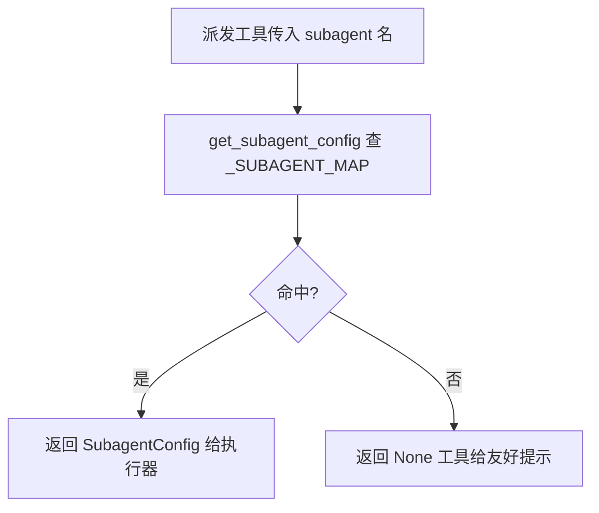

# subagents/registry.py — registry.py

> 1. **文件路径**: `backend/packages/harness/agentflow/subagents/registry.py`    
> 2. **目录位置**: subagents → registry.py        
> 3. **职责**: 子代理注册表查表（builtins 注册，registry 查表，executor（执行器） 只认 SubagentConfig）
> 4. **registry**：  注册中心 注册表

## 📑 目录

- [📋 结构图](#📋-结构图)
- [📤 关键导出](#📤-关键导出)
- [💡 设计思想](#💡-设计思想)
- [🎯 实用场景](#🎯-实用场景)
- [📊 顺序执行链流程图](#📊-顺序执行链流程图)
- [🧩 代码解析（成块对照 registry.py）](#🧩-代码解析成块对照-registrypy)
- [❓ Q&A / 知识点](#❓-qa--知识点)
- [⚠️ 风险点](#⚠️-风险点)

## 📋 结构图

```text
┌──────────────────────────────────────────────────────────┐
│ _SUBAGENT_MAP: dict[str, SubagentConfig]                 │
│   由 builtins.BUILTIN_SUBAGENTS 过滤 isinstance 后构建     │
│                                                          │
│ get_subagent_config(name) → SubagentConfig | None        │
│   查 _SUBAGENT_MAP；未知名返回 None                       │
│ list_subagents() → list[SubagentConfig]                  │
│   全部内置子代理（按注册表顺序）                           │
│ get_subagent_names() → list[str]                         │
│   name 列表（CLI 启动信息 / 工具 description 用）          │
└──────────────────────────────────────────────────────────┘
```

## 📤 关键导出

**函数**

- `get_subagent_config(name)`
- `list_subagents()`
- `get_subagent_names()`

## 💡 设计思想

1. 注册与查表分离：builtins/__init__.py 里的 `BUILTIN_SUBAGENTS` 是"登记表"，registry 提供"查岗窗口"；executor（执行器） 不感知注册来源，只认 `SubagentConfig`。
2. 查不到返回 `None` 而非抛异常：dispatch 工具拿到 `None` 给友好提示（"未知子代理"），不崩模型循环。
3. `_SUBAGENT_MAP` 构建时用 `isinstance(cfg, SubagentConfig)` 过滤：builtins 用 `dict[str, object]` 规避导入环，registry 这层再把类型收干净。

## 🎯 实用场景

1. dispatch_subagents 工具按 `subagent` 参数查表（dispatch_tool.py:89）。
2. CLI 启动信息打印已注册子代理名单（cli/main.py:227 用 `get_subagent_names()`）。
3. 测试断言注册表覆盖（test_subagent_registry.py 查表/枚举/未知名返回 None）。

## 📊 顺序执行链流程图（一次查表）

```text
dispatch_subagents 传入 subagent="bash"（request）
│
▼
get_subagent_config("bash")               ← _SUBAGENT_MAP.get(name)
│
▼
命中？                                     ← 是：返回 BASH_AGENT_CONFIG
│                                          ← 否：返回 None（不抛异常）
▼
dispatch 工具拿到 None？                   ← 是：返回"（未知子代理: bash；可选: ...）"
│                                          ← 否：SubagentExecutor(cfg, tools, model)
▼
list_subagents / get_subagent_names       ← 枚举用，查表路径相同
```

**Mermaid 版（GitHub / 飞书渲染；VSCode 需装插件）**：



## 🧩 代码解析（成块对照 registry.py）

> 读法：每块先贴**完整代码**，再看块下方的整块解析。代码与文件一致，仅省略头部规范注释。

### 块 1：imports + _SUBAGENT_MAP 构建 —— 登记表收编

```python
from __future__ import annotations

from agentflow.subagents.builtins import BUILTIN_SUBAGENTS
from agentflow.subagents.config import SubagentConfig

# 类型别名：注册表是 name → SubagentConfig 的映射（builtins 用 object 规避导入环）
_SUBAGENT_MAP: dict[str, SubagentConfig] = {
    name: cfg for name, cfg in BUILTIN_SUBAGENTS.items() if isinstance(cfg, SubagentConfig)
}
```

**结构简析**：从 builtins 引入 `BUILTIN_SUBAGENTS`、从 config 引入 `SubagentConfig`，模块加载时用字典推导构建 `_SUBAGENT_MAP`——`isinstance(cfg, SubagentConfig)` 把登记表里非 Config 条目滤掉，得到干净的 `dict[str, SubagentConfig]`。之后查表都是内存 `dict.get`。

本块无可逐条解释的函数（仅 import + 模块级推导）。

**补充**：`BUILTIN_SUBAGENTS` 在 builtins/__init__.py 标注为 `dict[str, object]`——刻意用 object 是为了 builtins 包不反向依赖 registry、规避导入环；registry 这层再用 isinstance 把类型收干净。

### 块 2：get_subagent_config —— 按名取配置

```python
def get_subagent_config(name: str) -> SubagentConfig | None:
    """按 name 取子代理配置；未注册返回 None（dispatch 工具据此给友好提示）。"""
    return _SUBAGENT_MAP.get(name)
```

**结构简析**：标准 `dict.get` 查表，一行实现。未命中返回 `None` 而非 raise——`None` 是给 dispatch 工具的"可识别失败信号"。

**`get_subagent_config()` 参数逐条解释**：

| 参数 | 类型 | 默认值 | 含义 |
|---|---|---|---|
| `name` | `str` | 必填 | 子代理查表键，须与注册表键（即 `cfg.name`）逐字一致，如 `"bash"` / `"general-purpose"`；未注册的名字 `dict.get` 返回 `None` |

**落库要点**：dispatch_tool.py:90-91 拿到 `None` 后返回 `（未知子代理: {subagent}；可选: {names}）` 友好提示，而不是 raise 打断模型循环。

### 块 3：list_subagents + get_subagent_names —— 枚举窗口

```python
def list_subagents() -> list[SubagentConfig]:
    """列出全部内置子代理配置（按注册表顺序）。"""
    return list(_SUBAGENT_MAP.values())


def get_subagent_names() -> list[str]:
    """全部子代理 name（CLI 启动信息 / 派发工具 description 用）。"""
    return [cfg.name for cfg in list_subagents()]
```

**结构简析**：两个枚举窗口——`list_subagents` 返回配置对象列表，`get_subagent_names` 在其上再 map 出 name 字符串，二者无入参。

**`list_subagents()` / `get_subagent_names()` 参数逐条解释**：均无参数。
- `list_subagents()`：返回 `list(_SUBAGENT_MAP.values())`，`list(...)` 复制一份快照，外部改不动内部 map。
- `get_subagent_names()`：返回 `[cfg.name for cfg in list_subagents()]`，依赖 `list_subagents()` 所以 names 顺序与注册表一致。

**落库要点**：names 取的是 `cfg.name`（配置对象的 name 字段），与 dict 键同源，但这里是从 value 取而非从 key 取。

## ❓ Q&A / 知识点

### 1. 为什么注册表键名必须等于 config.name？

**一句话**：dispatch 工具是按用户传入的 `subagent` 字符串去 `_SUBAGENT_MAP` 查键的，而这个字符串应当和 `cfg.name` 对齐；键与 name 不一致会造成"表里有、查不到"的静默失败。

**依据**：builtins/__init__.py:42 注释"键名必须与 config.name 一致（registry.get_subagent_config 按 name 查表）"；registry.py:38 风险点"注册表键与 config.name 必须一致（否则查不到）"。当前注册表里 `"general-purpose" → GENERAL_PURPOSE_CONFIG(name="general-purpose")`、`"bash" → BASH_AGENT_CONFIG(name="bash")`，键与 name 逐字相同。

### 2. 查不到为什么返回 None 而不是抛异常？

**一句话**：派发发生在模型工具循环里，抛异常会打断整轮对话；返回 None 让工具自己拼一句"可选子代理名单"的友好提示，模型还能据此改参数重试。dispatch_tool.py:90-91 就是这个分支。

## ⚠️ 风险点

1. 注册表键与 `config.name` 必须一致，否则查不到（静默失败，不报错）。
2. M4 无文件系统 agents / config.yaml 覆盖；M5 扩展 registry 时须保持三个对外函数签名不变。
3. `BUILTIN_SUBAGENTS` 标注 `dict[str, object]` 是刻意的防环设计，不要在 builtins 里 import registry。

---
_2026-10-01 M4 补齐：目录 + 顺序执行链流程图 + 成块代码解析（+Q&A）。_
_2026-10-03 重构：代码解析段按「结构简析 + 参数逐条表格 + 落库要点」规范化（代码块零改动）。_
