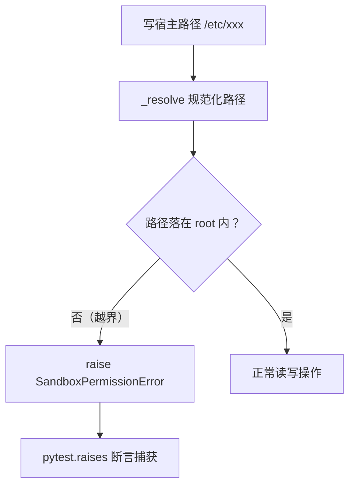

# tests/test_sandbox_guard.py — test_sandbox_guard.py

> **文件路径**: `backend/packages/harness/tests/test_sandbox_guard.py`
> **目录位置**: tests → test_sandbox_guard.py
> **职责**: 沙箱隔离测试（M4 验收点 4）——越界拦截 / 沙箱内可写 / 命令在根内执行 / Noop fail-closed / list_dir 深度 / 审计落库

## 📑 目录

- [📋 结构图](#📋-结构图)
- [📤 关键导出](#📤-关键导出)
- [💡 设计思想](#💡-设计思想)
- [🎯 实用场景](#🎯-实用场景)
- [📊 顺序执行链流程图](#📊-顺序执行链流程图)
- [🧩 代码解析（成块对照 test_sandbox_guard.py）](#🧩-代码解析成块对照-test_sandbox_guardpy)
- [❓ Q&A / 知识点](#❓-qa--知识点)
- [⚠️ 风险点](#⚠️-风险点)

## 📋 结构图

```text
tests/test_sandbox_guard.py（7 用例 → 验收点 4：沙箱隔离 + 审计）
├── test_local_sandbox_write_read_inside     沙箱内文件可写可读
├── test_local_sandbox_rejects_host_path     写 /etc 宿主路径被拦（核心）
├── test_local_sandbox_rejects_traversal     ../ 逃逸被拦
├── test_local_sandbox_execute_command_in_root  命令 cwd=root 执行
├── test_noop_sandbox_denies_everything      Noop 沙箱全拒（fail-closed）
├── test_local_sandbox_list_dir_depth        max_depth 语义（检查轮修正）
└── test_provider_injection_and_audit        provider 注入 + 审计放行/拦截都落库

被测对象: agentflow/sandbox/{local,noop,sandbox_provider,exceptions}.py
          + persistence/sandbox_audit_repositories.py
```

## 📤 关键导出

无独立导出（测试文件）。覆盖的被测契约：

- `LocalSandbox`：`write_file/read_file/execute_command/list_dir` + `_resolve` 越界拦截
- `NoopSandbox`：任何操作抛 `SandboxError`
- `set_sandbox_provider / get_sandbox_provider / reset_sandbox_provider`：全局注入与恢复
- `SandboxAuditRepository.record/query`：审计落库

## 💡 设计思想

1. **全部用 tmp_path（pytest fixture）**：沙箱根是临时目录，测试结束后自动清理——不碰宿主、不留垃圾。
2. **越界测试用真实宿主路径**：`/etc/agentflow_should_not_write.txt` 是宿主系统目录——如果沙箱拦截失效，测试会真的试图写宿主（然后被拒），这是"用真实危险场景验安全"。
3. **Noop 是 fail-closed 的证明**：默认沙箱（未注入时）任何操作都拒绝——安全默认是"关"，而不是"开"。
4. **审计测试同时记录放行和拦截**：`allowed == {0, 1}` 断言两种记录都在——审计不是只记坏事，是全程可追溯。
5. **finally 恢复 provider**：`reset_sandbox_provider()` 保证测试注入的沙箱不污染其他用例。

## 🎯 实用场景

1. 验收点 4 的自动化证明：隔离区内正常、隔离区外全拒、审计有据可查。
2. 防回归：`_resolve` 的路径校验、`list_dir` 的递归深度、审计落库，任何一环被改坏这里立刻红。

## 📊 顺序执行链流程图（test_local_sandbox_rejects_host_path 一次拦截）

```text
sb = LocalSandbox(tmp_path)（request）
│
▼
sb.write_file("/etc/agentflow_should_not_write.txt", "x")
│
▼
LocalSandbox.write_file → _resolve("/etc/...")    ← 核心安全闸
│
▼
Path 绝对路径 → resolve() 规范化
│
▼
越界判断: p != root 且 root 不在 p.parents → 拦截
│
▼
raise SandboxPermissionError  ← 测试用 pytest.raises 捕获并断言
```

**Mermaid 版（GitHub / 飞书渲染；VSCode 需装插件）**：



## 🧩 代码解析（成块对照 test_sandbox_guard.py）

> 读法：每块先贴**完整代码**，再看块下方的整块解析。代码与文件一致，仅省略头部规范注释。

### 块 1：imports —— 沙箱域 + 审计域

```python
import pytest

from agentflow.persistence.bootstrap import init_db
from agentflow.persistence.sandbox_audit_repositories import SandboxAuditRepository
from agentflow.sandbox import (
    LocalSandbox,
    LocalSandboxProvider,
    NoopSandbox,
    SandboxError,
    SandboxPermissionError,
    get_sandbox_provider,
    reset_sandbox_provider,
    set_sandbox_provider,
)
```

**整块解析**：测试跨三个域取料——`sandbox` 包（LocalSandbox/NoopSandbox/provider 三件套 + 两个异常）、`persistence`（init_db 建表 + SandboxAuditRepository 审计）、pytest（raises 断言）。`SandboxPermissionError` 是越界拦截的专有异常，`SandboxError` 是 Noop 的通用异常——测试据此区分"路径越界"与"一切被拒"。

### 块 2：test_local_sandbox_write_read_inside —— 隔离区内正常

```python
def test_local_sandbox_write_read_inside(tmp_path):
    """沙箱内文件可写可读（验收点 4：隔离区内正常工作）。"""
    sb = LocalSandbox(tmp_path)
    sb.write_file("note.txt", "hello 沙箱")
    assert sb.read_file("note.txt") == "hello 沙箱"
```

**整块解析**：验收点 4 的"正向"用例——沙箱不是只拦不干，隔离区内读写要正常。相对路径 `note.txt` 落在 `tmp_path` 根内，写后读回断言内容一致（含中文验证 UTF-8 往返）。

### 块 3：test_local_sandbox_rejects_host_path —— 宿主路径拦截（核心）

```python
def test_local_sandbox_rejects_host_path(tmp_path):
    """写沙箱外（宿主）路径被拦截（验收点 4 核心）。"""
    sb = LocalSandbox(tmp_path)
    # /etc 是宿主系统目录，写它必须被拒
    with pytest.raises(SandboxPermissionError):
        sb.write_file("/etc/agentflow_should_not_write.txt", "x")
    # 宿主根下读文件同样被拒
    with pytest.raises(SandboxPermissionError):
        sb.read_file("/etc/hosts")
```

**整块解析**：验收点 4 的核心用例——**写和读两个方向都测**。`write_file("/etc/...")` 写宿主被拒（防篡改系统文件），`read_file("/etc/hosts")` 读宿主也被拒（防偷读系统文件）。路径用真实存在的宿主目录（/etc），如果 `_resolve` 的 `resolve()` 规范化失效（比如用了 normpath 被软链绕过），这里就是第一道防线被击穿的信号。

### 块 4：test_local_sandbox_rejects_traversal —— ../ 逃逸拦截

```python
def test_local_sandbox_rejects_traversal(tmp_path):
    """../ 逃逸路径被规范化后拦截。"""
    sb = LocalSandbox(tmp_path)
    with pytest.raises(SandboxPermissionError):
        sb.write_file(str(tmp_path / ".." / "escape.txt"), "x")
```

**整块解析**：路径穿越（path traversal）是文件沙箱最常见的逃逸手法。`tmp_path / ".." / "escape.txt"` 指向沙箱外的上级目录——`_resolve` 里 `Path.resolve()` 先把 `..` 规范化成真实路径，再做越界判断拦截。这个用例证明"规范化"这一步真的在做，而不是直接拿字符串比前缀。

### 块 5：test_local_sandbox_execute_command_in_root —— 命令在根内执行

```python
def test_local_sandbox_execute_command_in_root(tmp_path):
    """命令在沙箱根目录执行（cwd=root），echo 正常。"""
    sb = LocalSandbox(tmp_path)
    out = sb.execute_command("echo sandbox-ok", timeout=10)
    assert "sandbox-ok" in out
```

**整块解析**：`execute_command` 的 cwd=root 语义验证——命令在沙箱根内跑。`echo sandbox-ok` 的 stdout 被捕获返回，断言包含预期文本。这个用例测的是"命令执行的基本路径通畅"；命令逃逸 cwd（`cd /etc && ...`）属 M5 的 OS 级 jail 范围，M4 文档风险点已如实标注。

### 块 6：test_noop_sandbox_denies_everything —— Noop fail-closed

```python
def test_noop_sandbox_denies_everything():
    """空沙箱：任何操作抛 SandboxError（fail-closed 默认）。"""
    sb = NoopSandbox()
    with pytest.raises(SandboxError):
        sb.execute_command("ls")
    with pytest.raises(SandboxError):
        sb.write_file("x.txt", "y")
    with pytest.raises(SandboxError):
        sb.read_file("x.txt")
```

**整块解析**：Noop 沙箱 = 安全默认值。未注入 provider 时（`_provider is None`）默认用 Noop，任何操作（命令/写/读）都抛 `SandboxError`——**fail-closed**（默认全拒）而非 fail-open（默认放行）。三条断言分别覆盖三种操作入口。

### 块 7：test_local_sandbox_list_dir_depth —— list_dir 深度语义（检查轮修正）

```python
def test_local_sandbox_list_dir_depth(tmp_path):
    """list_dir 的 max_depth 语义（检查轮修正：原 rglob 无限递归）。

    depth=1 只列直接子项；depth=2 再下一层；depth=3 才看到第三层。
    """
    sb = LocalSandbox(tmp_path)
    sb.write_file("top.txt", "t")
    sb.write_file("a/one.txt", "1")
    sb.write_file("a/b/two.txt", "2")
    sb.write_file("a/b/c/three.txt", "3")

    l1 = sb.list_dir(".", max_depth=1)
    assert "top.txt" in l1 and "a" in l1
    assert not any(x.startswith("a/") for x in l1)  # 不出现 a/one.txt

    l2 = sb.list_dir(".", max_depth=2)
    assert "a/one.txt" in l2
    assert not any(x.startswith("a/b/") for x in l2)  # 不出现 a/b/two.txt

    l3 = sb.list_dir(".", max_depth=3)
    assert "a/b/two.txt" in l3
    assert "a/b/c/three.txt" not in l3  # 第三层目录内的文件要 depth=4
```

**整块解析**：检查轮发现原 `rglob("*")` 无限递归、`max_depth` 失效后，修复为 `os.walk` 按层遍历，本用例把 depth 语义钉死。先造 4 层文件树（top / a/one / a/b/two / a/b/c/three），再逐层断言：depth=1 只见直接子项（不见 `a/one.txt`）、depth=2 见第二层（不见 `a/b/two.txt`）、depth=3 见第三层（`a/b/c/three.txt` 要 depth=4 才见）。**正反双向断言**（在 + 不在）防止"多列了"与"少列了"两种回归。

### 块 8：test_provider_injection_and_audit —— 注入 + 审计

```python
def test_provider_injection_and_audit(tmp_path):
    """注入 LocalSandboxProvider + 审计记录放行/拦截（验收点 4 配套）。"""
    audit_db = tmp_path / "audit.db"
    conn = init_db(str(audit_db))
    repo = SandboxAuditRepository(conn=conn)

    provider = LocalSandboxProvider(tmp_path / "sandbox-root")
    set_sandbox_provider(provider)
    try:
        sb = get_sandbox_provider().get(get_sandbox_provider().acquire())
        assert sb is not None

        # 放行操作（沙箱内写）
        sb.write_file("a.txt", "内容")
        repo.record(action="write_file", target="a.txt", allowed=True, subagent_name="test")
        # 拦截操作（越界）
        try:
            sb.write_file("/etc/blocked.txt", "x")
        except SandboxPermissionError:
            repo.record(action="write_file", target="/etc/blocked.txt", allowed=False, reason="越界")

        rows = repo.query(limit=10)
        assert len(rows) == 2
        allowed = {r["allowed"] for r in rows}
        assert allowed == {0, 1}  # 既有放行也有拦截记录
        blocked = [r for r in rows if r["allowed"] == 0]
        assert blocked and "/etc/blocked.txt" in blocked[0]["target"]
    finally:
        reset_sandbox_provider()  # 恢复默认，避免影响其他测试
```

**整块解析**：验收点 4 配套的端到端用例，四段式：
1. **建审计库**：独立 `audit.db` + `init_db` 建表 + `SandboxAuditRepository(conn=conn)`（注意这里用 `conn=` 关键字，与其他 repo 的 `db_path=` 是两种构造入口）。
2. **注入 provider**：`set_sandbox_provider(LocalSandboxProvider(tmp_path/"sandbox-root"))`，再经 `get_sandbox_provider().get(acquire())` 取到沙箱实例（`acquire` 返回 id → `get` 校验返回）。
3. **模拟两种操作**：沙箱内写 `a.txt` → 记 `allowed=True` 的放行记录；写 `/etc/blocked.txt` 被拒 → 在 except 里记 `allowed=False` + `reason="越界"` 的拦截记录。
4. **断言审计**：`len(rows)==2`（两条都落库）、`allowed == {0,1}`（放行和拦截**都在**——审计不是只记坏事）、拦截记录的目标是 `/etc/blocked.txt`。`finally: reset_sandbox_provider()` 保证不污染其他用例。

## ❓ Q&A / 知识点

### 为什么越界测试敢用真实的 /etc 路径？（2026-10-01 用户提问）

**一句话**：`_resolve` 的拦截保证写入在抛异常前不会真正发生——`pytest.raises(SandboxPermissionError)` 捕获到异常即证明"被拦住了"，文件根本写不进去；如果拦截失效，测试会真的尝试写 /etc 然后因为权限失败（也是失败），所以用真实宿主路径是安全且更严格的。

### 审计为什么同时记放行和拦截？

**一句话**：验收点 4 要求"全程可追溯"——审计的价值在于还原"谁对什么做了什么、结果如何"，只记拦截会丢失正常操作的轨迹（比如排查子代理到底碰过哪些文件）。`allowed == {0, 1}` 断言就是钉死"两种记录都要有"。

### list_dir 为什么正反双向断言？

**一句话**：`in` 断言防"少列了"（深度不够），`not any(...)` 断言防"多列了"（深度失控/无限递归）。检查轮正是靠"不该出现的却出现了"这类反向断言，才暴露了原 `rglob("*")` 无限递归的 bug。

## ⚠️ 风险点

1. 本测试依赖 `/etc` 存在（Linux/macOS 都有）；Windows 环境跑需要换成对应宿主目录，但项目在 macOS 上开发。
2. `SandboxAuditRepository(conn=conn)` 与 `SandboxAuditRepository(db_path=...)` 是两种构造入口——测试用了 conn 版，产品代码（main.py）用 db_path 版；两入口的语义（线程本地连接）不同，改动时两边都要验。
3. `list_dir` 深度语义是检查轮修复的回归防线——`os.walk` 的 `dirs[:] = []` 截断逻辑被改坏时，depth=1 用例会先红。
---
_2026-10-01 新建：tests 测试文档（用例级验收对照，对齐 doc-code 规范：目录/结构图/流程图/成块代码解析/Q&A/风险点）。_
