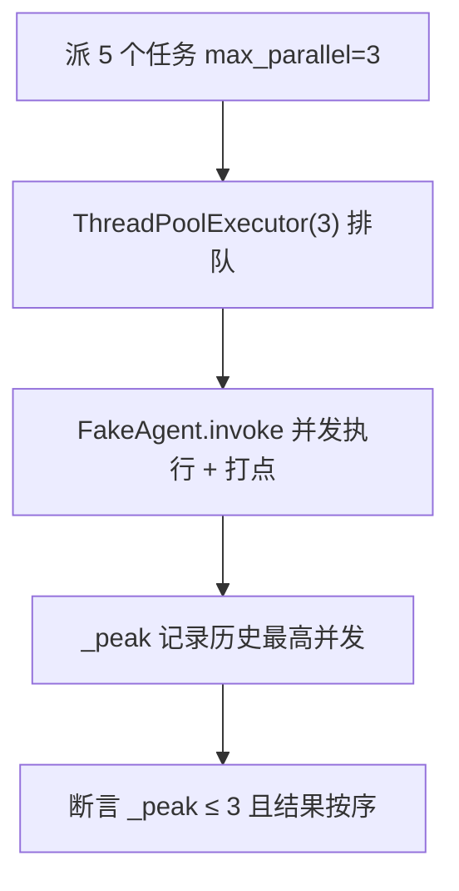

# tests/test_subagent_parallel.py — test_subagent_parallel.py

> **文件路径**: `backend/packages/harness/tests/test_subagent_parallel.py`
> **目录位置**: tests → test_subagent_parallel.py
> **职责**: 子代理并行派发测试（M4 验收点 2+3）——派 5 个任务实际并行 ≤3 排队；结果按输入顺序回传
> **关键手段**: FakeAgent（monkeypatch `_build_agent`）替代真实模型调用，不依赖 API

## 📑 目录

- [📋 结构图](#📋-结构图)
- [📤 关键导出](#📤-关键导出)
- [💡 设计思想](#💡-设计思想)
- [🎯 实用场景](#🎯-实用场景)
- [📊 顺序执行链流程图](#📊-顺序执行链流程图)
- [🧩 代码解析（成块对照 test_subagent_parallel.py）](#🧩-代码解析成块对照-test_subagent_parallelpy)
- [❓ Q&A / 知识点](#❓-qa--知识点)
- [⚠️ 风险点](#⚠️-风险点)

## 📋 结构图

```text
tests/test_subagent_parallel.py（3 用例 → 验收点 2/3）
├── 并发跟踪: _lock/_active/_peak + _enter/_exit/_reset_peak（跨线程共享）
├── FakeAgent: invoke 模拟耗时 + 返回固定文本（prefix 完成: task）
├── _make_executor: 真 executor + monkeypatch _build_agent → FakeAgent
│
├── test_dispatch_parallel_returns_in_order   验收点 3：结果按输入顺序回传
├── test_dispatch_parallel_peak_leq_3        验收点 2：派 5 个并发峰值 ≤3
└── test_dispatch_parallel_max_parallel_capped  max_parallel=10 也被压到 3

被测对象: agentflow/subagents/executor.py → SubagentExecutor.dispatch_parallel
```

## 📤 关键导出

无独立导出（测试文件）。核心被测链路：

- `SubagentExecutor.dispatch_parallel(tasks, max_parallel=3)` → `list[SubagentResult]`

配套测试设施（模块级）：

- `FakeAgent`（假子代理：`invoke` 模拟耗时 + 跟踪并发）
- `_make_executor(delay)`（构造真 executor，`_build_agent` 换成 FakeAgent）

## 💡 设计思想

1. **不依赖模型 API 测并发**：monkeypatch `_build_agent` 返回 FakeAgent——用 `time.sleep(delay)` 制造真实并发窗口，才能量出"同时有几个在跑"；真实模型调用没法精确控制并发窗口。
2. **峰值测量 = 打点法**：`_enter`/`_exit` 在锁内增减 `_active`，`_peak = max(_peak, _active)` 记录历史最高并发——这是"断言并发 ≤3"的证据来源。
3. **按序断言 = 逐位比较**：`results[0].result == "子代理完成: 任务一"` 按输入顺序逐位断言，防"结果对但顺序乱"。
4. **双保险钳制也要测**：外部传 `max_parallel=10` 仍被 `min(10, MAX_CONCURRENT_SUBAGENTS=3)` 压到 3——防有人绕过外部参数。

## 🎯 实用场景

1. 验收点 2（并行控制）与验收点 3（结果回传）的自动化证明。
2. 防回归：谁把 `MAX_CONCURRENT_SUBAGENTS` 改成 5、或把 `ThreadPoolExecutor` 换成裸线程，`_peak <= 3` 立刻红。

## 📊 顺序执行链流程图（test_dispatch_parallel_peak_leq_3 一次运行）

```text
_make_executor(delay=0.2) → 真 executor + _build_agent → FakeAgent（request）
│
▼
_reset_peak() 清空 _active/_peak
│
▼
dispatch_parallel(["任务0".."任务4"], max_parallel=3)
│
▼
workers = min(3, 3) → ThreadPoolExecutor(max_workers=3)  ← 5 个任务，3 个槽位
│
▼
FakeAgent.invoke 并发跑：_enter() 打点 / sleep(0.2) / _exit()
│
▼
断言：_peak <= 3（排队失效则 _peak=5） + 5 个结果全 completed
```

**Mermaid 版（GitHub / 飞书渲染；VSCode 需装插件）**：



## 🧩 代码解析（成块对照 test_subagent_parallel.py）

> 读法：每块先贴**完整代码**，再看块下方的整块解析。代码与文件一致，仅省略头部规范注释。

### 块 1：imports + 并发跟踪（跨线程共享）

```python
import threading
import time

from langchain_core.messages import AIMessage

from agentflow.subagents import SubagentExecutor, get_subagent_config

# ---- 并发跟踪（跨线程共享） ----
_lock = threading.Lock()
_active = 0
_peak = 0


def _enter() -> None:
    global _active, _peak
    with _lock:
        _active += 1
        _peak = max(_peak, _active)


def _exit() -> None:
    global _active
    with _lock:
        _active -= 1
```

**结构简析**：并发测量设施。模块级三个共享变量——`_lock`（threading.Lock）、`_active`（当前在跑数）、`_peak`（历史峰值）；配两个打点函数 `_enter` / `_exit`。线程池多线程同时增减，不加锁会读到脏值。

**`_enter()` 参数逐条解释**：无参数。锁内 `_active += 1`，并 `_peak = max(_peak, _active)` 记录历史最高水位；在 FakeAgent.invoke 开头调用（进入并发窗口）。

**`_exit()` 参数逐条解释**：无参数。锁内 `_active -= 1`；在 invoke 的 finally 里调用（无论成功失败都退出并发窗口）。

**落库要点**：`_peak = max(_peak, _active)` 是"历史最高水位"记录法——它是后面 `assert _peak <= 3` 的证据来源。

### 块 2：FakeAgent —— 假子代理

```python
class FakeAgent:
    """假子代理：invoke 模拟耗时 + 返回固定文本，并跟踪并发。"""

    def __init__(self, prefix: str, delay: float = 0.15):
        self.prefix = prefix
        self.delay = delay

    def invoke(self, inputs: dict) -> dict:
        _enter()
        try:
            task = inputs["messages"][0]["content"]
            time.sleep(self.delay)
            return {"messages": [AIMessage(content=f"{self.prefix}完成: {task}")]}
        finally:
            _exit()
```

**结构简析**：假子代理，结构对齐真实 agent 的 `invoke(inputs) -> dict` 契约。`time.sleep(self.delay)` 制造可控并发窗口，返回 `{"messages": [AIMessage(...)]}` 对齐 langchain 消息结构。

**`__init__()` 参数逐条解释**：

| 参数 | 类型 | 默认值 | 含义 |
|---|---|---|---|
| `prefix` | `str` | 必填 | 返回文本前缀，存 `self.prefix`（`"子代理完成: {task}"` 的"子代理完成"部分） |
| `delay` | `float` | `0.15` | 模拟耗时秒数，`time.sleep(self.delay)` 制造并发窗口；0.2s 足够让 5 个任务同时提交时只有 3 个真正并跑 |

**`invoke()` 参数逐条解释**：

| 参数 | 类型 | 默认值 | 含义 |
|---|---|---|---|
| `inputs` | `dict` | 必填 | langchain agent.invoke 入参；`task = inputs["messages"][0]["content"]` 从中取任务文本 |

行为：先 `_enter()` 打点 → try 里取 task、`time.sleep(self.delay)`、返回 `{"messages": [AIMessage(content=f"{prefix}完成: {task}")]}` → finally 里 `_exit()`。

**落库要点**：把 task 文本拼进返回，断言能精确到"任务一 → 子代理完成: 任务一"。

### 块 3：_make_executor —— 真 executor + 假 agent 注入

```python
def _make_executor(delay: float = 0.15):
    """构造真实 executor，但 _build_agent 换成 FakeAgent（不碰模型）。"""
    cfg = get_subagent_config("general-purpose")
    execu = SubagentExecutor(cfg, tools=[], model=None)
    fake = FakeAgent(prefix="子代理", delay=delay)
    execu._build_agent = lambda: fake  # type: ignore[method-assign]
    return execu


def _reset_peak() -> None:
    global _active, _peak
    with _lock:
        _active = 0
        _peak = 0
```

**结构简析**：测试装配核心。用真实 `SubagentExecutor`（保证测的是生产代码路径），只把 `_build_agent` 替换成返回 FakeAgent 的 lambda；配一个 `_reset_peak` 在每个用例前清零并发水位。

**`_make_executor()` 参数逐条解释**：

| 参数 | 类型 | 默认值 | 含义 |
|---|---|---|---|
| `delay` | `float` | `0.15` | 传给 `FakeAgent(prefix="子代理", delay=delay)` 的模拟耗时；返回装配好的 executor |

内部：`cfg = get_subagent_config("general-purpose")` → `SubagentExecutor(cfg, tools=[], model=None)` → `execu._build_agent = lambda: fake`。`tools=[]`、`model=None` 在 FakeAgent 下不会被使用。

**`_reset_peak()` 参数逐条解释**：无参数。锁内把 `_active`、`_peak` 清零，保证用例间不互相污染。

**落库要点**：monkeypatch `_build_agent` 后，executor 内部 `run()` 调 `self._build_agent()` 拿到的就是假 agent——调度逻辑（线程池/排队/超时）全是生产代码，只有"模型调用"被假替身接管。

### 块 4：test_dispatch_parallel_returns_in_order —— 按序回传（验收点 3）

```python
def test_dispatch_parallel_returns_in_order():
    """并行派发结果按输入顺序回传（验收点 3：结果回传）。"""
    execu = _make_executor(delay=0.05)
    tasks = ["任务一", "任务二", "任务三"]
    results = execu.dispatch_parallel(tasks, max_parallel=3)
    assert len(results) == 3
    assert results[0].result == "子代理完成: 任务一"
    assert results[1].result == "子代理完成: 任务二"
    assert results[2].result == "子代理完成: 任务三"
    assert all(r.status.value == "completed" for r in results)
```

**结构简析**：验收点 3——并行派发结果按输入顺序回传。`delay=0.05` 让任务快速完成（本用例不关心并发）。

**`test_dispatch_parallel_returns_in_order()` 参数逐条解释**：无参数，直接断言按序回传——`results[0/1/2]` 逐位等于 `"子代理完成: 任务一/二/三"`，且 3 个任务全部 `status=="completed"`。

**落库要点**：`dispatch_parallel` 内部 `[f.result() for f in futures]` 按 futures 提交顺序取结果，与完成先后无关——逐位断言就是钉死这个语义。

### 块 5：test_dispatch_parallel_peak_leq_3 —— 并发峰值（验收点 2）

```python
def test_dispatch_parallel_peak_leq_3():
    """派 5 个任务，实际并发峰值 ≤3（验收点 2：并行控制）。"""
    _reset_peak()
    execu = _make_executor(delay=0.2)
    tasks = [f"任务{i}" for i in range(5)]
    results = execu.dispatch_parallel(tasks, max_parallel=3)
    assert _peak <= 3, f"并发峰值 {_peak} 超过 3（排队失效）"
    assert len(results) == 5  # 5 个任务全部完成
    assert all(r.status.value == "completed" for r in results)
```

**结构简析**：验收点 2 的核心证据——派 5 个任务，实际并发峰值 ≤3。`delay=0.2` 拉长并发窗口：排队失效（线程池无上限）时 `_peak` 会到 5；正确实现下只有 3 个真并发。

**`test_dispatch_parallel_peak_leq_3()` 参数逐条解释**：无参数，直接断言 `_peak <= 3`、`len(results)==5`（5 个任务全完成）、全部 `status=="completed"`。

**落库要点**：断言信息 `f"并发峰值 {_peak} 超过 3（排队失效）"` 在失败时直接给出实测值——正确实现下 `ThreadPoolExecutor(max_workers=3)` 只有 3 个真并发，第 4/5 个排队等空位，`_peak == 3`。

### 块 6：test_dispatch_parallel_max_parallel_capped —— 硬上限钳制

```python
def test_dispatch_parallel_max_parallel_capped():
    """max_parallel 传更大值也被压到 3（硬上限）。"""
    _reset_peak()
    execu = _make_executor(delay=0.2)
    execu.dispatch_parallel([f"t{i}" for i in range(6)], max_parallel=10)
    assert _peak <= 3
```

**结构简析**：双保险的第二层验证——调用方传 `max_parallel=10`，executor 内部仍钳到 3。

**`test_dispatch_parallel_max_parallel_capped()` 参数逐条解释**：无参数，直接断言 `execu.dispatch_parallel([f"t{i}" for i in range(6)], max_parallel=10)` 后 `_peak <= 3`。

**落库要点**：executor 内部 `min(int(max_parallel), MAX_CONCURRENT_SUBAGENTS)` 钳到 3——防"外部参数绕过硬上限"：即使未来 dispatch 工具忘了钳，executor 这层也兜住。

## ❓ Q&A / 知识点

### 1. 为什么用 FakeAgent 而不是真实模型？（2026-10-01 用户提问）

**一句话**：并发测试需要**精确可控的并发窗口**（每个任务睡 0.2s），真实模型调用的耗时不可控、还会烧 API 配额、测试变慢且不稳定。

**依据源码**：`execu._build_agent = lambda: fake` 把 executor 内部的 agent 工厂替换掉——executor 的调度逻辑（线程池/排队/超时）全是生产代码，只有"模型调用"这一段被假替身接管。

### 2. 为什么 `_peak <= 3` 就能证明排队生效？

**一句话**：`_peak` 是"同时进入 invoke 的最大数量"。若线程池不限制并发，5 个任务会同时进入（`_peak=5`）；正确实现下同时只有 3 个能进，其余在 `ThreadPoolExecutor` 队列里等空位，`_peak=3`。所以峰值本身就是排队的直接证据。

### 3. 按序回传和完成顺序是一回事吗？

**不是**。`dispatch_parallel` 返回 `[f.result() for f in futures]`——按 **futures 提交顺序**逐个取结果，即使任务 2 先于任务 1 完成，`results[0]` 也是任务一的结果（`f.result()` 会等它跑完）。测试逐位断言就是钉死这个语义。

## ⚠️ 风险点

1. `delay` 值影响测试稳定性：太小（<0.05s）并发窗口可能测不出峰值，太大（>1s）拖慢测试。当前 0.2s 是经过实测的平衡值，勿随手改。
2. `_build_agent` 的 monkeypatch 依赖 executor 内部实现细节——若未来 `_build_agent` 改名或改成异步，本测试的注入点要同步更新。
3. 断言顺序 = 输入顺序是**验收点 3 的契约**（不是实现巧合）：改 executor 返回值顺序时，这里必须跟着改，且要先确认是"有意变更"。
---
_2026-10-01 新建：tests 测试文档（用例级验收对照，对齐 doc-code 规范：目录/结构图/流程图/成块代码解析/Q&A/风险点）。_
_2026-10-03 重构：代码解析段按「结构简析 + 参数逐条表格 + 落库要点」规范化（代码块零改动）。_
