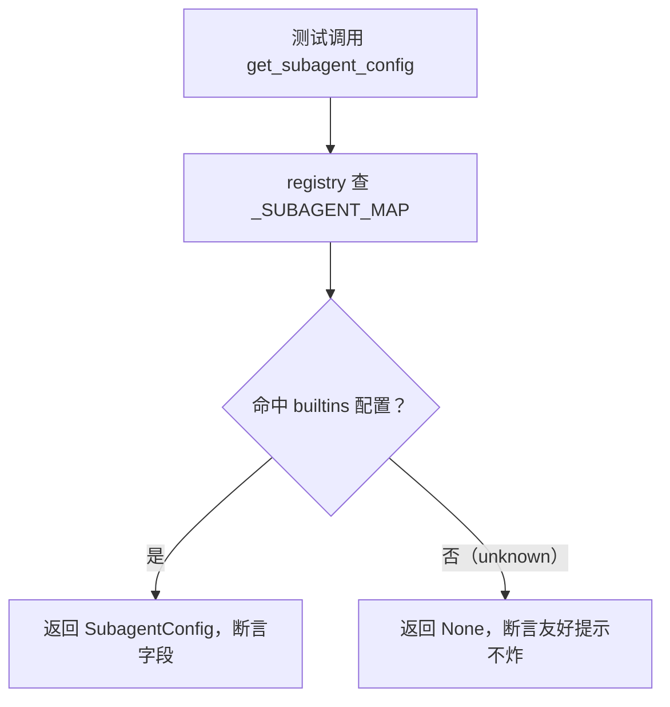

# tests/test_subagent_registry.py — test_subagent_registry.py

> **文件路径**: `backend/packages/harness/tests/test_subagent_registry.py`
> **目录位置**: tests → test_subagent_registry.py
> **职责**: 子代理注册表测试（M4 验收点 1）——`get_subagent_config` 查表 / `list_subagents` 枚举 / 默认黑名单防递归

## 📑 目录

- [📋 结构图](#📋-结构图)
- [📤 关键导出](#📤-关键导出)
- [💡 设计思想](#💡-设计思想)
- [🎯 实用场景](#🎯-实用场景)
- [📊 顺序执行链流程图](#📊-顺序执行链流程图)
- [🧩 代码解析（成块对照 test_subagent_registry.py）](#🧩-代码解析成块对照-test_subagent_registrypy)
- [❓ Q&A / 知识点](#❓-qa--知识点)
- [⚠️ 风险点](#⚠️-风险点)

## 📋 结构图

```text
tests/test_subagent_registry.py（5 用例 → 验收点 1：子代理注册）
├── test_get_general_purpose_config      内置通用子代理能查到，字段完整
├── test_get_bash_config_whitelist       bash 白名单只留 terminal_run
├── test_get_unknown_config_returns_none 未知名 → None（友好提示，不炸）
├── test_list_subagents_covers_builtins  注册表至少含 general-purpose + bash
└── test_default_disallowed_tools_prevent_recursion  默认黑名单含派发类（防递归）

被测对象: agentflow/subagents/registry.py（get_subagent_config / list_subagents / get_subagent_names）
          + config.py 默认字段（tools=None / disallowed_tools 三件套）
```

## 📤 关键导出

无独立导出（测试文件）。全量用例 = 5 个 `test_` 函数，对应验收点 1 的两条链路：

- **查表链路**: `get_subagent_config(name)` → `SubagentConfig | None`
- **枚举链路**: `get_subagent_names()` / `list_subagents()` → 内置子代理清单

## 💡 设计思想

1. **测注册表而非测实现**：断言走公开 API（`get_subagent_config`），不碰 registry 内部 `_SUBAGENT_MAP` 的细节——未来改存储结构测试不用跟着改。
2. **白名单/黑名单分开断言**：bash 的白名单（`tools == ["terminal_run"]`）与 general-purpose 的黑名单（默认三件套）是两条独立验收，各自有测试。
3. **未知名为 None 是有意契约**：dispatch 工具拿到 None 时给"未配置子代理"的友好提示，而不是崩溃——测试把这个契约钉死。

## 🎯 实用场景

1. 验收点 1 的自动化证明：注册表查得到、枚举得到、字段符合约定。
2. 防回归：有人改 `SubagentConfig` 默认值（比如误删黑名单）时，`test_default_disallowed_tools_prevent_recursion` 立刻红。

## 📊 顺序执行链流程图（一次注册表查表）

```text
test_get_general_purpose_config()（request）
│
▼
get_subagent_config("general-purpose")   ← registry.py 查 _SUBAGENT_MAP
│
▼
命中 builtins 注册的 GENERAL_PURPOSE_CONFIG（SubagentConfig）
│
▼
断言字段：name/model/tools=None/max_turns>0/timeout>0
```

**Mermaid 版（GitHub / 飞书渲染；VSCode 需装插件）**：



## 🧩 代码解析（成块对照 test_subagent_registry.py）

> 读法：每块先贴**完整代码**，再看块下方的整块解析。代码与文件一致，仅省略头部规范注释。

### 块 1：imports —— 只从 subagents 公开接口取

```python
from agentflow.subagents import (
    get_subagent_config,
    get_subagent_names,
    list_subagents,
)
from agentflow.subagents.config import SubagentConfig
```

**整块解析**：从 `agentflow.subagents` 包入口取三个公开函数（`__init__.py` 统一导出），`SubagentConfig` 用于 `isinstance` 类型断言。测试不 import registry 内部细节，只走公开 API——这正是"测契约不测实现"的体现。

### 块 2：test_get_general_purpose_config —— 通用子代理字段完整性

```python
def test_get_general_purpose_config():
    """内置通用子代理能查到，字段完整。"""
    cfg = get_subagent_config("general-purpose")
    assert isinstance(cfg, SubagentConfig)
    assert cfg.name == "general-purpose"
    assert cfg.model == "inherit"
    assert cfg.tools is None  # 继承父级全部工具
    assert cfg.max_turns > 0
    assert cfg.timeout_seconds > 0
```

**整块解析**：验收点 1 的核心用例。`isinstance` 先保证返回的是配置对象而非 None；随后逐字段断言：`name` 正确、`model="inherit"`（M4 只支持继承父模型）、`tools is None`（白名单不生效，继承父级全部）、执行上限为正数。任何字段默认值被改动都会在这里暴露。

### 块 3：test_get_bash_config_whitelist —— bash 最小权限

```python
def test_get_bash_config_whitelist():
    """bash 子代理工具白名单只留 terminal_run（最小权限）。"""
    cfg = get_subagent_config("bash")
    assert cfg is not None
    assert cfg.tools == ["terminal_run"]
```

**整块解析**：bash 是白名单收敛的典型——`tools == ["terminal_run"]` 精确等于列表，不是子集断言。这钉死"bash 只给终端工具"的最小权限原则：未来谁给 bash 加文件工具，此测试先红。

### 块 4：test_get_unknown_config_returns_none —— 未知名不炸

```python
def test_get_unknown_config_returns_none():
    """未注册的子代理 → None（dispatch 工具据此给友好提示，不炸）。"""
    assert get_subagent_config("no-such-agent") is None
```

**整块解析**：注册表查表对未知名的返回契约是 `None` 而非抛异常。dispatch 工具拿到 None 走"子代理未配置"友好提示分支（dispatch_tool.py 有对应逻辑），这条测试防止有人把查表改成抛错。

### 块 5：test_list_subagents_covers_builtins —— 枚举覆盖内置

```python
def test_list_subagents_covers_builtins():
    """内置注册表至少含 general-purpose 与 bash。"""
    names = get_subagent_names()
    assert "general-purpose" in names
    assert "bash" in names
    assert len(list_subagents()) >= 2
```

**整块解析**：枚举链路（验收点 1 第二半）。`get_subagent_names()` 返回名字列表，断言两个内置子代理都在；`list_subagents()` 返回配置列表，断言至少 2 个。`>= 2` 而不是 `== 2`——允许未来加新内置子代理不破坏此测试。

### 块 6：test_default_disallowed_tools_prevent_recursion —— 防递归是硬约束

```python
def test_default_disallowed_tools_prevent_recursion():
    """默认黑名单排除派发类工具（防子代理再派子代理死循环）。"""
    cfg = get_subagent_config("general-purpose")
    assert "dispatch_subagents" in (cfg.disallowed_tools or [])
    assert "ask_clarification" in (cfg.disallowed_tools or [])
```

**整块解析**：验证 config.py 默认黑名单三件套中的两件必在（`or []` 兜底 None）。`dispatch_subagents` 防子代理再派子代理（无限嵌套），`ask_clarification` 防子代理反问用户。这是"默认值不可删"的自动化守护——谁清了黑名单，这条立刻红。

## ❓ Q&A / 知识点

### 为什么未知子代理返回 None 而不是报错？（2026-10-01 用户提问）

**一句话**：None 是"查不到"的显式表达，dispatch 工具拿到后给用户友好提示（"子代理 X 未配置"），而不是让整个派发流程崩溃。

**依据源码**：registry.py `get_subagent_config` 对 `_SUBAGENT_MAP.get(name)` 未命中返回 None；dispatch_tool.py 里 `cfg = get_subagent_config(...)` 后 `if cfg is None: return 友好提示`。

### 为什么黑名单断言用 `(cfg.disallowed_tools or [])` 而不是直接 `cfg.disallowed_tools`？

**一句话**：`disallowed_tools` 类型是 `list[str] | None`，万一未来某配置显式传 None（清空黑名单），`in None` 会 TypeError。`or []` 让 None 安全降级为空列表，断言只判断"必含项在不在"。

## ⚠️ 风险点

1. 本测试**钉死了默认黑名单**——未来若要支持"子代理再派子代理"（递归派发），必须同时改 config.py 默认值 + 本测试 + executor 的并发保护，三者联动，不可只改一处。
2. `tools == ["terminal_run"]` 是精确相等：给 bash 加任何工具都会红——这是有意的（最小权限），不是测试写死了。
---
_2026-10-01 新建：tests 测试文档（用例级验收对照，对齐 doc-code 规范：目录/结构图/流程图/成块代码解析/Q&A/风险点）。_
