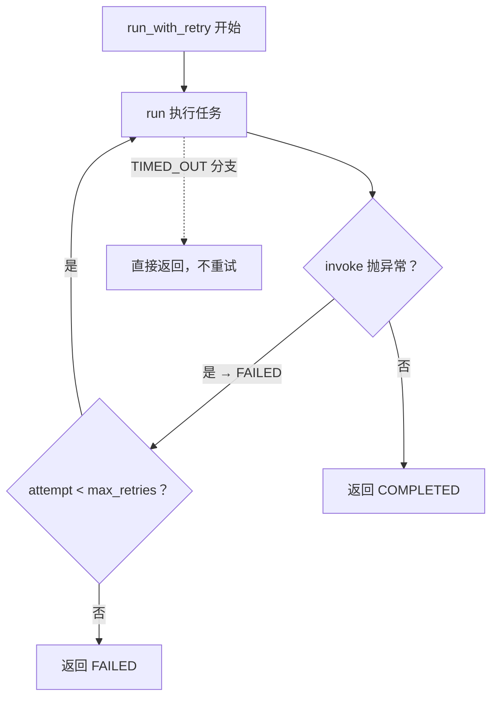

# tests/test_subagent_retry.py — test_subagent_retry.py

> **文件路径**: `backend/packages/harness/tests/test_subagent_retry.py`
> **目录位置**: tests → test_subagent_retry.py
> **职责**: 子代理重试测试（M4）——FAILED 重试到成功 / 一直失败返回 FAILED / TIMED_OUT 不重试 / 超时及时返回
> **关键手段**: FlakyAgent（前 N 次失败后成功）+ SlowAgent（睡过头模拟超时），monkeypatch `_build_agent`

## 📑 目录

- [📋 结构图](#📋-结构图)
- [📤 关键导出](#📤-关键导出)
- [💡 设计思想](#💡-设计思想)
- [🎯 实用场景](#🎯-实用场景)
- [📊 顺序执行链流程图](#📊-顺序执行链流程图)
- [🧩 代码解析（成块对照 test_subagent_retry.py）](#🧩-代码解析成块对照-test_subagent_retrypy)
- [❓ Q&A / 知识点](#❓-qa--知识点)
- [⚠️ 风险点](#⚠️-风险点)

## 📋 结构图

```text
tests/test_subagent_retry.py（4 用例 → 重试语义）
├── FlakyAgent: 前 fail_times 次 invoke 抛异常，之后成功（模拟模型瞬时故障）
├── SlowAgent:  invoke 睡 delay 秒（模拟超时），记录 calls
├── _make_executor: 真 executor + monkeypatch _build_agent → 注入 agent
│
├── test_retry_succeeds_after_failures    前 2 次失败、第 3 次成功 → COMPLETED
├── test_retry_gives_up_after_max_retries 一直失败 → 重试到上限返回 FAILED
├── test_timeout_not_retried               TIMED_OUT 不重试（只执行 1 次）
└── test_timeout_returns_promptly          超时及时返回 <2.5s（检查轮修正）

被测对象: agentflow/subagents/executor.py → SubagentExecutor.run / run_with_retry
```

## 📤 关键导出

无独立导出（测试文件）。覆盖的被测契约：

- `SubagentExecutor.run(task, timeout_seconds)` → 同步执行 + 超时标记 TIMED_OUT
- `SubagentExecutor.run_with_retry(task, max_retries, timeout_seconds)` → 只重试 FAILED

配套测试设施（模块级）：

- `FlakyAgent`（前 N 次失败、之后成功的假 agent）
- `SlowAgent`（睡过头模拟超时的假 agent）

## 💡 设计思想

1. **失败/超时都用假 agent 模拟**：`FlakyAgent` 前 `fail_times` 次抛 `RuntimeError("模型临时故障")`——模拟真实场景的模型瞬时异常（网络抖动/限流）；`SlowAgent` 睡 3s 模拟卡住的任务。不碰真实模型 API。
2. **`calls` 计数是重试语义的证据**：`agent.calls == 3` 精确断言"执行了几次"——重试成功是 3 次（2 败 + 1 成），重试放弃是 3 次（初 1 + 重 2），超时不重试是 1 次。执行次数即重试行为本身。
3. **超时及时返回是检查轮补的回归防线**：修复前 `with ThreadPoolExecutor` 的 `__exit__` 默认 `wait=True` 会等悬挂线程跑完（3s 任务 + 1s 超时 → 实际等 3s）；修复后显式 `shutdown(wait=False)`，测试用 `time.monotonic()` 断言 <2.5s。

## 🎯 实用场景

1. 重试语义的自动化证明：哪些状态该重试（FAILED）、哪些不该（TIMED_OUT）。
2. 防回归：`run_with_retry` 的重试判定、超时路径的及时返回，被改坏时这里立刻红。

## 📊 顺序执行链流程图（test_retry_succeeds_after_failures 一次运行）

```text
_make_executor(FlakyAgent(fail_times=2))（request）
│
▼
run_with_retry("任务", max_retries=2)
│
▼
第 1 次 run → FlakyAgent.invoke 抛 RuntimeError → 状态 FAILED
│
▼
FAILED 且 attempt < max_retries → 重试
│
▼
第 2 次 run → 又抛 → FAILED，attempt=2 达上限前仍可重试
│
▼
第 3 次 run → invoke 成功 → COMPLETED（calls==3）
```

**Mermaid 版（GitHub / 飞书渲染；VSCode 需装插件）**：



## 🧩 代码解析（成块对照 test_subagent_retry.py）

> 读法：每块先贴**完整代码**，再看块下方的整块解析。代码与文件一致，仅省略头部规范注释。

### 块 1：imports + FlakyAgent + SlowAgent

```python
import time

from langchain_core.messages import AIMessage

from agentflow.subagents import SubagentExecutor, SubagentStatus, get_subagent_config


class FlakyAgent:
    """前 fail_times 次 invoke 抛异常，之后成功。"""

    def __init__(self, fail_times: int):
        self.fail_times = fail_times
        self.calls = 0

    def invoke(self, inputs: dict) -> dict:
        self.calls += 1
        if self.calls <= self.fail_times:
            raise RuntimeError("模型临时故障")
        return {"messages": [AIMessage(content="终于成功")]}


class SlowAgent:
    """invoke 睡过头，模拟超时。"""

    def __init__(self, delay: float = 3.0):
        self.delay = delay
        self.calls = 0

    def invoke(self, inputs: dict) -> dict:
        self.calls += 1
        time.sleep(self.delay)
        return {"messages": [AIMessage(content="太慢了")]}
```

**整块解析**：两个假 agent 各司其职。`FlakyAgent` 的 `calls` 计数器递增 + 前 `fail_times` 次抛异常——模拟"模型瞬时故障后恢复"（真实场景：网络抖动、限流 1305）；`SlowAgent` 每次 `time.sleep(self.delay)` 睡满 3s——模拟"任务卡死不会自己结束"。两者的 `calls` 都是重试行为断言的关键证据。

### 块 2：_make_executor —— 真 executor + 假 agent 注入

```python
def _make_executor(agent):
    cfg = get_subagent_config("general-purpose")
    execu = SubagentExecutor(cfg, tools=[], model=None)
    execu._build_agent = lambda: agent  # type: ignore[method-assign]
    return execu
```

**整块解析**：与 test_subagent_parallel.py 同款装配模式——真实 `SubagentExecutor` + monkeypatch `_build_agent`。注意这里 `_make_executor(agent)` 直接接收 agent 实例（不像 parallel 版内部造 FakeAgent），因为 retry 测试要注入**不同的**假 agent（Flaky / Slow）。

### 块 3：test_retry_succeeds_after_failures —— 重试到成功

```python
def test_retry_succeeds_after_failures():
    """前 2 次失败、第 3 次成功 → run_with_retry 最终 COMPLETED。"""
    agent = FlakyAgent(fail_times=2)
    execu = _make_executor(agent)
    result = execu.run_with_retry("任务", max_retries=2)
    assert result.status == SubagentStatus.COMPLETED
    assert result.result == "终于成功"
    assert agent.calls == 3  # 2 次失败 + 1 次成功
```

**整块解析**：重试的"成功路径"。`FlakyAgent(fail_times=2)` 前两次抛异常，第三次成功；`run_with_retry(..., max_retries=2)` 允许 2 次重试。断言三件事：最终状态是 COMPLETED（不是 FAILED）、结果文本是 `"终于成功"`（第三次的返回）、`calls == 3`（恰好执行 3 次 = 初始 1 + 重试 2）——次数精确匹配证明重试逻辑真的跑了且没多跑。

### 块 4：test_retry_gives_up_after_max_retries —— 重试到放弃

```python
def test_retry_gives_up_after_max_retries():
    """一直失败 → 重试到上限后返回 FAILED。"""
    agent = FlakyAgent(fail_times=99)
    execu = _make_executor(agent)
    result = execu.run_with_retry("任务", max_retries=2)
    assert result.status == SubagentStatus.FAILED
    assert agent.calls == 3  # 初始 1 次 + 重试 2 次
    assert "模型临时故障" in (result.error or "")
```

**整块解析**：重试的"放弃路径"——`fail_times=99` 意味着永远失败。断言：状态 FAILED、`calls == 3`（初始 1 + 重试 2，**没有无限重试**）、错误信息里带 `"模型临时故障"`（最后那次异常被带进 SubagentResult.error）。这条钉死"重试次数 = max_retries，不会无限循环"。

### 块 5：test_timeout_not_retried —— 超时不重试

```python
def test_timeout_not_retried():
    """TIMED_OUT 不重试（超时重试只会再超时，直接返回）。"""
    agent = SlowAgent(delay=3.0)
    execu = _make_executor(agent)
    result = execu.run_with_retry("任务", max_retries=2, timeout_seconds=1)
    assert result.status == SubagentStatus.TIMED_OUT
    assert agent.calls == 1  # 只执行一次，未重试
```

**整块解析**：重试语义的分界点——`SlowAgent(3s)` + `timeout_seconds=1` 让任务必超时。断言：状态 TIMED_OUT、`calls == 1`（**只执行一次**）——run_with_retry 对 TIMED_OUT 直接返回不重试（`if result.status != FAILED or ...: return result`）。设计原因：超时重试只会再超时（任务本身跑不完），重试是浪费。

### 块 6：test_timeout_returns_promptly —— 超时及时返回（检查轮修正）

```python
def test_timeout_returns_promptly():
    """超时必须及时返回（检查轮修正：shutdown(wait=False) 不等悬挂线程）。

    修复前 `with ThreadPoolExecutor` 的 __exit__ 默认 wait=True，
    会等 SlowAgent 睡满 3s 才返回——超时失效。修复后 ~1s 返回。
    """
    agent = SlowAgent(delay=3.0)
    execu = _make_executor(agent)
    t0 = time.monotonic()
    result = execu.run("任务", timeout_seconds=1)
    elapsed = time.monotonic() - t0
    assert result.status == SubagentStatus.TIMED_OUT
    assert elapsed < 2.5  # 不能等到任务实际跑完（3s）
```

**整块解析**：检查轮补的回归用例（对应 executor.py 的 `run()` 修复）。`time.monotonic()` 测真实耗时：任务睡 3s、超时 1s，**正确实现应 ~1s 返回**，断言 `< 2.5s` 留了余量但远小于 3s。修复前 `with ThreadPoolExecutor` 的 `__exit__` 默认 `wait=True` 会等悬挂线程跑完——`run()` 实际阻塞 3s，超时形同虚设；修复后超时路径 `pool.shutdown(wait=False)` 及时返回。**这是"超时真的生效"而非"标记了 TIMED_OUT"的直接证据**。

## ❓ Q&A / 知识点

### 为什么 TIMED_OUT 不重试，只重试 FAILED？（2026-10-01 用户提问）

**一句话**：FAILED 是模型调用异常（网络抖动/限流），重试有机会成功；TIMED_OUT 说明任务本身跑不完（3s 的任务 1s 超时，重试只会再超时），重试是纯浪费。

**依据源码**：executor.py `run_with_retry` 的判定 `if result.status != SubagentStatus.FAILED or attempt >= max_retries: return result`——只有 FAILED 且未达上限才继续 while。`calls == 1` 断言把这个契约钉死。

### 超时"及时返回"和"标记 TIMED_OUT"有什么区别？

**一句话**：标记 TIMED_OUT 是"状态对了"，及时返回是"行为对了"。修复前：状态是 TIMED_OUT 但调用方仍阻塞到任务实际跑完（3s）——超时对用户体验无意义；修复后：~1s 就返回 TIMED_OUT，调用方立刻拿到结果继续流程。`elapsed < 2.5` 测的就是后者。

## ⚠️ 风险点

1. `test_timeout_returns_promptly` 的 `< 2.5` 是**时序断言**——在极慢的 CI 机器上可能有波动，但 3s vs 2.5s 的余量足够大（修复前是 3s+）；若未来超时机制再改，这个用例是首要报警点。
2. `calls` 计数断言依赖"每次 invoke 恰好执行一次"的语义——如果 executor 未来引入内部重试层（比如模型层重试），`calls == 3` 会失真，需要同步调整断言。
3. SlowAgent 睡 3s 会让超时用例实际耗时 ~1-3s——已是最小可行值（再短无法区分"及时返回"与"等任务跑完"）。
---
_2026-10-01 新建：tests 测试文档（用例级验收对照，对齐 doc-code 规范：目录/结构图/流程图/成块代码解析/Q&A/风险点）。_
