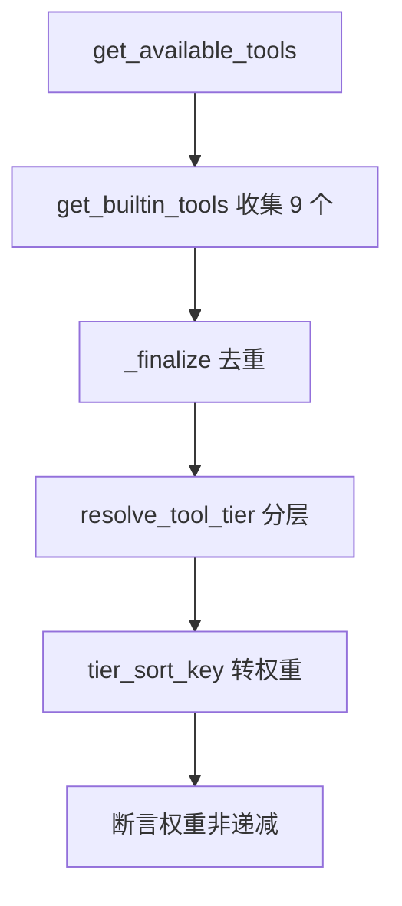

# tests/test_tool_catalog.py — test_tool_catalog.py

> **文件路径**: `backend/packages/harness/tests/test_tool_catalog.py`
> **目录位置**: tests → test_tool_catalog.py
> **职责**: 工具目录测试（M2 起，M4 更新）——9 个内置工具收集 / 去重 / 分层 / 排序 / 兜底 / 中文标签

## 📑 目录

- [📋 结构图](#📋-结构图)
- [📤 关键导出](#📤-关键导出)
- [💡 设计思想](#💡-设计思想)
- [🎯 实用场景](#🎯-实用场景)
- [📊 顺序执行链流程图](#📊-顺序执行链流程图)
- [🧩 代码解析（成块对照 test_tool_catalog.py）](#🧩-代码解析成块对照-test_tool_catalogpy)
- [❓ Q&A / 知识点](#❓-qa--知识点)
- [⚠️ 风险点](#⚠️-风险点)

## 📋 结构图

```text
tests/test_tool_catalog.py（6 用例 → M2 工具目录 + M4 新增 4 工具）
├── test_get_builtin_tools_has_all     M2 5 个 + M4 4 个 = 9 个内置工具
├── test_tool_names_unique             工具名不重复（_finalize 去重）
├── test_available_tools_sorted_by_tier 按 tier 排序权重非递减
├── test_resolve_tool_tier_known       已知工具分层正确（含 M4 新增）
├── test_resolve_tool_tier_unknown_defaults_optional  未知名兜底 optional
└── test_tier_label_zh                 中文标签

被测对象: agentflow/tools/tool_catalog.py（resolve_tool_tier / tier_sort_key / tool_tier_label_zh）
          + agentflow/tools/tools.py（get_builtin_tools / get_available_tools）
```

## 📤 关键导出

无独立导出（测试文件）。覆盖的被测契约：

- `get_builtin_tools()` → 9 个内置工具（M2 5 个基础 + M4 4 个新增）
- `get_available_tools()` → 去重后的最终工具集
- `resolve_tool_tier(name)` → 分层（runtime/core/workspace/plan/optional）
- `tier_sort_key(tier)` → 排序权重
- `tool_tier_label_zh(tier)` → 中文标签

## 💡 设计思想

1. **数量断言 = M4 增量验证**：`len(tools) == 9` 是硬断言——M2 只有 5 个基础工具，M4 加了 terminal_run/read_file/write_file/dispatch_subagents 凑成 9。数量 + 名字双断言，防"加多了"也防"加少了"。
2. **集合子集断言而非相等**：`{"ask_clarification", ...} <= names` 只断言"必含这些"，未来加新工具不会破坏本测试（与 registry 测试的 `>= 2` 同款哲学）。
3. **排序用权重非递减断言**：`weights == sorted(weights)` 直接验证"tier 排序生效"，不硬编码具体顺序——tier 的权值表改时，只要仍单调即可。
4. **未知兜底是契约**：`resolve_tool_tier("no_such_tool") == "optional"` 钉死"未知工具按可选处理"（对齐原版），防止未来改成抛异常。

## 🎯 实用场景

1. M2 工具目录验收 + M4 工具增量验收（9 个工具、tier 分层）。
2. 防回归：工具收集数量、去重、排序、分层、中文标签，任何一处被改坏这里立刻红。

## 📊 顺序执行链流程图（test_available_tools_sorted_by_tier 一次运行）

```text
get_available_tools()（request）
│
▼
get_builtin_tools() → 9 个内置工具（lru_cache 缓存，延迟收集）
│
▼
_finalize_tool_catalog：按 name 去重（seen 集合）
│
▼
逐个工具 resolve_tool_tier(name) → tier
│
▼
tier_sort_key(tier) → 权重列表
│
▼
断言 weights == sorted(weights)（非递减 = 分层排序生效）
```

**Mermaid 版（GitHub / 飞书渲染；VSCode 需装插件）**：



## 🧩 代码解析（成块对照 test_tool_catalog.py）

> 读法：每块先贴**完整代码**，再看块下方的整块解析。代码与文件一致，仅省略头部规范注释。

### 块 1：imports —— 工具目录 + 工具收集

```python
from agentflow.tools.tool_catalog import (
    resolve_tool_tier,
    tier_sort_key,
    tool_tier_label_zh,
)
from agentflow.tools.tools import get_available_tools, get_builtin_tools
```

**整块解析**：从两个模块取料——`tool_catalog.py`（分层/排序/标签三个纯函数）+ `tools.py`（收集入口两个函数）。测试的 6 个用例正好覆盖这两块的全部公开能力。

### 块 2：test_get_builtin_tools_has_all —— 9 个内置工具

```python
def test_get_builtin_tools_has_all():
    """M2 5 个基础工具 + M4 新增 4 个 = 9 个内置工具。"""
    tools = list(get_builtin_tools())
    assert len(tools) == 9
    names = {t.name for t in tools}
    # M2 基础 5 个
    assert {"ask_clarification", "todo", "knowledge", "plan", "fetch_url"} <= names
    # M4 新增：沙箱终端/文件 + 子代理派发
    assert {"terminal_run", "read_file", "write_file", "dispatch_subagents"} <= names
```

**整块解析**：M4 增量验收的核心用例。`len(tools) == 9` 精确计数；`names` 集合用**子集断言**（`<=`）分别验证 M2 基础 5 个与 M4 新增 4 个都在。注意 `get_builtin_tools` 带 `lru_cache`——如果工具定义改了但缓存没清，此用例会红（这是有意的：提醒清缓存）。

### 块 3：test_tool_names_unique —— 去重

```python
def test_tool_names_unique():
    """工具名不重复（_finalize_tool_catalog 去重保证）。"""
    names = [t.name for t in get_available_tools()]
    assert len(names) == len(set(names))
```

**整块解析**：验证 `_finalize_tool_catalog` 的去重逻辑。`len(names) == len(set(names))`——列表长度等于集合长度即无重复。这条防的是：未来某工具被注册两次（同名不同模块），模型拿到重复工具会行为异常。

### 块 4：test_available_tools_sorted_by_tier —— 分层排序

```python
def test_available_tools_sorted_by_tier():
    """按 tier 排序：runtime 在前，plan 在后。"""
    tools = get_available_tools()
    tiers = [resolve_tool_tier(t.name) for t in tools]
    # 排序权重应是非递减（tier_sort_key 从小到大）
    weights = [tier_sort_key(t) for t in tiers]
    assert weights == sorted(weights)
```

**整块解析**：分层排序的验证。先把每个工具名转成 tier，再转成排序权重（`tier_sort_key`），断言权重列表等于其排序后的自己（非递减）。**不硬编码具体顺序**——即使 tier 权值调整，只要保持单调递增就不破坏测试。语义是"运行时工具在前、计划类在后"（runtime 权值最小）。

### 块 5：test_resolve_tool_tier_known —— 已知工具分层

```python
def test_resolve_tool_tier_known():
    """已知工具的分层正确。"""
    assert resolve_tool_tier("ask_clarification") == "runtime"
    assert resolve_tool_tier("todo") == "core"
    assert resolve_tool_tier("knowledge") == "workspace"
    assert resolve_tool_tier("plan") == "plan"
    assert resolve_tool_tier("fetch_url") == "workspace"
    # M4 新增工具分层
    assert resolve_tool_tier("terminal_run") == "workspace"
    assert resolve_tool_tier("read_file") == "workspace"
    assert resolve_tool_tier("write_file") == "workspace"
    assert resolve_tool_tier("dispatch_subagents") == "core"
```

**整块解析**：tier 分层的精确映射表。M2 五个基础工具各有分层（runtime/core/workspace/plan/workspace），M4 四个新增工具也逐个钉死——`terminal_run/read_file/write_file` 归 workspace（沙箱文件/终端是工作区能力），`dispatch_subagents` 归 core（派发是核心能力，与 todo 同层）。改 tool_catalog 分层表时，这里必须同步。

### 块 6：test_resolve_tool_tier_unknown_defaults_optional —— 未知兜底

```python
def test_resolve_tool_tier_unknown_defaults_optional():
    """未知工具名兜底 optional（照原版）。"""
    assert resolve_tool_tier("no_such_tool") == "optional"
    assert resolve_tool_tier("") == "optional"
    assert resolve_tool_tier(None) == "optional"
```

**整块解析**：兜底契约三连测——未知名字符串、空串、None 都归 `optional`（"扩展可选"层）。钉死"未知工具不会被炸成异常、也不会排到核心层"。`None` 的断言特别重要：`resolve_tool_tier(None)` 的实参类型不是 str，防止有人把签名改成 `name: str` 后忘了处理 None。

### 块 7：test_tier_label_zh —— 中文标签

```python
def test_tier_label_zh():
    """中文标签。"""
    assert tool_tier_label_zh("core") == "日常常驻"
    assert tool_tier_label_zh("unknown") == "扩展可选"
```

**整块解析**：tier 的中文展示层验证。`core` → "日常常驻"（核心工具常驻可用）、`unknown` → "扩展可选"（兜底层的展示名）。注意入参是 `"unknown"` 而不是 `"optional"`——标签函数对**未知 tier 名**的兜底是"扩展可选"，这本身也是展示层容错的验证。

## ❓ Q&A / 知识点

### 为什么 `get_builtin_tools` 带 lru_cache 时，改工具定义要清缓存？（2026-10-01 用户提问）

**一句话**：`lru_cache` 让第一次调用后的结果被缓存复用——改完工具模块里的定义，下一次 `get_builtin_tools()` 仍返回旧工具集，测试/运行都会"看起来没改"。tools.py 风险点写明：改工具定义后需清缓存才能生效（重启进程或 `get_builtin_tools.cache_clear()`）。

### 为什么数量断言是 `== 9` 而名字断言是子集？

**一句话**：`len == 9` 是**当前版本快照**（M2 5 + M4 4），加新工具时主动改这个数——它是"你意识到工具集变了"的提醒；名字用 `<=`（子集）保证只断言"必含"，未来加工具不破坏本测试。一个锁总量、一个容增量，各司其职。

### tier 排序为什么用"权重非递减"而不是"断言具体顺序"？

**一句话**：具体顺序 = 权重表的实现细节，权重表调整（比如把某工具从 workspace 升到 core）时，只要整体仍单调，工具集就是"分层有序"的。断言"非递减"测的是**排序机制**，断言具体顺序会把机制测试和配置测试耦合在一起。

## ⚠️ 风险点

1. `len(tools) == 9` 是版本快照断言：M5/M6 加新工具必须同步更新此数（和名字子集），否则误红。
2. 工具名去重依赖 `_finalize_tool_catalog` 的 `seen` 集合逻辑——若去重被绕过（比如有工具不走 `get_available_tools`），`test_tool_names_unique` 覆盖不到，需要在新入口加测。
3. `resolve_tool_tier(None)` 的断言依赖函数对 None 的容错——签名若改成 `name: str`（不含 None），此用例先红，提醒同时更新调用方。
---
_2026-10-01 新建：tests 测试文档（用例级验收对照，对齐 doc-code 规范：目录/结构图/流程图/成块代码解析/Q&A/风险点）。_
