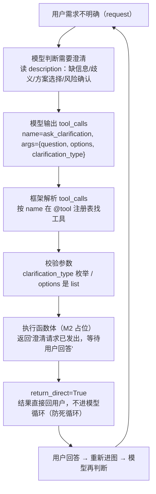

# tools/builtins/clarification_tool.py — clarification_tool.py

> **文件路径**: `backend/packages/harness/agentflow/tools/builtins/clarification_tool.py`
> **目录位置**: tools → builtins → clarification_tool.py
> **职责**: 澄清工具

## 📑 目录

- [📋 结构图](#📋-结构图)
- [📤 关键导出](#📤-关键导出)
- [💡 设计思想](#💡-设计思想)
- [🎯 实用场景](#🎯-实用场景)
- [📊 顺序执行链流程图](#📊-顺序执行链流程图)
- [🧩 代码解析（成块对照 clarification_tool.py）](#🧩-代码解析成块对照-clarification_toolpy)
- [⚠️ 风险点](#⚠️-风险点)
- [❓ Q&A / 知识点](#❓-qa--知识点)

## 📋 结构图

```text
┌────────────────────────────────────────────────────────┐
│ @tool("ask_clarification", return_direct=True)         │
│   ask_clarification(question, clarification_type,      │
│     context, options, questions, title, category)      │
│   用途: 信息缺失/歧义/方案选择/风险确认时向用户提问     │
│   类型: missing_info | ambiguous_requirement |         │
│         approach_choice | risk_confirmation |          │
│         suggestion                                    │
│   返回: "澄清请求已发出，等待用户回答"（占位）          │
└────────────────────────────────────────────────────────┘
```

## 📤 关键导出

**函数**

- `ask_clarification_tool()`

**常量**

- `_ASK_CLARIFICATION_DESCRIPTION`

## 💡 设计思想

1. return_direct=True 必须为 True：否则 langchain create_agent 会
   把工具结果再送进模型循环——澄清问题还没答就又调一次澄清（死循环）。
2. 本工具是"占位"：真正交互由中间件/UI 处理（M2 CLI 直接打印提问），
   工具本体只负责"把提问意图结构化地表达出来"。
3. docstring 即说明书：clarification_type 枚举约束了提问类型，
   model 看到 description 就知道何时用、怎么填。

## 🎯 实用场景

1. 意图不明确时澄清：Agent 判断用户需求模糊 → return_direct=True 直接反问用户
2. 会话脊柱工具：与原版 SESSION_SYSTEM_TOOL_NAMES 对齐，属于 runtime 档系统核心
3. 工具模板学习：39 行最小工具模板（docstring 即说明书），新工具开发的起点

## 📊 顺序执行链流程图（澄清工具被调用时）

```text
用户需求不明确（request）
│
▼
模型判断需要澄清              ← 读 description："当任务因缺少信息/需求歧义/方案选择/风险确认而阻塞时使用"
│
▼
模型输出 tool_calls           ← {'name': 'ask_clarification',
│                                'args': {'question': '您想做什么操作？',
│                                         'options': ['A','B','C'],
│                                         'clarification_type': 'approach_choice'}}
▼
框架解析 tool_calls           ← 按 name 在 @tool 注册表里找到本工具
│
▼
校验参数                     ← 按函数签名 schema：clarification_type 枚举合法？
│                              options 是 list[str]？最多 3 个问题？
▼
执行函数体（M2 占位）          ← 只返回"澄清请求已发出，等待用户回答"
│
▼
return_direct=True            ← 结果直接回给用户，不进模型循环（防死循环）
│
▼
用户回答 → 重新进图 → 模型再判断（回答清晰则直接执行）
```

**Mermaid 版（GitHub / 飞书渲染；VSCode 需装插件）**：



## 🧩 代码解析（成块对照 clarification_tool.py）

> 读法：每块先贴**完整代码**，再看块下方的整块解析。代码与文件一致，仅省略头部规范注释。

### 块 1：imports —— 最小依赖

```python
from typing import Any, Literal

from langchain.tools import tool
```

**整块解析**：只依赖两个东西——`Literal`（参数枚举的类型标注）和 `tool`（LangChain 的 @tool 装饰器，把普通函数注册成"工具"）。`Any` 给 `questions` 列表里字典字段兜底。这是"最小工具模板"：一个函数 + 一个装饰器就是工具。

### 块 2：`_ASK_CLARIFICATION_DESCRIPTION` —— 给模型看的说明书

```python
_ASK_CLARIFICATION_DESCRIPTION = """\
用于向用户发起结构化澄清（不要只在对话里列选项）。
当任务因缺少信息/需求歧义/方案选择/风险确认而阻塞时使用；最多 3 个问题。
Single: question + options[]。Multi: questions[{prompt,options,id?,context?,allow_multiple?}] + title。
类型: missing_info | ambiguous_requirement | approach_choice | risk_confirmation | suggestion。
调用后执行暂停，等待用户在界面回答。
"""
```

**整块解析**：这是**工具的灵魂**——它不是给人读的注释，是**注入 system prompt 给模型读的说明书**。模型靠它决定"何时调这个工具、参数怎么填"。四行分别约定：① 使用场景（缺信息/歧义/方案选择/风险确认，且"不要打字列选项"）；② 数量上限（最多 3 个问题）；③ 参数格式（单问：question+options；多问：questions 数组+title）；④ 类型枚举（5 种澄清类型）。改措辞 = 改模型行为。

### 块 3：`@tool` 装饰器 —— 注册工具

```python
# return_direct=True: 澄清结果直接返回，不再回模型循环（原版注释，照搬）
@tool(
    "ask_clarification",
    description=_ASK_CLARIFICATION_DESCRIPTION,
    parse_docstring=False,
    return_direct=True,
)
def ask_clarification_tool(...) -> str:
```

**整块解析**：装饰器做三件事——① `"ask_clarification"` 注册工具名（模型 tool_calls 里的 `name` 就按这个匹配）；② `description=...` 绑定说明书（进入 system prompt）；③ `return_direct=True` 关键开关：工具结果**直接返回给用户，不再送回模型循环**。为什么必须 True：如果 False，模型拿到"澄清请求已发出"的结果会再想"用户还没回答，是不是还要澄清"→ 又调一次 → **死循环**（原版注释专门标注）。

### 块 4：函数签名 —— 结构化参数的载体

```python
def ask_clarification_tool(
    question: str = "",
    clarification_type: Literal["missing_info", "ambiguous_requirement",
                                "approach_choice", "risk_confirmation", "suggestion"] = "missing_info",
    context: str | None = None,
    options: list[str] | None = None,
    questions: list[dict[str, Any]] | None = None,
    title: str | None = None,
    category: str | None = None,
) -> str:
```

**整块解析**：参数就是"结构化"的落点——langchain 会把函数签名自动转成 JSON schema 给模型，模型只能填 schema 允许的字段和值：

| 参数 | 含义 | 约束 |
|---|---|---|
| `question` | 主问题（问什么） | str，必填语义 |
| `clarification_type` | 澄清类型 | Literal 枚举：missing_info（缺信息）/ ambiguous_requirement（需求歧义）/ approach_choice（方案选择）/ risk_confirmation（风险确认）/ suggestion（建议） |
| `options` | 选项列表 | `list[str]`——结构化选项（不是文字里列） |
| `questions` | 多问模式 | `list[dict]`，每项含 prompt/options 等（最多 3 个） |
| `context` / `title` / `category` | 附加上下文/标题/分类 | 可选 |

这就是"结构化"：**模型不能随便填**——枚举类型、列表类型都由 schema 卡死，未来 UI 拿到这些字段直接渲染成输入框/按钮。

### 块 5：函数体 —— M2 占位实现

```python
    """向用户发起结构化澄清（使用条件见工具 description）。"""
    # M2 占位实现：真正交互由中间件/UI 处理（原版同款做法）
    return "澄清请求已发出，等待用户回答"
```

**整块解析**：M2 只做**占位**——真正让用户看到问题、选择选项的交互要由中间件/Web UI 做（M6/M7）。这里先固定返回一句话，保证：链路通（工具能被调用、结果能回传）、不炸、签名稳定。未来接真实交互只改函数体，签名不动（风险点 3）。

## ⚠️ 风险点

1. return_direct 不可改为 False（否则模型循环死循环）
2. clarification_type 枚举与 description 必须同步（模型按 description 填参）
3. M2 是占位返回；M6 接真实澄清交互时只改函数体，签名保持

## ❓ Q&A / 知识点（问答自动归档区）

### "结构化澄清（不要只在对话里列选项）"是什么意思？（2026-09-30 用户提问）

**一句话**：模型遇到信息缺失/歧义时，**必须用工具发起澄清，不能自己在回复里打字列 A/B/C 选项**。

**两种做法的对比**：

| 做法 | 模型在对话里直接列选项 ❌ | 调用 ask_clarification 工具 ✅ |
|---|---|---|
| 形式 | 自由文本："你是想要 A 还是 B 还是 C？" | 结构化参数：question、options=[A,B,C]、clarification_type="approach_choice" |
| 机器可读 | 否——后续流程无法程序化拿到"问了什么/选项有哪些" | 是——字段固定、类型枚举、options 是 list |
| 未来 UI | 无法渲染（UI 不知道哪些是选项） | 直接渲染成选项按钮/输入框（M6/M7） |
| 模型发挥 | 随意，格式不稳定 | 受 schema 约束，格式稳定 |

**为什么"不要只在对话里列选项"写进 description**：
这是给模型的**行为约束**——模型天生爱偷懒，直接在回复里列选项对模型最省事，但那样信息是自由文本，无法被程序化处理。description 明确告诉模型："提问要用工具"，把提问意图**结构化表达**（哪个字段放问题、选项放哪、属于哪种澄清类型），未来 Web UI 才能把澄清请求渲染成交互组件。

**结构化 = 机器可读**：字段固定（question/options/type 是参数名）+ 类型约束（clarification_type 是 Literal 枚举，options 是 list[str]）+ 可编程消费（UI 直接渲染，不用解析文字）。

**注意 M2 是占位实现**：当前函数体只返回"澄清请求已发出，等待用户回答"（CLI 下没有真正 UI），真正交互 M6/M7 接上，签名保持不变。

### 澄清是"入口解析"还是"出口纠偏"？（2026-09-30 用户提问）

**答案：出口纠偏，不是入口解析。** AgentFlow 没有"先结构化解析用户消息、明确任务需求"这个前置步骤。

```text
用户消息 "帮我记个待办：学完M2"
  │
  ▼ 直接进图（不预先解析）
  模型判断需求是否明确   ← system prompt + 工具 description 就是"理解层"
  │
  ├─ 需求明确 → 直接输出 tool_calls（todo add）→ 执行 → 完成
  │
  └─ 需求不明确/歧义 → 调 ask_clarification 结构化反问
         │  question + options + clarification_type
         ▼
      等待用户回答 → 用户补充 → 重新进图 → 模型再判断
```

| 阶段 | 做什么 |
|---|---|
| 入口 | 不解析——消息原样进图，模型读完直接判断 |
| 判断中 | 明确 → 直接干活；不明确 → 才考虑澄清 |
| 澄清 | 结构化反问（不是打字列选项），等用户答完重进图 |

例：明确需求（"帮我记个待办：学完M2"）→ 直接调 todo；
模糊需求（"帮我处理一下这个"）→ 模型调澄清反问"您想做什么操作？" → 用户回答后继续。

**一句话**："结构化"发生在模型判断出需求不明确**之后**（反问用户），不是消息进来时（解析用户）。

---
_自动生成于 doc-code 规范落地（2026-09-28）。来源：clarification_tool.py 头部注释 + 顶层符号。_
_2026-09-30 追加：Q&A 归档区（"结构化澄清"含义 + 澄清是出口纠偏非入口解析，用户提问自动归纳）；同日二更：成块代码解析（5 块）+ 顺序执行链流程图（ASCII + Mermaid 双版本）+ 目录。_
