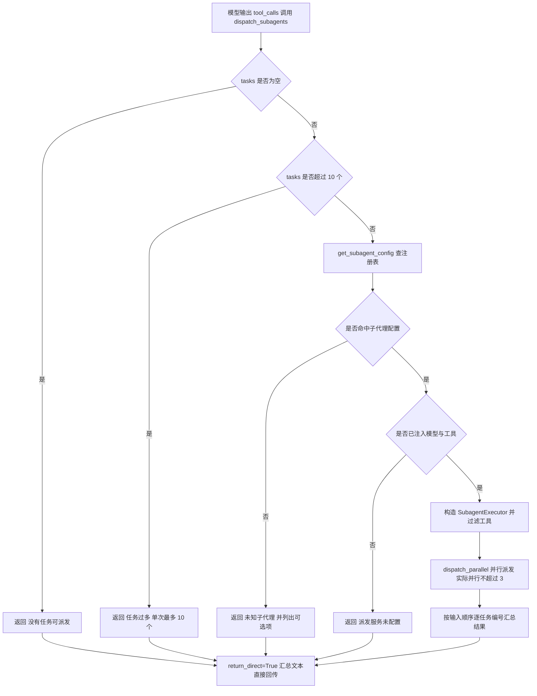

# tools/builtins/dispatch_tool.py — dispatch_tool.py

> **文件路径**: `backend/packages/harness/agentflow/tools/builtins/dispatch_tool.py`
> **目录位置**: tools → builtins → dispatch_tool.py
> **职责**: 子代理并行派发工具（M4 新增）

## 📑 目录

- [📋 结构图](#📋-结构图)
- [📤 关键导出](#📤-关键导出)
- [💡 设计思想](#💡-设计思想)
- [🎯 实用场景](#🎯-实用场景)
- [📊 顺序执行链流程图](#📊-顺序执行链流程图)
- [🧩 代码解析（成块对照 dispatch_tool.py）](#🧩-代码解析成块对照-dispatch_toolpy)
- [❓ Q&A / 知识点](#❓-qa--知识点)
- [⚠️ 风险点](#⚠️-风险点)

## 📋 结构图

```text
┌────────────────────────────────────────────────────────┐
│ _subagent_tools: list[BaseTool] | None = None          │
│ _subagent_model: BaseChatModel | None = None          │
│   （模块级句柄，CLI 装配注入）                          │
│                                                       │
│ configure_dispatch_service(tools, model)             │
│   CLI main() 装配时注入：子代理工具集 + 父模型           │
│                                                       │
│ @tool("dispatch_subagents", return_direct=True)       │
│ dispatch_subagents(tasks, subagent, max_parallel)     │
│   ① 空 tasks / 超 10 个 → 友好提示                    │
│   ② get_subagent_config(subagent) 查注册表            │
│   ③ 未注入模型/工具 → 未配置提示（防模型循环）         │
│   ④ SubagentExecutor(cfg, tools, model)               │
│   ⑤ executor.dispatch_parallel(tasks, ≤3) 并行         │
│   ⑥ 结果逐任务编号汇总回传                            │
└────────────────────────────────────────────────────────┘
```

## 📤 关键导出

**函数（LangChain 工具）**

- `dispatch_subagents()` —— 子代理并行派发工具（注册名 `"dispatch_subagents"`）
- `configure_dispatch_service()` —— 注入子代理工具集 + 父模型

## 💡 设计思想

1. 主 Agent 的"分身术"入口：把一个大任务拆成多个**互不依赖**的小任务列表，
   派给子代理并行执行，再拿回结构化结果（M4 验收点 1/2/3 闭环）。
2. 工具依赖注入（`configure_dispatch_service`）：dispatch 工具**不能自己建模型**
   （模型由 CLI 统一创建），对齐 knowledge_tool 的 configure 注入模式。
3. 结果汇总逐任务编号，主 Agent 可直接读表拼接最终答案。
4. 对标来源：`evoflow/tools/builtins/subagent_tool.py`（原版 task_tool，
   M4 简化为 dispatch_subagents）。

## 🎯 实用场景

1. 并行查/并行处理："同时查 A 和 B 两个文件""并行处理 3 个数据源"——
   tasks 传多个独立子任务描述。
2. 编排核心：tool_catalog 把 `dispatch_subagents` 标为 **core 档**（核心编排工具），
   区别于 terminal_read_file 等 workspace 档工具。
3. 子代理类型选择：默认 `general-purpose`，可选 `bash`（bash 子代理白名单只有
   terminal_run）。

## 📊 顺序执行链流程图（模型调起 dispatch_subagents 时）

```text
模型读 _DISPATCH_DESCRIPTION，输出 tool_calls（request: name=dispatch_subagents）
│
▼
框架按 name 找到 @tool("dispatch_subagents")，校验参数 schema
│
▼
if not tasks                       → return "（没有任务可派发）"
if len(tasks) > 10                 → return "（任务过多：N 个，单次最多 10 个）"
│
▼
cfg = get_subagent_config(subagent)   ← 查子代理注册表（registry.py）
├─ cfg is None（未知子代理）
│    └─ return "（未知子代理: X；可选: 全部子代理名）"
│
├─ cfg 命中（默认 general-purpose）
│    ▼
│  if _subagent_model is None or _subagent_tools is None
│       → return "（派发服务未配置：CLI 未注入子代理工具集/模型）"
│    ▼
│  executor = SubagentExecutor(cfg, _subagent_tools, model=_subagent_model)
│       ← 构造时 _filter_tools 按 cfg.tools 白名单 ∩ cfg.disallowed_tools 黑名单过滤
│    ▼
│  results = executor.dispatch_parallel(tasks, max_parallel=max_parallel)
│       ← ThreadPoolExecutor(max_workers=max(1,min(max_parallel,3))) 天然排队，实际并行≤3
│    ▼
│  逐任务汇总：body = r.result（completed）或 [status] error（其他终态）
│       lines.append("【任务i】task\n→ body")
│    ▼
│  return "\n\n".join(lines)   ← 按输入顺序的编号结果表
│
▼
return_direct=True：汇总文本直接回传主 Agent，由它拼最终答案
```

**Mermaid 版（GitHub / 飞书渲染；VSCode 需装插件）**：



## 🧩 代码解析（成块对照 dispatch_tool.py）

> 读法：每块先贴**完整代码**，再看块下方的整块解析。代码与文件一致，仅省略头部规范注释。

### 块 1：imports + 模块级服务句柄 —— 依赖与全局状态

```python
from __future__ import annotations

from langchain.tools import BaseTool, tool
from langchain_core.language_models import BaseChatModel

from agentflow.subagents import (
    SubagentExecutor,
    get_subagent_config,
    get_subagent_names,
)
from agentflow.subagents.config import SubagentConfig

# 派发服务句柄（CLI 装配注入；未注入时给友好提示）
_subagent_tools: list[BaseTool] | None = None
_subagent_model: BaseChatModel | None = None
```

**整块解析**：依赖四组——`BaseTool / tool`（工具类型与装饰器）、`BaseChatModel`（模型类型）、`SubagentExecutor / get_subagent_config / get_subagent_names`（经 `subagents` 包出口引入，来自 executor.py 与 registry.py）、`SubagentConfig`（类型标注）。两个模块级全局句柄 `_subagent_tools / _subagent_model` 初值 `None`：dispatch 工具自己不建模型、不收集工具，全部等 CLI 注入。

### 块 2：`configure_dispatch_service` —— 注入工具集 + 父模型

```python
def configure_dispatch_service(
    tools: list[BaseTool] | None,
    model: BaseChatModel | None,
) -> None:
    """注入子代理工具集 + 父模型（CLI main() 装配时调用）。"""
    global _subagent_tools, _subagent_model
    _subagent_tools = tools
    _subagent_model = model
```

**整块解析**：与 audit repo 同款的模块级注入，但一次注入两样——**父级全部工具列表**（executor 构造时再按子代理 config 的白/黑名单过滤）和**父模型实例**（子代理 `model="inherit"` 时直接复用）。CLI 装配点：`cli/main.py:188` `configure_dispatch_service(tools, model)`，`tools` 即 `get_available_tools()` 返回的全量工具。

### 块 3：`_DISPATCH_DESCRIPTION` —— 给模型看的说明书

```python
_DISPATCH_DESCRIPTION = """\
子代理并行派发工具：把多个独立任务派给子代理并行执行，汇总结果后返回。
当任务可拆分成多个互不依赖的小任务（如"同时查 A 和 B 两个文件"、"并行处理 3 个数据源"）时使用。
参数:
- tasks: 任务描述列表（每个元素是一个独立子任务，会被单独派发）
- subagent: 子代理类型（默认 general-purpose；可选: general-purpose, bash）
- max_parallel: 并行上限（默认 3，最多 3 个同时跑）
用法示例: tasks=["总结 a.md 内容", "总结 b.md 内容"] → 两个子代理并行处理，各自返回结果。
"""
```

**整块解析**：说明书把三件事讲死——① 何时用（任务可拆成**互不依赖**的小任务）；② 三个参数各是什么（tasks 列表 / subagent 类型 / max_parallel 上限）；③ 用法示例。模型据此决定"这个大任务该不该拆、拆成几个、派给谁"。`"""\` 换行写法保留首行后直接接内容。

### 块 4：`@tool` 装饰器 + 函数签名 —— 三个参数

```python
@tool("dispatch_subagents", description=_DISPATCH_DESCRIPTION, parse_docstring=False, return_direct=True)
def dispatch_subagents(
    tasks: list[str],
    subagent: str = "general-purpose",
    max_parallel: int = 3,
) -> str:
```

**整块解析**：装饰器注册名 `"dispatch_subagents"`、绑定说明书、`parse_docstring=False`、`return_direct=True`。三个参数由 LangChain 转 JSON schema：`tasks: list[str]`（任务描述列表，必填）；`subagent: str = "general-purpose"`（子代理类型）；`max_parallel: int = 3`（并行上限）。

### 块 5：函数体 —— 四重前置校验 + 构造执行器 + 编号汇总

```python
    """把任务列表派给子代理并行执行，返回按顺序汇总的结果。"""
    if not tasks:
        return "（没有任务可派发）"
    if len(tasks) > 10:
        return f"（任务过多：{len(tasks)} 个，单次最多 10 个）"
    cfg: SubagentConfig | None = get_subagent_config(subagent)
    if cfg is None:
        return f"（未知子代理: {subagent}；可选: {', '.join(get_subagent_names())}）"
    if _subagent_model is None or _subagent_tools is None:
        return "（派发服务未配置：CLI 未注入子代理工具集/模型）"
    executor = SubagentExecutor(cfg, _subagent_tools, model=_subagent_model)
    results = executor.dispatch_parallel(tasks, max_parallel=max_parallel)
    # 结果回传：逐任务编号汇总（主 Agent 直接读表拼答案）
    lines: list[str] = []
    for i, (task, r) in enumerate(zip(tasks, results), start=1):
        body = r.result if r.status.value == "completed" else f"[{r.status.value}] {r.error}"
        lines.append(f"【任务{i}】{task}\n→ {body}")
    return "\n\n".join(lines)
```

**整块解析**：四重前置校验**全部返回字符串而非抛异常**——这是"不炸模型循环"的关键设计：
1. `not tasks` → "（没有任务可派发）"；
2. `len(tasks) > 10` → 单次最多 10 个的硬上限提示；
3. `get_subagent_config(subagent)` 未命中 → 列出 `get_subagent_names()` 可选项；
4. **`_subagent_model is None or _subagent_tools is None` → "（派发服务未配置…）"**（见 Q&A）。

通过校验后：`SubagentExecutor(cfg, _subagent_tools, model=_subagent_model)`（构造时 `_filter_tools` 按白/黑名单过滤工具）→ `executor.dispatch_parallel(tasks, max_parallel=max_parallel)` 并行跑 → 按 `zip(tasks, results)` 输入顺序逐任务编号：`completed` 取 `r.result`，否则取 `[status] error`，拼成 `【任务i】task\n→ body`，最后 `"\n\n".join(lines)` 返回编号结果表。

## ❓ Q&A / 知识点

### dispatch_subagents 未配置模型/工具时返回什么？为什么（防模型循环）？（2026-10-01 用户提问）

**一句话**：返回固定字符串 `（派发服务未配置：CLI 未注入子代理工具集/模型）`，而**不是抛异常或返回空**——目的是不让未配置状态炸进模型工具循环。

**源码依据**（dispatch_tool.py:92-93）：

```python
    if _subagent_model is None or _subagent_tools is None:
        return "（派发服务未配置：CLI 未注入子代理工具集/模型）"
```

**为什么这样设计（两道防线）**：

| 防线 | 机制 | 作用 |
|---|---|---|
| 本工具层 | 未注入时**返回友好字符串**（`return_direct=True` 直接回传），不 raise | 模型拿到一句人话提示就停下，不会因为未捕获异常反复重试派发 |
| 执行器层 | 即便走到 `SubagentExecutor`，`_build_agent` 里 `if self.model is None: raise RuntimeError("子代理需要 model…")` | 真正缺模型时 executor 也会被 run 的 `except Exception` 收进 FAILED 结果，不外抛 |

**配套的"防递归"**：子代理拿到的工具集在 executor 构造时被 `_filter_tools` 过滤，`SubagentConfig.disallowed_tools` 默认黑名单含 `"dispatch_subagents"`（`subagents/config.py:66`）——子代理**不会再派发子代理**，避免无限递归。

### max_parallel 传 5 真的会 5 个一起跑吗？

**一句话**：不会。executor 内部 `dispatch_parallel` 再 `min` 一次：`workers = max(1, min(int(max_parallel), MAX_CONCURRENT_SUBAGENTS))`，`MAX_CONCURRENT_SUBAGENTS = 3`，`ThreadPoolExecutor(max_workers=workers)` 天然排队——派 5 个时第 4/5 个等空位，实际并行恒 ≤3（双保险，验收点 2）。

### 为什么单次任务上限是 10？

**一句话**：`len(tasks) > 10` 直接拒收——防止模型一次性拆出几十个子任务把线程池打爆。这是工具层的第一道闸门，与 executor 的并行 ≤3 是两层不同的限制（数量上限 vs 同时并发上限）。

## ⚠️ 风险点

1. 工具集注入前调用 dispatch → 返回"未配置"提示（**不炸模型循环**，勿改成 raise）。
2. `max_parallel` 硬上限 3（executor 内部再 `min` 一次，双保险）——勿放宽 `MAX_CONCURRENT_SUBAGENTS`。
3. 子代理工具集不要传 `dispatch_subagents` 自己（config 黑名单 `disallowed_tools` 默认已排 `"subagent"/"dispatch_subagents"/"ask_clarification"`，防递归派发）。
4. 子代理不挂 checkpointer：一次执行不持久化（M5 长任务再学）。

---
_2026-10-01 M4 补齐：目录 + 顺序执行链流程图 + 成块代码解析（+Q&A）。_
