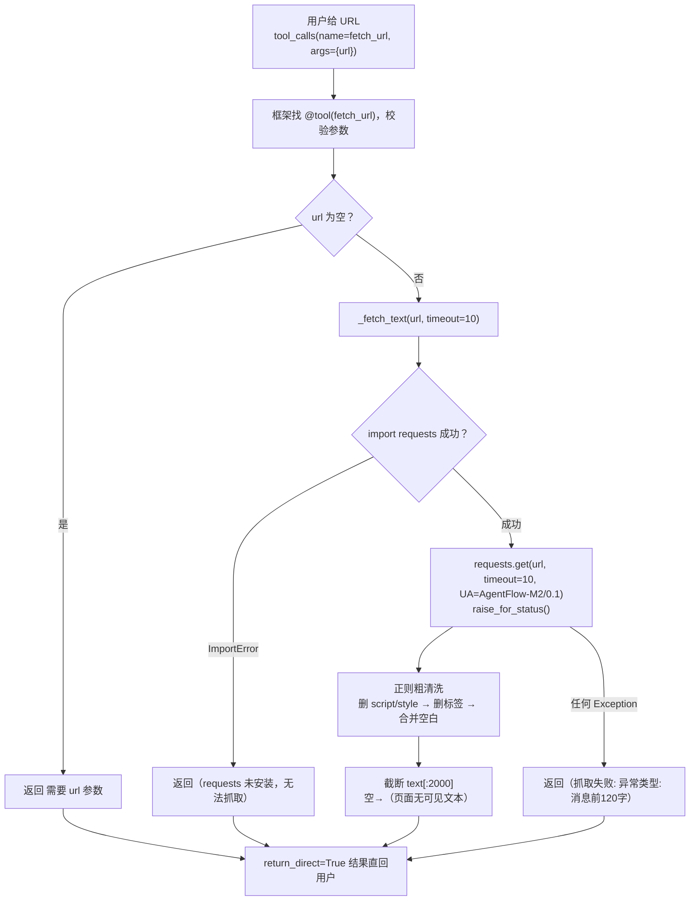

# tools/builtins/fetch_url_tool.py — fetch_url_tool.py

> **文件路径**: `backend/packages/harness/agentflow/tools/builtins/fetch_url_tool.py`
> **目录位置**: tools → builtins → fetch_url_tool.py
> **职责**: 网页抓取工具

## 📑 目录

- [📋 结构图](#📋-结构图)
- [📤 关键导出](#📤-关键导出)
- [💡 设计思想](#💡-设计思想)
- [🎯 实用场景](#🎯-实用场景)
- [📊 顺序执行链流程图](#📊-顺序执行链流程图)
- [🧩 代码解析（成块对照 fetch_url_tool.py）](#🧩-代码解析成块对照-fetch_url_toolpy)
- [❓ Q&A / 知识点](#❓-qa--知识点)
- [⚠️ 风险点](#⚠️-风险点)

## 📋 结构图

```text
┌────────────────────────────────────────────────────────────┐
│ _fetch_text(url, timeout=10) -> str                        │
│   抓取 URL → 粗清洗（去 script/style/标签）→ 截断 2000 字  │
│   失败/无 requests → 返回友好提示                          │
│                                                             │
│ fetch_url_tool(url) -> str                                 │
│   @tool("fetch_url", return_direct=True)                   │
│   空 url → "需要 url 参数"；否则委托 _fetch_text           │
└────────────────────────────────────────────────────────────┘
```

## 📤 关键导出

**函数**

- `fetch_url_tool()`

**常量**

- `_FETCH_URL_DESCRIPTION`

## 💡 设计思想

1. 函数内 import requests：保持模块启动轻量（配合 tools.py 延迟加载）。
2. 粗清洗用正则（去 script/style/标签）而非 html2text：
   M2 最小可行，真实项目应学原版用 html2text/BeautifulSoup（注释已标明）。
3. 截断 2000 字：控制回填对话的 token 成本（大页面只取开头）。
4. 失败返回友好提示而非抛异常：工具调用不能炸掉 Agent 循环。

## 🎯 实用场景

1. 网页内容获取：用户给 URL 问内容 → 工具抓取并粗清洗（2000 字上限）
2. 静态页面场景：README/文档页/新闻页等可直接抓取文本
3. 注意：动态渲染页面（JS）抓不到正文，需 M5+ 浏览器工具

## 📊 顺序执行链流程图（模型调起 fetch_url 后）

```text
用户给 URL 问内容（request：tool_calls name="fetch_url", args={url}）
│
▼
框架按 name 找到 @tool("fetch_url") 注册工具，校验 url 参数
│
▼
执行 fetch_url_tool(url)
│
├─ 空 url → 直接返回 "需要 url 参数"（不进网络请求）
│
▼
委托 _fetch_text(url, timeout=10)
│
├─ try: import requests
│    ImportError → 返回 "（requests 未安装，无法抓取）"
│
▼
requests.get(url, timeout=10, headers={"User-Agent":"AgentFlow-M2/0.1"})
│   resp.raise_for_status()  ← 非 2xx 抛 HTTPError
▼
正则粗清洗（import re 函数内）
│   ① 删 <script>…</script>、<style>…</style>
│   ② 删所有 <标签>，替换为空格
│   ③ \s+ 合并为单空格，strip
▼
截断 text[:2000]           ← 空结果兜底 "（页面无可见文本）"
│
▼（任何一步 Exception）
except Exception → 返回 "（抓取失败: <异常类型>: <消息前120字>）"
│
▼
return_direct=True：结果字符串直接回用户
```

**Mermaid 版（GitHub / 飞书渲染；VSCode 需装插件）**：



## 🧩 代码解析（成块对照 fetch_url_tool.py）

> 读法：每块先贴**完整代码**，再看块下方的整块解析。代码与文件一致，仅省略头部规范注释。

### 块 1：imports —— 模块顶部只依赖 tool 装饰器

```python
from __future__ import annotations

from langchain.tools import tool
```

**结构简析**：模块顶部**不 import requests、不 import re**——这是刻意的轻量设计：requests 是重依赖，放在 `_fetch_text` 函数体内 import（块 2），配合 tools.py 的延迟加载，import 本工具模块时不触发 requests 加载。顶部只保留 LangChain 的 `tool` 装饰器。

本块无函数签名，不展开参数表。

**补充**：这是"双重延迟"的一环——先延迟加载工具模块，再延迟加载模块里的重依赖 requests。

### 块 2：`_fetch_text` —— 抓取 + 粗清洗 + 截断核心

```python
def _fetch_text(url: str, timeout: int = 10) -> str:
    """抓取 URL 并返回文本（M2 简化：requests 直抓 + 粗清洗）。

    注意：不做 JS 渲染（浏览器能力 M 后期再学原版 browser_tool）。
    """
    try:
        import requests
    except ImportError:
        return "（requests 未安装，无法抓取）"
    try:
        resp = requests.get(url, timeout=timeout, headers={"User-Agent": "AgentFlow-M2/0.1"})
        resp.raise_for_status()
        # 粗清洗：去掉 HTML 标签（真实项目应学原版用 html2text / BeautifulSoup）
        import re

        text = re.sub(r"<script[\s\S]*?</script>|<style[\s\S]*?</style>", "", resp.text)
        text = re.sub(r"<[^>]+>", " ", text)
        text = re.sub(r"\s+", " ", text).strip()
        return text[:2000] or "（页面无可见文本）"
    except Exception as exc:  # noqa: BLE001
        return f"（抓取失败: {type(exc).__name__}: {str(exc)[:120]}）"
```

**结构简析**：分两道 try——① **依赖兜底**：`import requests` 失败（未装）直接返回友好提示，不让整个 import 崩；② **网络+清洗主流程**：`requests.get` 带 `timeout` 防挂死，自定义 `User-Agent: AgentFlow-M2/0.1`；`raise_for_status()` 把 4xx/5xx 转异常。清洗三步走：先删 script/style 块（`[\s\S]*?` 跨行非贪婪匹配），再删所有 `<...>` 标签，最后把空白压成单空格。`text[:2000]` 硬截断控 token 成本；空串兜底"（页面无可见文本）"。

**`_fetch_text()` 参数逐条解释**：

| 参数 | 类型 | 默认值 | 含义 |
|---|---|---|---|
| `url` | `str` | 必填 | 目标网页 URL；透传给 `requests.get(url, ...)`，非法/不可达地址会在异常分支兜底 |
| `timeout` | `int` | `10` | 请求超时秒数；`requests.get(url, timeout=timeout, ...)` 超时挂死时抛异常，走最外层 except 返回失败提示 |

**补充**：最外层 `except Exception` 吞掉一切异常，返回 `f"（抓取失败: {type(exc).__name__}: {str(exc)[:120]}）"`——只报异常类型名 + 消息前 120 字，工具调用绝不炸掉 Agent 循环。

### 块 3：`_FETCH_URL_DESCRIPTION` —— 给模型看的说明书

```python
_FETCH_URL_DESCRIPTION = """\
网页抓取工具：给定 URL，抓取并返回页面正文文本（最多 2000 字）。
当用户要求"打开这个网页 / 看看这个链接讲了什么 / 抓取 xxx 页面"时使用。
注意: 仅支持静态页面；JS 渲染页面可能抓不到内容。
"""
```

**结构简析**：说明书三行——能力（URL→正文文本，最多 2000 字）、触发场景（打开网页/看链接/抓页面）、局限（仅静态页，JS 渲染可能抓不到）。

本块是模块级常量字符串，无函数签名，不展开参数表。

**补充**：最后一句局限写进 description 很关键——让模型遇到 SPA 页面时有心理预期，不至于抓空后硬编内容。

### 块 4：`@tool` 装饰器 + `fetch_url_tool` 入口

```python
@tool("fetch_url", description=_FETCH_URL_DESCRIPTION, parse_docstring=False, return_direct=True)
def fetch_url_tool(url: str) -> str:
    """抓取网页正文（使用条件见工具 description）。"""
    if not url:
        return "需要 url 参数"
    return _fetch_text(url)
```

**结构简析**：薄入口层——注册名 `"fetch_url"`，绑定说明书，`return_direct=True`。函数只做一件事：`if not url` 防空（空串/None 直接提示，不进网络请求），否则委托 `_fetch_text`。

**`fetch_url_tool()` 参数逐条解释**：

| 参数 | 类型 | 默认值 | 含义 |
|---|---|---|---|
| `url` | `str` | 必填 | 目标网页 URL；`if not url` 空串/None 直接返回"需要 url 参数"，不进网络请求；否则委托 `_fetch_text(url)` |

**补充**：抓取、清洗、异常处理全在 `_fetch_text` 内部，入口保持最简——未来换 html2text/浏览器渲染只改 `_fetch_text`，入口签名不动。

## ❓ Q&A / 知识点

### 1. 为什么 requests 要写在函数体内 import，而不是文件顶部？

**一句话**：让"加载本工具模块"和"真正发网络请求"解耦——模块启动轻，重依赖按需才加载。

| 写法 | import fetch_url_tool 时 | 何时加载 requests |
|---|---|---|
| 顶部 `import requests` | 立刻加载 requests（重依赖） | 模块一进来就加载 |
| 函数内 `import requests`（本实现） | 零成本，只注册工具 | 第一次真正抓网页时 |

配合 tools.py 的 `get_builtin_tools` 函数内 import，整个链路是**双重延迟**：先延迟加载工具模块，再延迟加载模块里的重依赖 requests。即使 requests 没装，工具也能注册、能被模型看到（只是调用时返回"requests 未安装"提示），不会因为缺依赖拖垮 CLI 启动。

### 2. 为什么抓取失败要"返回友好字符串"而不是抛异常？

**一句话**：工具跑在 Agent 模型循环里，抛异常会打断整个对话流；返回一段人话提示，模型能据此告知用户或换方案。

本实现两层防护：① 最外层 `except Exception` 兜底所有网络/解析异常，转成 `（抓取失败: 异常类型: 消息前120字）`；② `import requests` 失败单独兜成"未安装"。任何情况下 `fetch_url_tool` 都 return 一个字符串、永不 raise——这是"工具不能炸掉 Agent 循环"的硬性约定（设计思想 4）。

## ⚠️ 风险点

1. 仅静态页面可用；JS 渲染页抓不到正文（M 后期学原版 browser_tool）
2. 截断上限 2000 字是硬限制，影响对话回填长度
3. 正则清洗只是粗处理，复杂页面可能残留噪声（升级时换 html2text）

---
_自动生成于 doc-code 规范落地（2026-09-28）。来源：fetch_url_tool.py 头部注释 + 顶层符号。_
_2026-09-30 补齐：目录 + 顺序执行链流程图 + 成块代码解析（+Q&A）。_
_2026-10-03 重构：代码解析段按「结构简析 + 参数逐条表格 + 落库要点」规范化（代码块零改动）。_
