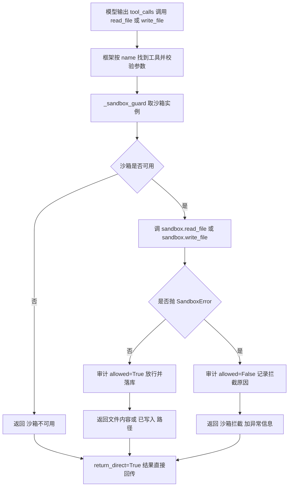

# tools/builtins/file_tools.py — file_tools.py

> **文件路径**: `backend/packages/harness/agentflow/tools/builtins/file_tools.py`
> **目录位置**: tools → builtins → file_tools.py
> **职责**: 沙箱文件读写工具（M4 新增，含 read_file / write_file 两个工具）

## 📑 目录

- [📋 结构图](#📋-结构图)
- [📤 关键导出](#📤-关键导出)
- [💡 设计思想](#💡-设计思想)
- [🎯 实用场景](#🎯-实用场景)
- [📊 顺序执行链流程图](#📊-顺序执行链流程图)
- [🧩 代码解析（成块对照 file_tools.py）](#🧩-代码解析成块对照-file_toolspy)
- [❓ Q&A / 知识点](#❓-qa--知识点)
- [⚠️ 风险点](#⚠️-风险点)

## 📋 结构图

```text
┌────────────────────────────────────────────────────────┐
│ _audit_repo: SandboxAuditRepository | None = None      │
│ configure_sandbox_audit_repository(repo)              │
│   （与 terminal_tool 共用同一注入点，CLI 各调一次）      │
│ _audit(action, target, allowed, reason="")           │
│   落审计；subagent_name = action（按操作名区分）        │
│ _sandbox_guard() -> Sandbox | None                    │
│   provider.get(provider.acquire()) 取当前沙箱          │
│                                                       │
│ @tool("read_file", return_direct=True)               │
│ read_file(path) -> str        读沙箱内文件            │
│                                                       │
│ @tool("write_file", return_direct=True)              │
│ write_file(path, content, append=False) -> str       │
│   append=True 追加；否则整体覆盖                      │
└────────────────────────────────────────────────────────┘
```

## 📤 关键导出

**函数（LangChain 工具）**

- `read_file()` —— 沙箱读文件工具（注册名 `"read_file"`）
- `write_file()` —— 沙箱写文件工具（注册名 `"write_file"`）
- `configure_sandbox_audit_repository()` —— 注入审计仓库

**内部私有函数**

- `_sandbox_guard()` —— 取沙箱（工具共用）
- `_audit()` —— 写审计记录

## 💡 设计思想

1. 文件读写统一走沙箱接口：两个工具都经 `_sandbox_guard` 取沙箱，
   再调 `sandbox.read_file / sandbox.write_file`；路径越界由
   `LocalSandbox._resolve` 统一拦截（验收点 4 核心）——工具层**绝不直接
   `open()` 宿主路径**。
2. 审计：每次文件操作（放行/拦截）都落库，可追溯子代理动过什么文件。
3. `append` 参数区分写/追加，语义直白（对齐 todo_tool 风格）。
4. 对标来源：`evoflow/tools/host_direct/file_tools.py`（原版 read/write/update/delete，
   M4 简化为 read + write）。

## 🎯 实用场景

1. 读沙箱产物：`read_file` 查看沙箱内文件（如子代理刚生成的结果文件）。
2. 写沙箱文件：`write_file` 把生成报告/配置保存到沙箱工作目录；
   `append=True` 追加日志、`append=False` 整体覆盖。
3. 与 terminal_run 互补：bash 子代理系统提示词明确"不要用终端做文件编辑，
   有 read_file / write_file 工具时优先用它们"。

## 📊 顺序执行链流程图（以 read_file 为例；write_file 同构）

```text
模型读 _READ_DESCRIPTION，输出 tool_calls（request: name=read_file, args={path}）
│
▼
框架按 name 找到 @tool("read_file")，校验参数 schema（path: str）
│
▼
sandbox = _sandbox_guard()   ← provider = get_sandbox_provider()；return provider.get(provider.acquire())
│
├─ sandbox is None
│    └─ return "（沙箱不可用）"
│
└─ sandbox 可用
     │
     ▼
   content = sandbox.read_file(path)   ← LocalSandbox.read_file 经 _resolve 校验路径；越界抛 SandboxError
     │
     ├─ 正常返回
     │    _audit("read_file", path, allowed=True)   ← 放行落审计（subagent_name="read_file"）
     │    return content
     │
     └─ 抛 SandboxError
          _audit("read_file", path, allowed=False, reason=str(exc))  ← 拦截落审计
          return f"（沙箱拦截）{exc}"
│
▼
return_direct=True：结果直接回传（write_file 成功返回 已写入: path（追加））
```

**Mermaid 版（GitHub / 飞书渲染；VSCode 需装插件）**：



## 🧩 代码解析（成块对照 file_tools.py）

> 读法：每块先贴**完整代码**，再看块下方的整块解析。代码与文件一致，仅省略头部规范注释。

### 块 1：imports + 模块级审计句柄 —— 依赖与全局状态

```python
from __future__ import annotations

from langchain.tools import tool

from agentflow.persistence.sandbox_audit_repositories import SandboxAuditRepository
from agentflow.sandbox import Sandbox, SandboxError, get_sandbox_provider

_audit_repo: SandboxAuditRepository | None = None
```

**结构简析**：与 terminal_tool 几乎同构，但多引一个 `Sandbox`（`_sandbox_guard` 的返回类型标注）。`_audit_repo` 是模块级全局句柄，初值 `None`。

本块无函数签名，不展开参数表。

**落库要点**：审计未注入时 `_audit_repo` 保持 None，两个文件工具照常运行，只是不写审计（风险点 2）。

### 块 2：`configure_sandbox_audit_repository` —— 与 terminal_tool 共用注入点

```python
def configure_sandbox_audit_repository(repo: SandboxAuditRepository | None) -> None:
    """注入沙箱审计仓库（CLI 装配；与 terminal_tool 共用同一注入点）。"""
    global _audit_repo
    _audit_repo = repo
```

**结构简析**：注意这是**与 terminal_tool 各自独立的一份同名函数**——两个模块各有自己的 `_audit_repo` 全局。

**`configure_sandbox_audit_repository()` 参数逐条解释**：

| 参数 | 类型 | 默认值 | 含义 |
|---|---|---|---|
| `repo` | `SandboxAuditRepository \| None` | 必填 | 沙箱审计仓库实例（或 None 清空）；`global _audit_repo` 挂到模块级句柄上 |

**落库要点**：CLI 用别名分别注入（`cli/main.py:93-95` 把本函数 import 为 `configure_file_audit`，`cli/main.py:179` 调用；terminal_tool 那份为 `configure_terminal_audit`），两者传入的是同一个 `SandboxAuditRepository(db_path=db_path)` 实例。

### 块 3：`_audit` —— 落审计（subagent_name 按操作名区分）

```python
def _audit(action: str, target: str, allowed: bool, reason: str = "") -> None:
    if _audit_repo is None:
        return
    try:
        _audit_repo.record(
            action=action,
            target=target,
            allowed=allowed,
            reason=reason,
            subagent_name=action,
        )
    except Exception:  # noqa: BLE001,S110 —— 审计失败不影响工具主流程
        pass
```

**结构简析**：与 terminal_tool 的 `_audit` 唯一实质差异是 **`subagent_name=action`**——这里按操作名（"read_file"/"write_file"）区分审计来源，而不是硬编码一个工具名。同样三层防御：未注入 return、`except Exception: pass` 吞审计异常。

**`_audit()` 参数逐条解释**：

| 参数 | 类型 | 默认值 | 含义 |
|---|---|---|---|
| `action` | `str` | 必填 | 操作名（"read_file"/"write_file"）；既传给 repo 的 `action=`，又作为 `subagent_name=action` 落库区分审计来源 |
| `target` | `str` | 必填 | 操作目标（文件 path），落库到 `target` 字段 |
| `allowed` | `bool` | 必填 | 是否放行；放行=True、拦截=False，落库由 repo 归一化为 0/1 |
| `reason` | `str` | `""` | 拦截原因；拦截分支传 `str(exc)`，放行时留空串 |

**落库要点**：`_audit_repo` 为 None 时直接 return 不写库；`record(...)` 整体包在 try/except 里，审计写失败（含 DB 异常）被吞掉，绝不影响工具主流程（`# noqa: BLE001,S110`）。

### 块 4：`_sandbox_guard` —— 两个文件工具共用的取沙箱

```python
def _sandbox_guard() -> Sandbox | None:
    """取当前沙箱（无则 None）。"""
    provider = get_sandbox_provider()
    return provider.get(provider.acquire())
```

**结构简析**：把 terminal_run 里"取 provider → acquire → get 沙箱"三步抽成一个共用函数，`read_file`/`write_file` 都调它，避免重复。

`_sandbox_guard()` 无参数——`provider = get_sandbox_provider()` 后 `return provider.get(provider.acquire())` 取当前沙箱。

**补充**：返回 `Sandbox | None`，无沙箱时为 None——调用方必须判空（`sandbox is None → "（沙箱不可用）"`）。

### 块 5：`_READ_DESCRIPTION` + `read_file` —— 沙箱读

```python
_READ_DESCRIPTION = """\
沙箱读文件工具：读取沙箱工作目录内的文件内容。
当需要查看沙箱内文件（如子代理生成的结果文件）时使用。
"""


@tool("read_file", description=_READ_DESCRIPTION, parse_docstring=False, return_direct=True)
def read_file(path: str) -> str:
    """读取沙箱内文件（沙箱外路径被拦截，全程审计）。"""
    sandbox = _sandbox_guard()
    if sandbox is None:
        return "（沙箱不可用）"
    try:
        content = sandbox.read_file(path)
        _audit("read_file", path, allowed=True)
        return content
    except SandboxError as exc:
        _audit("read_file", path, allowed=False, reason=str(exc))
        return f"（沙箱拦截）{exc}"
```

**结构简析**：装饰器注册名 `"read_file"`。执行链与 terminal_run 同构——取沙箱 → 判空 → `sandbox.read_file(path)` 交沙箱读 → 放行/拦截双分支审计。

**`read_file()` 参数逐条解释**：

| 参数 | 类型 | 默认值 | 含义 |
|---|---|---|---|
| `path` | `str` | 必填 | 沙箱内文件相对路径；直接透传给 `sandbox.read_file(path)`，工具层不自己 open 宿主路径 |

**落库要点**：放行时 `_audit("read_file", path, allowed=True)`；抛 `SandboxError`（路径越界等）时 `_audit("read_file", path, allowed=False, reason=str(exc))` 并返回"（沙箱拦截）{exc}"。路径合法性与越界全部由 `LocalSandbox.read_file` 内部 `_resolve` 把关。

### 块 6：`_WRITE_DESCRIPTION` + `write_file` —— 沙箱写/追加

```python
_WRITE_DESCRIPTION = """\
沙箱写文件工具：写入/追加沙箱工作目录内的文件。
当需要把内容保存到沙箱内文件（如生成报告、写配置）时使用。
append=True 追加到文件末尾；否则整体覆盖。
"""


@tool("write_file", description=_WRITE_DESCRIPTION, parse_docstring=False, return_direct=True)
def write_file(path: str, content: str, append: bool = False) -> str:
    """写入/追加沙箱内文件（越界被拦截，全程审计）。"""
    sandbox = _sandbox_guard()
    if sandbox is None:
        return "（沙箱不可用）"
    try:
        sandbox.write_file(path, content, append=append)
        _audit("write_file", path, allowed=True)
        return f"已写入: {path}" + ("（追加）" if append else "")
    except SandboxError as exc:
        _audit("write_file", path, allowed=False, reason=str(exc))
        return f"（沙箱拦截）{exc}"
```

**结构简析**：比 read_file 多一个 `append` 参数——`True` 追加到文件末尾，`False` 整体覆盖，透传给 `sandbox.write_file(path, content, append=append)`。

**`write_file()` 参数逐条解释**：

| 参数 | 类型 | 默认值 | 含义 |
|---|---|---|---|
| `path` | `str` | 必填 | 沙箱内文件相对路径；透传给 `sandbox.write_file`，越界由沙箱 `_resolve` 拦截 |
| `content` | `str` | 必填 | 要写入的文件内容；整体覆盖或追加到末尾，语义由 `append` 决定 |
| `append` | `bool` | `False` | `True`=追加到文件末尾；`False`=整体覆盖；成功文案据此挂"（追加）"标记 |

**落库要点**：放行 `_audit("write_file", path, allowed=True)`，拦截 `allowed=False, reason=str(exc)`；成功返回 `f"已写入: {path}" + ("（追加）" if append else "")`——纯覆盖只回"已写入: path"，追加时多挂"（追加）"。

## ❓ Q&A / 知识点

### 1. read_file / write_file 走沙箱会不会影响 M1-M3 的工具？（2026-10-01 用户提问）

**一句话**：不会。与 `terminal_run` 一样，这两个是 M4 全新独立注册的工具，M1-M3 工具既不 import 沙箱、也不被改造。

详见 `terminal_tool.md` 的同名 Q&A（对比表）：本文件两个工具只是 `tools/tools.py:83-84` 在返回元组里**追加**的新条目，tool_catalog 标为 workspace 档；取沙箱/写审计全封装在本模块内部，对已有工具透明。

### 2. 为什么 `_audit` 里 `subagent_name=action`，而 terminal_tool 是硬编码？

**一句话**：一个文件两个工具，用 `action`（"read_file"/"write_file"）当审计来源才能在 sandbox_audit 表里区分是谁动的文件；terminal_tool 整个文件只有 terminal_run 一个工具，硬编码即可。

| 文件 | subagent_name 取值 | 效果 |
|---|---|---|
| terminal_tool.py:66 | 硬编码 `"terminal_run"` | 该文件所有审计来源都是 terminal_run |
| file_tools.py:66 | `subagent_name=action` | read_file 记 "read_file"，write_file 记 "write_file" |

### 3. write_file 为什么分 append/覆盖两种语义？

**一句话**：写日志/补内容要追加（`append=True`），生成报告/写配置要整体覆盖（`append=False`）——一个参数两种常用语义，避免再拆一个 append_file 工具。两种都走同一沙箱写接口与同一份审计。

## ⚠️ 风险点

1. 路径必须经沙箱（不能直接 `open()` 宿主路径）——越界拦截全部依赖 `LocalSandbox._resolve`。
2. 审计仓库未注入时静默跳过（不阻塞工具主流程）——上线前务必确认 CLI 已 `configure_file_audit`。
3. `_audit_repo` 是模块级全局，与 terminal_tool 各自一份——测试时注意分别注入/清理。

---
_2026-10-01 M4 补齐：目录 + 顺序执行链流程图 + 成块代码解析（+Q&A）。_
_2026-10-03 重构：代码解析段按「结构简析 + 参数逐条表格 + 落库要点」规范化（代码块零改动）。_
