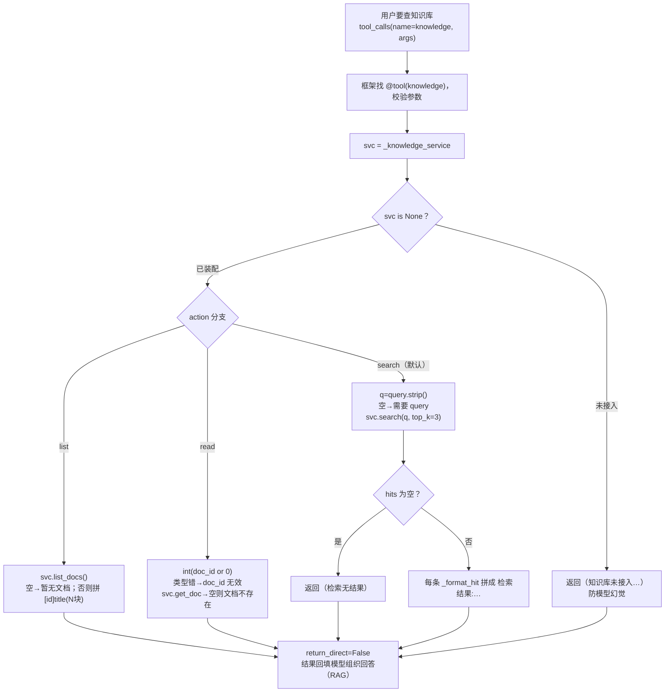

# tools/builtins/knowledge_tool.py — knowledge_tool.py

> **文件路径**: `backend/packages/harness/agentflow/tools/builtins/knowledge_tool.py`
> **目录位置**: tools → builtins → knowledge_tool.py
> **职责**: 知识库检索工具

## 📑 目录

- [📋 结构图](#📋-结构图)
- [📤 关键导出](#📤-关键导出)
- [💡 设计思想](#💡-设计思想)
- [🎯 实用场景](#🎯-实用场景)
- [📊 顺序执行链流程图](#📊-顺序执行链流程图)
- [🧩 代码解析（成块对照 knowledge_tool.py）](#🧩-代码解析成块对照-knowledge_toolpy)
- [❓ Q&A / 知识点](#❓-qa--知识点)
- [⚠️ 风险点](#⚠️-风险点)

## 📋 结构图

```text
┌────────────────────────────────────────────────────────────┐
│ _format_hit(h, index) -> str                               │
│   单条命中格式化：标题/分数/摘要（照原版 _format_hit）     │
│                                                             │
│ knowledge_tool(action, query, doc_id, kb_name) -> str      │
│   @tool("knowledge", return_direct=True)                   │
│   search → 关键词/自然语言检索                             │
│   read   → 按 doc_id 读文档                                │
│   list   → 列出知识库文档（kb_name 可选）                  │
│   （M2 占位：返回"未接入"明确提示）                        │
└────────────────────────────────────────────────────────────┘
```

## 📤 关键导出

**函数**

- `knowledge_tool()`

**常量**

- `_KNOWLEDGE_DESCRIPTION`

## 💡 设计思想

1. 接口契约先行：search/read/list 三动作 + 参数名与返回格式固定，
   即使 M2 未接 RAG，调用方（模型/CLI/测试）的用法不会变；
   M5 只换函数体内部实现（接向量库），签名零改动。
2. _format_hit 统一命中格式：后续所有来源（向量库/全文）都走它，
   避免各工具各写各的展示格式（照原版）。
3. 占位也返回"明确提示"而非空串：防止模型误以为检索到了结果
   而编造内容（幻觉防控）。

## 🎯 实用场景

1. 知识库检索（M5 接入前占位）：search/read/list 接口先行，_format_hit 统一命中格式
2. 接口契约先行：工具名称/参数/返回格式固定，后续换向量库实现不动调用方

## 📊 顺序执行链流程图（模型调起 knowledge 后）

```text
用户要查知识库（request：tool_calls name="knowledge", args={action,query,doc_id,kb_name}）
│
▼
框架按 name 找到 @tool("knowledge") 注册工具，校验参数
│
▼
执行 knowledge_tool(action="search" 默认, query, doc_id, kb_name)
│
├─ svc = _knowledge_service（模块级全局，装配时注入）
│
├─ svc is None → 直接返回 "（知识库未接入。请先在 CLI 装配…）"
│                （M2/M3 未接 RAG 时走这里，防幻觉）
│
▼（已装配 KnowledgeService）
├─ action == "list"
│    svc.list_docs() → 空？→ "（知识库暂无文档…）"
│                    → 否则拼 "[id] title（N 块）" 列表
│
├─ action == "read"
│    int(doc_id or 0)，TypeError/ValueError → "doc_id 无效"
│    doc = svc.get_doc(...) → 空？→ "（文档不存在: <id>）"
│                          → 否则 "[title]\n<source>"
│
└─ action == "search"（默认）
     q = (query or "").strip() → 空？→ "search 需要 query 参数"
     hits = svc.search(q, top_k=3) → 空？→ "（检索无结果）"
     → 否则每条走 _format_hit 拼成 "检索结果:..."
│
▼
return_direct=False：结果回填模型，由模型"引用结果组织回答"（标准 RAG）
```

**Mermaid 版（GitHub / 飞书渲染；VSCode 需装插件）**：



## 🧩 代码解析（成块对照 knowledge_tool.py）

> 读法：每块先贴**完整代码**，再看块下方的整块解析。代码与文件一致，仅省略头部规范注释。

### 块 1：imports + 模块级服务句柄 + `configure_knowledge_service`

```python
from __future__ import annotations

from typing import Any

from langchain.tools import tool

# 模块级服务句柄：由 CLI 装配时 configure_knowledge_service 注入
# （@tool 是模块级对象无法接收实例，用显式配置函数替代依赖注入）
_knowledge_service: Any = None


def configure_knowledge_service(service: Any) -> None:
    """装配时把 KnowledgeService 实例挂到工具上（M3）。

    未配置时工具返回"未接入"提示（保持旧行为，测试/无库场景不崩）。
    """
    global _knowledge_service
    _knowledge_service = service
```

**结构简析**：`@tool` 装饰的函数是**模块级对象**，框架调用时不带实例参数——无法像普通类那样构造时传入 KnowledgeService。解法是模块级全局句柄 `_knowledge_service`（初始 None）+ 显式 `configure_knowledge_service(service)`，由 CLI 启动装配时调用注入。`global` 声明保证函数内能改写模块变量。

**`configure_knowledge_service()` 参数逐条解释**：

| 参数 | 类型 | 默认值 | 含义 |
|---|---|---|---|
| `service` | `Any` | 必填 | KnowledgeService 实例；`global _knowledge_service` 把它挂到模块级句柄上，供工具运行时读取 |

**补充**：未配置时句柄保持 None，工具走"未接入"分支返回明确提示，测试/无库场景不崩。

### 块 2：`_format_hit` —— 统一命中格式化

```python
def _format_hit(h: dict[str, Any], index: int) -> str:
    """格式化一条知识库命中（照原版 _format_hit：标题/分数/摘要）。"""
    title = h.get("title") or h.get("fileName") or h.get("docId") or f"文档{index + 1}"
    score = h.get("rrfScore") or h.get("score") or 0
    score_str = f"{float(score):.3f}" if score else "—"
    snippet = (str(h.get("content") or "")[:400]).strip()
    parts = [f"[{index + 1}] {title}", f"   分数: {score_str}"]
    if snippet:
        parts.append(f"   {snippet}")
    return "\n".join(parts)
```

**结构简析**：所有检索来源（向量库/全文）的命中都走这一个格式化函数，避免各写各的。三处字段兜底：① 标题按 `title → fileName → docId → 文档{N}` 顺序取；② 分数兼容 `rrfScore`（RRF 融合分）和普通 `score`，有值才格式化为三位小数，否则显示"—"；③ 摘要截前 400 字。

**`_format_hit()` 参数逐条解释**：

| 参数 | 类型 | 默认值 | 含义 |
|---|---|---|---|
| `h` | `dict[str, Any]` | 必填 | 单条命中 dict；依次取 `title`/`fileName`/`docId`/`rrfScore`/`score`/`content`，缺失字段逐级兜底 |
| `index` | `int` | 必填 | 命中序号（从 0 起）；输出里显示为 `[index+1]`，标题全缺时回退成 `文档{index+1}` |

**补充**：输出三行——`[序号] 标题` / `   分数: x.xxx` / （有摘要时）`   摘要`（content 截前 400 字后 strip）。

### 块 3：`_KNOWLEDGE_DESCRIPTION` —— 给模型看的说明书

```python
_KNOWLEDGE_DESCRIPTION = """\
知识库检索工具（统一接口: search / read / list）。
当用户要求"查一下知识库 / 搜我们文档里有没有 xxx / 读某文档"时使用。
action=search: 传 query（关键词/自然语言问题）。
action=read: 传 doc_id（文档 ID）。
action=list: 列出知识库文档（传 kb_name 可选）。
注意: 知识库未建/未配置时返回明确提示。
"""
```

**结构简析**：说明书约定三动作各自要带的参数——search 传 query、read 传 doc_id、list 列文档（kb_name 可选）。最后一句"未建/未配置时返回明确提示"告诉模型：调用后可能拿到的是提示而非结果，要会处理。

本块是模块级常量字符串，无函数签名，不展开参数表。

**补充**：这个字符串作为 `@tool` 的 `description=` 传给框架，是模型做工具选择和参数填充的依据；改文案会直接影响模型何时调、怎么调本工具。

### 块 4：`@tool` 装饰器 + 函数签名 + 未接入分支

```python
@tool("knowledge", description=_KNOWLEDGE_DESCRIPTION, parse_docstring=False, return_direct=False)
def knowledge_tool(
    action: str = "search",
    query: str | None = None,
    doc_id: str | None = None,
    kb_name: str | None = None,
) -> str:
    """知识库检索（使用条件见工具 description）。

    M3 改为 return_direct=False：检索结果回填模型，由模型"引用结果组织回答"
    （标准 RAG 形态，验收点 3）。M2 占位期是 True（结果直接返回）。
    """
    svc = _knowledge_service
    if svc is None:
        return "（知识库未接入。请先在 CLI 装配 KnowledgeService 并建库后使用）"
```

**结构简析**：注意 `return_direct=False`（与 todo/fetch_url 不同）——RAG 场景下检索结果**必须回填模型**，由模型阅读后"引用结果组织回答"，而不是把原文直塞给用户。函数体第一步先取 `svc = _knowledge_service`，None 时直接返回未接入提示（防模型误以为检索成功而编造内容，设计思想 3）。

**`knowledge_tool()` 参数逐条解释**：

| 参数 | 类型 | 默认值 | 含义 |
|---|---|---|---|
| `action` | `str` | `"search"` | 动作：`search`=关键词/自然语言检索（默认）；`read`=按 doc_id 读文档；`list`=列出知识库文档 |
| `query` | `str \| None` | `None` | 仅 search 用；`(query or "").strip()` 去空白后为空则返回"search 需要 query 参数" |
| `doc_id` | `str \| None` | `None` | 仅 read 用；`int(doc_id or 0)` 转整型，转不动（TypeError/ValueError）返回"doc_id 无效" |
| `kb_name` | `str \| None` | `None` | 预留：指定知识库名；当前实现 list 分支调 `list_docs()` 无参，未实际使用 |

**补充**：装饰器 `@tool("knowledge", description=_KNOWLEDGE_DESCRIPTION, parse_docstring=False, return_direct=False)`——注册名 `"knowledge"`，`parse_docstring=False` 表示不从 docstring 自动推参数说明（用 description 手动写），`return_direct=False` 表示结果回填模型走标准 RAG。

### 块 5：list / read / search 三分支实现

```python
    if action == "list":
        docs = svc.list_docs()
        if not docs:
            return "（知识库暂无文档。可用脚本/CLI 导入文本建库）"
        return "知识库文档:\n" + "\n".join(
            f"- [{d['id']}] {d['title']}（{d['chunk_count']} 块）" for d in docs
        )
    if action == "read":
        try:
            doc = svc.get_doc(int(doc_id or 0))
        except (TypeError, ValueError):
            return "doc_id 无效"
        if not doc:
            return f"（文档不存在: {doc_id}）"
        return f"[{doc['title']}]\n{doc.get('source') or ''}"
    # search（默认动作）
    q = (query or "").strip()
    if not q:
        return "search 需要 query 参数"
    hits = svc.search(q, top_k=3)
    if not hits:
        return "（检索无结果）"
    return "检索结果:\n" + "\n\n".join(
        _format_hit({"title": h["title"], "score": h["score"], "content": h["content"]}, i)
        for i, h in enumerate(hits)
    )
```

**结构简析**：三分支都"先校验后调用、空结果给明确提示"——① `list`：空库返回建库指引，否则每条拼 `- [id] title（N 块）`；② `read`：`int(doc_id or 0)` 转换，专门 catch `TypeError/ValueError`（doc_id 非数字），取不到文档报"文档不存在"；③ `search`（默认）：query 去空白后空则报错，`svc.search(q, top_k=3)` 固定取前 3 条，空结果报"检索无结果"，否则把每条命中重组成 `{title, score, content}` 喂给 `_format_hit` 格式化后用空行拼接。

本块是块 4 已签名函数的函数体分支，参数同 `knowledge_tool()`（见块 4），不重复造表。

**补充**：search 固定 `top_k=3`；每条命中只挑 `title`/`score`/`content` 三个字段重组成新 dict 再喂 `_format_hit`，不把 service 返回的原始结构直接透出。

## ❓ Q&A / 知识点

### 1. 为什么用模块级全局 `_knowledge_service` + configure 函数，而不是构造函数注入？

**一句话**：LangChain 的 `@tool` 工具是**模块级函数对象**，框架调用时只传参数、不传实例，构造注入走不通。

普通类可以在 `__init__` 里接收服务依赖，但 `@tool("knowledge")` 装饰后，工具被注册进注册表，框架只按 `name` 调用 `knowledge_tool(action=..., query=...)`——没有地方传 `KnowledgeService` 实例。本实现的解法是：
- 模块级全局 `_knowledge_service: Any = None` 当句柄；
- CLI 装配时显式调 `configure_knowledge_service(service)`（内部 `global` 改写句柄）；
- 工具运行时读这个句柄。

代价是引入了全局可变状态，但换来了"工具签名零改动"——M5 接真向量库时只换 `configure` 传进去的实例，函数签名和模型看到的 schema 都不动。

### 2. 为什么 knowledge 是 `return_direct=False`，而 todo/fetch_url 是 True？

**一句话**：RAG 检索结果需要模型"读完再组织语言"，而不是把原文直接甩给用户。

| 工具 | return_direct | 理由 |
|---|---|---|
| todo / fetch_url / clarification | True | 结果是"给用户看的最终结论"（已加待办/网页原文/已提问），不需要模型再加工 |
| knowledge | **False** | 检索命中是**原材料**，模型要读摘要后"引用着回答"用户问题（标准 RAG 形态），结果需回填模型循环 |

源码 docstring 明确标注：M3 从占位期的 True 改为 False（验收点 3：标准 RAG）。

## ⚠️ 风险点

1. 函数签名（action/query/doc_id/kb_name）是契约，M5 接 RAG 时不可改
2. 占位提示文案会被模型直接转述给用户，措辞要准确（含"设置中添加向量模型"指引）
3. _format_hit 字段取值顺序（title→fileName→docId）对齐原版，勿乱改

---
_自动生成于 doc-code 规范落地（2026-09-28）。来源：knowledge_tool.py 头部注释 + 顶层符号。_
_2026-09-30 补齐：目录 + 顺序执行链流程图 + 成块代码解析（+Q&A）。_
_2026-10-03 重构：代码解析段按「结构简析 + 参数逐条表格 + 落库要点」规范化（代码块零改动）。_
