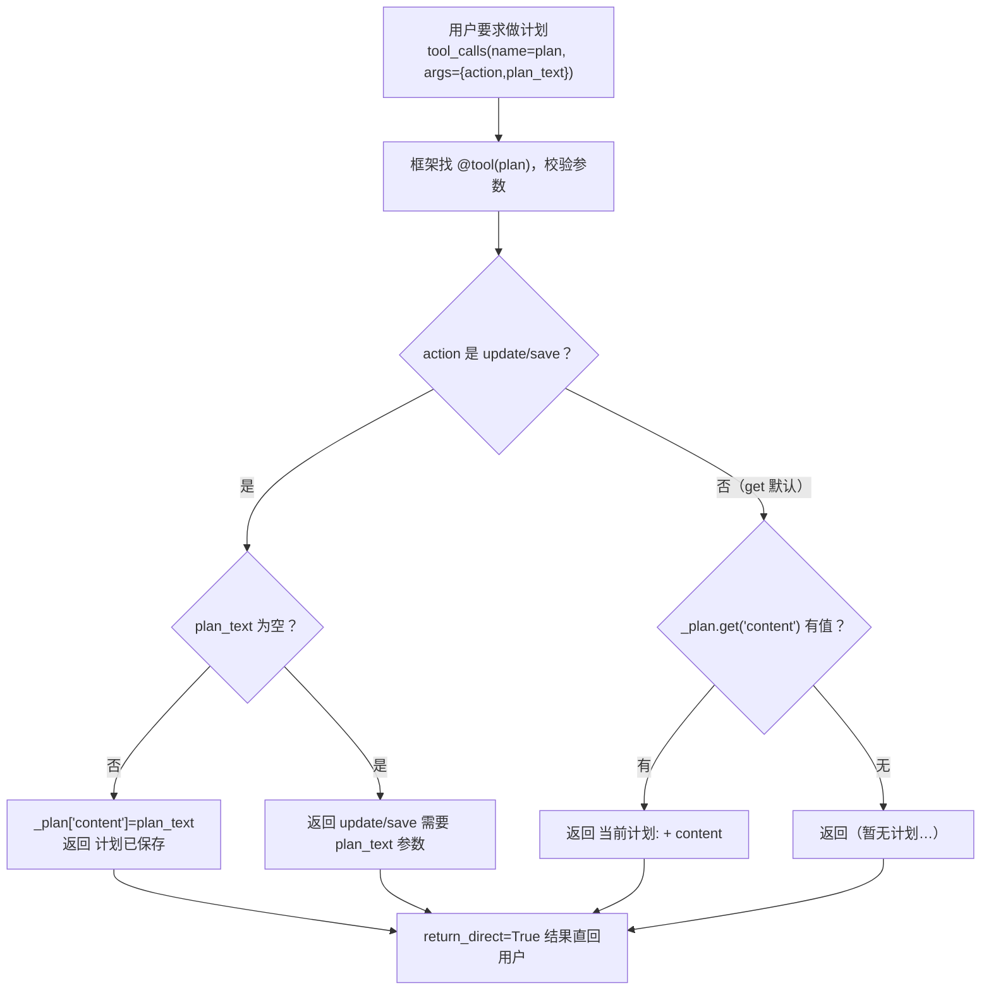

# tools/builtins/plan_tool.py — plan_tool.py

> **文件路径**: `backend/packages/harness/agentflow/tools/builtins/plan_tool.py`
> **目录位置**: tools → builtins → plan_tool.py
> **职责**: 计划工具

## 📑 目录

- [📋 结构图](#📋-结构图)
- [📤 关键导出](#📤-关键导出)
- [💡 设计思想](#💡-设计思想)
- [🎯 实用场景](#🎯-实用场景)
- [📊 顺序执行链流程图](#📊-顺序执行链流程图)
- [🧩 代码解析（成块对照 plan_tool.py）](#🧩-代码解析成块对照-plan_toolpy)
- [❓ Q&A / 知识点](#❓-qa--知识点)
- [⚠️ 风险点](#⚠️-风险点)

## 📋 结构图

```text
┌────────────────────────────────────────────────────────────┐
│ _plan: dict —— 会话内计划存储（内存；原版是文档）           │
│                                                             │
│ plan_tool(action, plan_text) -> str                        │
│   @tool("plan", return_direct=True)                        │
│   get    → 读取当前计划（无则提示可 update 写入）           │
│   update → 写入计划内容（plan_text 必填）                  │
│   save   → 同 update（语义区分：保存到持久层，M2 同内存）   │
└────────────────────────────────────────────────────────────┘
```

## 📤 关键导出

**函数**

- `plan_tool()`

**常量**

- `_PLAN_DESCRIPTION`

## 💡 设计思想

1. 计划是"任务级"能力：用户要求分步执行时，模型可把步骤写进
   计划再逐项推进，避免上下文里反复重复计划全文。
2. M2 内存 dict 够用：单会话内读写；M3+ 落盘（文件/DB）时
   只改存储实现，工具签名不动。
3. save 与 update 语义区分：update=改内存内容，save=持久化
   （M2 两者同实现，为 M3+ 预留接口语义）。

## 🎯 实用场景

1. 会话内计划：get/update/save 管理对话中的计划（如学习计划分步）
2. 计划持久化后续：M2 内存版，M3+ 可落 SQLite 或文件

## 📊 顺序执行链流程图（模型调起 plan 后）

```text
用户要求"先做个计划 / 按步骤来"（request：tool_calls name="plan", args={action,plan_text}）
│
▼
框架按 name 找到 @tool("plan") 注册工具，校验参数
│
▼
执行 plan_tool(action="get" 默认, plan_text=None)
│
├─ action == "update" 或 "save"
│    plan_text 为空 → 返回 "update/save 需要 plan_text 参数"（不静默覆盖）
│    否则 → _plan["content"] = plan_text，返回 "计划已保存"
│
└─ action == "get"（默认）
     _plan.get("content") 有值 → "当前计划:\n<content>"
     无值 → "（暂无计划。需要时可用 plan update 写入）"
│
▼
return_direct=True：结果字符串直接回用户
```

**Mermaid 版（GitHub / 飞书渲染；VSCode 需装插件）**：



## 🧩 代码解析（成块对照 plan_tool.py）

> 读法：每块先贴**完整代码**，再看块下方的整块解析。代码与文件一致，仅省略头部规范注释。

### 块 1：imports + 模块级计划存储

```python
from __future__ import annotations

from typing import Literal

from langchain.tools import tool

# 会话内计划存储（原版计划是文档；M2 用内存 dict，后续 M 再落盘）
_plan: dict = {}
```

**结构简析**：依赖极少——`Literal`（action 枚举）+ LangChain `tool`。`_plan` 是模块级全局 dict（M2 内存版，原版计划是独立文档），当前只用一个 key `content` 存计划全文。

本块无函数签名，不展开参数表。

**落库要点**：M2 内存 dict 进程重启即清空（风险点 1）；M3+ 落盘时只替换存储实现，工具签名不动。

### 块 2：`_PLAN_DESCRIPTION` —— 给模型看的说明书

```python
_PLAN_DESCRIPTION = """\
计划工具：维护当前任务的分步计划（get/update/save）。
当用户要求"先做个计划 / 按步骤来 / 更新计划"时使用。
action=get: 读取当前计划；action=update: 更新计划内容（plan_text 必填）；
action=save: 保存计划。
注意: 计划是会话级的，跨会话不保留。
"""
```

**结构简析**：说明书约定三动作——get 读、update 写（plan_text 必填）、save 保存；最后明确"会话级、跨会话不保留"，让模型知道这不是长期任务管理。

本块是模块级常量字符串，无函数签名，不展开参数表。

**补充**：作为 `@tool` 的 `description=` 传入，模型按它决定何时调、怎么填参。

### 块 3：`@tool` 装饰器 + 函数体三分支

```python
@tool("plan", description=_PLAN_DESCRIPTION, parse_docstring=False, return_direct=True)
def plan_tool(
    action: Literal["get", "update", "save"] = "get",
    plan_text: str | None = None,
) -> str:
    """维护任务计划（使用条件见工具 description）。"""
    if action == "update" or action == "save":
        if not plan_text:
            return "update/save 需要 plan_text 参数"
        _plan["content"] = plan_text
        return "计划已保存"
    if _plan.get("content"):
        return f"当前计划:\n{_plan['content']}"
    return "（暂无计划。需要时可用 plan update 写入）"
```

**结构简析**：整个工具就两个分支——① `update`/`save` 走同一分支（M2 同实现，语义为 M3+ 持久化预留）：先查 `plan_text` 为空就报错（**不静默覆盖**，风险点 2），有值才写入 `_plan["content"]`；② 否则按 get 处理：有计划就全文返回，无计划返回引导文案。

**`plan_tool()` 参数逐条解释**：

| 参数 | 类型 | 默认值 | 含义 |
|---|---|---|---|
| `action` | `Literal["get", "update", "save"]` | `"get"` | `get`=读取当前计划（默认）；`update`/`save`=写入计划内容（M2 同实现，save 语义为 M3+ 持久化预留） |
| `plan_text` | `str \| None` | `None` | 仅 update/save 用；为空则返回"update/save 需要 plan_text 参数"（不静默覆盖），有值才写 `_plan["content"]` |

**落库要点**：写入即 `_plan["content"] = plan_text`（内存 dict），返回"计划已保存"；get 命中返回 `f"当前计划:\n{_plan['content']}"`，无内容返回引导文案。`return_direct=True` 结果直回用户。

## ❓ Q&A / 知识点

### 1. 为什么 update 和 save 在 M2 是同一份实现？

**一句话**：为 M3+ 持久化预留语义接口——M2 内存阶段两者无差别，落盘后再拆开。

| 动作 | M2 实现 | M3+ 预期语义 |
|---|---|---|
| update | 写内存 `_plan["content"]` | 改内存当前计划 |
| save | 同 update（写内存） | 把计划持久化到文件/DB |

现在就把两个 action 都暴露给模型（description 里也列了），是为了**接口契约先行**：模型现在就学会"写计划用 update/save"，M3+ 真接持久层时只改函数体里 save 的存储动作，签名和模型用法都不变。

### 2. 为什么 update/save 缺 plan_text 要报错，不静默处理？

**一句话**：静默覆盖/空写会悄悄抹掉已有计划，报错能让模型补参数重试。

源码里 `if not plan_text: return "update/save 需要 plan_text 参数"`——如果这里不报错而是直接 `_plan["content"] = ""`，一次漏传参数就把之前写好的计划清空了。显式报错后，模型看到提示会补传 plan_text 再调一次。这与"不可静默覆盖"的风险点 2 对应。

## ⚠️ 风险点

1. _plan 是模块级内存 dict：进程重启即清空（当前设计，调试够用）
2. update 无 plan_text 时返回错误提示，不可静默覆盖
3. save/update 语义在 M3+ 持久化时可能拆分，改动需同步 description

---
_自动生成于 doc-code 规范落地（2026-09-28）。来源：plan_tool.py 头部注释 + 顶层符号。_
_2026-09-30 补齐：目录 + 顺序执行链流程图 + 成块代码解析（+Q&A）。_
_2026-10-03 重构：代码解析段按「结构简析 + 参数逐条表格 + 落库要点」规范化（代码块零改动）。_
