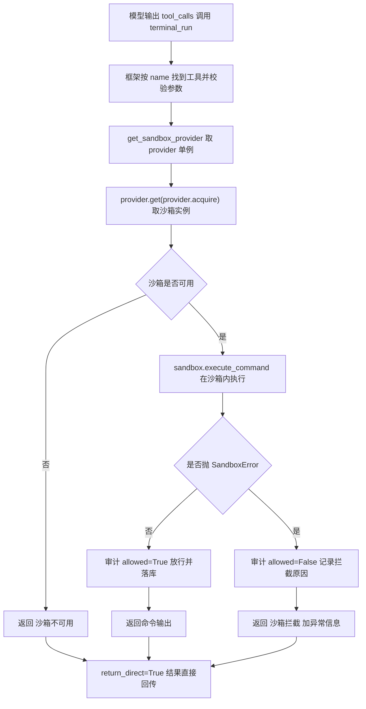

# tools/builtins/terminal_tool.py — terminal_tool.py

> **文件路径**: `backend/packages/harness/agentflow/tools/builtins/terminal_tool.py`
> **目录位置**: tools → builtins → terminal_tool.py
> **职责**: 沙箱终端工具（M4 新增）

## 📑 目录

- [📋 结构图](#📋-结构图)
- [📤 关键导出](#📤-关键导出)
- [💡 设计思想](#💡-设计思想)
- [🎯 实用场景](#🎯-实用场景)
- [📊 顺序执行链流程图](#📊-顺序执行链流程图)
- [🧩 代码解析（成块对照 terminal_tool.py）](#🧩-代码解析成块对照-terminal_toolpy)
- [❓ Q&A / 知识点](#❓-qa--知识点)
- [⚠️ 风险点](#⚠️-风险点)

## 📋 结构图

```text
┌────────────────────────────────────────────────────────┐
│ _audit_repo: SandboxAuditRepository | None = None      │
│   （模块级句柄，CLI 装配注入；未注入则审计静默跳过）     │
│                                                       │
│ configure_sandbox_audit_repository(repo)              │
│   CLI main() 装配时注入审计仓库（None = 关闭审计）      │
│                                                       │
│ _audit(action, target, allowed, reason="")           │
│   放行/拦截都写一条审计；subagent_name 固定 terminal_run│
│                                                       │
│ @tool("terminal_run", return_direct=True)             │
│ terminal_run(command: str) -> str                    │
│   ① get_sandbox_provider() 取 provider 单例            │
│   ② sandbox = provider.get(provider.acquire())         │
│   ③ sandbox.execute_command(command) 沙箱内执行        │
│   ④ 成功 → 命令输出；SandboxError → （沙箱拦截）提示   │
└────────────────────────────────────────────────────────┘
```

## 📤 关键导出

**函数**

- `terminal_run()` —— 沙箱终端工具（注册名 `"terminal_run"`）
- `configure_sandbox_audit_repository()` —— CLI 装配时注入审计仓库

**内部私有函数**

- `_audit()` —— 写审计记录（仓库未注入时静默跳过）

## 💡 设计思想

1. 一切宿主命令必须走沙箱：工具层不提供任何"绕过沙箱"的路径——
   `terminal_run` 内部唯一取沙箱的入口就是 `get_sandbox_provider()`，
   Noop 时直接拒绝执行，Local 时目录隔离。
2. 审计句柄用模块级注入（`configure_sandbox_audit_repository`），
   对齐 knowledge_tool 的 `configure_knowledge_service` 模式：
   工具模块不自己 new 仓库，由 CLI 装配时统一注入。
3. `return_direct=True`：命令输出直接回给模型，不再二次加工。
4. 对标来源：`evoflow/tools/host_direct/terminal_tool.py`（原版进程/会话管理，
   M4 简化为单命令）。

## 🎯 实用场景

1. 终端命令：查看系统状态、运行脚本、执行测试、批处理文件
   （默认超时 30s；命令以 AgentFlow 进程权限运行，访问宿主机路径不会被路径 API 拦截）。
2. bash 子代理的唯一工具：`subagents/builtins/bash_agent.py:54` 白名单
   `tools=["terminal_run"]`（最小权限，不碰文件/知识库）。
3. 验收点 4 可追溯性：放行/拦截都落 `sandbox_audit` 表，拦截有据可查。

## 📊 顺序执行链流程图（模型调起 terminal_run 时）

```text
模型读 _TERMINAL_DESCRIPTION，输出 tool_calls（request: name=terminal_run）
│
▼
框架按 name 在 @tool 注册表找到 terminal_run，校验参数 schema（command: str）
│
▼
provider = get_sandbox_provider()   ← 取全局单例（CLI 已 set_sandbox_provider 注入 LocalSandboxProvider）
│
▼
sandbox = provider.get(provider.acquire())   ← LocalSandboxProvider.acquire 返回自身 id，get 返回同一个 LocalSandbox
│
├─ sandbox is None（Noop/未装配）
│    └─ return "（沙箱不可用）"
│
└─ sandbox 可用
     │
     ▼
   out = sandbox.execute_command(command)   ← LocalSandbox 在项目 .sandbox 目录内执行；越界抛 SandboxError
     │
     ├─ 正常返回
     │    _audit("terminal_run", command, allowed=True)   ← 放行落审计
     │    return out（命令输出，LocalSandbox 已截断 500 字符详情）
     │
     └─ 抛 SandboxError
          _audit("terminal_run", command, allowed=False, reason=str(exc))  ← 拦截落审计
          return f"（沙箱拦截）{exc}"
│
▼
return_direct=True：结果直接回用户/模型，不进模型二次加工
```

**Mermaid 版（GitHub / 飞书渲染；VSCode 需装插件）**：



## 🧩 代码解析（成块对照 terminal_tool.py）

> 读法：每块先贴**完整代码**，再看块下方的整块解析。代码与文件一致，仅省略头部规范注释。

### 块 1：imports + 模块级审计句柄 —— 依赖与全局状态

```python
from __future__ import annotations

from langchain.tools import tool

from agentflow.persistence.sandbox_audit_repositories import SandboxAuditRepository
from agentflow.sandbox import SandboxError, get_sandbox_provider

# 审计仓库句柄（CLI 装配注入；未注入时审计静默跳过，不阻塞工具）
_audit_repo: SandboxAuditRepository | None = None
```

**结构简析**：依赖三样——`tool`（LangChain 装饰器注册工具）、`SandboxAuditRepository`（审计仓库类型，仅作句柄类型标注，不在本文件实例化）、`SandboxError / get_sandbox_provider`（沙箱异常与取沙箱的唯一入口）。`_audit_repo` 是模块级全局句柄，初值 `None`。

本块无函数签名，不展开参数表。

**落库要点**：未注入审计时 `_audit_repo` 保持 None，工具照常跑只是不写审计——审计是可观测性配套，不能反过来阻塞工具主流程。

### 块 2：`configure_sandbox_audit_repository` —— 依赖注入入口

```python
def configure_sandbox_audit_repository(repo: SandboxAuditRepository | None) -> None:
    """注入沙箱审计仓库（CLI main() 装配；None = 关闭审计）。"""
    global _audit_repo
    _audit_repo = repo
```

**结构简析**：经典"模块级注入"——函数接收一个仓库实例，写进全局 `_audit_repo`。

**`configure_sandbox_audit_repository()` 参数逐条解释**：

| 参数 | 类型 | 默认值 | 含义 |
|---|---|---|---|
| `repo` | `SandboxAuditRepository \| None` | 必填 | 沙箱审计仓库实例；`global _audit_repo` 挂到模块级句柄，传 `None` 即关闭审计 |

**落库要点**：CLI 装配时调用（`cli/main.py:178` 以 `configure_terminal_audit` 别名导入后调用）；工具模块自身不 import db、不 new 仓库，连接全部由 CLI 统一创建，测试时也可注入内存/mock 仓库。

### 块 3：`_audit` —— 放行/拦截统一落审计

```python
def _audit(action: str, target: str, allowed: bool, reason: str = "") -> None:
    if _audit_repo is None:
        return
    try:
        _audit_repo.record(
            action=action,
            target=target,
            allowed=allowed,
            reason=reason,
            subagent_name="terminal_run",
        )
    except Exception:  # noqa: BLE001,S110 —— 审计失败不影响工具主流程（调试期静默）
        pass
```

**结构简析**：三层防御——① 仓库未注入（`None`）直接 return，不阻塞工具；② 调 `repo.record(...)` 真正落库，`subagent_name` 在这里**硬编码为 `"terminal_run"`**（与 file_tools 里 `subagent_name=action` 的写法不同，注意区分）；③ `except Exception: pass` 吞掉一切审计异常并加 `noqa`。

**`_audit()` 参数逐条解释**：

| 参数 | 类型 | 默认值 | 含义 |
|---|---|---|---|
| `action` | `str` | 必填 | 操作名，本文件固定传 `"terminal_run"`；落库到 repo 的 `action=` 字段 |
| `target` | `str` | 必填 | 操作目标（命令字符串），落库到 `target` 字段 |
| `allowed` | `bool` | 必填 | 是否放行；放行=True、拦截=False，落库时由 repo 归一化为 0/1 整数 |
| `reason` | `str` | `""` | 拦截原因；拦截分支传 `str(exc)`，放行时留空串 |

**落库要点**：`subagent_name` 在此硬编码 `"terminal_run"`（整个文件只有 terminal_run 一个工具）；`record(...)` 包在 try/except 里，审计写库失败（锁/磁盘问题）被吞，绝不反过来炸掉正在执行的命令（`# noqa: BLE001,S110`）。

### 块 4：`_TERMINAL_DESCRIPTION` —— 给模型看的说明书

```python
_TERMINAL_DESCRIPTION = """\
沙箱终端工具：在沙箱工作目录内执行 shell 命令并返回输出。
当需要查看系统状态、运行脚本、执行测试、批处理文件时使用。
注意: 命令在沙箱内执行，访问沙箱外路径会被拦截；命令需在超时（30s）内完成。
"""
```

**结构简析**：与 clarification/todo 工具同款——这段字符串注入 system prompt 给模型读，决定"何时调本工具、参数怎么填"。注意：源码这段说明声称沙箱外路径会拦截，但 `LocalSandbox.execute_command()` 实际只设 `cwd` 和超时；该说明与实现不符，shell 命令不经过文件 API 的路径校验。

本块是模块级常量字符串，无函数签名，不展开参数表。

**补充**：作为 `@tool` 的 `description=` 传入；改措辞 = 改模型行为。

### 块 5：`@tool` 装饰器 + `terminal_run` 函数体 —— 唯一执行链

```python
@tool("terminal_run", description=_TERMINAL_DESCRIPTION, parse_docstring=False, return_direct=True)
def terminal_run(command: str) -> str:
    """在沙箱内执行命令（沙箱外访问被拦截，全程审计）。"""
    provider = get_sandbox_provider()
    sandbox = provider.get(provider.acquire())
    if sandbox is None:
        return "（沙箱不可用）"
    try:
        out = sandbox.execute_command(command)
        _audit("terminal_run", command, allowed=True)
        return out
    except SandboxError as exc:
        _audit("terminal_run", command, allowed=False, reason=str(exc))
        return f"（沙箱拦截）{exc}"
```

**结构简析**：装饰器注册名 `"terminal_run"`、绑定说明书、`parse_docstring=False`、`return_direct=True`。函数体是 M4 安全闸的完整闭环：取沙箱（`provider = get_sandbox_provider()` → `sandbox = provider.get(provider.acquire())`）→ 空守卫（`sandbox is None` → "（沙箱不可用）"）→ 执行（`sandbox.execute_command(command)`）→ 双分支审计。`acquire()` 返回沙箱 id，`get(id)` 再按 id 取回实例——工具不感知全局状态，只走这一个入口。

**`terminal_run()` 参数逐条解释**：

| 参数 | 类型 | 默认值 | 含义 |
|---|---|---|---|
| `command` | `str` | 必填 | 透传给 `sandbox.execute_command(command)` 的 shell 字符串；超时默认 30s，但可访问 AgentFlow 进程有权限访问的宿主机资源 |

**落库要点**：成功先 `_audit("terminal_run", command, allowed=True)` 再返回输出（LocalSandbox 已截断 500 字符详情）；捕获 `SandboxError` 后 `_audit(..., allowed=False, reason=str(exc))` 并返回"（沙箱拦截）{exc}"——catch 异常是硬要求，不 catch 会把异常炸进模型工具循环。

## ❓ Q&A / 知识点

### 1. terminal_run / read_file 走沙箱会不会影响 M1-M3 的工具？（2026-10-01 用户提问）

**一句话**：不会。`terminal_run` / `read_file` / `write_file` 是 M4 **全新独立注册的工具**，与 M1-M3 已有工具互不干扰。

**为什么互不影响**：

| 维度 | M1-M3 已有工具（todo/knowledge/plan/fetch/ask_clarification） | M4 新增沙箱工具（terminal_run/read_file/write_file） |
|---|---|---|
| 代码归属 | 各自独立模块文件（todo_tool.py、knowledge_tool.py…） | 新文件 terminal_tool.py / file_tools.py |
| 取沙箱 | 根本不 import sandbox 包，不碰 `get_sandbox_provider()` | 内部才调 `get_sandbox_provider()` + `SandboxError` |
| 审计 | 不写 sandbox_audit 表 | 经 `_audit()` 写 sandbox_audit 表 |
| 注册 | `tools/tools.py` 原有条目 | `tools/tools.py:82-84` **追加** 进返回元组 |
| 档位 | 各自原 tier（runtime/core/workspace…） | tool_catalog.py:106-108 标为 workspace 档 |

**结论**：沙箱是**叠加在新工具内部**的一层安全壳，M1-M3 工具既不 import 它、也不被它改造。CLI 装配段（`cli/main.py:176-179`）只是额外 `set_sandbox_provider` + 注入审计仓库，不改动已有装配逻辑。（`read_file/write_file` 侧的呼应见 `file_tools.md`。）

### 2. 为什么 `sandbox` 取不到时返回"（沙箱不可用）"而不是抛异常？

**一句话**：工具任何异常都不能炸进模型循环——取不到沙箱是"环境未就绪"，应给模型一句可读提示让它停下，而不是抛栈。

与 `SandboxError` 分支同理：本文件对所有外部依赖（沙箱、审计）都做了"软失败"——沙箱不可用返回占位字符串，沙箱拦截返回友好提示，审计异常 `except: pass`。模型拿到的永远是字符串结果，不会收到未捕获异常导致工具循环崩溃。

### 3. bash 子代理为什么只白名单 terminal_run？

**一句话**：最小权限——`subagents/builtins/bash_agent.py:54` 配置 `tools=["terminal_run"]`，bash 子代理只能跑命令，不能直接读写文件或调知识库，命令逃逸与路径越界统一由 `LocalSandbox._resolve` 在沙箱层拦截。

## ⚠️ 风险点

1. 不要提供绕过 `get_sandbox_provider` 的执行路径——它是命令执行的安全闸唯一入口。
2. `SandboxError` 必须 catch → 拦截提示；不 catch 会把异常炸进模型工具循环。
3. 命令输出可能很长：LocalSandbox 已截断 500 字符详情（超长输出看沙箱实现）。
4. `_audit_repo` 是模块级全局：测试/多场景使用后注意不要串状态（对齐 provider 的 set/reset 用法）。

---
_2026-10-01 M4 补齐：目录 + 顺序执行链流程图 + 成块代码解析（+Q&A）。_
_2026-10-03 重构：代码解析段按「结构简析 + 参数逐条表格 + 落库要点」规范化（代码块零改动）。_
