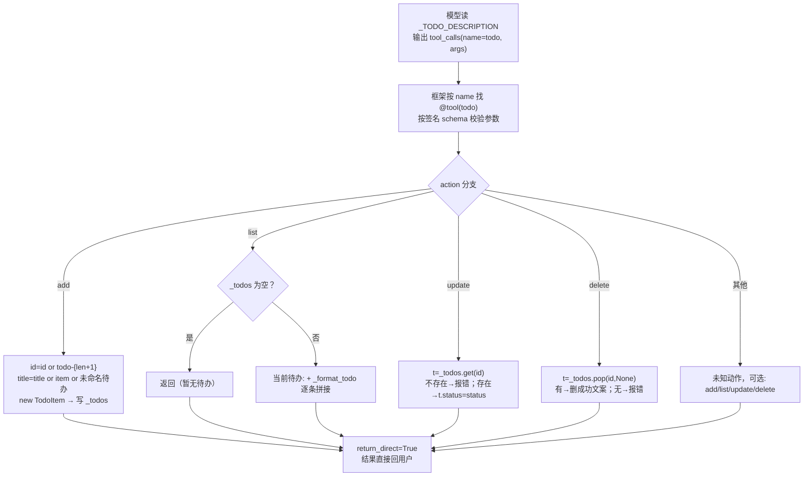

# tools/builtins/todo_tool.py — todo_tool.py

> **文件路径**: `backend/packages/harness/agentflow/tools/builtins/todo_tool.py`
> **目录位置**: tools → builtins → todo_tool.py
> **职责**: 会话内待办工具

## 📑 目录

- [📋 结构图](#📋-结构图)
- [📤 关键导出](#📤-关键导出)
- [💡 设计思想](#💡-设计思想)
- [🎯 实用场景](#🎯-实用场景)
- [📊 顺序执行链流程图](#📊-顺序执行链流程图)
- [🧩 代码解析（成块对照 todo_tool.py）](#🧩-代码解析成块对照-todo_toolpy)
- [⚠️ 风险点](#⚠️-风险点)
- [❓ Q&A](#❓-qa)

## 📋 结构图

```text
┌────────────────────────────────────────────────────────────┐
│ TodoStatus(str, Enum): pending / in_progress / done /      │
│                        cancelled（状态枚举）               │
│ TodoItem(@dataclass): id / title / status / created_at     │
│                                                             │
│ _todos: dict[str, TodoItem] —— 会话级内存存储              │
│                                                             │
│ todo_tool(action, item, id, title, status) -> str          │
│   @tool("todo", return_direct=True)                        │
│   add    → 新增待办（title 必填）                           │
│   list   → 列出全部（无则"（暂无待办）"）                  │
│   update → 按 id 改状态                                    │
│   delete → 按 id 删除                                      │
└────────────────────────────────────────────────────────────┘
```

## 📤 关键导出

**类**

- `TodoStatus`
- `TodoItem`

**函数**

- `todo_tool()`

**常量**

- `_TODO_DESCRIPTION`

## 💡 设计思想

1. 参考文档：doc/doc-dev/01-里程碑/M2-工具与中间件.md §3
2. 原版语义：待办是"对话级 checklist"，不跨会话、不进任务中心——
   用户随手记的待办跟会话走，轻量、无持久化负担。
3. return_direct=True：工具结果直接回给用户，不再让模型二次加工，
   避免模型对结构化结果过度解读（照原版 clarification 工具模板）。
4. docstring 即说明书：_TODO_DESCRIPTION 就是给模型看的"何时用、
   参数怎么填"，工具体保持最简。

## 🎯 实用场景

1. 会话内待办：对话中"帮我记个待办"，Agent 自动调 add（实测：已添加待办: 学完M2（todo-1））
2. 任务跟进：list/update/delete 支撑对话中管理待办清单
3. M2 验收演示：工具自动调用链路的默认测试工具

## 📊 顺序执行链流程图（模型调起 todo 后）

```text
模型读 _TODO_DESCRIPTION，决定调 todo（request：tool_calls name="todo"）
│
▼
框架按 name 找到 @tool("todo") 注册的工具，校验参数 schema
│
▼
执行 todo_tool(action, item, id, title, status)
│
├─ action == "add"
│    id = id or f"todo-{len(_todos)+1}"
│    title = title or item or "未命名待办"
│    new TodoItem(id, title) → 写入 _todos[id]
│    返回 "已添加待办: <title>（<id>）"
│
├─ action == "list"
│    _todos 为空 → "（暂无待办）"
│    否则 → "当前待办:" + 每条 _format_todo 拼接
│
├─ action == "update"
│    t = _todos.get(id or "")
│    不存在 → "待办不存在: <id>"
│    存在 → t.status = status，返回 "已更新待办: <title> → <status>"
│
├─ action == "delete"
│    t = _todos.pop(id or "", None)
│    有 → "已删除待办: <title>"；无 → "待办不存在: <id>"
│
└─ 都不匹配 → "未知动作，可选: add/list/update/delete"
│
▼
return_direct=True：字符串结果直接回用户，不进模型二次加工
```

**Mermaid 版（GitHub / 飞书渲染；VSCode 需装插件）**：



## 🧩 代码解析（成块对照 todo_tool.py）

> 读法：每块先贴**完整代码**，再看块下方的整块解析。代码与文件一致，仅省略头部规范注释。

### 块 1：imports + `TodoStatus` 状态枚举

```python
from __future__ import annotations

from dataclasses import dataclass, field
from datetime import UTC, datetime
from enum import Enum
from typing import Literal

from langchain.tools import tool


class TodoStatus(str, Enum):
    PENDING = "pending"
    IN_PROGRESS = "in_progress"
    DONE = "done"
    CANCELLED = "cancelled"
```

**结构简析**：依赖五样——`dataclass/field`（定义待办数据类）、`UTC/datetime`（生成时间戳）、`Enum`（状态枚举）、`Literal`（参数枚举标注）、`tool`（LangChain 装饰器）。`TodoStatus(str, Enum)` 是**字符串枚举**：继承 str 后，枚举值本身就是字符串（`TodoStatus.PENDING.value == "pending"`），存进 dataclass 和返回给模型都无需转换。

本块是 imports + 枚举类定义，无待展开参数的函数，不展开参数表。

**补充**：四个状态——pending（待办）/ in_progress（进行中）/ done（完成）/ cancelled（取消）。

### 块 2：`TodoItem` 数据类 + 模块级存储 + 单条格式化

```python
@dataclass
class TodoItem:
    id: str
    title: str
    status: str = TodoStatus.PENDING.value
    created_at: str = field(default_factory=lambda: datetime.now(UTC).isoformat(timespec="seconds"))


# 会话级存储：内存 dict（原版语义：不跨会话、不进任务中心）
_todos: dict[str, TodoItem] = {}


def _format_todo(item: TodoItem) -> str:
    return f"- [{item.status}] {item.title}（{item.id}）"
```

**结构简析**：`TodoItem` 四个字段——`id/title` 必填，`status` 默认 pending，`created_at` 用 `field(default_factory=...)` **惰性**生成 UTC ISO 时间戳（秒级）——不写 `datetime.now(...)` 做默认值是为了避免类定义期固定求值。`_todos` 是模块级全局 dict。`_format_todo` 把单条待办渲染成一行。

**`_format_todo()` 参数逐条解释**：

| 参数 | 类型 | 默认值 | 含义 |
|---|---|---|---|
| `item` | `TodoItem` | 必填 | 单条待办对象；渲染成一行 `- [{item.status}] {item.title}（{item.id}）`，专供 list 展示 |

**落库要点**：`_todos: dict[str, TodoItem] = {}` 是会话级内存存储（原版按 thread_id 分桶，M2 简化为进程内所有会话共享一个池）；进程重启即清空。

### 块 3：`_TODO_DESCRIPTION` —— 给模型看的说明书

```python
_TODO_DESCRIPTION = """\
会话内待办清单工具（对话级 checklist，不是任务中心）。
当用户要求"列一下要做的事 / 帮我记个待办 / 进度到哪了"时使用。
动作: add=添加待办（title 必填）；list=列出全部；
update=改状态（id + status: pending/in_progress/done/cancelled）；delete=删除（id）。
"""
```

**结构简析**：与 clarification 工具同款——这段字符串不是注释，是注入 system prompt 给模型的说明书：什么时候用（列待办/记待办/问进度）、四个动作各要什么参数（add 要 title；update 要 id+status；delete 要 id）。

本块是模块级常量字符串，无函数签名，不展开参数表。

**补充**：作为 `@tool` 的 `description=` 传入；改措辞 = 改模型何时调本工具（风险点 3）。

### 块 4：`@tool` 装饰器 + 函数签名

```python
@tool("todo", description=_TODO_DESCRIPTION, parse_docstring=False, return_direct=True)
def todo_tool(
    action: Literal["add", "list", "update", "delete"] = "list",
    item: str | None = None,
    id: str | None = None,
    title: str | None = None,
    status: Literal["pending", "in_progress", "done", "cancelled"] = "pending",
) -> str:
```

**结构简析**：装饰器注册工具名 `"todo"`、绑定说明书、`parse_docstring=False`（不用 docstring 生成 schema，全靠 description）、`return_direct=True`（结果直回用户）。五个参数全由 LangChain 转成 JSON schema 卡模型。

**`todo_tool()` 参数逐条解释**：

| 参数 | 类型 | 默认值 | 含义 |
|---|---|---|---|
| `action` | `Literal["add", "list", "update", "delete"]` | `"list"` | 动作：`add`=新增（title 必填）；`list`=列出全部（默认）；`update`=按 id 改状态；`delete`=按 id 删除 |
| `item` | `str \| None` | `None` | add 时的标题兼容位；`title or item` 兜底（模型老写法传 item 也能接住） |
| `id` | `str \| None` | `None` | update/delete 用；add 时缺省自动生成 `todo-{len(_todos)+1}` |
| `title` | `str \| None` | `None` | add 时的待办标题；`title or item or "未命名待办"` 三层兜底 |
| `status` | `Literal["pending", "in_progress", "done", "cancelled"]` | `"pending"` | update 时的目标状态，四态枚举；add 时新建条目固定 pending |

**补充**：`item` 与 `title` 并存是兼容写法——add 时 `title or item` 兜底。

### 块 5：函数体 —— 四动作分支调度

```python
    """会话内待办清单（使用条件见工具 description）。"""
    if action == "add":
        t = TodoItem(id=id or f"todo-{len(_todos) + 1}", title=title or item or "未命名待办")
        _todos[t.id] = t
        return f"已添加待办: {t.title}（{t.id}）"
    if action == "list":
        if not _todos:
            return "（暂无待办）"
        return "当前待办:\n" + "\n".join(_format_todo(t) for t in _todos.values())
    if action == "update":
        t = _todos.get(id or "")
        if not t:
            return f"待办不存在: {id}"
        t.status = status
        return f"已更新待办: {t.title} → {status}"
    if action == "delete":
        t = _todos.pop(id or "", None)
        return f"已删除待办: {t.title}" if t else f"待办不存在: {id}"
    return "未知动作，可选: add/list/update/delete"
```

**结构简析**：四个 `if` 顺序分支，每个分支都**返回字符串**（工具统一返回文本）。

本块是块 4 已签名函数的函数体，参数同 `todo_tool()`（见块 4），不重复造表。

**落库要点**：
- `add`：id 缺省自动生成 `todo-{len(_todos)+1}`（删除后 len 变小，id 可能复用，风险点 2）；写 `_todos[t.id] = t`，title 三层兜底 `title or item or "未命名待办"`。
- `list`：空 dict 返回占位"（暂无待办）"，否则 join 所有 `_format_todo` 结果。
- `update`：`.get(id or "")` 取条目，不存在报"待办不存在"；存在就**原地改 `t.status`**（TodoItem 是可变 dataclass，直接改字段）。
- `delete`：`.pop(id or "", None)` 原子删除，按是否拿到条目分别返回成功/不存在文案。
- 末尾兜底：未知 action 返回可选动作提示。

## ⚠️ 风险点

1. _todos 是模块级内存 dict：进程重启即清空（当前设计，调试够用）
2. 待办 ID 用 len(_todos)+1 生成：删除后 ID 可能复用（可接受，或用 uuid）
3. 修改 _TODO_DESCRIPTION 会直接影响模型何时调用本工具（措辞要准）

## ❓ Q&A

**Q: todo 数据存内存还是存本地？会丢吗？**

A: 存内存（模块级 dict），进程重启即清空——**这是原版设计**。
原版 docstring 明说："conversation-scoped checklist, stored in memory and do NOT persist across conversations, never appear in 任务中心"。
需要跨会话/可分配的任务走任务中心（M7+ POST /api/tasks），todo 只服务"会话内随手记"。

**Q: 和原版有什么差异？**

A: 原版 `_todo_store: dict[str, list[TodoItem]]` **按 thread_id 分桶**（会话间隔离）；
M2 简化为单一 dict（所有会话共用一个池）。M3 改存储时对齐。

**Q: 想要持久化怎么办？**

A: 照原版语义 → 交给任务中心；真要落库 → M3+ 加 SQLite `todos` 表，只改函数体签名不动。

**Q: 模型如何从对话"读懂是待办"并调用本工具？（tool_calls 解析机制，2026-09-30）**

A: 链路三步，职责分离清晰：

```text
① 模型"读懂" = 读工具说明书，不是理解业务
   system prompt 里注入了每个工具的 description：
   "todo: 会话内待办清单工具…当用户要求'帮我记个待办'时使用。动作: add=添加待办（title 必填）…"
   模型把"帮我记一个待办：学完M2" 匹配到 description → 决定调 todo

② 模型输出结构化指令（tool_calls JSON），不是自然语言
   AIMessage(tool_calls=[{'name': 'todo', 'args': {'action': 'add', 'title': '学完M2'}}])
   注意：此时模型并没有"处理数据"——它只声明"我要调 todo，参数填这些"

③ 框架解析 + 工具处理数据
   解析: langchain 读 tool_calls → 按 name='todo' 在注册表里找到本工具（@tool 注册）
   校验: 按函数签名 schema 校验参数（action/title 类型、枚举合法性）
   执行: 调用 todo_tool(action='add', title='学完M2') → 内部写 _todos 并返回字符串
   回填: 返回字符串包成 ToolMessage（带 tool_call_id）回填给模型

一句话分工：
   模型决定"调哪个、参数填什么"（判断力）
   框架决定"找哪个工具、怎么校验调用"（调度力）
   工具自己处理数据（todo 函数体：写 dict / 格式化）
   结果回填给模型（return_direct=True 则直接打印）
```

---
_自动生成于 doc-code 规范落地（2026-09-28）。来源：todo_tool.py 头部注释 + 顶层符号。_
_2026-09-30 追加：Q&A 归档区（模型读懂→tool_calls→解析执行三步链路，用户提问自动归纳）。_
_2026-09-30 补齐：目录 + 顺序执行链流程图 + 成块代码解析（+Q&A）。_
_2026-10-03 重构：代码解析段按「结构简析 + 参数逐条表格 + 落库要点」规范化（代码块零改动）。_
