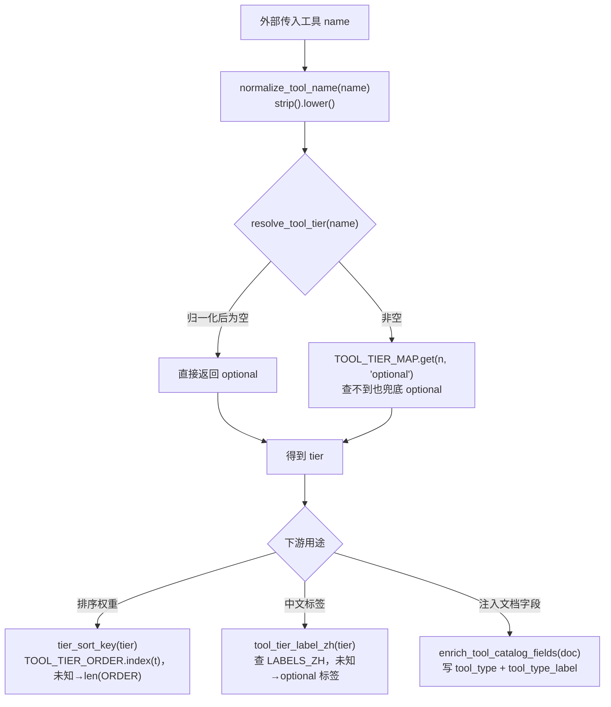

# tools/tool_catalog.py — tool_catalog.py

> **文件路径**: `backend/packages/harness/agentflow/tools/tool_catalog.py`
> **目录位置**: tools → tool_catalog.py
> **职责**: 工具Tier分层定义与字段增强模块

## 📑 目录

- [📋 结构图](#📋-结构图)
- [📤 关键导出](#📤-关键导出)
- [💡 设计思想](#💡-设计思想)
- [🎯 实用场景](#🎯-实用场景)
- [📊 顺序执行链流程图](#📊-顺序执行链流程图)
- [🧩 代码解析（成块对照 tool_catalog.py）](#🧩-代码解析成块对照-tool_catalogpy)
- [❓ Q&A](#❓-qa)
- [⚠️ 风险点](#⚠️-风险点)

## 📋 结构图

```text
┌────────────────────────────────────────────────────────────┐
│ ToolTier: Literal 类型，7 种工具档位静态类型定义             │
│ TOOL_TIER_ORDER: 元组常量，Tier 优先级排序基准               │
│ TOOL_TIER_LABELS_ZH: 档位 → 中文标签映射                     │
│ TOOL_TIER_MAP: M2 本地硬编码 5 个工具的档位                  │
│                                                             │
│ normalize_tool_name(name) → 小写去空格                       │
│ resolve_tool_tier(name) → 查档位（未知 → optional 兜底）     │
│ tool_tier_label_zh(tier) → 中文标签                          │
│ enrich_tool_catalog_fields(doc) → 给工具文档注入 tier 字段   │
│ tier_sort_key(tier) → 排序权重（供 tools.py 排序用）         │
└────────────────────────────────────────────────────────────┘
```

**M4 追加（TOOL_TIER_MAP 从 5 条扩到 9 条）**：

```text
│ TOOL_TIER_MAP（M4 现行）：                                  │
│   ask_clarification=runtime / todo=core /                   │
│   knowledge=workspace / plan=plan / fetch_url=workspace     │
│   terminal_run=workspace / read_file=workspace /            │
│   write_file=workspace / dispatch_subagents=core（新增）    │
```

## 📤 关键导出

**函数**

- `normalize_tool_name()`
- `resolve_tool_tier()`
- `tool_tier_label_zh()`
- `enrich_tool_catalog_fields()`
- `tier_sort_key()`

**常量（M4 补充说明）**

- `TOOL_TIER_MAP`：M4 由 5 条扩到 9 条——新增 `terminal_run`/`read_file`/`write_file`=workspace、`dispatch_subagents`=core（其余 ToolTier / TOOL_TIER_ORDER / TOOL_TIER_LABELS_ZH 未变）。

## 💡 设计思想

1. 使用 Literal 实现静态类型约束，Pylance 静态校验，限制 tier 只能使用
   7 个指定字符串。
2. 独立维护 TOOL_TIER_ORDER 元组，统一定义优先级顺序，用于全局工具排序。
3. 拆分多个单一职责函数：归一化 / 分层判定 / 中文标注 / 字段增强 / 排序权重，
   便于单独扩展（照原版 tool_catalog.py 的职责拆分）。
4. M2 简化：去掉对 intent_tool_profile 等深层模块的依赖，
   用本地 TOOL_TIER_MAP 硬编码当前 5 个工具的档位。

## 🎯 实用场景

1. 工具分层展示：gateway 返回工具列表时附带 tier 与中文标签（enrich_tool_catalog_fields）
2. 工具排序：tier_sort_key 供 tools.py 按"系统核心→常驻→工作区"排序
3. 新增工具登记：TOOL_TIER_MAP 追加一行即可定义新工具的档位（不登记默认 optional）
4. DB 同步/UI 过滤（原版用途）：后续按 tier 做会话工具勾选、退役工具隐藏

## 📊 顺序执行链流程图（一次工具名解析/排序的调用链）

```text
外部需要知道某个工具的档位（request：给一个工具 name）
│
▼
normalize_tool_name(name)      ← str(name or "").strip().lower()
│                                归一化：None 兜底空串、去首尾空格、转小写
▼
resolve_tool_tier(name)        ← ① n 为空 → 直接返回 "optional"
│                                ② 否则 TOOL_TIER_MAP.get(n, "optional")
▼
得到 tier（runtime/core/…/optional兜底）
│
├─ 要排序权重？ → tier_sort_key(tier)
│                  t.strip().lower() → TOOL_TIER_ORDER.index(t)
│                  命中 → 返回下标（0=runtime 最靠前）
│                  ValueError（未知 tier）→ 返回 len(ORDER)（排最后）
│
├─ 要中文标签？ → tool_tier_label_zh(tier)
│                  查 TOOL_TIER_LABELS_ZH，未知 → optional 标签
│
└─ 要给文档注入字段？ → enrich_tool_catalog_fields(doc)
                         out=dict(doc) → 查 tier →
                         out["tool_type"]=tier, out["tool_type_label"]=中文标签
```

**Mermaid 版（GitHub / 飞书渲染；VSCode 需装插件）**：



## 🧩 代码解析（成块对照 tool_catalog.py）

> 读法：每块先贴**完整代码**，再看块下方的整块解析。代码与文件一致，仅省略头部规范注释。

### 块 1：imports + `ToolTier` 类型别名 —— 7 档静态枚举

```python
from __future__ import annotations

from typing import Any, Literal

# 工具档位（照原版）：（7个tier）
# 1. runtime=系统核心
# 2. core=日常常驻
# 3. workspace=工作区
# 4. plan=规划协作
# 5. goal=目标模式
# 6. optional=扩展可选
# 7. retired=已退役
ToolTier = Literal[
    "runtime", "core", "workspace", "plan", "goal", "optional", "retired"
]
```

**整块解析**：`ToolTier` 不是类，是 `Literal[...]` 类型别名——它把 tier 变量**静态锁死在 7 个字符串里**，Pylance/mypy 写 `"runtiem"`（拼错）或第 8 个档位会直接报错。7 档语义从上到下递减：runtime（系统核心，如澄清）→ core（日常常驻，如 todo）→ workspace（工作区，如 knowledge/fetch_url）→ plan（规划协作）→ goal（目标模式）→ optional（扩展可选，兜底位）→ retired（已退役，不参与调度）。

### 块 2：`TOOL_TIER_ORDER` + `TOOL_TIER_LABELS_ZH` —— 顺序基准与中文标签

```python
# 档位展示顺序（供排序）  每一个元素都必须是 `ToolTier` 类型   `...` 代表**不定长元组**
TOOL_TIER_ORDER: tuple[ToolTier, ...] = (
    "runtime",
    "core",
    "workspace",
    "plan",
    "goal",
    "optional",
    "retired",
)

# 中文标签（照原版）
TOOL_TIER_LABELS_ZH: dict[ToolTier, str] = {
    "runtime": "系统核心",
    "core": "日常常驻",
    "workspace": "工作区",
    "plan": "规划协作",
    "goal": "目标模式",
    "optional": "扩展可选",
    "retired": "已退役",
}
```

**整块解析**：两张表职责分离——`TOOL_TIER_ORDER` 是**排序的唯一基准**（元组下标即权重，下标 0 最靠前），`TOOL_TIER_LABELS_ZH` 是**展示层映射**（给 UI/gateway 看的中文名）。`tuple[ToolTier, ...]` 的 `...` 表示不定长元组；类型标注要求每个元素都得是合法 tier。改顺序 = 改工具优先级（风险点 1），新增档位必须两张表同步加（风险点 2）。

### 块 3：`TOOL_TIER_MAP` —— M2 本地硬编码 5 个工具的档位

```python
# M2 本地硬编码：当前 5 个工具的分层（原版依赖 intent_tool_profile 动态解析，
# M2 直接写死——工具少，分层一目了然；加新工具时在此追加一行）
TOOL_TIER_MAP: dict[str, ToolTier] = {
    # 澄清：会话脊柱工具（原版 SESSION_SYSTEM_TOOL_NAMES 含 ask_clarification → runtime）
    "ask_clarification": "runtime",
    # 待办：对话内常驻（原版 todo → core 日常常驻）
    "todo": "core",
    # 知识库：工作区场景（原版 knowledge → workspace 档，角色勾选）
    "knowledge": "workspace",
    # 计划：规划协作（原版 plan → plan 档）
    "plan": "plan",
    # 抓网页：工作区场景
    "fetch_url": "workspace",
}
```

**整块解析**：原版靠 `intent_tool_profile` 动态查档位，M2 工具只有 5 个，直接硬编码成 dict——**新增工具必须在这里追加一行**，否则 `resolve_tool_tier` 查不到就兜底 optional（排到最后，风险点 4）。注意 key 是工具注册名（小写，与 `normalize_tool_name` 归一化后对齐）。

### 块 3-M4：`TOOL_TIER_MAP` 新增 4 条（M4 追加）

```python
    # M4 新增：沙箱终端/文件（工作区场景）+ 子代理派发（核心编排）
    "terminal_run": "workspace",
    "read_file": "workspace",
    "write_file": "workspace",
    "dispatch_subagents": "core",
```

**整块解析**（M4 增量）：紧接块 3 的 `fetch_url` 一行之后追加 4 个新工具档位——terminal_run / read_file / write_file 归 **workspace（工作区）**：它们是操作项目工作区（沙箱目录）的工具，与 knowledge/fetch_url 同档；`dispatch_subagents` 归 **core（日常常驻）**：子代理派发是编排核心能力，与 todo 同档，排序时排在 workspace 之前。注释 `# M4 新增：…` 直接写在字典内。key 同样是小写注册名，过 `normalize_tool_name` 后命中；未登记才会兜底 optional。

### 块 4：归一化 + 查档 + 中文标签三个小函数

```python
def normalize_tool_name(name: str | None) -> str:
    """工具名归一化：去首尾空格 + 转小写（照原版）。"""
    return str(name or "").strip().lower()


def resolve_tool_tier(name: str | None) -> ToolTier:
    """查工具档位：已知 → 对应 tier；未知 → optional（照原版兜底）。"""
    n = normalize_tool_name(name)
    if not n:
        return "optional"
    return TOOL_TIER_MAP.get(n, "optional")


def tool_tier_label_zh(tier: ToolTier | str | None) -> str:
    """档位中文标签（未知档位 → optional 标签，照原版）。"""
    key = str(tier or "optional").strip().lower()
    return TOOL_TIER_LABELS_ZH.get(key, TOOL_TIER_LABELS_ZH["optional"])  # type: ignore[return-value]
```

**整块解析**：三个纯函数、职责单一——`normalize_tool_name` 统一入口（None→空串、strip、lower），后续查档都先过它，避免大小写/空格导致查不到；`resolve_tool_tier` 两级兜底（空名→optional；`dict.get(n, "optional")` 未知名→optional），**永不抛 KeyError**；`tool_tier_label_zh` 同样兜底，未知档位返回 optional 的"扩展可选"标签。`# type: ignore` 是因为最后一个 `.get` 的默认值也是 dict 内合法 key，类型推断保守。

### 块 5：`enrich_tool_catalog_fields` + `tier_sort_key` —— 字段注入与排序权重

```python
def enrich_tool_catalog_fields(doc: dict[str, Any]) -> dict[str, Any]:
    """给工具文档加 tier 字段（照原版 enrich_tool_catalog_fields）。

    用途: M7 gateway 返回工具列表 / 会话记录工具元数据时，附带分层信息。
    """
    out = dict(doc)
    tier = resolve_tool_tier(str(out.get("name") or ""))
    out["tool_type"] = tier
    out["tool_type_label"] = tool_tier_label_zh(tier)
    return out


def tier_sort_key(tier: ToolTier | str | None) -> int:
    """档位排序权重（tier 越靠前权重越小；未知档位排最后，照原版）。"""
    t = str(tier or "optional").strip().lower()
    try:
        return TOOL_TIER_ORDER.index(t)  # type: ignore[arg-type]
    except ValueError:
        return len(TOOL_TIER_ORDER)
```

**整块解析**：`enrich_tool_catalog_fields` 是**不修改原 dict**（`out = dict(doc)` 浅拷贝）地往工具元数据里塞两个字段：`tool_type`（机读档位）+ `tool_type_label`（人读中文名），供 M7 gateway 返回给 UI。`tier_sort_key` 把档位转成排序整数：`TOOL_TIER_ORDER.index(t)` 返回下标（runtime=0 最小最靠前）；`try/except ValueError` 兜底——未知档位 `.index` 会抛错，此时返回 `len(TOOL_TIER_ORDER)`（=7），保证未知档位**永远排最后**而不崩。

## ❓ Q&A

**Q: tier 排序谁在用？**

A: tools.py 的 _finalize_tool_catalog；CLI 启动信息里按 tier 顺序列工具

**Q: 新增工具不登记会怎样？**

A: resolve_tool_tier 兜底 optional，会排到工具列表最后，但不报错

**Q: M4 新工具 dispatch_subagents 为什么定 core 而不是 workspace？（2026-10-01 用户提问）**

A: 档位语义不同——terminal_run/read_file/write_file 是"操作工作区（沙箱目录）"的工具，归 workspace；dispatch_subagents 是把子任务拆给子代理并行执行的**编排核心**能力，归 core（日常常驻，与 todo 同档）。排序权重上 core（下标 1）比 workspace（下标 2）更靠前，工具列表里派发工具会排在工作区工具之前。

## ⚠️ 风险点

1. TOOL_TIER_ORDER 元组顺序直接决定工具优先级，禁止随意调整顺序
2. 新增 Tier 枚举值，需要同步更新 TOOL_TIER_ORDER、TOOL_TIER_LABELS_ZH
3. retired 代表退役工具，业务逻辑默认不参与 Agent 调度
4. 新增工具必须同步在 TOOL_TIER_MAP 追加一行，否则默认 optional

---
_自动生成于 doc-code 规范落地（2026-09-28）。来源：tool_catalog.py 头部注释 + 顶层符号。_
_2026-09-30 补齐：目录 + 顺序执行链流程图 + 成块代码解析（+Q&A）。_
_2026-10-01 M4 补齐：目录 + 顺序执行链流程图 + 成块代码解析（+Q&A）。_
