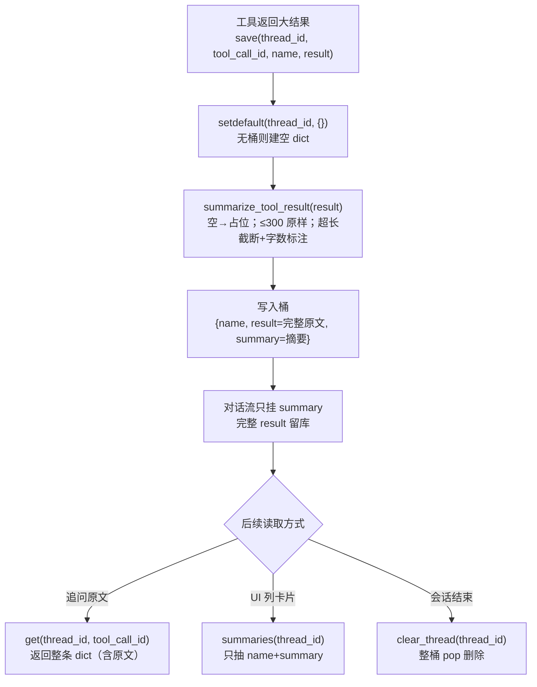

# tools/tool_result_store.py — tool_result_store.py

> **文件路径**: `backend/packages/harness/agentflow/tools/tool_result_store.py`
> **目录位置**: tools → tool_result_store.py
> **职责**: 工具结果存取模块（摘要截断 + 内存存储）

## 📑 目录

- [📋 结构图](#📋-结构图)
- [📤 关键导出](#📤-关键导出)
- [💡 设计思想](#💡-设计思想)
- [🎯 实用场景](#🎯-实用场景)
- [📊 顺序执行链流程图](#📊-顺序执行链流程图)
- [🧩 代码解析（成块对照 tool_result_store.py）](#🧩-代码解析成块对照-tool_result_storepy)
- [❓ Q&A](#❓-qa)
- [⚠️ 风险点](#⚠️-风险点)

## 📋 结构图

```text
┌────────────────────────────────────────────────────────────┐
│ _PREVIEW_MAX_CHARS = 1200（预览截断阈值，照原版常量）        │
│ _SUMMARY_MAX_CHARS = 300（摘要默认展示长度）                │
│                                                             │
│ summarize_tool_result(text, max_chars) -> str               │
│   工具结果 → 聊天可见摘要（非字符串先转字符串，超长截断）    │
│                                                             │
│ ToolResultStore（内存版）                                   │
│   save(thread_id, tool_call_id, name, result) → 存完整结果   │
│   get(thread_id, tool_call_id) → 取完整结果                 │
│   summaries(thread_id) → 列出该线程全部摘要                 │
│   clear_thread(thread_id) → 清空某线程结果                  │
└────────────────────────────────────────────────────────────┘
```

## 📤 关键导出

**类**

- `ToolResultStore`

**函数**

- `summarize_tool_result()`

**常量**

- `_PREVIEW_MAX_CHARS`
- `_SUMMARY_MAX_CHARS`

## 💡 设计思想

1. 学原版：工具可能返回大结果（网页/文件），对话流只展示摘要；
   完整结果按 thread_id + tool_call_id 存这里，供后续引用 / UI 展示。
2. M2 用内存 dict（进程内有效）；M3+ 如需跨进程再落 SQLite。
3. 摘要与完整结果分开存，避免对话上下文被大结果撑爆（token 成本控制）。

## 🎯 实用场景

1. 对话流只显摘要：工具返回大结果（网页/文件/搜索）时，聊天里只展示截断摘要，避免刷屏与上下文爆炸
2. 追问引用完整结果：用户问"刚才那个网页具体内容"，Agent 按 thread_id+tool_call_id 取回原文
3. 调试审计：summaries(thread_id) 列出某会话全部工具调用摘要，排查"工具当时返回了什么"
4. UI 工具卡片（M7）：gateway 返回工具调用记录、前端渲染工具卡片时读 name+summary
5. 多会话隔离：thread 维度键设计，进程内多会话并行不串扰

## 📊 顺序执行链流程图（一次工具结果的存与取）

```text
工具执行完返回大结果（request：save(thread_id, tool_call_id, name, result)）
│
▼
store.save(thread_id, tool_call_id, name, result)
│
├─ setdefault(thread_id, {})  ← 没有该线程桶就建空 dict
│
▼
summarize_tool_result(result)   ← 同一份结果同时压摘要
│   raw = str(text or "")
│   空串 → 返回 "（工具无输出）"
│   len(raw) <= 300 → 原样返回
│   超长 → raw[:300] + "…（已截断，原文 N 字）"
▼
写桶：_results[thread_id][tool_call_id] =
│     {"name":…, "result":完整原文, "summary":摘要}
▼
对话流只挂 summary（省 token）；完整 result 留在库里
│
├─ 用户追问"刚才那个网页原文" → get(thread_id, tool_call_id)
│     → _results.get(thread_id, {}).get(tool_call_id) → 整条 dict（含原文）
│
├─ UI 列某会话工具卡片 → summaries(thread_id)
│     → 只抽 {"name", "summary"} 列表
│
└─ 会话结束 → clear_thread(thread_id)
      → _results.pop(thread_id, None)
```

**Mermaid 版（GitHub / 飞书渲染；VSCode 需装插件）**：



## 🧩 代码解析（成块对照 tool_result_store.py）

> 读法：每块先贴**完整代码**，再看块下方的整块解析。代码与文件一致，仅省略头部规范注释。

### 块 1：imports + 两个截断阈值常量

```python
from __future__ import annotations

from typing import Any

# 预览截断阈值（照原版常量：大结果在聊天里只显示摘要）
_PREVIEW_MAX_CHARS = 1200

# 结果摘要默认展示长度
_SUMMARY_MAX_CHARS = 300
```

**结构简析**：只依赖 `Any`（result 类型任意）。两个下划线前缀的模块内部常量——`_PREVIEW_MAX_CHARS = 1200`（预览截断阈值，照原版常量）与 `_SUMMARY_MAX_CHARS = 300`（摘要默认展示长度，作为 `summarize_tool_result` 的 `max_chars` 默认值）。

本块无函数签名，不展开参数表。

**落库要点**：当前实现里 `summarize_tool_result` 默认用的是 `_SUMMARY_MAX_CHARS`（300），`_PREVIEW_MAX_CHARS` 保留对齐原版常量语义。调它们会影响**所有**工具摘要长度（风险点 1）。

### 块 2：`summarize_tool_result` —— 大结果压成聊天可见摘要

```python
def summarize_tool_result(text: str | Any, max_chars: int = _SUMMARY_MAX_CHARS) -> str:
    """把工具结果压成"聊天可见摘要"（学原版：正文完整存，展示用摘要）。

    规则:
      - 非字符串先转字符串
      - 超长截断 + "…（已截断，原文 N 字）"
      - 空结果返回占位
    """
    raw = str(text or "")
    if not raw.strip():
        return "（工具无输出）"
    if len(raw) <= max_chars:
        return raw
    return f"{raw[:max_chars]}…（已截断，原文 {len(raw)} 字）"
```

**结构简析**：三段式处理——① `str(text or "")`：非字符串（dict/异常对象/None）先转字符串，None/假值兜底空串；② 空白判断：`not raw.strip()` → 返回固定占位"（工具无输出）"，不让聊天里出现空白气泡；③ 截断：长度 ≤ `max_chars` 原样返回，否则切前 `max_chars` 字并标注"…（已截断，原文 N 字）"。

**`summarize_tool_result()` 参数逐条解释**：

| 参数 | 类型 | 默认值 | 含义 |
|---|---|---|---|
| `text` | `str \| Any` | 必填 | 工具原始结果；`str(text or "")` 先转字符串，None/假值兜底空串；转成空白串则返回"（工具无输出）"占位 |
| `max_chars` | `int` | `_SUMMARY_MAX_CHARS`（=300） | 摘要最大字符数；`len(raw) <= max_chars` 原样返回，否则截前 `max_chars` 字并追加"…（已截断，原文 N 字）" |

**落库要点**：截断标注里带原文总字数 `len(raw)`，为后续 `get` 按 tool_call_id 取回完整原文留线索；本函数只产摘要字符串，不写存储。

### 块 3：`ToolResultStore` 的 init / save / get —— 双层 dict 存取

```python
class ToolResultStore:
    """工具结果存取（内存版）。

    为什么存在（学原版）：工具可能返回大结果（网页/文件），
    对话流只展示摘要；完整结果按 thread_id + tool_call_id 存这里，
    供后续引用/UI 展示（M7 gateway 接它）。
    M2 用内存 dict（进程内有效）；M3+ 如需跨进程再落 SQLite。
    """

    def __init__(self) -> None:
        # thread_id → {tool_call_id: {"name": ..., "result": ..., "summary": ...}}
        self._results: dict[str, dict[str, dict[str, Any]]] = {}

    def save(self, thread_id: str, tool_call_id: str, name: str, result: Any) -> None:
        """保存工具结果（自动生成摘要）。"""
        self._results.setdefault(thread_id, {})[tool_call_id] = {
            "name": name,
            "result": result,
            "summary": summarize_tool_result(result),
        }

    def get(self, thread_id: str, tool_call_id: str) -> dict[str, Any] | None:
        """按 thread + call id 取完整结果。"""
        return self._results.get(thread_id, {}).get(tool_call_id)
```

**结构简析**：存储结构是**双层 dict**——外层 key=thread_id（会话隔离），内层 key=tool_call_id（同会话内每次工具调用唯一），叶子是固定三字段 `{name, result, summary}`。`save` 用 `setdefault(thread_id, {})` 保证首次写某会话时自动建桶，存的时候自动调 summarize 生成摘要，调用方不用管。`get` 双层 `.get(..., {})` 兜底：会话不存在、call_id 不存在都返回 None，不抛 KeyError。

（`__init__` 无业务参数，仅初始化 `self._results = {}`，不展开参数表。）

**`save()` 参数逐条解释**：

| 参数 | 类型 | 默认值 | 含义 |
|---|---|---|---|
| `thread_id` | `str` | 必填 | 会话 ID；作为外层桶 key，`setdefault(thread_id, {})` 无桶时自动建空 dict |
| `tool_call_id` | `str` | 必填 | 本次工具调用唯一 ID；作为内层 key，同 call_id 重复 save 会覆盖旧记录 |
| `name` | `str` | 必填 | 工具名；存入叶子 dict 的 `name` 字段，供 summaries 投影 / UI 卡片展示 |
| `result` | `Any` | 必填 | 工具完整原始结果；原样存入 `result` 字段，同时喂给 `summarize_tool_result` 自动生成 `summary` |

**`get()` 参数逐条解释**：

| 参数 | 类型 | 默认值 | 含义 |
|---|---|---|---|
| `thread_id` | `str` | 必填 | 会话 ID；`self._results.get(thread_id, {})` 会话不存在时兜底空桶 |
| `tool_call_id` | `str` | 必填 | 工具调用 ID；双层 `.get` 后命中返回整条叶子 dict `{name, result, summary}`，未命中返回 None |

**落库要点**：叶子固定三字段——`name`（工具名）、`result`（完整原文，对话流不挂）、`summary`（截断摘要，对话流只挂这个省 token）；摘要在 save 时一次性算好，get/summaries 不重复算。

### 块 4：`summaries` + `clear_thread` —— 列表展示与整桶清理

```python
    def summaries(self, thread_id: str) -> list[dict[str, str]]:
        """列出某线程的全部工具摘要（对话流展示用）。"""
        return [
            {"name": r["name"], "summary": r["summary"]}
            for r in (self._results.get(thread_id) or {}).values()
        ]

    def clear_thread(self, thread_id: str) -> None:
        """清空某线程的工具结果。"""
        self._results.pop(thread_id, None)
```

**结构简析**：`summaries` 用列表推导**只投影两个字段**（name + summary）——刻意不把完整 result 吐出来，这是给 UI 工具卡片/对话流用的轻量视图，避免把大结果全量带出；`(self._results.get(thread_id) or {})` 兜底 None。`clear_thread` 用 `pop(thread_id, None)` 整桶删除（会话结束/重试时回收内存），第二个参数 None 表示桶不存在也不报错。

**`summaries()` 参数逐条解释**：

| 参数 | 类型 | 默认值 | 含义 |
|---|---|---|---|
| `thread_id` | `str` | 必填 | 会话 ID；遍历该线程桶内全部叶子，每条只取 `{"name", "summary"}` 组成列表，绝不带出完整 `result` |

**`clear_thread()` 参数逐条解释**：

| 参数 | 类型 | 默认值 | 含义 |
|---|---|---|---|
| `thread_id` | `str` | 必填 | 会话 ID；`pop(thread_id, None)` 整桶删除回收内存，桶不存在时不报错 |

**落库要点**：`summaries` 是对话流/UI 工具卡片的只读视图（只吐 name+summary）；会话结束或重试时调 `clear_thread` 回收整桶内存。

## ❓ Q&A

**Q: 为什么摘要和原文分开存？**

A: 对话流 token 成本：只放摘要进上下文；原文按需取回，不重新调工具

**Q: 内存版会丢数据吗？**

A: 进程重启即丢；M3+ 跨进程场景落 SQLite 即可

## ⚠️ 风险点

1. _PREVIEW_MAX_CHARS / _SUMMARY_MAX_CHARS 是全局常量，调整影响所有摘要长度
2. 内存 dict 进程内有效；进程重启后结果丢失（当前仅调试用，可接受）

---
_自动生成于 doc-code 规范落地（2026-09-28）。来源：tool_result_store.py 头部注释 + 顶层符号。_
_2026-09-30 补齐：目录 + 顺序执行链流程图 + 成块代码解析（+Q&A）。_
_2026-10-03 重构：代码解析段按「结构简析 + 参数逐条表格 + 落库要点」规范化（代码块零改动）。_
