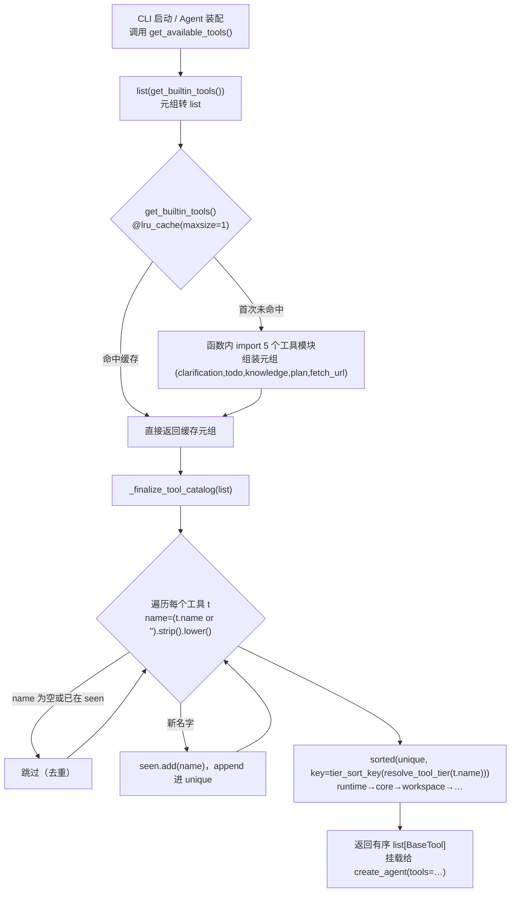

# tools/tools.py — tools.py

> **文件路径**: `backend/packages/harness/agentflow/tools/tools.py`
> **目录位置**: tools → tools.py
> **职责**: 工具收集模块（延迟加载 + 去重 + 按Tier排序）

## 📑 目录

- [📋 结构图](#📋-结构图)
- [📤 关键导出](#📤-关键导出)
- [💡 设计思想](#💡-设计思想)
- [🎯 实用场景](#🎯-实用场景)
- [📊 顺序执行链流程图](#📊-顺序执行链流程图)
- [🧩 代码解析（成块对照 tools.py）](#🧩-代码解析成块对照-toolspy)
- [❓ Q&A](#❓-qa)
- [⚠️ 风险点](#⚠️-风险点)

## 📋 结构图

```text
┌────────────────────────────────────────────────────────────┐
│ get_builtin_tools() -> tuple[BaseTool, ...]                 │
│   @lru_cache：首次调用才导入 5 个工具模块，加快项目启动速度  │
│   返回内置工具元组：(clarification, todo, knowledge, plan,  │
│                     fetch_url)                              │
│                                                             │
│ _finalize_tool_catalog(tools) -> list[BaseTool]             │
│   工具目录后置处理：                                         │
│     ① 根据工具 name 去重，保留第一个出现的工具定义          │
│     ② 依据 ToolTier 优先级顺序进行排序（runtime → core →    │
│        workspace → …）                                      │
│                                                             │
│ get_available_tools() -> list[BaseTool]                     │
│   对外入口：输出最终挂载给 Agent 使用的工具列表             │
└────────────────────────────────────────────────────────────┘
```

## 📤 关键导出

**函数**

- `get_builtin_tools()`
- `get_available_tools()`

## 💡 设计思想

1. 参考文档：doc/doc-dev/01-里程碑/M2-工具与中间件.md §2
2. 原版 EvoFlow 设计动机：工具数量庞大（50+），启动时一次性全部 import
   会拖慢启动；使用 @lru_cache + 函数内部 import 实现延迟加载：
   仅第一次调用 get_builtin_tools 时加载，后续直接复用缓存。
3. M2 精简改造：移除退役工具表、工具别名、社区工具、沙箱相关逻辑，
   只保留核心收集流程。

## 🎯 实用场景

1. Agent 启动装配：get_available_tools() 输出最终挂载给 Agent 的工具列表（CLI/未来 gateway 共用）
2. 工具开发回归：新增工具后测试去重与 tier 排序是否生效
3. 性能敏感场景：lru_cache 延迟加载避免启动时 import 全部工具模块（requests 等重依赖）
4. 原版对齐演示：对照 EvoFlow 原版 tools.py（566 行）理解"收集-去重-排序"管线

## 📊 顺序执行链流程图（Agent 启动装配工具时）

```text
CLI 启动 / Agent 装配（request：get_available_tools()）
│
▼
get_available_tools()          ← 对外入口：要最终挂载给 Agent 的工具列表
│
▼
list(get_builtin_tools())      ← 先把内置工具元组转 list
│
▼
get_builtin_tools()            ← @lru_cache(maxsize=1)：首次才执行函数体
│                                函数内 import 5 个工具模块（延迟加载）
▼
组装元组返回                    ← (ask_clarification_tool, todo_tool,
│                                knowledge_tool, plan_tool, fetch_url_tool)
▼
_finalize_tool_catalog(list)    ← 工具目录收尾：去重 + 排序
│
├─ 遍历每个工具：name = (t.name or "").strip().lower()
│   ├─ name 为空 / 已在 seen 里 → 跳过（去重：同名只留第一个）
│   └─ 否则 → seen.add(name)，append 进 unique
│
▼
sorted(unique, key=tier排序)    ← key=tier_sort_key(resolve_tool_tier(t.name))
│                                runtime→core→workspace→plan→goal→optional→retired
▼
返回有序 list[BaseTool]         ← 挂载给 create_agent(tools=...)
```

**Mermaid 版（GitHub / 飞书渲染；VSCode 需装插件）**：



## 🧩 代码解析（成块对照 tools.py）

> 读法：每块先贴**完整代码**，再看块下方的整块解析。代码与文件一致，仅省略头部规范注释。

### 块 1：imports —— 只依赖排序所需的两个同域函数

```python
from __future__ import annotations

from functools import lru_cache

from langchain.tools import BaseTool

from agentflow.tools.tool_catalog import resolve_tool_tier, tier_sort_key
```

**整块解析**：模块级 import 保持极轻——`lru_cache`（缓存装饰器）、`BaseTool`（类型标注用，不实例化）、以及 tool_catalog 里的两个排序函数 `resolve_tool_tier` / `tier_sort_key`。注意 5 个真正的工具模块**一个都不在顶部 import**——它们被推迟到 `get_builtin_tools()` 函数体内（块 2），这就是延迟加载的落点：import tools.py 本身不拖慢启动。

### 块 2：`get_builtin_tools` —— lru_cache + 函数内 import 的延迟加载

```python
@lru_cache(maxsize=1)
def get_builtin_tools() -> tuple[BaseTool, ...]:
    """收集全部内置工具（延迟加载：函数内 import，照原版）。

    为什么延迟：5 个工具模块含 requests 等重量依赖，
    全部模块级 import 会拖慢 CLI 启动；lru_cache 保证只加载一次。
    """
    from agentflow.tools.builtins.clarification_tool import ask_clarification_tool
    from agentflow.tools.builtins.fetch_url_tool import fetch_url_tool
    from agentflow.tools.builtins.knowledge_tool import knowledge_tool
    from agentflow.tools.builtins.plan_tool import plan_tool
    from agentflow.tools.builtins.todo_tool import todo_tool

    return (
        ask_clarification_tool,
        todo_tool,
        knowledge_tool,
        plan_tool,
        fetch_url_tool,
    )
```

**整块解析**：两个机制叠加——① **函数内 import**：5 个工具模块的 import 写在函数体里，只有第一次调用本函数时才真正加载（requests 等重依赖不进启动路径）；② `@lru_cache(maxsize=1)`：本函数无参数，`maxsize=1` 缓存唯一返回值，之后每次调用直接命中缓存，不重复 import、不重复构造工具对象。返回的是**工具对象元组**（已 @tool 装饰好），顺序是"收集顺序"（clarification→todo→knowledge→plan→fetch_url），后续由 `_finalize_tool_catalog` 去重排序。

### 块 3：`_finalize_tool_catalog` —— 按 name 去重 + 按 tier 排序

```python
def _finalize_tool_catalog(tools: list[BaseTool]) -> list[BaseTool]:
    """工具目录收尾：去重 + 按 tier 排序（照原版思想，简化版）。

    去重规则：同名只保留第一个（避免重复注册报错/重复挂载）。
    排序规则：runtime → core → workspace → plan → goal → optional → retired。
    """
    seen: set[str] = set()
    unique: list[BaseTool] = []
    for t in tools:
        name = (t.name or "").strip().lower()
        if not name or name in seen:
            continue
        seen.add(name)
        unique.append(t)
    return sorted(unique, key=lambda t: tier_sort_key(resolve_tool_tier(t.name)))
```

**整块解析**：两步收尾——① **去重**：`seen` 集合记录已见工具名（归一化：strip 去空格 + lower 转小写），空名跳过、同名跳过，**只保留第一个出现的**；② **排序**：`sorted` 的 key 是两段联动——先 `resolve_tool_tier(t.name)` 查工具档位（未知兜底 optional），再 `tier_sort_key` 转成 `TOOL_TIER_ORDER` 里的下标整数，下标越小越靠前（runtime=0 最前，retired=6 最后）。排序是稳定的，去重后顺序相同的工具保持收集先后。

### 块 4：`get_available_tools` —— 对外入口

```python
def get_available_tools() -> list[BaseTool]:
    """返回最终给 Agent 挂载的工具列表（M2 = 全部内置工具）。"""
    return _finalize_tool_catalog(list(get_builtin_tools()))
```

**整块解析**：一行串起整条管线——`get_builtin_tools()`（缓存收集元组）→ `list(...)`（转 list）→ `_finalize_tool_catalog(...)`（去重+排序）→ 返回给 `create_agent(tools=...)`。M2 阶段"可用工具 = 全部内置工具"，没有外部工具注入/过滤逻辑；未来 gateway 加社区工具时，在这一层并集后再 finalize。

## ❓ Q&A

**Q: 为什么延迟加载？**

A: 5 个工具模块含 requests 等重依赖，模块级 import 拖慢 CLI 启动；lru_cache 保证只加载一次，之后复用

**Q: lru_cache 怎么清？**

A: 修改工具定义后需重启进程（或手动 cache_clear）；调试期重启最省事

**Q: "延迟收集（lru_cache）"是什么意思？（2026-09-30 用户提问）**

A: 两个词拆开看——**"延迟"是加载时机，lru_cache 是只加载一次**，合起来叫"延迟收集"。

**① "延迟" = 函数内 import（lazy import）**：

```python
# 普通写法（模块顶部 import）——import tools.py 时就立刻加载 5 个工具模块
from agentflow.tools.builtins.todo_tool import todo_tool   # ← 在文件顶部
from agentflow.tools.builtins.fetch_url_tool import fetch_url_tool  # ← 也在顶部
# 代价：只要 import tools.py，requests 等重量依赖全部立即加载 → 拖慢启动

# 实际写法（函数内 import）——只有第一次调用时才加载
def get_builtin_tools():
    from agentflow.tools.builtins.clarification_tool import ask_clarification_tool  # ← 在函数体里
    ...
```

效果对比：

| 时机 | 顶部 import | 函数内 import（延迟） |
|---|---|---|
| import tools.py 时 | 立刻加载全部工具（重依赖全上） | 什么都不加载，秒开 |
| 第一次调 get_builtin_tools() | —（早已加载） | 此时才加载 5 个工具模块 |
| CLI 启动体验 | 慢（原版 50+ 工具问题更大） | 快 |

**② "收集" = 组装工具**：函数体把 5 个工具对象收进一个元组返回（clarification, todo, knowledge, plan, fetch_url）。

**③ lru_cache(maxsize=1) = 只执行一次**：第一次调用真正执行函数体（import + 收集），结果缓存；之后每次调用**直接返回缓存元组**，不重复 import、不重复构造工具对象。`maxsize=1` 是因为函数无参数，缓存 1 个条目就够。

时序示例：

```text
第 1 次: uv run agentflow
  → import tools.py（工具模块未加载，启动快）
  → main() 调 get_available_tools() → get_builtin_tools() 首次执行
  → 函数内 import 5 个工具 → 组装元组 → 缓存
第 2 次（同进程再调，如测试/多次装配）:
  → get_builtin_tools() 直接返回缓存，不重复加载
```

**⚠️ 副作用（风险点 2）**：缓存的是工具对象——**改了工具代码后不重启进程不生效**（拿到的还是旧对象）。调试期改工具记得重启，或 `get_builtin_tools.cache_clear()`。

## ⚠️ 风险点

1. TOOL_TIER_ORDER 元组顺序直接影响工具排序结果，不可随意调整
2. get_builtin_tools 带有 lru_cache 缓存；修改工具定义后，需要清空缓存才能生效
3. 去重规则：按工具 name 字段，保留最先出现的工具，丢弃后续同名工具

---
_自动生成于 doc-code 规范落地（2026-09-28）。来源：tools.py 头部注释 + 顶层符号。_
_2026-09-30 追加：Q&A 归档区（"延迟收集 lru_cache"详解：延迟=函数内 import、缓存=只加载一次、副作用=改代码要清缓存，用户提问自动归纳）。_
_2026-09-30 补齐：目录 + 顺序执行链流程图 + 成块代码解析（+Q&A）。_
