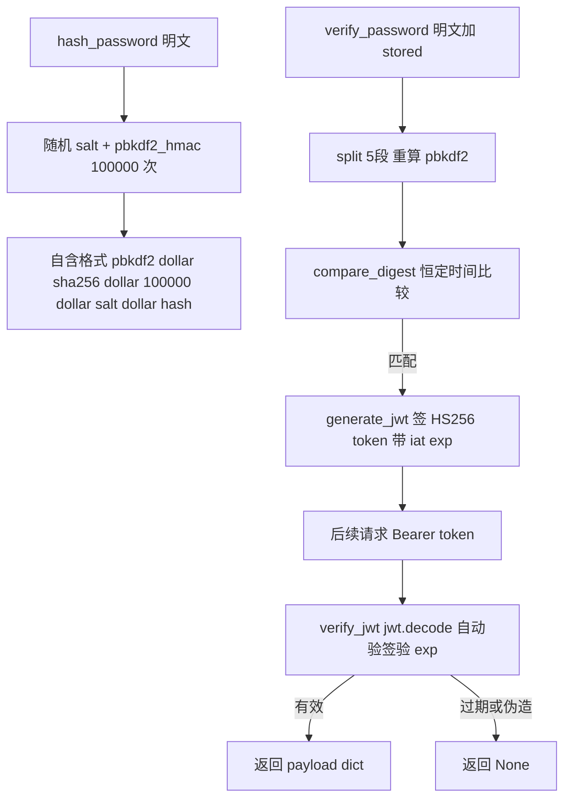

# webui/auth.py — auth.py

> **文件路径**: `backend/packages/harness/agentflow/webui/auth.py`
> **目录位置**: webui → auth.py
> **职责**: 登录鉴权——PBKDF2 密码哈希 + JWT（HS256）签发/校验（M6）

## 📑 目录

- [📋 结构图](#-结构图)
- [📤 关键导出](#-关键导出)
- [💡 设计思想](#-设计思想)
- [🎯 实用场景](#-实用场景)
- [📊 顺序执行链流程图](#-顺序执行链流程图)
- [🧩 代码解析（成块对照 auth.py）](#-代码解析成块对照-authpy)
- [❓ Q&A / 知识点](#-qa--知识点)
- [⚠️ 风险点](#-风险点)

## 📋 结构图

```text
┌──────────────────────────────────────────────────────────────┐
│ 常量:                                                        │
│   _PBKDF2_ALGO="sha256"  _PBKDF2_ITERATIONS=100_000          │
│   _SALT_BYTES=16  _HASH_FORMAT="pbkdf2$...$...$...$..."      │
│   _JWT_ALGORITHM="HS256"  _JWT_EXPIRY_SECONDS=7天            │
│                                                              │
│ hash_password(pw) → "pbkdf2$sha256$100000$<salt>$<hash>"     │
│ verify_password(pw, stored) → bool（secrets.compare_digest）  │
│ generate_jwt(sub, username, secret) → token（HS256/iat/exp）│
│ verify_jwt(token, secret) → payload dict | None              │
└──────────────────────────────────────────────────────────────┘
```

## 📤 关键导出

**函数**

- `hash_password` / `verify_password`：PBKDF2 密码哈希与校验
- `generate_jwt` / `verify_jwt`：JWT 签发与校验

## 💡 设计思想

1. **PBKDF2-HMAC-SHA256（标准库 hashlib）**：100000 次迭代抗暴力破解；格式自含
   （算法/迭代数/salt 随哈希一起存），未来升级迭代数不破旧哈希。
2. **secrets.compare_digest 恒定时间比较**：防时序攻击（直接 `==` 会泄漏长度/内容）。
3. **JWT 用 PyJWT**：payload 带 `sub`/`username`/`iat`/`exp`；过期校验由 `jwt.decode`
   自动完成（exp 过期抛异常 → 返回 None）。
4. **容错不抛异常**：任何校验失败返回 `None`/`False`，守卫层统一处理 401。

## 🎯 实用场景

1. **建账号**：注册/初始化时 `hash_password(明文)` 落库自含格式串。
2. **登录校验**：`verify_password(明文, 库里哈希)` 过了再 `generate_jwt(...)` 发 token。
3. **请求鉴权**：`verify_jwt(token, secret)` 验签 + 验过期，拿到 payload（sub/username）。
4. **被守卫复用**：`authz/http_guard.py` 的 `resolve_auth_from_headers` 内部调 `verify_jwt`。

## 📊 顺序执行链流程图

**调用方**：`verify_jwt` ← `authz/http_guard.py`（守卫解析身份）；
`hash/verify_password`、`generate_jwt` ← webui 登录/建号流程。

```text
登录流程
│
├─ hash_password(明文) → 随机salt + pbkdf2_hmac → "pbkdf2$sha256$100000$salt$hash"
│
└─ verify_password(明文, stored)
      split("$") → 校验5段/前缀pbkdf2 → 重算pbkdf2 → compare_digest → bool
            │
            ▼（密码对了）
        generate_jwt(sub, username, secret)
          payload={sub,username,iat,exp=now+7天} → jwt.encode(HS256) → token
            │
            ▼（后续请求带 Authorization: Bearer <token>）
        verify_jwt(token, secret)
          jwt.decode(自动验签+验exp) → payload dict | None（异常统一 None）
```

**Mermaid 版（GitHub / 飞书渲染）**：



## 🧩 代码解析（成块对照 auth.py）

> 读法：每块先贴**完整代码**，再看块下方的整块解析。代码与文件一致。

### 块 1：imports + 模块常量

```python
from __future__ import annotations

import hashlib
import os
import secrets
import time
from typing import Any

_PBKDF2_ALGO = "sha256"
_PBKDF2_ITERATIONS = 100_000
_SALT_BYTES = 16
_HASH_FORMAT = "pbkdf2${algo}${iterations}${salt_hex}${hash_hex}"

_JWT_ALGORITHM = "HS256"
_JWT_EXPIRY_SECONDS = 7 * 24 * 3600  # 7 天
```

**结构简析**：标准库（hashlib/os/secrets/time/Any）。PBKDF2 侧四常量：算法 sha256、
迭代 100000、salt 16 字节、自含格式串。JWT 侧两常量：算法 HS256、过期 7 天。

**常量逐条解释**：

| 常量 | 值 | 含义 |
|---|---|---|
| `_PBKDF2_ALGO` | `"sha256"` | PBKDF2 摘要算法（HMAC-SHA256） |
| `_PBKDF2_ITERATIONS` | `100_000` | 迭代次数，抗暴力破解（越大越慢越安全） |
| `_SALT_BYTES` | `16` | 随机盐字节数（`os.urandom(16)`） |
| `_HASH_FORMAT` | `"pbkdf2${algo}${iterations}${salt_hex}${hash_hex}"` | 自含格式模板：算法/迭代/salt/hash 五段用 `$` 分隔 |
| `_JWT_ALGORITHM` | `"HS256"` | JWT 签名算法（HMAC-SHA256 对称） |
| `_JWT_EXPIRY_SECONDS` | `7 * 24 * 3600` | token 默认有效期 7 天 |

**落库要点**：`_HASH_FORMAT` 五段——`pbkdf2` / algo / iterations / salt_hex / hash_hex，
verify 时按 `$` split 回这五段重算。

### 块 2：`hash_password` + `verify_password` —— PBKDF2 自含格式

```python
def hash_password(password: str) -> str:
    """PBKDF2-HMAC-SHA256 哈希密码，返回自含格式字符串。

    格式: pbkdf2$sha256$100000$<salt_hex>$<hash_hex>
    """
    salt = os.urandom(_SALT_BYTES)
    dk = hashlib.pbkdf2_hmac(_PBKDF2_ALGO, password.encode("utf-8"), salt, _PBKDF2_ITERATIONS)
    return _HASH_FORMAT.format(
        algo=_PBKDF2_ALGO,
        iterations=_PBKDF2_ITERATIONS,
        salt_hex=salt.hex(),
        hash_hex=dk.hex(),
    )


def verify_password(password: str, stored_hash: str) -> bool:
    """校验明文密码是否匹配存储哈希。恒定时间比较，失败返回 False。"""
    try:
        parts = stored_hash.split("$")
        if len(parts) != 5 or parts[0] != "pbkdf2":
            return False
        algo = parts[1]
        iterations = int(parts[2])
        salt = bytes.fromhex(parts[3])
        expected_hash = bytes.fromhex(parts[4])
        dk = hashlib.pbkdf2_hmac(algo, password.encode("utf-8"), salt, iterations)
        return secrets.compare_digest(dk, expected_hash)
    except (ValueError, IndexError):
        return False
```

**结构简析**：`hash_password` 每次随机盐 + pbkdf2_hmac，输出五段自含串；`verify_password`
把存储串 split 回五段、用**存里记录的 algo/iterations/salt** 重算，再 `compare_digest` 恒定时间比较。
任何格式错/解析错都 `return False`（不抛）。

**`hash_password()` 参数逐条解释**：

| 参数 | 类型 | 默认值 | 含义 |
|---|---|---|---|
| `password` | `str` | 必填 | 明文密码；`encode("utf-8")` 后喂 pbkdf2_hmac |

**`verify_password()` 参数逐条解释**：

| 参数 | 类型 | 默认值 | 含义 |
|---|---|---|---|
| `password` | `str` | 必填 | 用户输入的明文密码 |
| `stored_hash` | `str` | 必填 | `hash_password` 产出的自含格式串；split 后须正好 5 段且首段 `pbkdf2`，否则 False |

**落库要点**：迭代数和算法**随哈希一起存**——将来把 `_PBKDF2_ITERATIONS` 调大，旧哈希仍按它自己记录的次数校验，不破旧数据；`compare_digest` 防时序侧信道。

### 块 3：`generate_jwt` + `verify_jwt` —— JWT HS256

```python
def generate_jwt(
    subject: str,
    username: str,
    secret: str,
    *,
    expires_in: int = _JWT_EXPIRY_SECONDS,
) -> str:
    """签发 JWT（HS256）。subject 通常是用户/主体 id，username 便于展示。"""
    import jwt

    now = int(time.time())
    payload: dict[str, Any] = {
        "sub": subject,
        "username": username,
        "iat": now,
        "exp": now + expires_in,
    }
    return jwt.encode(payload, secret, algorithm=_JWT_ALGORITHM)


def verify_jwt(token: str, secret: str) -> dict[str, Any] | None:
    """校验 JWT：签名有效 + 未过期 → payload dict；否则 None（不抛异常）。"""
    import jwt

    try:
        payload = jwt.decode(token, secret, algorithms=[_JWT_ALGORITHM])
        return payload if isinstance(payload, dict) else None
    except Exception:  # noqa: BLE001 —— 任何 JWT 异常（过期/伪造/格式错）统一 None
        return None
```

**结构简析**：`generate_jwt` 懒 `import jwt`（PyJWT），payload 带 `sub`/`username`/`iat`/`exp`，
HS256 签名。`verify_jwt` 用 `jwt.decode(..., algorithms=["HS256"])`——**过期校验由 decode 自动完成**
（exp 过期抛异常），任何异常统一吞成 `None`。

**`generate_jwt()` 参数逐条解释**：

| 参数 | 类型 | 默认值 | 含义 |
|---|---|---|---|
| `subject` | `str` | 必填 | 主体 id（写进 payload.sub） |
| `username` | `str` | 必填 | 展示用用户名（写进 payload.username） |
| `secret` | `str` | 必填 | HS256 对称签名密钥 |
| `expires_in` | `int` | `_JWT_EXPIRY_SECONDS`（7 天） | 有效期秒数；`exp = now + expires_in` |

**`verify_jwt()` 参数逐条解释**：

| 参数 | 类型 | 默认值 | 含义 |
|---|---|---|---|
| `token` | `str` | 必填 | 待校验 JWT；签名无效/过期/格式错均 → `None` |
| `secret` | `str` | 必填 | 与签发时相同的 HS256 密钥 |

**落库要点**：`algorithms=["HS256"]` 写死算法白名单（防 `alg=none` 混淆攻击）；`iat`/`exp` 是 unix 秒。

## ❓ Q&A / 知识点

### 1. PBKDF2 的"自含格式"好在哪？

**一句话**：`pbkdf2$sha256$100000$<salt>$<hash>` 把算法、迭代数、盐**都跟着哈希一起存**——
校验时不用额外查表，且将来调大迭代数不破坏旧哈希（旧哈希仍按它自己记录的 100000 次校验）。

对比"全局固定迭代数单独配置"：那种方式升级参数后旧数据要么校验失败、要么得重哈希。自含格式
是"每条哈希自带它的锻造参数"，平滑升级。

### 2. verify_jwt 的过期校验是怎么做的？需要自己判断 exp 吗？

**一句话**：不用——`jwt.decode(token, secret, algorithms=["HS256"])` 自动校验签名**和**过期时间，
exp 一过就抛异常，代码里 `except Exception → return None`。

所以业务侧拿到非 None 就意味着"签名有效且未过期"，直接用 payload。这也是为什么异常要全吞：
过期/伪造/格式错在守卫层都等价于 401，不需要区分。

### 3. AuthRequiredError 的 401 语义和本模块什么关系？

**一句话**：本模块只产出"是否有效"（verify_jwt 返回 payload 或 None），**不抛异常**；
真正抛 `AuthRequiredError`（HTTP 401 语义）的是 `authz/http_guard.py`——它在 verify_jwt 返回 None 时抛错，
HTTP 层捕获后返 401 JSON。

分工：auth.py 是"纯函数判定 + 容错返回 None/False"，http_guard/middleware 是"把 None 翻译成 401 异常"。

### 4. 为什么用 secrets.compare_digest 而不是 == 比较哈希？

**一句话**：普通 `==` 比较字节串时是"找到第一个不同字节就返回"，耗时随匹配长度变化——
攻击者可测响应时间反推正确哈希（时序攻击）。`compare_digest` 恒定时间比较，堵住这条侧信道。

密码哈希比较虽不是直接网络高频面，但这是密码学惯例写法，成本为零，必须做对。

## ⚠️ 风险点

1. **JWT 密钥强度**：`secret` 一旦泄漏，任何人都能自签有效 token。M6 用配置 secret 直签——
   务必用足够长的随机串，勿硬编码进源码；换 secret 会使所有已发 token 立即失效。
2. **7 天有效期偏长**：token 被盗后 7 天内可用；M6 无刷新/吊销机制，要缩短需改 `_JWT_EXPIRY_SECONDS`
   或签发时传 `expires_in`。
3. **verify 全异常吞成 None**：过期/伪造/格式错误无差别返回 None，排障时分不清是哪种失败
   （守卫层统一 401，不区分原因）。
4. **PBKDF2 100000 次有成本**：每次登录/校验都要算 10 万次迭代——是刻意的慢，但高频登录下
   可能被用作低成本 DoS（M6 内网工具可接受）。

---
_2026-10-05 M6 新增：目录 + 结构图 + 流程图 + 成块代码解析（参数逐条表）+ Q&A。_
