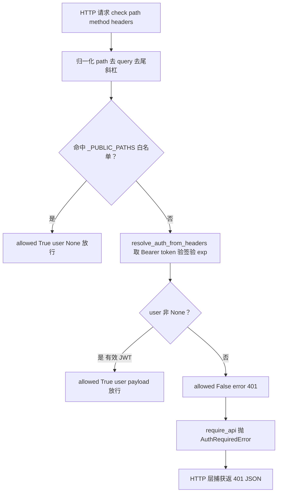

# webui/middleware.py — middleware.py

> **文件路径**: `backend/packages/harness/agentflow/webui/middleware.py`
> **目录位置**: webui → middleware.py
> **职责**: 登录鉴权守卫（纯函数版）——public 白名单放行 / JWT 校验 / 401 语义（M6）

## 📑 目录

- [📋 结构图](#-结构图)
- [📤 关键导出](#-关键导出)
- [💡 设计思想](#-设计思想)
- [🎯 实用场景](#-实用场景)
- [📊 顺序执行链流程图](#-顺序执行链流程图)
- [🧩 代码解析（成块对照 middleware.py）](#-代码解析成块对照-middlewarepy)
- [❓ Q&A / 知识点](#-qa--知识点)
- [⚠️ 风险点](#-风险点)

## 📋 结构图

```text
┌──────────────────────────────────────────────────────────────┐
│ _PUBLIC_PATHS = {"/login","/health","/static","/favicon.ico","/"}│
│                                                              │
│ WebuiAuthGuard(secret)                                      │
│   check(path, method="GET", headers=None) -> dict           │
│     ① 归一化 path（去 query/尾斜杠）→ 命中白名单 → allow(user=None)│
│     ② resolve_auth_from_headers(headers, secret) 有效 → allow(user=payload)│
│     ③ 其余 → deny(error="Authentication required (401)")      │
│   require_api(headers, path="/api", method="GET") -> payload│
│     拒绝时 raise AuthRequiredError（HTTP 层捕获返 401 JSON）  │
└──────────────────────────────────────────────────────────────┘
```

## 📤 关键导出

**类**

- `WebuiAuthGuard`（守卫：public 白名单 + token 校验 + 401 语义）

## 💡 设计思想

1. **纯逻辑可测**：不依赖 Starlette/FastAPI——任何人可对 `check()` 断言放行/拒绝语义，
   CLI 环境可测。
2. **白名单先行**：公开路径（/login /health /静态资源）不鉴权，其余全拦。
3. **单层守卫**：M6 只有 JWT 一层；M7 加主体/ACL 时在此扩展 `check` 分支。
4. **判定与抛错分离**：`check` 返回 dict（不抛），`require_api` 才把拒绝翻译成 `AuthRequiredError`。

## 🎯 实用场景

1. **HTTP 层接线**：webui 每个请求先 `guard.check(path, method, headers)` 决定放行还是 401。
2. **API 入口**：`require_api(headers)` 直接拿到 payload，拒绝时抛 `AuthRequiredError` 由框架捕获返 401 JSON。
3. **登录页/静态资源**：`/login` `/static` `/` 在白名单内，未登录也能访问。
4. **测试断言**：构造 `WebuiAuthGuard(secret)`，对 `check()` 喂不同 path/headers 断言 `allowed` 真假。

## 📊 顺序执行链流程图

**调用方**：`WebuiAuthGuard` ← webui HTTP 层；`resolve_auth_from_headers` ← `authz/http_guard.py`
（内部再调 `webui/auth.py:verify_jwt`）。

```text
HTTP 请求进来
│
└─ guard.check(path, method, headers)
        │
        ▼
    normalized_path = path.split("?")[0].rstrip("/") or "/"
        │
        ▼
    ① normalized_path in _PUBLIC_PATHS?
        是 → return {allowed:True, user:None}   ← 白名单放行
        否 ↓
    ② user = resolve_auth_from_headers(headers, secret)
        （取 Bearer token → verify_jwt 验签+验exp）
        user 非 None → return {allowed:True, user:payload}
        None ↓
    ③ return {allowed:False, error:"Authentication required (401)"}
        │
        ▼（require_api 包装时）
    not allowed → raise AuthRequiredError(error) → HTTP 层返 401 JSON
```

**Mermaid 版（GitHub / 飞书渲染）**：



## 🧩 代码解析（成块对照 middleware.py）

> 读法：每块先贴**完整代码**，再看块下方的整块解析。代码与文件一致。

### 块 1：imports + `_PUBLIC_PATHS` + `WebuiAuthGuard.__init__` + `check`

```python
from __future__ import annotations

from typing import Any

from agentflow.authz.http_guard import AuthRequiredError, resolve_auth_from_headers

# 公开路径白名单（不鉴权）：登录/健康检查/静态资源
_PUBLIC_PATHS = {"/login", "/health", "/static", "/favicon.ico", "/"}


class WebuiAuthGuard:
    """登录鉴权守卫（纯逻辑版）。

    用法:
        guard = WebuiAuthGuard(secret)
        result = guard.check(path, method, headers)
        # result == {"allowed": True, "user": payload | None} 放行
        # result == {"allowed": False, "error": "..."}        拒绝（401 语义）
    """

    def __init__(self, secret: str) -> None:
        self._secret = secret

    def check(
        self,
        path: str,
        method: str = "GET",
        headers: dict[str, str] | None = None,
    ) -> dict[str, Any]:
        """核心判定：路径/方法/headers → 放行或拒绝。

        规则顺序:
            1. public path 白名单 → 直接放行（user=None）
            2. 有有效 JWT → 放行（user=payload）
            3. 其余 → 拒绝（401 语义）
        """
        normalized_path = (path or "").split("?")[0].rstrip("/") or "/"
        if normalized_path in _PUBLIC_PATHS:
            return {"allowed": True, "user": None}
        user = resolve_auth_from_headers(headers, self._secret)
        if user is not None:
            return {"allowed": True, "user": user}
        return {"allowed": False, "error": "Authentication required (401)"}
```

**结构简析**：从 `authz.http_guard` 导入 `AuthRequiredError`（401 异常载体）与
`resolve_auth_from_headers`（只解析不抛错）。`_PUBLIC_PATHS` 是公开路径集合。
`check` 按固定顺序三步判定：归一化 path → 白名单命中放行 → 有效 JWT 放行 → 否则拒绝。

**`__init__()` 参数逐条解释**：

| 参数 | 类型 | 默认值 | 含义 |
|---|---|---|---|
| `secret` | `str` | 必填 | JWT HS256 签名密钥；存 `self._secret`，传给 `resolve_auth_from_headers` 验签 |

**`check()` 参数逐条解释**：

| 参数 | 类型 | 默认值 | 含义 |
|---|---|---|---|
| `path` | `str` | 必填 | 请求路径；先 `split("?")[0]` 去 query、`rstrip("/")` 去尾斜杠（空则归 `/`），再查白名单 |
| `method` | `str` | `"GET"` | HTTP 方法（M6 未按方法区分，仅透传保留扩展位） |
| `headers` | `dict[str, str] \| None` | `None` | 请求头；`resolve_auth_from_headers` 从中取 `Authorization: Bearer <token>` |

**落库要点**：归一化是关键——`/login/`（带尾斜杠）、`/login?x=1`（带 query）都能正确命中 `/login` 白名单；
白名单命中时 `user=None`（公开访问无身份），JWT 放行时 `user=payload`。

### 块 2：`require_api` —— 拒绝时抛 AuthRequiredError

```python
    def require_api(
        self,
        headers: dict[str, str] | None,
        *,
        path: str = "/api",
        method: str = "GET",
    ) -> dict[str, Any]:
        """API 入口封装：拒绝时抛 AuthRequiredError（HTTP 层捕获返 401 JSON）。"""
        result = self.check(path, method, headers)
        if not result["allowed"]:
            raise AuthRequiredError(result.get("error", "Authentication required"))
        return result["user"] or {}
```

**结构简析**：`require_api` 是 API 入口的便捷包装——内部调 `check`，拒绝时把 `error` 包成
`AuthRequiredError` 抛出（HTTP 层捕获返 401 JSON）；放行则返回 `user` payload（空则 `{}`）。

**`require_api()` 参数逐条解释**：

| 参数 | 类型 | 默认值 | 含义 |
|---|---|---|---|
| `headers` | `dict[str, str] \| None` | 必填 | 请求头（透传给 `check` → `resolve_auth_from_headers`） |
| `path` | `str` | `"/api"`（关键字） | 判定路径；API 默认 `/api`（不在白名单，必走 JWT 校验） |
| `method` | `str` | `"GET"`（关键字） | HTTP 方法（透传） |

**落库要点**：`check` 返回 `allowed=False` 时 `raise AuthRequiredError(...)`——纯函数层不碰 HTTP 响应形状，
只负责"判定 + 抛错"，401 JSON 由上层框架拼。

## ❓ Q&A / 知识点

### 1. WebuiAuthGuard 的白名单具体豁免哪些路径？

**一句话**：`_PUBLIC_PATHS = {"/login", "/health", "/static", "/favicon.ico", "/"}`——
登录页、健康检查、静态资源、favicon、根路径，这 5 个不鉴权直接放行（`user=None`）。

这是 M6 的豁免集合：未登录用户必须能打开登录页、加载静态资源、拿到健康检查；其余一切路径都要 JWT。
注意 `/static` 是前缀式匹配吗？——不是，是**归一化后精确匹配**（`/static/foo.js` 归一化后不等于 `/static`，
M6 白名单是精确集合，静态资源子路径是否放行需以实际路由为准）。

### 2. 为什么 check 是纯函数返回 dict，而不是直接抛异常？

**一句话**：判定逻辑要可测、可复用——`check` 返回 `{allowed, user|error}` 让调用方自己决定怎么处理
（返 401 / 跳登录页 / 打日志）；`require_api` 才是"把拒绝翻译成 AuthRequiredError"的 HTTP 专用包装。

这样同一份判定既能给 HTTP 层用（require_api 抛错），也能给测试/CLI 直接断言 dict，不绑框架。

### 3. AuthRequiredError 的 401 语义是怎么落地的？

**一句话**：`require_api` 在 `check` 返回 `allowed=False` 时 `raise AuthRequiredError(error)`——
这个异常就是"401 语义载体"，HTTP 层捕获它后返回 401 JSON。

本模块（纯函数层）不碰 HTTP 状态码/响应体形状，只负责"判定 + 抛错"；`AuthRequiredError` 定义在
`authz/http_guard.py`，message 是给用户的拒绝说明。

### 4. path 为什么要先归一化（去 query / 去尾斜杠）？

**一句话**：`/login?next=/home` 和 `/login/` 都应该命中 `/login` 白名单——
不归一化会把带 query、带尾斜杠的合法公开请求误判成"未授权"。

`(path or "").split("?")[0].rstrip("/") or "/"`：先去 query 串，再去尾斜杠，空路径兜底成 `/`。
这样 `/login/` → `/login`、`/` 保持 `/`，白名单匹配才稳。

## ⚠️ 风险点

1. **白名单是精确匹配不是前缀**：`/static` 在集合里，但 `/static/app.js` 归一化后 ≠ `/static`，
   静态资源子路径默认要 JWT——若实际静态路由是 `/static/...`，需确认框架层另有放行，否则页面资源 401。
2. **secret 泄漏即失守**：守卫与 `webui/auth.py` 共用同一 HS256 secret，泄漏后任何人自签 token 全过。
3. **method 未参与判定**：M6 `check` 不按方法区分（GET/POST 同权），CSRF/方法级权限留待 M7。
4. **白名单过大风险**：`/` 在白名单意味着根路径未登录可访问；若根路径挂了敏感信息页会泄漏——
   确认 `/` 只渲染登录壳。

---
_2026-10-05 M6 新增：目录 + 结构图 + 流程图 + 成块代码解析（参数逐条表）+ Q&A。_
